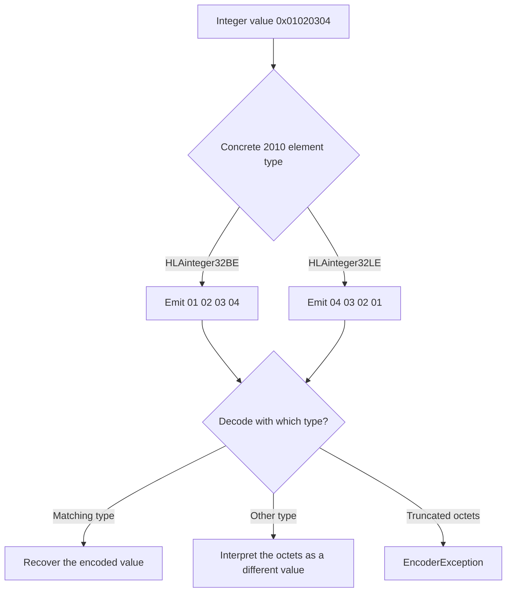
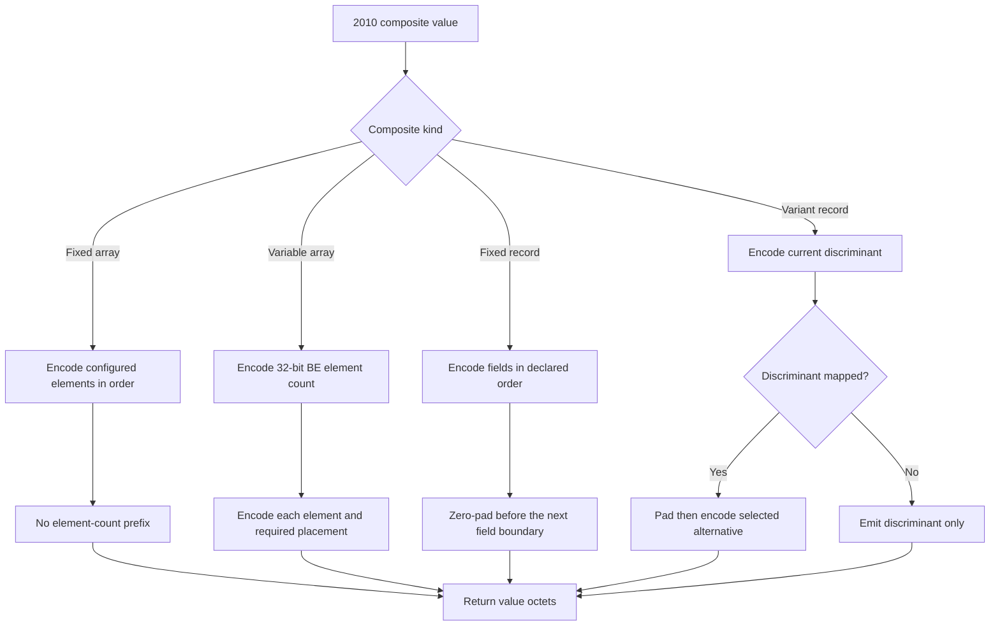

# IEEE 1516.1-2010 C++ DataElement Encoding: Flow Guide

> **Edition and profile boundary:** this page covers only the pinned IEEE
> 1516.1-2010 C++ encoding API and Umbra's separate 2010 codec implementation.
> It is not evidence for the 2025 stream, a complete conformance inventory, or
> the behavior of a full RTI.

This companion makes selected value-encoding behavior easier to follow. The
2010 API remains separate from the [2025 DataElement guide](HLA-2025-DATA-ELEMENT-ENCODING-FLOW-GUIDE.md):
similar byte-order names and one shared unsigned-octet helper do not establish
that the editions' wrappers, composites, or edge cases are equivalent.

## Scope and evidence

- The pinned [2010 `DataElement` declaration](../../third_party/ieee1516.1-2010/include/RTI/encoding/DataElement.h)
  and [basic element declarations](../../third_party/ieee1516.1-2010/include/RTI/encoding/BasicDataElements.h)
  define the public C++ types and operations.
- The separate [2010 basic-element implementation](../../cpp/src/ieee1516_2010_basic_data_elements.cpp#L89)
  chooses explicit big- or little-endian helpers for the corresponding named
  types. Those wrappers call a shared primitive that appends or reads unsigned
  octets; the primitive does not select an order for a type.
- The diagrams describe current source behavior and selected assertions in
  [`ieee1516_2010_encoding_smoke`](../../cpp/tests/ieee1516_2010_encoding_smoke.cpp#L23)
  and [`ieee1516_2010_composite_encoding_smoke`](../../cpp/tests/ieee1516_2010_composite_encoding_smoke.cpp#L53).
  CMake registers these as separate 2010 smoke tests
  ([encoding target](../../CMakeLists.txt#L443),
  [composite target](../../CMakeLists.txt#L453)). This guide did not run them.
- `DataElement::encode()` returns encoded value bytes. This guide does not
  describe process transport framing, federation messages, or network behavior.

## Scalar order is selected by the concrete 2010 type

For the tested 32-bit integer, the BE wrapper emits the most-significant octet
first and the LE wrapper emits the least-significant octet first. The selected
type also controls decoding: interpreting the same octets with the other type
produces a different value, not an automatic byte-order negotiation. The
implementation passes an explicit `ByteOrder` to the shared octet helper; host
byte order is not the selection mechanism.

The smoke test asserts both exact byte vectors and the changed value after
decoding with the other order. It also checks a big-endian `HLAfloat64BE`
vector, four-octet boolean representation, length-prefixed ASCII and Unicode
strings, opaque data, and rejection of truncated integer input. These are
selected cases, not a claim that every basic element or malformed buffer has
been exhaustively tested.

## Composite shape determines counts, padding, and alternatives

Each composite delegates an element's own value bytes to that element while
the 2010 composite implementation controls collection shape and placement.
The following paths are observed in the separate composite smoke target:

The exact tested examples make those shape differences concrete: a two-element
fixed array of 32-bit BE integers is eight octets without a count; a two-element
variable array begins with `00 00 00 02`; an octet followed by a 32-bit field
in a fixed record includes three zero padding octets; and the mapped versus
unmapped variant cases produce eight versus one octet. The smoke test also
rejects nonzero fixed-record padding. These examples do not imply that every
prototype, boundary combination, or decode failure has a focused assertion.

The implementation details stay in separate 2010 translation units:
[fixed arrays](../../cpp/src/ieee1516_2010_fixed_array.cpp#L177),
[variable arrays](../../cpp/src/ieee1516_2010_variable_array.cpp#L210),
[fixed records](../../cpp/src/ieee1516_2010_fixed_record.cpp#L142), and
[variant records](../../cpp/src/ieee1516_2010_variant_record.cpp#L269).
The relevant observed cases are grouped in the [2010 composite smoke test](../../cpp/tests/ieee1516_2010_composite_encoding_smoke.cpp#L53).

## Keep the edition boundary explicit

The 2010 basic-element wrappers, composite translation units, and smoke tests
are distinct from the 2025 ones. Both streams call the same small
[unsigned-octet byte-order primitive](../../cpp/src/internal/encoding/byte_order.hpp#L15),
but a common low-level helper is not evidence of API or composite parity. Keep
changes and explanations edition-scoped, and consult the [separate 2025 guide](HLA-2025-DATA-ELEMENT-ENCODING-FLOW-GUIDE.md)
for its own sources and focused tests.
