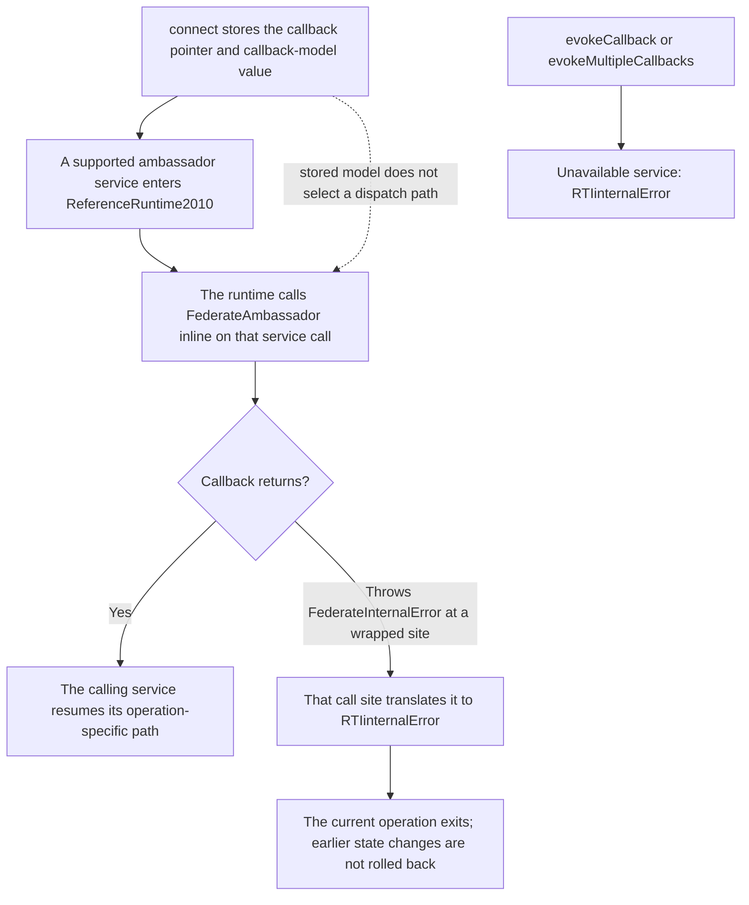
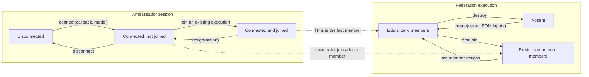
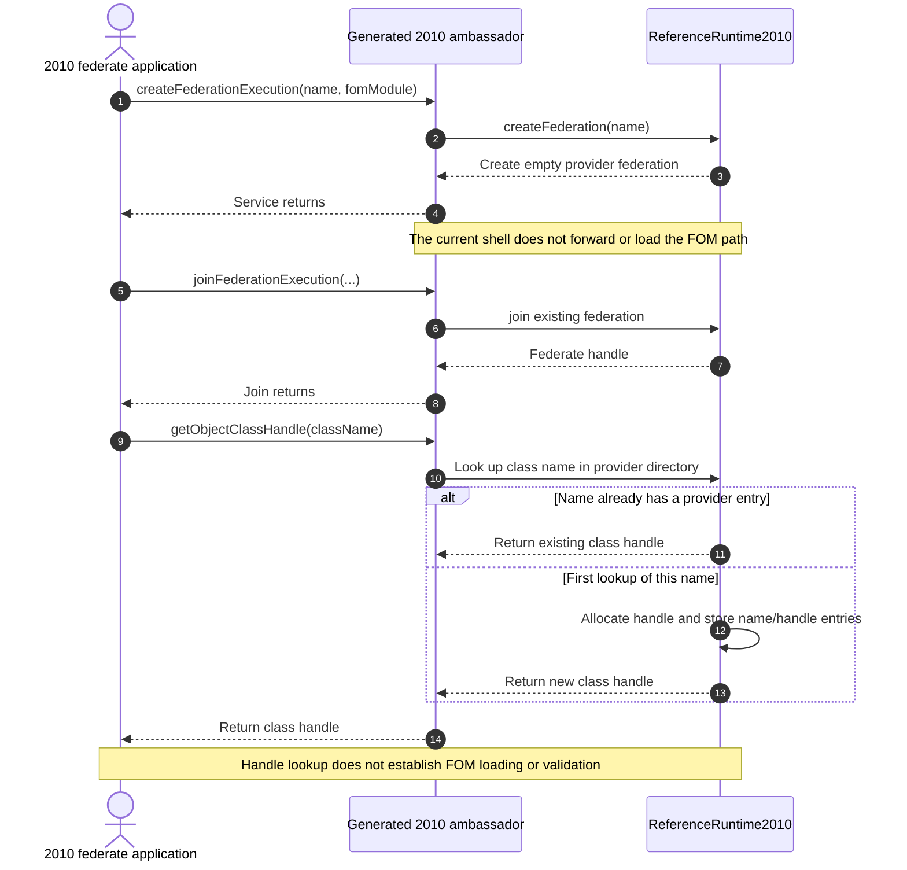
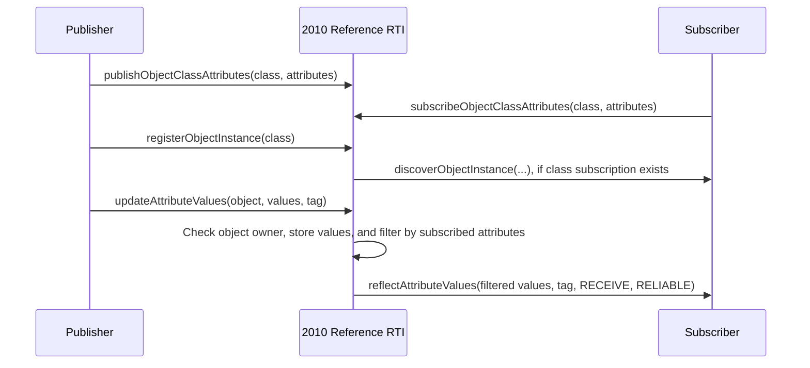
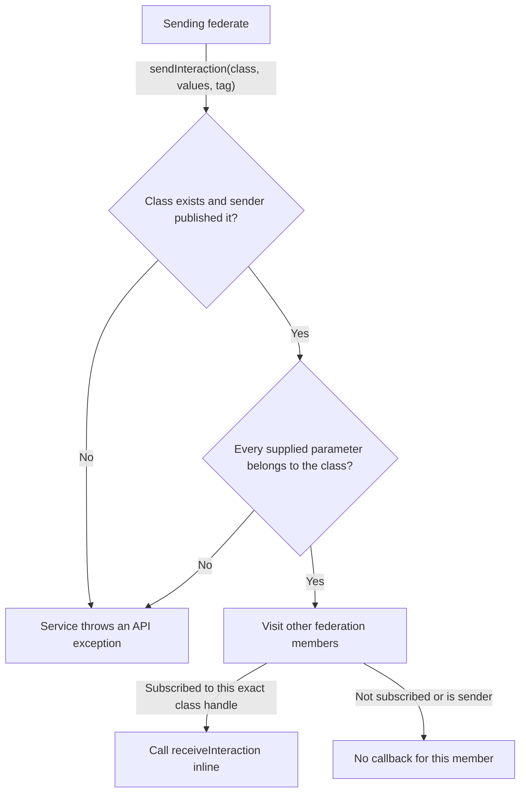
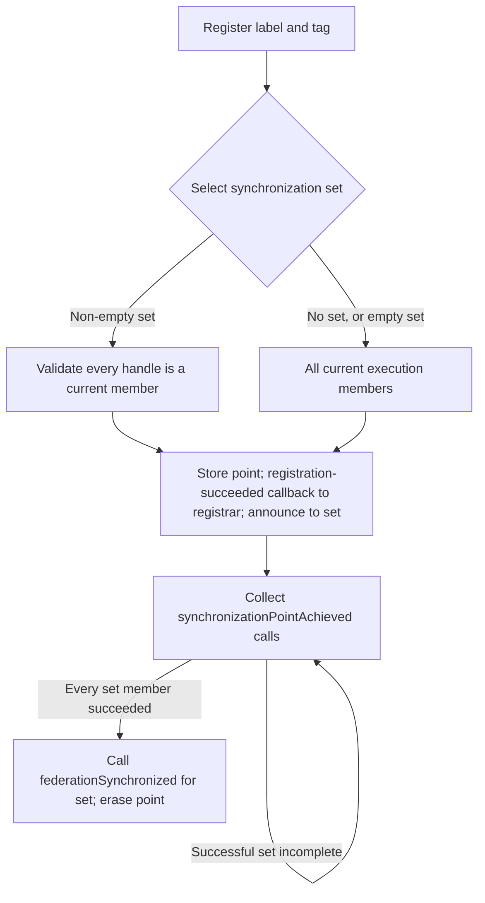
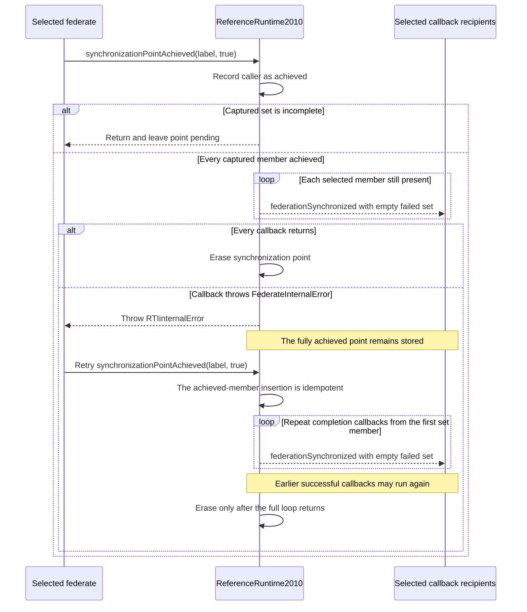
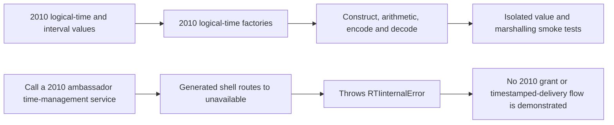

# IEEE 1516.1-2010 Reference RTI: Implemented Flow Guide

> **Edition and profile boundary:** this page describes Umbra's separate IEEE
> 1516.1-2010 C++ binding and its small in-process reference RTI, version
> `0.2.0-reference`. It is not a 2025 behavior guide and does not claim that
> this reference slice is a complete or production-ready RTI.

This guide makes the 2010 implementation's current behavior legible without
projecting behavior from the 2025 runtime onto it. The [IEEE 1516.1-2010
Federate Interface Specification](https://standards.ieee.org/ieee/1516.1/3745/)
is the authority for normative service behavior. The diagrams describe only
the source-backed Umbra slice; they are not a substitute for that standard or
a conformance claim.

## Read the two layers separately

The IEEE 1516.1-2010 API groups services around federation execution
management, declaration management, object management, synchronization, and
time management. Umbra's current 2010 shell implements a bounded subset. The
generated ambassador shell delegates that subset to `ReferenceRuntime2010`;
services outside it throw `RTIinternalError` with a not-implemented
diagnostic.

| Service concept | What the 2010 profile currently demonstrates | Important limit |
| --- | --- | --- |
| Connection and federation lifecycle | Connect, create/list/destroy an execution, join, resign, and disconnect. | The execution is process-local; destroy is rejected while members remain. |
| Declaration management | Publish and subscribe to object-class attributes and interaction classes. | Names are registered lazily by the provider directory; they are not checked against a loaded FOM. |
| Object information | Register an object, discover it for matching class subscribers, update values, and reflect subscribed attributes. | The owner is tracked per object, not per attribute; no region filtering or time-managed delivery is modeled. |
| Interaction information | Send a published interaction to members subscribed to that exact interaction-class handle. | No region filtering, timed send, or queued callback pump is modeled. |
| Synchronization | Register a point, announce it to its set, collect successful achievements, then report completion. | This path is source-backed but not exercised by the focused binding-shell smoke test found in this survey. |
| Time management | 2010 integer/float logical-time and interval values plus encoding/marshalling tests exist. | The RTI shell's time-management services are unavailable; value types do not imply a working time-advance state machine. |

## Callback delivery and failure boundaries in the 2010 reference profile

This is a source-derived description of the bounded Umbra 2010 reference
runtime, not a statement of the standard's general callback contract.

The generated 2010 shell stores the callback model supplied to `connect`, but
the field is not consulted to choose how the reference runtime delivers these
callbacks. `ReferenceRuntime2010` calls the callback object directly; it does
not enqueue work for a callback pump. The shell's two evoke methods are
unavailable. Therefore the source does not implement an HLA_EVOKED delivery
path, even though the smoke scenario connects with `HLA_IMMEDIATE`. Do not read
the stored enum as proof that both callback models work, or infer that direct
callback re-entry is safe merely because invocation is synchronous.

The `FederateInternalError` conversion is local to particular callback call
sites, not a universal wrapper around every callback. Registration/announcement,
synchronization completion, object discovery, reflection, interaction receive,
and ownership reporting each catch it and throw `RTIinternalError`. The
`reportFederationExecutions` callback is also called directly, but that call
site has no corresponding local conversion. In the wrapped cases, unwinding
stops the current service and any remaining recipient iteration; state already
mutated before the callback is not generally rolled back.

That ordering has concrete consequences: registration stores the point before
calling registration/announcement callbacks; object registration inserts the
object before discovery; and attribute updates store values before reflection.
For synchronization completion, all successful achievements are retained and
the point is erased only after the entire callback loop returns. Thus a thrown
completion callback leaves the fully achieved point available for a later
retry, which repeats the callback loop from its first selected member. The
dedicated [synchronization retry sequence](#4-synchronization-point-barrier)
shows that operation-specific case; this chart is the wider 2010 dispatch
boundary, not a second barrier diagram.

Source: [callback-model storage and unavailable evoke services](../../cpp/generated/rti_ambassador_shell_2010.hpp#L17),
[registration callbacks and catch](../../cpp/src/internal/runtime/reference_2010.cpp#L123),
[completion callbacks and catch](../../cpp/src/internal/runtime/reference_2010.cpp#L164),
[discovery and reflection callbacks](../../cpp/src/internal/runtime/reference_2010.cpp#L502),
[interaction and ownership callbacks](../../cpp/src/internal/runtime/reference_2010.cpp#L584),
[uncaught report callback](../../cpp/src/internal/runtime/reference_2010.cpp#L106),
[unavailable evoke methods](../../cpp/generated/rti_ambassador_shell_2010.hpp#L624).

The [2010 binding-shell smoke test](../../cpp/tests/ieee1516_2010_binding_shell_smoke.cpp#L10)
observes direct discovery, reflection, ownership, and interaction callbacks in
its HLA_IMMEDIATE scenario. It does not test callback exceptions, the HLA_EVOKED
setting, synchronization, re-entry safety, or recipient-loop behavior after a
callback throws. No 2010 test or CI run is claimed here.

## 1. Ambassador connection and execution membership

The 2010 ambassador has its own connected/joined flags. Federation existence
is separate global runtime state: connecting does not create an execution, and
resigning does not disconnect the ambassador.

The session and execution tracks are independent. Joining moves both tracks;
resigning moves the session back to connected and only moves the execution to
zero-members state when the last member resigns. Read these transitions with
the implementation guards below:

- `connect` stores the supplied callback object and callback-model value. A
  second connect throws `AlreadyConnected`.
- `join` requires an existing execution and rejects a duplicate non-empty
  federate name or a session that is already a member.
- `disconnect` while joined fails; resign first. The shell remains connected
  after a successful resign.
- `destroyFederationExecution` succeeds only when the execution's member map is
  empty.
- Object-class, attribute, interaction-class, and parameter handles are
  allocated lazily by name lookup. A name accepted by this directory is not
  thereby proven to exist in an input FOM.
- The reference `resign` implementation ignores the requested `ResignAction`
  and erases objects owned by that member. It does not send a removal callback
  before erasing them. Do not interpret this as the standard's general resign
  semantics.
- FOM module arguments are accepted by the public shell but are not loaded by
  this provider. The test deliberately passes `ignored-fom.xml`; the runtime
  header describes a deterministic provider directory pending a 2010 FOM
  loader.

Source: [generated 2010 ambassador shell](../../cpp/generated/rti_ambassador_shell_2010.hpp#L17),
[execution creation and teardown](../../cpp/src/internal/runtime/reference_2010.cpp#L83),
[join](../../cpp/src/internal/runtime/reference_2010.cpp#L213),
[resign and disconnect](../../cpp/src/internal/runtime/reference_2010.cpp#L262),
[lazy class lookup](../../cpp/src/internal/runtime/reference_2010.cpp#L292),
[FOM-input forwarding](../../cpp/generated/rti_ambassador_shell_2010.hpp#L40),
[reference-runtime profile note](../../cpp/src/internal/runtime/reference_2010.hpp#L14).

### This profile accepts, but does not load, FOM paths

The public creation overload accepts a FOM module path, but this shell
currently forwards only the execution name to the reference runtime. After
joining, `getObjectClassHandle` consults the runtime's provider directory and
creates a name/handle entry on first lookup. The 2010 binding-shell smoke test
passes `ignored-fom.xml` before looking up its object class. This is a narrow
implementation observation: the returned handle is not evidence that a FOM
was loaded or that the name was validated against one.

The sequence is source-backed by the [2010 shell overload](../../cpp/generated/rti_ambassador_shell_2010.hpp#L40),
the [reference runtime's class lookup](../../cpp/src/internal/runtime/reference_2010.cpp#L292),
and its [provider-directory profile note](../../cpp/src/internal/runtime/reference_2010.hpp#L14).
The [2010 binding-shell smoke](../../cpp/tests/ieee1516_2010_binding_shell_smoke.cpp#L122)
exercises the accepted `ignored-fom.xml` argument followed by class lookup; it
does not establish standard FOM-loading semantics.

## 2. Object publication, discovery, update, and reflection

The object path is synchronous in this reference runtime. A matching
subscriber's `FederateAmbassador` method is called from the service
implementation before that service returns.

Important implementation details:

- Registration requires the member to have published the object class. The
  object is recorded with one owning federate.
- Discovery is sent to other members that have a subscription entry for the
  object's class. Reflection values are then filtered against the receiver's
  subscribed attribute handles; an empty filtered map produces no callback.
- An update is accepted only from the recorded object owner. Values and the
  user tag are forwarded to matching subscribers; the implementation uses
  `RECEIVE` order and `RELIABLE` transportation for this callback.
- `queryAttributeOwnership` reports the object's owning federate through
  `informAttributeOwnership`. `isAttributeOwnedByFederate` also compares the
  object's single owner. These are not per-attribute ownership states or
  ownership-transfer support.
- The object callbacks are direct calls, not queued events. See [Callback
  delivery and failure boundaries](#callback-delivery-and-failure-boundaries-in-the-2010-reference-profile)
  for the profile-wide callback-model and exception limits.

Source: [attribute publication](../../cpp/src/internal/runtime/reference_2010.cpp#L448),
[attribute subscription](../../cpp/src/internal/runtime/reference_2010.cpp#L476),
[register and discover](../../cpp/src/internal/runtime/reference_2010.cpp#L502),
[update and reflect](../../cpp/src/internal/runtime/reference_2010.cpp#L549),
[ownership query](../../cpp/src/internal/runtime/reference_2010.cpp#L619),
[object-owner check](../../cpp/src/internal/runtime/reference_2010.cpp#L646),
[callback-model storage](../../cpp/generated/rti_ambassador_shell_2010.hpp#L23),
[unavailable evoke methods](../../cpp/generated/rti_ambassador_shell_2010.hpp#L624).

## 3. Interaction send and receive

The implementation validates the interaction-class handle, requires the
sender's publication, and validates each supplied parameter handle. It then
delivers to other members subscribed to that exact interaction-class handle.
As with object updates, delivery is synchronous and uses `RECEIVE` / `RELIABLE`
with producing-federate supplemental information. This slice does not model
class-hierarchy subscription matching, regions, transportation selection, or
time-stamped interactions.

Source: [interaction publication](../../cpp/src/internal/runtime/reference_2010.cpp#L404),
[interaction subscription](../../cpp/src/internal/runtime/reference_2010.cpp#L426),
[send and receive](../../cpp/src/internal/runtime/reference_2010.cpp#L584).

## 4. Synchronization-point barrier

The no-set overload constructs the current member set. In the explicit-set
overload an empty set also expands to all current members, so this profile
cannot express an empty-participant barrier through that overload. A
`successfully = false` call does not mark the member achieved and leaves the
point pending. On full success, the runtime calls `federationSynchronized` for
the set and erases the point after callbacks return. Callback exceptions are
translated to `RTIinternalError`; inspect the source before relying on retry or
reentrancy behavior around a throwing callback.

Less-obvious consequences of the current code:

- Empty or duplicate labels are rejected as `RTIinternalError`; an explicit
  set containing an unknown handle is rejected as `InvalidFederateHandle`.
- A member outside the selected set cannot achieve the point and receives
  `FederateNotExecutionMember` from that service.
- The participant set is captured at registration. A later join does not join
  the pending barrier.
- The registering member receives `synchronizationPointRegistrationSucceeded`
  even when it is not in the explicit synchronization set; only set members
  receive the announcement callback.
- Resignation removes the member but does not edit pending point sets. If a
  participant leaves before achieving, the stored set can therefore remain
  incomplete and prevent the success-size check from completing.
- The point is inserted before registration callbacks. If one throws, the
  registration service reports `RTIinternalError` but the point remains stored,
  potentially with announcements not yet delivered to the whole set.
- The point is erased only after all completion callbacks return. If one throws
  after all achievements, the operation reports `RTIinternalError` and retains
  the point; a repeated successful achievement can retry the completion
  callback loop, including callbacks that returned earlier.

Source: [point registration and announcement](../../cpp/src/internal/runtime/reference_2010.cpp#L114),
[achievement barrier](../../cpp/src/internal/runtime/reference_2010.cpp#L164).

The normal path is not the whole callback story. The source stores a point
before registration callbacks and removes it only after every completion
callback returns. A completion callback failure therefore leaves a fully
achieved point stored, and a later successful achievement retries the callback
loop from its first current set member. This is an implementation observation,
not a claim about the normative retry contract.

The public calls and callbacks are declared in the pinned 2010
[`RTIambassador` API](../../third_party/ieee1516.1-2010/include/RTI/RTIambassador.h#L173)
and [`FederateAmbassador` API](../../third_party/ieee1516.1-2010/include/RTI/FederateAmbassador.h#L57).
No focused 2010 synchronization-barrier test was found in this survey, so the
retry and duplicate-callback path above is source-observed only.

## 5. Timing values are not time-managed execution

The 2010 stream contains `HLAinteger64Time` and `HLAfloat64Time` value and
interval implementations, plus encoding and marshalling smoke tests. Those
artifacts establish value construction/comparison/serialization behavior only.
In the 2010 ambassador shell, `enableTimeRegulation`,
`enableTimeConstrained`, `timeAdvanceRequest`, `queryLogicalTime`, and the
callback-evoke services call `unavailable()`. There is consequently no
source-backed 2010 time-advance state machine to diagram yet ([time-service
stubs](../../cpp/generated/rti_ambassador_shell_2010.hpp#L325),
[advance request](../../cpp/generated/rti_ambassador_shell_2010.hpp#L341),
[logical-time query](../../cpp/generated/rti_ambassador_shell_2010.hpp#L373)).

The support boundary itself is useful to diagram, as long as it is not mistaken
for a functioning time-advance flow:

The service branch is grounded in the [generated time-service overrides](../../cpp/generated/rti_ambassador_shell_2010.hpp#L325)
and the shared [`unavailable()` implementation](../../cpp/generated/rti_ambassador_shell_2010.hpp#L691).
The integer, float, and marshalling smoke programs exercise value/factory
operations, not ambassador service calls; they do not prove that every stub
throws the expected error at runtime.

Likewise, federation save/restore, regions/DDM, and broad ownership services
are outside the implemented reference slice. The generated shell's header
comment states that services outside the bounded slice intentionally throw.
Keep these absent flows visible as gaps rather than borrowing a diagram from
the 2025 runtime.

## Evidence and confidence boundaries

| Claim | Evidence | What it does not prove |
| --- | --- | --- |
| The 2010 binding provides a connected, two-member publisher/subscriber path for discovery, reflection, ownership query, and interaction receive. | [`ieee1516_2010_binding_shell_smoke.cpp`](../../cpp/tests/ieee1516_2010_binding_shell_smoke.cpp#L91), registered as [`umbra.ieee1516e_2010.binding_shell`](../../CMakeLists.txt#L423). | Full API conformance, synchronization callbacks, callback-evoked behavior, or omitted services. |
| Supported 2010 reference-runtime callbacks are invoked directly; selected call sites translate `FederateInternalError` into `RTIinternalError`. | [callback model is stored](../../cpp/generated/rti_ambassador_shell_2010.hpp#L17), [direct runtime callback sites](../../cpp/src/internal/runtime/reference_2010.cpp#L123), and the [HLA_IMMEDIATE smoke path](../../cpp/tests/ieee1516_2010_binding_shell_smoke.cpp#L119). | A working HLA_EVOKED path, callback-exception behavior under test, re-entry safety, or uniform exception conversion at every callback site. |
| The reference shell accepts a FOM path without loading it, then obtains object-class handles through its provider directory. | [2010 shell forwarding and provider profile](../../cpp/generated/rti_ambassador_shell_2010.hpp#L40), [lazy class-name lookup](../../cpp/src/internal/runtime/reference_2010.cpp#L292), and the [binding-shell scenario](../../cpp/tests/ieee1516_2010_binding_shell_smoke.cpp#L122). | Normative FOM behavior, validation against a loaded FOM, or behavior of the separate 2025 implementation. |
| 2010 integer/float time values and binary marshalling have isolated smoke coverage. | [`integer-time`](../../cpp/tests/ieee1516_2010_integer_time_smoke.cpp), [`float-time`](../../cpp/tests/ieee1516_2010_float_time_smoke.cpp), and [`time-marshalling`](../../cpp/tests/ieee1516_2010_time_marshal_smoke.cpp) smoke programs. | Federation logical-time advancement or ordering of time-stamped messages. |
| Synchronization-point state and callbacks exist in the reference runtime. | [Registration](../../cpp/src/internal/runtime/reference_2010.cpp#L114) and [achievement](../../cpp/src/internal/runtime/reference_2010.cpp#L164) source. | A focused 2010 test of the barrier; none was found in this bounded survey. |
| The 2010 API is intentionally a bounded shell. | [Generated shell profile comment](../../cpp/generated/rti_ambassador_shell_2010.hpp#L1) and its [`unavailable()` path](../../cpp/generated/rti_ambassador_shell_2010.hpp#L691). | That unsupported services are acceptable for every user or use case. |

The focused binding-shell test uses C `assert` checks and one linear scenario.
Treat it as evidence for that scenario, not an exhaustive state-machine test.
The project test target is an executable smoke test, not a Catch2 lane.

## Deliberate boundary and next evidence

This guide is about the 2010 reference profile only. It does not claim
equivalence with the IEEE 1516.1-2025 implementation and does not import any
2025 timing, callback-queue, region, ownership, or lifecycle behavior. The
Requirements Lab remains outside this documentation goal.

Next useful 2010 evidence, if this profile is expanded, is focused coverage for
synchronization-point registration/announcement/achievement, callback-exception
conversion and partial-recipient effects, the selected callback-model behavior,
and the currently unavailable service families. The existing smoke test only
exercises successful direct callbacks with `HLA_IMMEDIATE`; keep the uncovered
cases as explicit gaps and keep the separate 2010 CI disabled unless it is
deliberately re-enabled.
