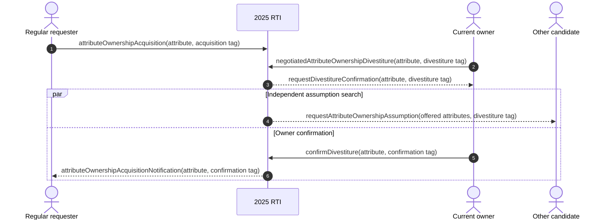
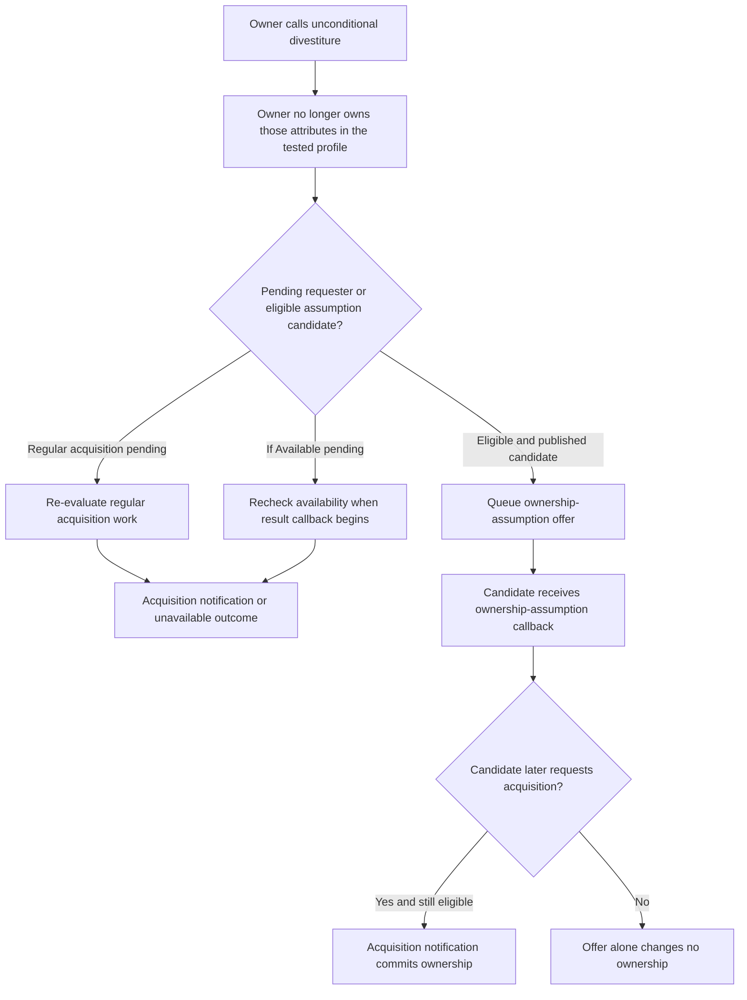

# IEEE 1516.1-2025 Attribute Ownership: Flow Guide

This guide builds a mental model for attribute ownership services and their
callbacks in Umbra's current 2025 development paths. It is explanatory
documentation, not an implementation contract or a conformance claim.

## Scope and authority

- **Standard boundary:** IEEE 1516.1-2025 only. The official [IEEE standard
  page](https://standards.ieee.org/ieee/1516.1/6688/) identifies the document
  that defines the RTI services and interfaces. Consult the standard itself
  for normative requirements.
- **Implementation boundary:** current 2025 C++ API scenarios exercised by
  Umbra's non-installable development profile, including focused embedded and
  process-boundary tests. Some private runtime components are shared
  implementation machinery; this guide does not infer 2010 behavior from them.
- **Edition separation:** IEEE 1516.1-2010 is deliberately outside this guide.
  It has separate public API and compatibility tests. No equivalence with its
  ownership behavior is asserted here.
- **Evidence boundary:** source describes current implementation behavior;
  focused tests demonstrate only their named scenarios. Neither overrides the
  standard or proves full feature support, interoperability, or conformance.

The service anchors used here are the 2025 ownership-management services,
including Attribute Ownership Acquisition (§7.8), Attribute Ownership
Acquisition If Available (§7.9), and Attribute Ownership Release Denied
(§7.12). The implementation source cites these service sections; use the
official standard for the normative text and exact requirements.

## Start with the unit of state

Ownership is tracked for an **object-instance attribute**, not as one indivisible
property of the object. An object can therefore have attributes owned by
different federates, unowned attributes, and attributes with requests pending
at the same time. A single API call containing several attributes can produce
different outcomes for different members of its set.

Keep these concepts separate:

| Concept | What it tells you | What it does not tell you |
| --- | --- | --- |
| Publication | Whether a federate has declared it can produce an object-class attribute. | That it currently owns a particular instance attribute. |
| Subscription/discovery | Whether an instance is relevant and known to a receiving federate. | That the receiver owns any of its attributes. |
| Ownership | Which federate currently owns a particular instance attribute, or whether it is unowned. | Whether a particular update has been delivered or is eligible under time/DDM rules. |
| Accepted request | The RTI admitted a service call and recorded or scheduled its work. | That the requested ownership transition has already completed. |
| Ownership callback | A public outcome for the request; in the current 2025 profile, some ownership state is committed at callback dispatch. | A guarantee that every requested attribute will resolve the same way. |

The current runtime entry points and callback dispatch are in
[ownership services](../../cpp/src/internal/runtime/umbra_rti_ambassador_ownership_services.cpp)
and
[ownership callback dispatch](../../cpp/src/internal/runtime/umbra_rti_ambassador_ownership_callback_dispatch.cpp).
The per-attribute registry paths are in
[regular acquisition](../../cpp/src/internal/federation/federation_registry_attribute_ownership_acquisition.cpp),
[If-Available acquisition](../../cpp/src/internal/federation/federation_registry_attribute_ownership_acquisition_if_available.cpp),
and
[negotiated divestiture](../../cpp/src/internal/federation/federation_registry_negotiated_attribute_ownership_divestiture.cpp).

## Requester-side state: request is not ownership

The following is a useful per-attribute model for the exercised 2025 paths. It
is not a complete normative state machine for every service, exception, or
implementation profile.

```mermaid
stateDiagram-v2
  direction LR
  [*] --> NoPendingRequest
  NoPendingRequest --> AcquisitionPending: Acquisition accepted
  NoPendingRequest --> WillingToAcquire: If Available accepted
  AcquisitionPending --> Owns: Acquisition Notification begins
  WillingToAcquire --> Owns: available at callback recheck; Notification begins
  AcquisitionPending --> NoPendingRequest: Ownership Unavailable begins
  WillingToAcquire --> NoPendingRequest: Ownership Unavailable begins
  AcquisitionPending --> NoPendingRequest: request canceled or instance invalidated
  WillingToAcquire --> NoPendingRequest: pending work superseded or instance invalidated
  Owns --> NoPendingRequest: ownership later divested or otherwise lost
```



The important callback boundary is that the accepted request alone does not
make isAttributeOwnedByFederate true. In the focused 2025 tests, the requester's
ownership query changes when the acquisition-notification callback is
dispatched. With If Available, the dispatcher rechecks the request and current
ownership before selecting the notification or unavailable outcome. Thus, if
an owner divests before that callback is dispatched, a request that would
otherwise be unavailable can instead acquire the now-unowned attribute. See
the implementation's
[begin-acquisition callback path](../../cpp/src/internal/federation/federation_registry_attribute_ownership_acquisition_if_available.cpp)
and the tests below.

### Regular acquisition with an owner response

```mermaid
sequenceDiagram
  autonumber
  actor B as Requesting federate
  participant RTI as 2025 RTI
  actor A as Current owner

  B->>RTI: attributeOwnershipAcquisition(attributes, tag)
  RTI-->>B: Service accepted; requested attributes become pending
  RTI-->>A: requestAttributeOwnershipRelease(owned subset, acquisition tag)
  Note over B,RTI: Unowned members of the same set can resolve independently
  RTI-->>B: Attribute Ownership Acquisition Notification for eligible unowned member
  Note over B: Ownership becomes true at notification dispatch in the tested profile
  alt A denies release
    A->>RTI: attributeOwnershipReleaseDenied(denied subset, denial tag)
    RTI-->>B: attributeOwnershipUnavailable(denied subset, denial tag)
    Note over A: A remains owner of the denied attributes
  else A divests through an applicable transfer path
    Note over A,RTI: The transfer path can be unconditional or negotiated; exact callbacks differ
    RTI-->>B: Attribute Ownership Acquisition Notification
    Note over B: The requester observes ownership at callback dispatch
  end
```

This diagram summarizes only the paths represented by the cited tests. It
does not claim a particular arbitration order among multiple requesters or
cover every legal owner response.

The case
[Embedded Attribute Ownership Acquisition honors 2025 release and denial callbacks](../../cpp/tests/ieee1516_2025_attribute_ownership_acquisition_release_callbacks_catch2.cpp)
demonstrates several easily missed details:

- The request includes both an owner-held attribute and an unowned attribute;
  the unowned attribute can notify and transfer while the owner-held one stays
  pending.
- A regular request can supersede pending If-Available work in this scenario;
  stale queued work is suppressed rather than becoming a second public result.
- Repeating an already-pending regular request does not queue another owner
  release callback in this tested profile.
- The owner receives the requester's acquisition tag with the release request.
  If the owner denies release, the requester receives the denial call's tag in
  its Unavailable callback, and the owner retains ownership.
- Pending acquisition constrains unpublication in this scenario; publication
  is not merely an unrelated declaration detail.

### If Available: evaluate at the result callback

```mermaid
sequenceDiagram
  autonumber
  actor B as Requesting federate
  participant RTI as 2025 RTI
  actor A as Current owner

  B->>RTI: attributeOwnershipAcquisitionIfAvailable(attributes, tag)
  RTI-->>B: Service accepted; work is pending
  Note over RTI: A known class and the required publication are preconditions
  alt Attribute is unowned when result work is dispatched
    RTI->>RTI: Revalidate request and commit eligible ownership
    RTI-->>B: attributeOwnershipAcquisitionNotification(attributes, tag)
  else Attribute is still owned by A
    RTI-->>B: attributeOwnershipUnavailable(attributes, tag)
  else A divests before the callback-time recheck
    A->>RTI: Divestiture changes availability
    RTI->>RTI: Revalidate pending If-Available work
    RTI-->>B: attributeOwnershipAcquisitionNotification(attributes, tag)
  end
```

The branches are outcomes at the profile's callback-time recheck, not a promise
that an owned attribute will be held indefinitely for the requester. The
focused [If-Available test](../../cpp/tests/ieee1516_2025_attribute_ownership_acquisition_if_available_catch2.cpp)
shows a mixed attribute set resolving into both Notification and Unavailable
callbacks. It also exercises repeated pending requests and the publication
guard against withdrawing a declaration needed by pending work.

## Owner-side transfer paths

### Negotiated divestiture adds a confirmation stage

Negotiated divestiture is not the same sequence as denying a release request.
The owner initiates a negotiated divestiture, receives a
requestDivestitureConfirmation callback, and may confirm the transfer. In a
focused 2025 process-boundary scenario, the confirmation then leads to the
regular requester's acquisition-notification callback. A separate assumption
offer can be delivered to another candidate while that confirmation is
pending; the offer itself does not transfer ownership.



The targeted
[Confirm Divestiture with a pushed assumption candidate](../../cpp/tests/ieee1516_2025_confirm_divestiture_process_assumption_catch2.cpp)
test demonstrates the separate callback paths and tag ownership. It is a
process-boundary test, not evidence that every deployed transport or profile
supports the same end-to-end scope.

### Unconditional divestiture and assumption offers

In the exercised embedded scenario, unconditional divestiture first removes
the old owner's ownership. Pending regular and If-Available requesters may
then receive their own acquisition notification. The RTI can also search for
eligible assumption candidates and send requestAttributeOwnershipAssumption.
That callback is an **offer**, not an ownership transfer: the candidate remains
non-owner until its later acquisition request resolves through an acquisition
notification.



The focused
[Unconditional Attribute Ownership Divestiture offers eligible 2025 federates](../../cpp/tests/ieee1516_2025_unconditional_attribute_ownership_divestiture_catch2.cpp)
shows that a candidate that stopped publishing before callback dispatch gets
no stale offer, that a previously pending If-Available request can resolve
after divestiture, and that the assumption recipient remains a non-owner until
it separately requests acquisition. The search can continue after stale work
is suppressed; a candidate that republishes can become eligible for a fresh
offer.

## Edge cases worth remembering

- **Attribute sets are not atomic ownership units.** Track outcomes by each
  object-instance attribute, even when a service accepts one set.
- **Callbacks can be stale.** Object deletion, resignation, publication
  changes, or a superseding request can invalidate queued work before user code
  runs. The dispatcher/registry revalidates at delivery boundaries; do not
  draw every queued callback as guaranteed to execute.
- **More than one requester can be pending.** The
  [multiple-acquirer release-denied case](../../cpp/tests/ieee1516_2025_attribute_ownership_release_denied_multi_acquirer_catch2.cpp)
  shows a denial resolving both requesters as unavailable while the current
  owner remains owner. This guide does not specify fairness or winner
  selection for competing successful transfers.
- **A request may be rejected before it enters a pending state.** Connection,
  federation membership, known object instance, defined attributes, and
  publication are distinct preconditions. The cited tests exercise selected
  failures; this is not the complete exception matrix.
- **Ownership is not update delivery.** Time ordering, region relevance,
  subscription filtering, and update-queue behavior form additional state
  machines. Read the dedicated timing guide and the upcoming DDM/region guide
  before inferring whether a new owner has received any particular value.
- **Persistence and resignation are not modeled here.** Separate tests cover
  pending ownership across save/restore and resignation actions; they deserve
  their own flow diagrams rather than being hidden in this core transfer
  chart.

## Source and focused evidence

- Public 2025 service adaptation and callback scheduling:
  [ownership services](../../cpp/src/internal/runtime/umbra_rti_ambassador_ownership_services.cpp),
  [ownership callback dispatch](../../cpp/src/internal/runtime/umbra_rti_ambassador_ownership_callback_dispatch.cpp).
- State planning and callback-entry revalidation:
  [regular acquisition registry](../../cpp/src/internal/federation/federation_registry_attribute_ownership_acquisition.cpp),
  [If-Available registry](../../cpp/src/internal/federation/federation_registry_attribute_ownership_acquisition_if_available.cpp),
  [negotiated divestiture registry](../../cpp/src/internal/federation/federation_registry_negotiated_attribute_ownership_divestiture.cpp).
- Focused tests:
  [regular acquisition, release, and denial](../../cpp/tests/ieee1516_2025_attribute_ownership_acquisition_release_callbacks_catch2.cpp),
  [If Available](../../cpp/tests/ieee1516_2025_attribute_ownership_acquisition_if_available_catch2.cpp),
  [unconditional divestiture and assumption search](../../cpp/tests/ieee1516_2025_unconditional_attribute_ownership_divestiture_catch2.cpp),
  [multiple acquirers after release denial](../../cpp/tests/ieee1516_2025_attribute_ownership_release_denied_multi_acquirer_catch2.cpp),
  and [process-boundary confirmation with an assumption candidate](../../cpp/tests/ieee1516_2025_confirm_divestiture_process_assumption_catch2.cpp).

The first acquisition case is indexed as
umbra-cpp-attribute-ownership-acquisition-integration: 73 assertions, mapped
to four canonical IEEE 1516.1-2025 sections (7.7.3, 7.8, 7.11, and 7.12) by the
current test-plan query. Those mappings are traceability aids, not conformance
evidence.

## Deliberate limits and next step

This guide does not attempt to encode every ownership exception, arbitration
rule, callback control, automatic resignation action, MOM report, persistence
transition, or interaction with time and DDM. It describes a set of high-value
paths whose behavior is visible in current 2025 source and tests. Expand it
only when a focused source-and-test review can support the added diagram.

The next guide is
[DDM and region relevance/routing](HLA-BEHAVIOR-FLOW-GUIDES.md#prioritized-guide-backlog).
Keep the 2010 stream separate and leave the Requirements Lab unchanged in this
phase.
