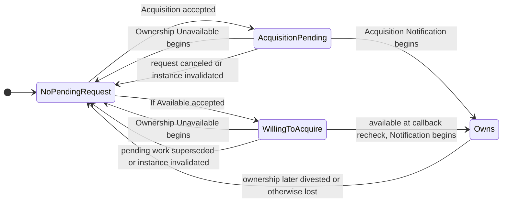
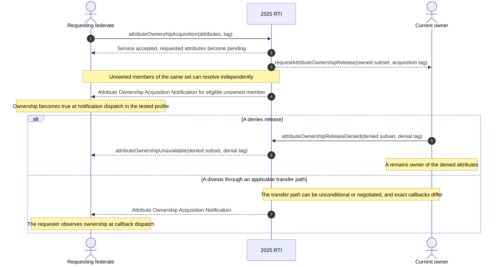
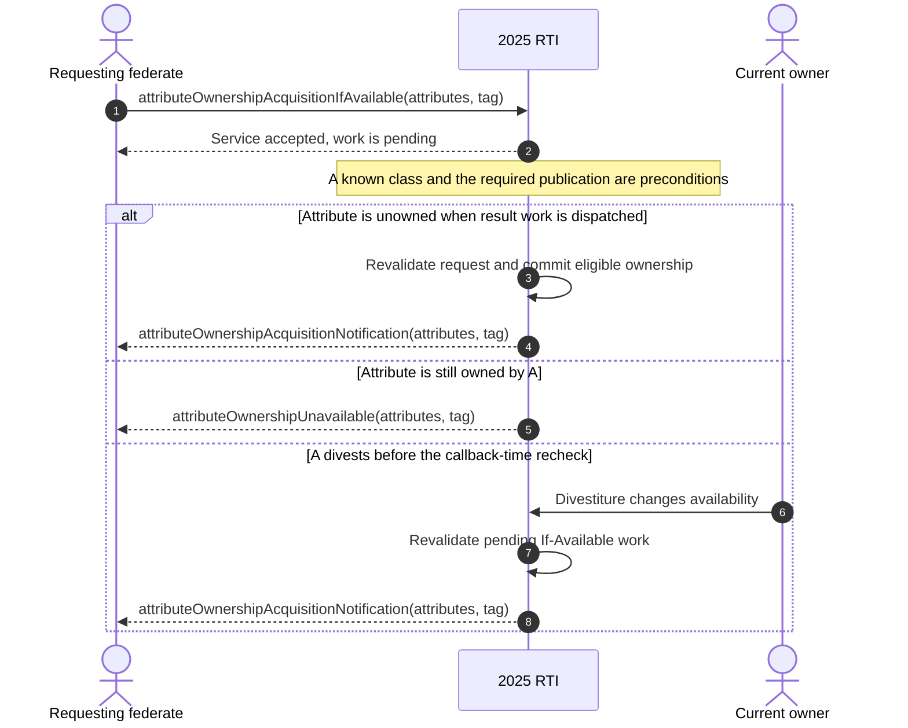
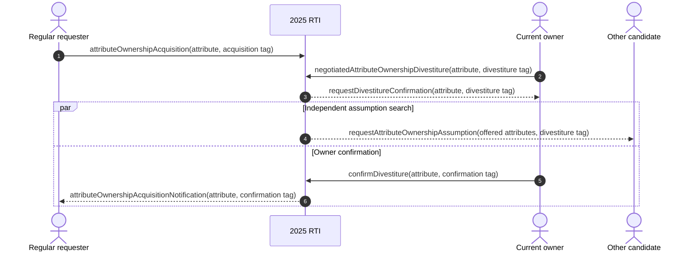
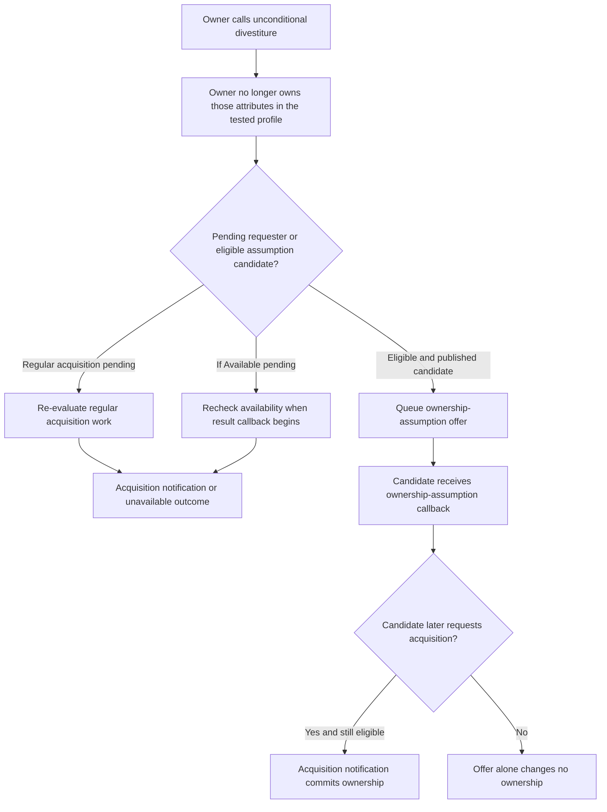
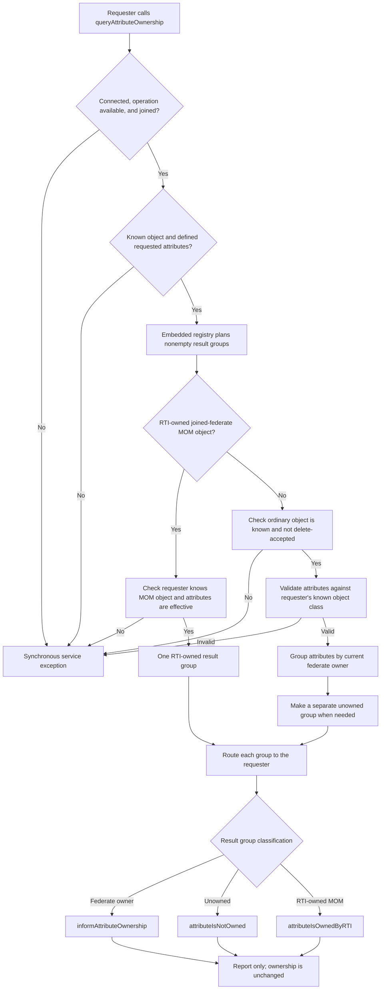
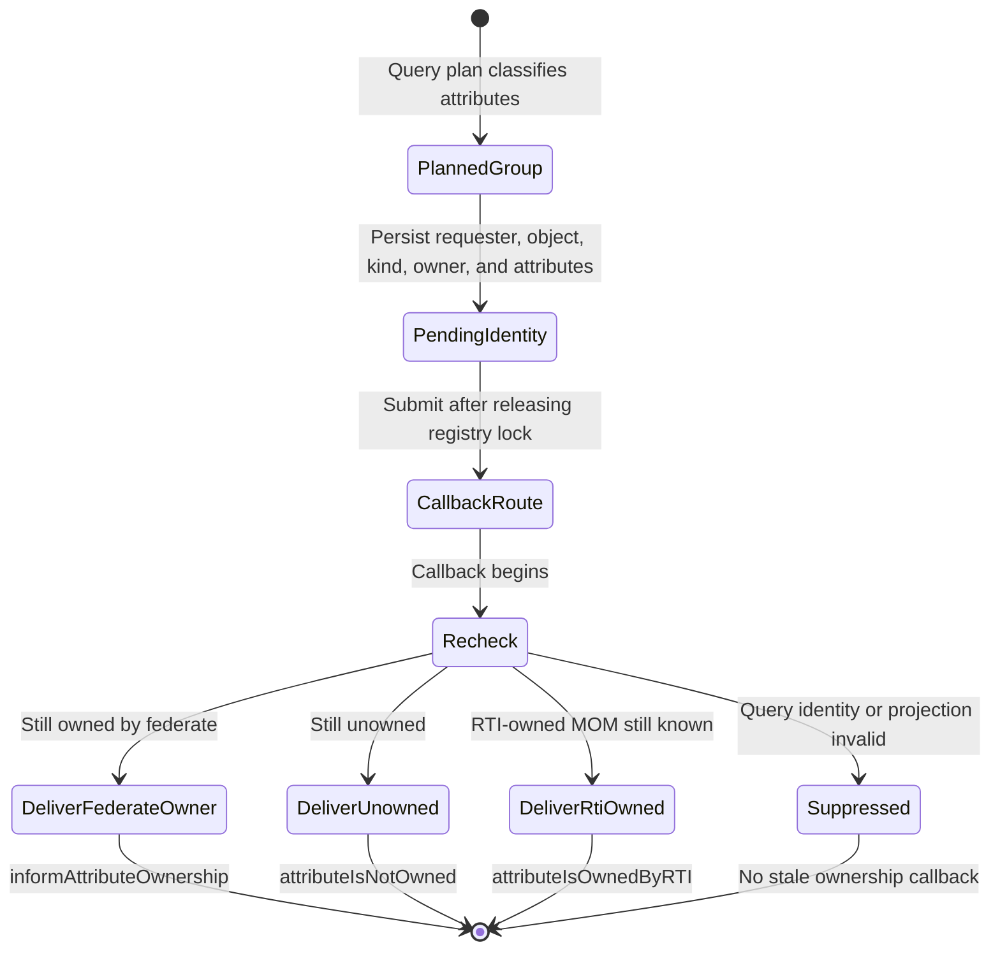
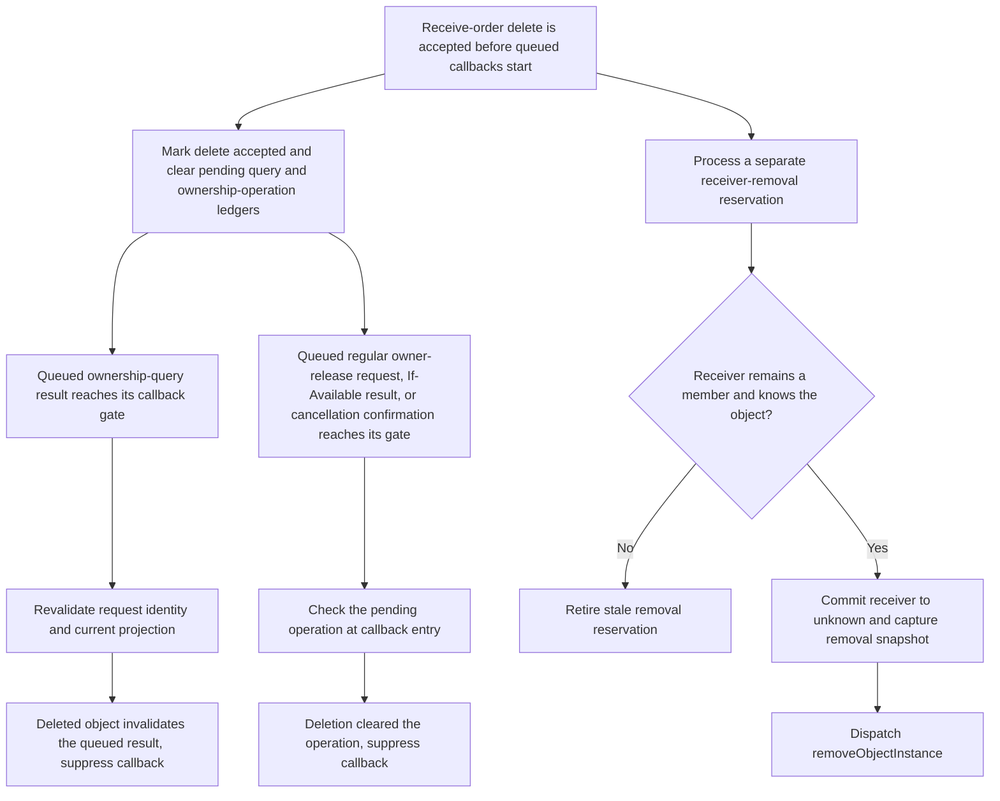

# IEEE 1516.1-2025 Attribute Ownership: Flow Guide

This guide builds a mental model for attribute ownership services and their
callbacks in Umbra's current 2025 development paths. It is explanatory
documentation, not an implementation contract or a conformance claim.

## Scope and authority

- **Standard boundary:** IEEE 1516.1-2025 only. The official [IEEE standard
  page](https://standards.ieee.org/ieee/1516.1/6688/) identifies the document
  that defines the RTI services and interfaces. Consult the standard itself
  for normative requirements.
- **Implementation boundary:** current 2025 C++ API scenarios exercised by
  Umbra's non-installable development profile, including focused embedded and
  process-boundary tests. Some private runtime components are shared
  implementation machinery; this guide does not infer 2010 behavior from them.
- **Edition separation:** IEEE 1516.1-2010 is deliberately outside this guide.
  It has separate public API and compatibility tests. No equivalence with its
  ownership behavior is asserted here.
- **Evidence boundary:** source describes current implementation behavior;
  focused tests demonstrate only their named scenarios. Neither overrides the
  standard or proves full feature support, interoperability, or conformance.

The service anchors used here are the 2025 ownership-management services,
including Attribute Ownership Acquisition (§7.8), Attribute Ownership
Acquisition If Available (§7.9), and Attribute Ownership Release Denied
(§7.12). The implementation source cites these service sections; use the
official standard for the normative text and exact requirements.

## Start with the unit of state

Ownership is tracked for an **object-instance attribute**, not as one indivisible
property of the object. An object can therefore have attributes owned by
different federates, unowned attributes, and attributes with requests pending
at the same time. A single API call containing several attributes can produce
different outcomes for different members of its set.

Keep these concepts separate:

| Concept | What it tells you | What it does not tell you |
| --- | --- | --- |
| Publication | Whether a federate has declared it can produce an object-class attribute. | That it currently owns a particular instance attribute. |
| Subscription/discovery | Whether an instance is relevant and known to a receiving federate. | That the receiver owns any of its attributes. |
| Ownership | Which federate currently owns a particular instance attribute, or whether it is unowned. | Whether a particular update has been delivered or is eligible under time/DDM rules. |
| Accepted request | The RTI admitted a service call and recorded or scheduled its work. | That the requested ownership transition has already completed. |
| Ownership callback | A public outcome for the request; in the current 2025 profile, some ownership state is committed at callback dispatch. | A guarantee that every requested attribute will resolve the same way. |

The current runtime entry points and callback dispatch are in
[ownership services](../../cpp/src/internal/runtime/umbra_rti_ambassador_ownership_services.cpp)
and
[ownership callback dispatch](../../cpp/src/internal/runtime/umbra_rti_ambassador_ownership_callback_dispatch.cpp).
The per-attribute registry paths are in
[regular acquisition](../../cpp/src/internal/federation/federation_registry_attribute_ownership_acquisition.cpp),
[If-Available acquisition](../../cpp/src/internal/federation/federation_registry_attribute_ownership_acquisition_if_available.cpp),
and
[negotiated divestiture](../../cpp/src/internal/federation/federation_registry_negotiated_attribute_ownership_divestiture.cpp).

## Requester-side state: request is not ownership

The following is a useful per-attribute model for the exercised 2025 paths. It
is not a complete normative state machine for every service, exception, or
implementation profile.

The important callback boundary is that the accepted request alone does not
make isAttributeOwnedByFederate true. In the focused 2025 tests, the requester's
ownership query changes when the acquisition-notification callback is
dispatched. With If Available, the dispatcher rechecks the request and current
ownership before selecting the notification or unavailable outcome. Thus, if
an owner divests before that callback is dispatched, a request that would
otherwise be unavailable can instead acquire the now-unowned attribute. See
the implementation's
[begin-acquisition callback path](../../cpp/src/internal/federation/federation_registry_attribute_ownership_acquisition_if_available.cpp)
and the tests below.

### Regular acquisition with an owner response

This diagram summarizes only the paths represented by the cited tests. It
does not claim a particular arbitration order among multiple requesters or
cover every legal owner response.

The case
[Embedded Attribute Ownership Acquisition honors 2025 release and denial callbacks](../../cpp/tests/ieee1516_2025_attribute_ownership_acquisition_release_callbacks_catch2.cpp)
demonstrates several easily missed details:

- The request includes both an owner-held attribute and an unowned attribute;
  the unowned attribute can notify and transfer while the owner-held one stays
  pending.
- A regular request can supersede pending If-Available work in this scenario;
  stale queued work is suppressed rather than becoming a second public result.
- Repeating an already-pending regular request does not queue another owner
  release callback in this tested profile.
- The owner receives the requester's acquisition tag with the release request.
  If the owner denies release, the requester receives the denial call's tag in
  its Unavailable callback, and the owner retains ownership.
- Pending acquisition constrains unpublication in this scenario; publication
  is not merely an unrelated declaration detail.

### If Available: evaluate at the result callback

The branches are outcomes at the profile's callback-time recheck, not a promise
that an owned attribute will be held indefinitely for the requester. The
focused [If-Available test](../../cpp/tests/ieee1516_2025_attribute_ownership_acquisition_if_available_catch2.cpp)
shows a mixed attribute set resolving into both Notification and Unavailable
callbacks. It also exercises repeated pending requests and the publication
guard against withdrawing a declaration needed by pending work.

## Owner-side transfer paths

### Negotiated divestiture adds a confirmation stage

Negotiated divestiture is not the same sequence as denying a release request.
The owner initiates a negotiated divestiture, receives a
requestDivestitureConfirmation callback, and may confirm the transfer. In a
focused 2025 process-boundary scenario, the confirmation then leads to the
regular requester's acquisition-notification callback. A separate assumption
offer can be delivered to another candidate while that confirmation is
pending; the offer itself does not transfer ownership.

The targeted
[Confirm Divestiture with a pushed assumption candidate](../../cpp/tests/ieee1516_2025_confirm_divestiture_process_assumption_catch2.cpp)
test demonstrates the separate callback paths and tag ownership. It is a
process-boundary test, not evidence that every deployed transport or profile
supports the same end-to-end scope.

### Unconditional divestiture and assumption offers

In the exercised embedded scenario, unconditional divestiture first removes
the old owner's ownership. Pending regular and If-Available requesters may
then receive their own acquisition notification. The RTI can also search for
eligible assumption candidates and send requestAttributeOwnershipAssumption.
That callback is an **offer**, not an ownership transfer: the candidate remains
non-owner until its later acquisition request resolves through an acquisition
notification.

The focused
[Unconditional Attribute Ownership Divestiture offers eligible 2025 federates](../../cpp/tests/ieee1516_2025_unconditional_attribute_ownership_divestiture_catch2.cpp)
shows that a candidate that stopped publishing before callback dispatch gets
no stale offer, that a previously pending If-Available request can resolve
after divestiture, and that the assumption recipient remains a non-owner until
it separately requests acquisition. The search can continue after stale work
is suppressed; a candidate that republishes can become eligible for a fresh
offer.

## Query Attribute Ownership reports a snapshot; it does not transfer

The 2025 API separates the request service (§7.17) from its three result
callbacks (§7.18): `informAttributeOwnership`, `attributeIsNotOwned`, and
`attributeIsOwnedByRTI`. These callback names and sections are visible in the
pinned [RTIambassador API](../../third_party/ieee1516.1-2025/include/RTI/RTIambassador.h)
and [FederateAmbassador API](../../third_party/ieee1516.1-2025/include/RTI/FederateAmbassador.h).
The following diagrams describe the **embedded 2025 path only**. The process
endpoint takes a separate client/protocol branch in the ambassador and is not
claimed equivalent here.

The service validates membership, object knowledge, and the supplied
attribute handles before planning a report. Failures at those gates are
synchronous service exceptions, not ownership-result callbacks. For an
ordinary object, the embedded registry groups each nonempty subset by current
federate owner and places unowned attributes in a separate group. A
joined-federate MOM object has a separate RTI-owned ledger and produces the
`attributeIsOwnedByRTI` result rather than fabricating a federate owner. All
groups route to the querying federate. The query changes no ownership state;
it reports the classification found by the plan and later rechecked at
delivery.

In the focused ordinary-object test, querying one owned and one unowned
attribute produces two distinct requester callbacks after the EVOKED callback
queue is drained; the owner receives neither callback. The MOM case exercises
the separate RTI-owned result and confirms that `isAttributeOwnedByFederate`
remains false for those attributes. These are selected embedded scenarios,
not an exhaustive exception matrix or a process-profile parity claim.

Planning a group is not a promise that its callback will still be meaningful
when user code runs. The embedded path records a pending query identity,
submits its callback route after releasing the registry lock, then consumes
and validates that identity and recomputes the current projection at callback
entry. A removed ordinary object, a no-longer-known projection, or attributes
that no longer match the planned result can suppress that group. The focused
deletion case shows that an already queued ownership report is suppressed
after object removal while the removal callback itself is still delivered.

The save/restore tests add a separate persistence boundary: selected pending
unowned and RTI-owned query groups are present in the saved image and can be
rebound after a fresh embedded registry is created. Those two focused cases
exercise both `HLA_EVOKED` and `HLA_IMMEDIATE`; they do not establish restore
coverage for every result kind or every save/restore cut point. The diagrams
also do not specify ordering among independently planned result groups.

## Accepted object deletion invalidates pending ownership work

For an accepted receive-order `deleteObjectInstance`, the embedded registry
marks deletion accepted and clears pending ownership-query identities and
ownership-operation ledgers. Queued query, regular owner-release,
If-Available, and cancellation callbacks therefore re-enter their callback
gates against an object/request that is no longer eligible, and the selected
embedded tests observe those stale ownership callbacks being suppressed. A
separate receiver-removal reservation is still checked at its own gate; if the
receiver remains a member that knows the object, Umbra commits that receiver
to unknown before `removeObjectInstance`. These are separate callback gates,
not a promise of global ordering among ownership and removal callbacks.

This accepted federation-wide deletion differs from
`localDeleteObjectInstance`, which refuses the caller's local-forget request
while its relevant ownership work is still pending; see the distinct
[local-delete flow](HLA-2025-OBJECT-AND-INTERACTION-INFORMATION-FLOW-GUIDE.md#local-delete-forgets-one-federates-view-it-does-not-delete-the-instance).
The diagram's stale-work branches are directly exercised for ownership
queries, regular owner-release requests, If-Available results, and cancellation
confirmation. Other cleared ledgers are source-observed here, not individually
proven by these four deletion scenarios. The focused If-Wanted, negotiated
divestiture, and Confirm Divestiture test files surveyed for this update had no
direct delete/removal references. One If-Wanted restore test does stage a
pending notification and then resigns the owner with
`CANCEL_THEN_DELETE_THEN_DIVEST` before draining callbacks, but it makes no
post-deletion callback assertion; treat that as indirect setup evidence, not
proof of suppression. The Confirm Divestiture candidate-resignation test also
captures a pending notification before the candidate resigns, then tears down
the remaining owner without checking a post-delete callback. Deletion
suppression for these operation families remains source-observed.

The registry's [accepted-delete cleanup](../../cpp/src/internal/federation/federation_registry_object_instance_deletion.cpp#L99),
the [query-result gate](../../cpp/src/internal/runtime/umbra_rti_ambassador_ownership_callback_dispatch.cpp#L20),
the [If-Available gate](../../cpp/src/internal/runtime/umbra_rti_ambassador_ownership_callback_dispatch.cpp#L79),
the [regular release-request gate](../../cpp/src/internal/runtime/umbra_rti_ambassador_ownership_callback_dispatch.cpp#L256),
and the [receiver-removal gate](../../cpp/src/internal/runtime/umbra_rti_ambassador_object_instance_lifecycle_callbacks.cpp#L1331)
establish separate source paths. Focused `HLA_EVOKED` tests demonstrate
[query-result suppression](../../cpp/tests/attribute_ownership_query_catch2.cpp#L359),
[regular owner-release suppression](../../cpp/tests/ieee1516_2025_attribute_ownership_acquisition_release_callbacks_catch2.cpp#L201),
[If-Available suppression](../../cpp/tests/attribute_ownership_acquisition_if_available_catch2.cpp#L353),
and [cancellation-confirmation suppression](../../cpp/tests/attribute_ownership_acquisition_cancellation_catch2.cpp#L359),
each with a receive-order removal callback. They are separate scenarios and do
not establish all-ledger callback ordering or process-endpoint parity.

## Edge cases worth remembering

- **Attribute sets are not atomic ownership units.** Track outcomes by each
  object-instance attribute, even when a service accepts one set.
- **Callbacks can be stale.** Object deletion, resignation, publication
  changes, or a superseding request can invalidate queued work before user code
  runs. The dispatcher/registry revalidates at delivery boundaries; do not
  draw every queued callback as guaranteed to execute.
- **More than one requester can be pending.** The
  [multiple-acquirer release-denied case](../../cpp/tests/ieee1516_2025_attribute_ownership_release_denied_multi_acquirer_catch2.cpp)
  shows a denial resolving both requesters as unavailable while the current
  owner remains owner. This guide does not specify fairness or winner
  selection for competing successful transfers.
- **A request may be rejected before it enters a pending state.** Connection,
  federation membership, known object instance, defined attributes, and
  publication are distinct preconditions. The cited tests exercise selected
  failures; this is not the complete exception matrix.
- **Ownership is not update delivery.** Time ordering, region relevance,
  subscription filtering, and update-queue behavior form additional state
  machines. Read the dedicated [timing guide](HLA-2025-TIME-MANAGEMENT-GUIDE.md)
  and [DDM/region guide](HLA-2025-DATA-DISTRIBUTION-AND-REGIONS-FLOW-GUIDE.md)
  before inferring whether a new owner has received any particular value.
- **Persistence and resignation are outside this core transfer guide.** See the
  [ownership persistence and resignation companion](HLA-2025-OWNERSHIP-PERSISTENCE-AND-RESIGNATION-FLOW-GUIDE.md)
  for selected pending-work restore and member-scoped cancellation scenarios;
  those diagrams remain bounded to the cited 2025 implementation and tests.

## Source and focused evidence

- Public 2025 service adaptation and callback scheduling:
  [ownership services](../../cpp/src/internal/runtime/umbra_rti_ambassador_ownership_services.cpp),
  [ownership callback dispatch](../../cpp/src/internal/runtime/umbra_rti_ambassador_ownership_callback_dispatch.cpp).
- Query result planning and callback-time projection:
  [embedded registry query planning and recipient revalidation](../../cpp/src/internal/federation/federation_registry_attribute_ownership_acquisition_if_available.cpp),
  [query callback dispatch](../../cpp/src/internal/runtime/umbra_rti_ambassador_ownership_callback_dispatch.cpp#L20),
  and the public 2025 API headers linked above.
- State planning and callback-entry revalidation:
  [regular acquisition registry](../../cpp/src/internal/federation/federation_registry_attribute_ownership_acquisition.cpp),
  [If-Available registry](../../cpp/src/internal/federation/federation_registry_attribute_ownership_acquisition_if_available.cpp),
  [negotiated divestiture registry](../../cpp/src/internal/federation/federation_registry_negotiated_attribute_ownership_divestiture.cpp).
- Focused tests:
  [regular acquisition, release, and denial](../../cpp/tests/ieee1516_2025_attribute_ownership_acquisition_release_callbacks_catch2.cpp),
  [If Available](../../cpp/tests/ieee1516_2025_attribute_ownership_acquisition_if_available_catch2.cpp),
  [unconditional divestiture and assumption search](../../cpp/tests/ieee1516_2025_unconditional_attribute_ownership_divestiture_catch2.cpp),
  [multiple acquirers after release denial](../../cpp/tests/ieee1516_2025_attribute_ownership_release_denied_multi_acquirer_catch2.cpp),
  [process-boundary confirmation with an assumption candidate](../../cpp/tests/ieee1516_2025_confirm_divestiture_process_assumption_catch2.cpp),
  [embedded query grouping and deletion invalidation](../../cpp/tests/ieee1516_2025_embedded_query_attribute_ownership_catch2.cpp),
  [RTI-owned MOM query result](../../cpp/tests/ieee1516_2025_rti_owned_mom_ownership_query_catch2.cpp),
  [pending unowned query restore](../../cpp/tests/ieee1516_2025_public_fresh_registry_pending_unowned_query_attribute_ownership_restore_catch2.cpp),
  and [pending RTI-owned query restore](../../cpp/tests/ieee1516_2025_public_fresh_registry_pending_rti_owned_query_attribute_ownership_restore_catch2.cpp).

The first acquisition case is indexed as
umbra-cpp-attribute-ownership-acquisition-integration: 73 assertions, mapped
to four canonical IEEE 1516.1-2025 sections (7.7.3, 7.8, 7.11, and 7.12) by the
current test-plan query. Those mappings are traceability aids, not conformance
evidence.

## Deliberate limits and next step

This guide does not attempt to encode every ownership exception, arbitration
rule, callback control, automatic resignation action, MOM report, persistence
transition, or interaction with time and DDM. It describes a set of high-value
paths whose behavior is visible in current 2025 source and tests. Expand it
only when a focused source-and-test review can support the added diagram.

For the adjacent delivery-relevance state machines, continue with
[DDM and region relevance/routing](HLA-2025-DATA-DISTRIBUTION-AND-REGIONS-FLOW-GUIDE.md).
Keep the 2010 stream separate and leave the Requirements Lab unchanged in this
phase.
