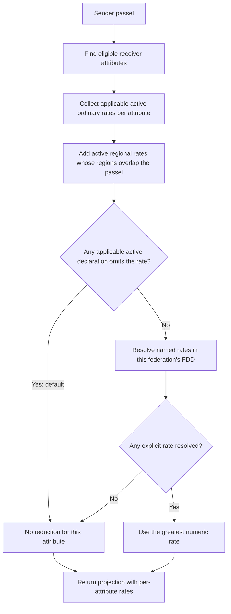
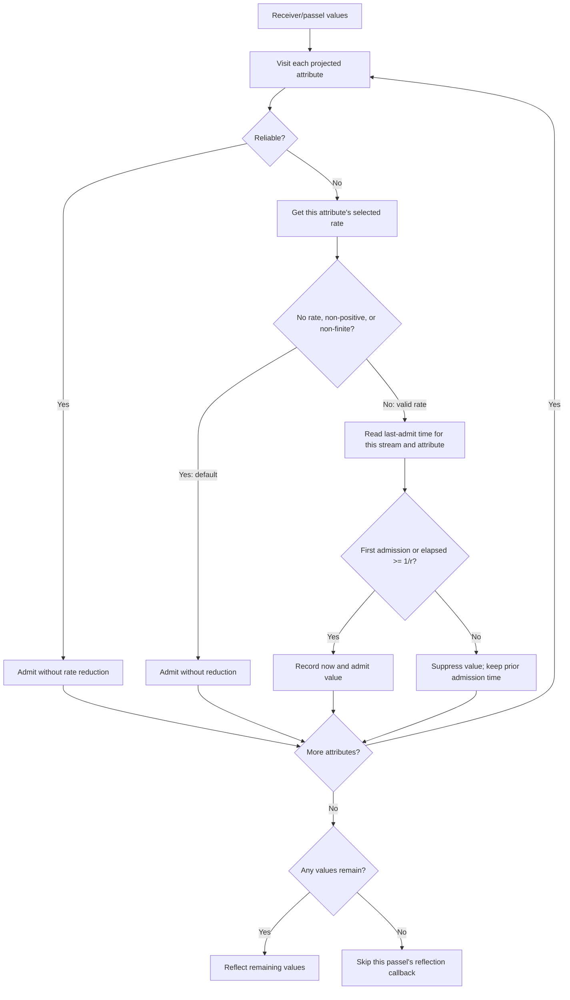
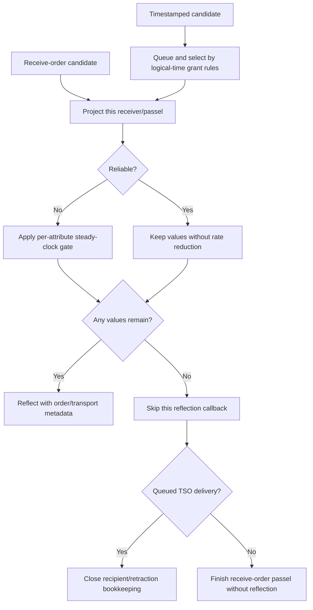

# HLA 1516.1-2025 Attribute Update-Rate Admission Flow Guide

> **Scope:** IEEE 1516.1-2025 API, Umbra's embedded federation-management
> development profile. This describes the observed 2025 implementation and
> selected tests; it is not a complete normative account or evidence of
> process-profile parity. The 2010 RTI stream is separate and is not covered.

This guide follows one receiver's attribute values through three distinct
decisions: which subscription rate applies, whether each best-effort attribute
is admitted at callback delivery, and where that check sits relative to
receive-order dispatch or a TSO grant. Keep this path separate from region
geometry, passel formation, time-advance eligibility, and relevance advisories.

## The public vocabulary

The 2025 `subscribeObjectClassAttributes` API accepts an active/passive flag
and an optional update-rate designator. The API also exposes
`getUpdateRateValue` (§10.11) and `getUpdateRateValueForAttribute` (§10.12).
The pinned 2025 MIM defines `HLAmaxUpdateRate` using the `HLAupdateRateName`
type. These identify the public vocabulary and lookup surfaces; the exact
combination and admission behavior charted below is an implementation
observation, not an independent statement of every normative rate rule.

- [Pinned `subscribeObjectClassAttributes` declaration](../../third_party/ieee1516.1-2025/include/RTI/RTIambassador.h#L535)
- [Pinned update-rate query declarations, §§10.11–10.12](../../third_party/ieee1516.1-2025/include/RTI/RTIambassador.h#L1778)
- [Pinned MIM `HLAmaxUpdateRate`](../../third_party/ieee1516.2-2025/resources/mim/HLAstandardMIM-2025.xml#L1354) and [`HLAupdateRateName`](../../third_party/ieee1516.2-2025/resources/mim/HLAstandardMIM-2025.xml#L3594)

## 1. Resolve a rate for each receiver and attribute

Ordinary subscription matching, publication, object knowledge, and any
applicable region checks establish the receiver's candidate attributes first.
For each projected attribute, the current embedded planner considers active
ordinary declarations and active regional declarations whose region applies to
the sent passel. A passive regional declaration does not contribute to this
delivery-rate selection.

In this implementation, an omitted/empty designator on any applicable active
declaration selects the no-reduction path for that attribute, even if another
applicable declaration names an explicit rate. Otherwise, the planner keeps
the greatest resolved numeric rate among the applicable active ordinary and
regional declarations. It stores the result per attribute, not as one
projection-wide rate. The exact applicability predicates still belong to
ordinary subscription and DDM logic; this chart does not replace those guides.

This is distinct from the owner's Attribute Relevance Advisory update-rate
designator. `turnUpdatesOnForObjectInstance` may communicate a designator to an
owner; it is not the subscriber-side callback admission clock. See the
[separate relevance-advisory guide](HLA-2025-RELEVANCE-ADVISORY-FLOW-GUIDE.md).

## 2. Admit or suppress each best-effort value at delivery

Once a receiver/passel projection is ready, the 2025 embedded callback paths
filter each projected attribute independently. Reliable transport bypasses
reduction. For best-effort transport, a missing/non-positive rate follows the
default path; a positive finite rate `r` allows an admission when that
attribute has no previous admission or at least `1/r` seconds have elapsed on
`std::chrono::steady_clock` since its last admitted value.

The comparison is strict on suppression: elapsed time **less than** `1/r` is
rejected, so equality is admitted. Only successful admissions update the
stored time. Distinct attributes have independent histories. The admission key
also contains the subscription generation, so a newly created subscription
generation starts with fresh history; resignation and federation teardown
erase only the corresponding history prefixes.

This is a best-effort admission filter, not a timer that schedules a suppressed
value for later delivery and not a measurement of the producer's sustained
rate. If every value in a passel is filtered, that passel does not produce a
reflection callback; another passel or another attribute can still be
delivered.

## 3. Keep the wall clock outside the TSO state machine

Receive-order dispatch and queued timestamp-order delivery reach the same
per-attribute admission rule at different points. For receive-order traffic,
the filter runs on the callback-dispatch path. For TSO traffic, time management
first determines which queued work reaches its delivery/grant boundary; the
rate gate then uses wall-clock elapsed time, not the message's logical
timestamp, to decide which values remain in that reflection.

The final TSO branch is intentionally narrow: a rate-suppressed reflection is
not requeued for a later wall-clock slot. The focused TSO test drives matching
time-advance requests and checks that the suppressed message becomes no longer
retractable at its recipient boundary; that is not a full test of the grant
algorithm. The exact grant rules and callback ordering remain in the
[time-management guide](HLA-2025-TIME-MANAGEMENT-GUIDE.md); the TSO chart here
only marks where rate admission intersects that path.

## Evidence and limits

| Question | Source or focused test | What it establishes |
| --- | --- | --- |
| Which active subscription rates are applicable to an attribute? | [Recipient planner](../../cpp/src/internal/federation/federation_registry_attribute_update_recipients.cpp#L327) | Current source combines applicable ordinary and overlapping active regional declarations per attribute; an applicable omitted/default declaration prevents reduction for that attribute. |
| What clock and interval does the private gate use? | [Gate contract](../../cpp/src/internal/time/update_rate_gate.hpp#L12), [implementation](../../cpp/src/internal/time/update_rate_gate.cpp#L9), [deterministic unit case](../../cpp/tests/ieee1516_2025_update_rate_gate_unit_catch2.cpp#L9) | The implementation uses an injectable steady clock, interval `1/r`, reliable/default bypass, independent keys, successful-admission timestamps, and scoped cleanup. The unit test advances a fake clock rather than sleeping. |
| Are mixed attributes filtered separately? | [Mixed explicit/default subscription case](../../cpp/tests/mixed_update_rate_subscriptions_catch2.cpp#L199) | In the embedded receive-order scenario, the Low-rate value is removed from the next reflection while the HLAdefault value in that same passel remains. |
| Do regional declarations participate? | [Regional best-effort case](../../cpp/tests/regional_best_effort_attribute_rate_catch2.cpp#L204), [passive regional query case](../../cpp/tests/update_rate_passive_regional_subscription_catch2.cpp#L73) | The first exercises overlapping active regional rate admission and resubscription; the second distinguishes passive from active regional declarations for the public rate query. These are separate observations. |
| Where does TSO admission occur, and what if all values are filtered? | [TSO dispatch](../../cpp/src/internal/runtime/umbra_rti_ambassador_time_advance_dispatch.cpp#L390), [mixed reliable/best-effort TSO case](../../cpp/tests/timestamped_attribute_update_rate_reduction_catch2.cpp#L187), [regional TSO case](../../cpp/tests/regional_best_effort_timestamped_attribute_rate_catch2.cpp#L197) | The implementation gates at queued delivery; focused embedded tests show best-effort suppression with reliable retention and regional suppression across grants. The mixed TSO case also checks the empty-reflection/retraction boundary. |

Additional implementation references: [rate-history key construction](../../cpp/src/internal/runtime/umbra_rti_ambassador.cpp#L96), [receive-order callback gate](../../cpp/src/internal/runtime/umbra_rti_ambassador_object_instance_lifecycle_callbacks.cpp#L785), and [federation rate queries](../../cpp/src/internal/federation/federation_registry_catalog_queries.cpp#L345).

These focused cases are embedded development-profile evidence, not proof of
full IEEE conformance, process-profile parity, or a globally enforced callback
cadence. Do not infer 2010 behavior from this 2025 implementation. Keep
transportation passel construction in the
[object/interaction information guide](HLA-2025-OBJECT-AND-INTERACTION-INFORMATION-FLOW-GUIDE.md),
region matching in the [DDM guide](HLA-2025-DATA-DISTRIBUTION-AND-REGIONS-FLOW-GUIDE.md),
and owner-facing rate advisories in the [relevance guide](HLA-2025-RELEVANCE-ADVISORY-FLOW-GUIDE.md).
