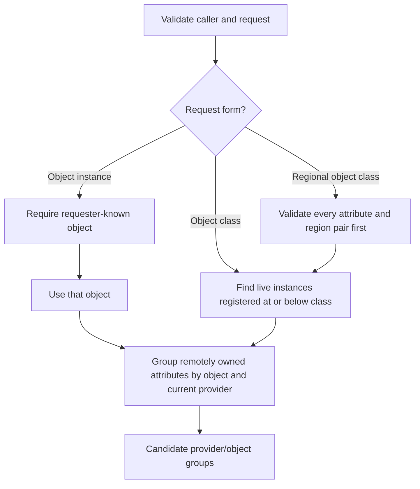
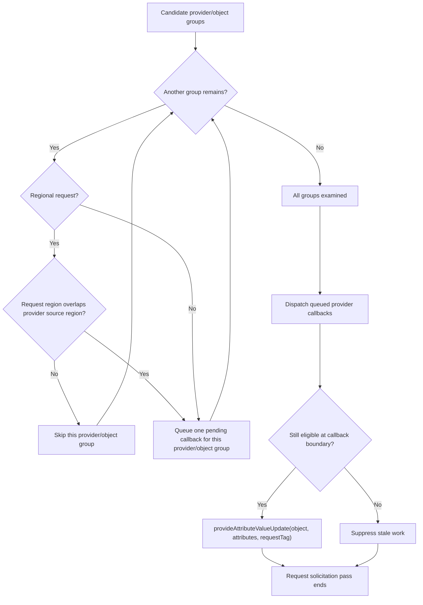
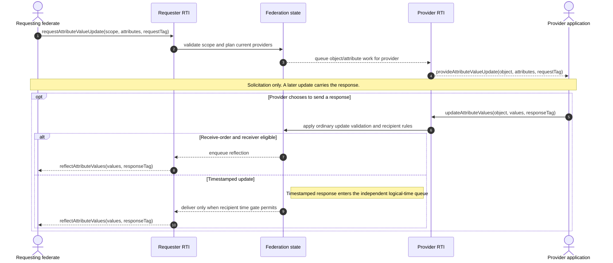
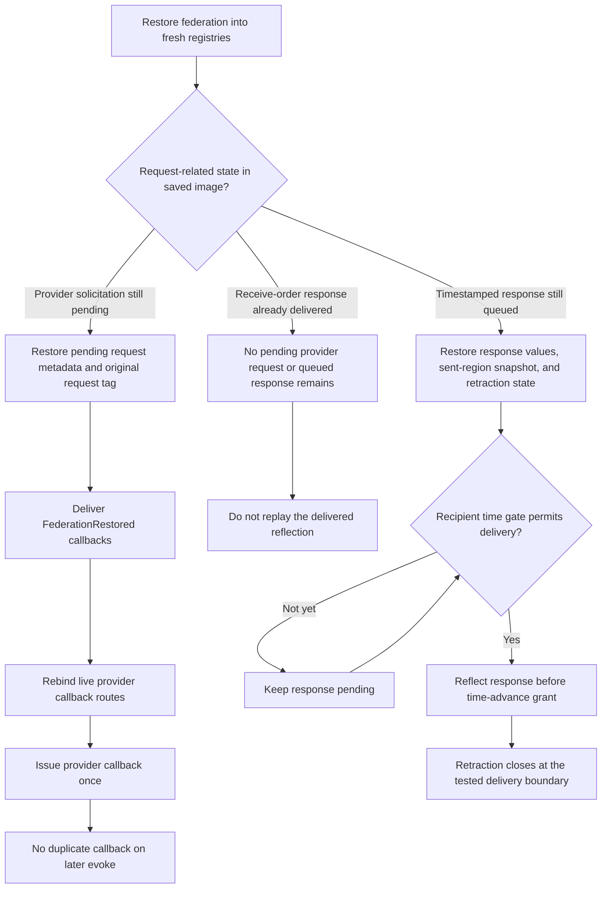

# HLA 1516.1-2025 attribute-value update request flow guide

This guide follows an explicit request for an attribute value through the
current **2025** API and Umbra implementation. A request solicits a provider;
it does not carry the requested value back to the caller. The provider callback,
the provider's later update, and the receiver's reflection are distinct events
with distinct eligibility and timing rules.

This is a source- and test-informed implementation guide, not a complete
normative interpretation of every request overload. It does not describe or
infer IEEE 1516.1-2010 behavior. Keep the editions' APIs, implementations, and
tests on their own paths. Most implementation detail below follows the embedded
2025 route; the one process class-request observation is called out separately
and is not evidence of process/embedded parity.

## 1. Choose the request scope and build provider work

The 2025 API has object-instance, object-class, and regional object-class
request forms. They do not all identify work the same way. The embedded
implementation plans provider callbacks by object and current attribute
ownership; it does not treat a request as one opaque callback for the whole
class.

#### 1. Expand request scope into candidate provider/object work

#### 2. Filter each group, then dispatch and recheck provider work

Apply the dispatch/recheck branch independently to each queued
provider/object group.

### What changes with each scope

- **Object instance:** the requesting federate must already know the object.
  Requested attributes are checked against that object's known class. The
  planner then solicits current owners for attributes they own; an attribute
  already owned by the requester does not create a provider callback.
- **Object class:** Umbra's embedded planner enumerates live, non-deleted
  instances registered at or below the requested class. It splits each
  instance's requested attributes by their current provider. A provider can
  therefore receive multiple callbacks for different objects, and one object
  can produce callbacks to multiple providers. A focused process test also
  observes class expansion across two registered subclass instances; that is
  not evidence of full process/embedded parity.
- **Regional object class:** validate the supplied attribute/region pairs and
  region ownership/commit state before planning any route. The request and
  provider source regions must satisfy the current regional eligibility test.
  Tests cover empty scopes, disjoint scopes, committed region changes, and a
  queued callback whose regional route becomes stale before delivery. Do not
  generalize those cases into a claim that every request property is
  revalidated in every profile.
- **Callback boundary:** pending embedded requests retain request metadata and
  are checked again as provider work begins. A route that no longer has
  eligible attributes can be suppressed rather than delivered as stale work.

The diagram omits API exception details and per-overload validation matrices.
It also omits automatic `provideAttributeValueUpdate` behavior: an explicit
request is not discovery-triggered Auto Provide, and the Auto Provide switch
must not be applied to explicit requests by assumption. See the
[Auto Provide guide](HLA-2025-AUTO-PROVIDE-FLOW-GUIDE.md) for the separate
discovery-triggered path.

## 2. The provider callback is not the value response

The request's user tag is echoed to the provider callback. The provider decides
whether and when to call `updateAttributeValues`; that later service supplies
the value bytes and its own tag. If a receiver is eligible, the resulting
`reflectAttributeValues` carries the provider's response tag, not an
automatically reused request tag.

This path does not bypass ordinary update rules. Ownership, receiver knowledge,
subscriptions, regional relevance, transportation/order, and time management
remain separate gates. A request may yield no provider callback, and a provider
callback may yield no update. Even when an update is sent, it may not result in
a reflection for a particular receiver.

### Special case: RTI-owned MOM objects

The current 2025 ambassador implementation has a separate branch for requests
against RTI-owned MOM objects: it plans a MOM snapshot and directly reflects
that snapshot to the requester instead of routing an ordinary provider
solicitation. Keep this as a special RTI-owned-object path, not as the general
provider lifecycle described above. See the
[federation-scoped MOM guide](HLA-2025-FEDERATION-MOM-FLOW-GUIDE.md) and the
[joined-federate MOM guide](HLA-2025-JOINED-FEDERATE-MOM-OBJECT-LIFECYCLE-FLOW-GUIDE.md)
for MOM ownership and lifecycle boundaries.

For the later update's receive-order projection/passel behavior, see the
[object and interaction information guide](HLA-2025-OBJECT-AND-INTERACTION-INFORMATION-FLOW-GUIDE.md).
For timestamped update ordering, grants, and retraction, see the
[time-management guide](HLA-2025-TIME-MANAGEMENT-GUIDE.md),
[callback/service-ordering guide](HLA-2025-CALLBACK-AND-SERVICE-ORDERING-FLOW-GUIDE.md),
and [TSO retraction guide](HLA-2025-TSO-RETRACTION-FLOW-GUIDE.md).

## 3. Save/restore depends on which lifecycle stage was reached

“The response to a request” is not one durable state. A request still waiting
to solicit a provider, an already delivered receive-order update, and a queued
timestamped update have different restore behavior in the focused embedded
2025 tests.

These are state distinctions, not three stages that every request must visit.
The restore tests deliberately probe different cut points:

- A still-pending class request is restored with its request tag and provider
  routing is rebound; the provider callback follows `federationRestored`, and
  later callback pumping does not duplicate it.
- A delivered receive-order response is application-visible state rather than
  pending provider work; the fresh-registry restore test checks that it is not
  reflected a second time.
- A queued timestamped regional response survives with its values, source-region
  snapshot, and retraction state. The test observes reflection before the
  matching time-advance grant; after recipient delivery, retraction is no
  longer accepted.

Do not infer that every overload or execution profile has identical save/restore
coverage from these selected cases. For the broader save/restore state machine,
see the [federation save/restore guide](HLA-2025-FEDERATION-SAVE-RESTORE-FLOW-GUIDE.md).

## Evidence and implementation pointers

The links below identify the API surface, the current implementation seams,
and focused 2025 observations. Test observations are not substitutes for a
clause-by-clause review of IEEE 1516.1-2025.

| Concern | Source or focused test | What it supports |
| --- | --- | --- |
| Object-instance, class, and regional public API | [RTIambassador.h:876](../../third_party/ieee1516.1-2025/include/RTI/RTIambassador.h#L876), [RTIambassador.h:891](../../third_party/ieee1516.1-2025/include/RTI/RTIambassador.h#L891), [RTIambassador.h:1672](../../third_party/ieee1516.1-2025/include/RTI/RTIambassador.h#L1672) | The three request scopes and their API argument shapes |
| Provider callback | [FederateAmbassador.h:350](../../third_party/ieee1516.1-2025/include/RTI/FederateAmbassador.h#L350) | The callback receives an object, attribute set, and tag |
| Embedded request overloads | [Ambassador request implementation:23](../../cpp/src/internal/runtime/umbra_rti_ambassador_request_attribute_value_updates.cpp#L23), [class overload:331](../../cpp/src/internal/runtime/umbra_rti_ambassador_request_attribute_value_updates.cpp#L331), [regional overload:633](../../cpp/src/internal/runtime/umbra_rti_ambassador_request_attribute_value_updates.cpp#L633) | Separate object, class, regional, and RTI-owned MOM handling paths |
| Embedded owner partition and fan-out | [Registry object planner:278](../../cpp/src/internal/federation/federation_registry_attribute_value_update_requests.cpp#L278), [class planner:970](../../cpp/src/internal/federation/federation_registry_attribute_value_update_requests.cpp#L970), [instance expansion:1037](../../cpp/src/internal/federation/federation_registry_attribute_value_update_requests.cpp#L1037) | Request validation, instance expansion, and per-provider/per-object planning |
| Process class expansion observation | [Process class request test:49](../../cpp/tests/ieee1516_2025_connection_process_class_request_attribute_value_update_catch2.cpp#L49) | A focused process test observes class request callbacks for registered subclass instances; not full process parity |
| Regional filter and stale queued work | [Regional filtering test:178](../../cpp/tests/ieee1516_2025_regional_request_attribute_value_update_filtering_catch2.cpp#L178) | Selected overlap, validation, committed-region mutation, and stale callback cases |
| Provider chooses timestamped response | [Timestamped class response test:6](../../cpp/tests/ieee1516_2025_timestamped_object_class_request_provider_response_catch2.cpp#L6), [regional response test:6](../../cpp/tests/ieee1516_2025_timestamped_regional_request_provider_response_catch2.cpp#L6) | A request callback can lead to a distinct TSO update, grant-ordered reflection, and response-tag propagation |
| Pending request restored | [Class pending-request restore test:6](../../cpp/tests/ieee1516_2025_public_class_pending_attribute_value_update_restore_catch2.cpp#L6) | Request metadata/tag restoration, callback ordering after restore, and no duplicate callback |
| Delivered RO response not replayed | [No-replay restore test:6](../../cpp/tests/ieee1516_2025_public_regional_provider_response_no_replay_restore_catch2.cpp#L6) | A delivered receive-order response is not re-reflected after fresh-registry restore |
| Queued regional TSO response restored | [Retraction restore test:7](../../cpp/tests/ieee1516_2025_public_regional_provider_response_retraction_restore_catch2.cpp#L7) | Queued payload, sent-region snapshot, recipient grant ordering, and retraction terminalization |

## Related guides

- [Object and interaction information flow](HLA-2025-OBJECT-AND-INTERACTION-INFORMATION-FLOW-GUIDE.md)
- [Attribute update-rate admission](HLA-2025-ATTRIBUTE-UPDATE-RATE-ADMISSION-FLOW-GUIDE.md)
- [DDM and regions](HLA-2025-DATA-DISTRIBUTION-AND-REGIONS-FLOW-GUIDE.md)
- [Auto Provide](HLA-2025-AUTO-PROVIDE-FLOW-GUIDE.md)
- [Time management](HLA-2025-TIME-MANAGEMENT-GUIDE.md)
- [Federation save/restore](HLA-2025-FEDERATION-SAVE-RESTORE-FLOW-GUIDE.md)

