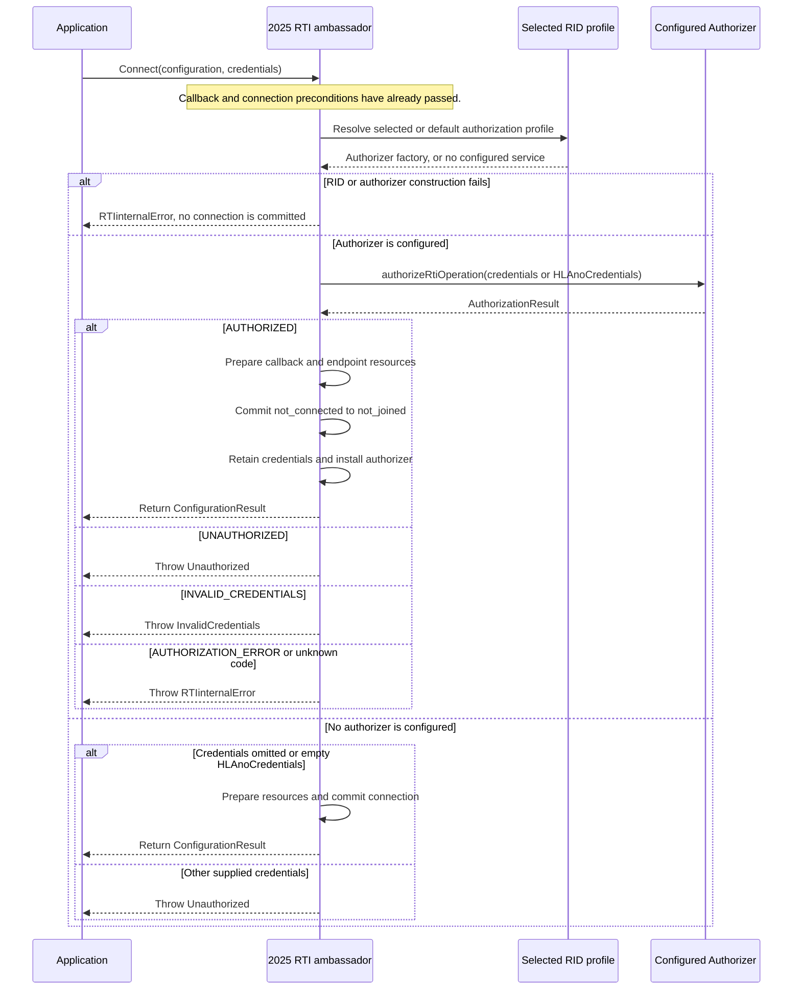

# HLA 1516.1-2025 Authorization and Credentials Flow

This guide follows the 2025 `Authorizer` contract across four RTI operations:
Connect, Create Federation Execution, Destroy Federation Execution, and Join
Federation Execution. It separates credential presentation, authorizer
decision, Umbra's exception mapping, and the operation's later state change.
It is a description of the pinned API and current Umbra 2025 implementation,
not a security assessment or a conformance claim.

Keep this guide separate from the [2010 reference-RTI flow
guide](HLA-2010-REFERENCE-RTI-FLOW-GUIDE.md). It does not infer that the 2010
stream has this authorizer interface or these behaviors.

## Three authorization scopes

The pinned 2025 `Authorizer` interface names three callbacks. They are not a
generic per-service hook:

| RTI operation | Authorizer callback | Inputs Umbra supplies | Umbra mapping before the operation continues |
| --- | --- | --- | --- |
| `Connect` | `authorizeRtiOperation` | The supplied `Credentials`, or `HLAnoCredentials` when omitted | `UNAUTHORIZED` → `Unauthorized`; `INVALID_CREDENTIALS` → `InvalidCredentials`; `AUTHORIZATION_ERROR` or an unknown code → `RTIinternalError` |
| `Create Federation Execution`, `Create Federation Execution With MIM`, `Destroy Federation Execution` | `authorizeFederationOperation` | The credentials retained from `Connect` and the requested federation name | `UNAUTHORIZED` or `INVALID_CREDENTIALS` → `Unauthorized`; `AUTHORIZATION_ERROR` or an unknown code → `RTIinternalError` |
| `Join Federation Execution` | `authorizeFederateOperation` | Retained credentials, federation name, federate type, and requested federate name | `UNAUTHORIZED` or `INVALID_CREDENTIALS` → `Unauthorized`; `AUTHORIZATION_ERROR` or an unknown code → `RTIinternalError` |

The pinned declarations distinguish the credential-taking Connect overloads,
which list both `Unauthorized` and `InvalidCredentials`, from Create, Destroy,
and Join, which list `Unauthorized` but not `InvalidCredentials`. The overload
annotations are not uniform: the [bare Connect overload](../../third_party/ieee1516.1-2025/include/RTI/RTIambassador.h#L55)
lists neither authorization exception; the [configuration-only overload](../../third_party/ieee1516.1-2025/include/RTI/RTIambassador.h#L68)
lists `Unauthorized`; and the [credentials-only](../../third_party/ieee1516.1-2025/include/RTI/RTIambassador.h#L83)
and [configuration-plus-credentials](../../third_party/ieee1516.1-2025/include/RTI/RTIambassador.h#L98)
overloads list both. The implementation uses one result mapper for all Connect
overloads. Treat that mismatch as an API-declaration question, not as
permission to broaden the documented throw contract without checking full
§4.2. The same pinned header declares [Create with one FOM module](../../third_party/ieee1516.1-2025/include/RTI/RTIambassador.h#L128),
[Create with an FOM module list](../../third_party/ieee1516.1-2025/include/RTI/RTIambassador.h#L145),
[Create-With-MIM](../../third_party/ieee1516.1-2025/include/RTI/RTIambassador.h#L165),
[Destroy](../../third_party/ieee1516.1-2025/include/RTI/RTIambassador.h#L179),
[unnamed Join](../../third_party/ieee1516.1-2025/include/RTI/RTIambassador.h#L212),
and [named Join](../../third_party/ieee1516.1-2025/include/RTI/RTIambassador.h#L234)
with their own operation-specific throw lists. The pinned [`Authorizer`
interface](../../third_party/ieee1516.1-2025/include/RTI/auth/Authorizer.h#L24)
and [`AuthorizationResult`](../../third_party/ieee1516.1-2025/include/RTI/auth/AuthorizationResult.h#L15)
define the callback and result values.

Authorization is distinct from Service Reporting, Exception Reporting, and
MOM exception reporting. An authorized operation can still fail its ordinary
connection, FOM, federation-state, or membership checks.

## 1. Connect loads the profile, asks once, then commits

The callback-model and reentrant-call checks happen before the authorizer
stage; an already-connected ambassador is rejected before caller settings are
prepared. See the [Connect guide](HLA-2025-CONNECTION-AND-CONFIGURATION-FLOW-GUIDE.md)
for those local connection gates. At the authorization boundary, the selected
RID profile may provide Umbra's reference `HLAauthorizer`; a successful
authorization is still followed by connection-resource preparation before the
local lifecycle commits.



The no-authorizer rule is specific to this Connect path: absent credentials and
the empty `HLAnoCredentials` value are accepted; another supplied credential
is rejected. For a configured authorizer, omitted credentials are presented to
`authorizeRtiOperation` as `HLAnoCredentials`. The authorizer candidate is
installed only after connection setup reaches the local commit. The RID-backed
reference service currently reads a configured global password file; that is
an Umbra profile option, not a claim about every 2025 authorizer. See [RID
loading](../../cpp/src/internal/runtime/rti_initialization_data.cpp#L339) and
[Connect authorization](../../cpp/src/internal/runtime/umbra_rti_ambassador_connect_services.cpp#L68).

## 2. Connected credentials gate Create, Destroy, and Join

After Connect, the ambassador keeps the credential value in its connection
snapshot. Before the federation-management branch, Umbra copies that value
under the state lock, releases the lock, and invokes the configured authorizer
under the authorizer lock. This keeps plugin code outside the ambassador state
mutex while serializing authorizer calls with Disconnect.

```mermaid
flowchart TD
  A[Connected ambassador with saved Connect credentials] --> B{Requested service}
  B -->|Create, Create With MIM, or Destroy| C[authorizeFederationOperation(credentials, federationName)]
  B -->|Join with requested name| D[authorizeFederateOperation(credentials, federationName, name, type)]
  B -->|Join without requested name| E[authorizeFederateOperation(credentials, federationName, empty name, type)]
  C --> F{Configured authorizer exists?}
  D --> F
  E --> F
  F -->|No| G[No plugin decision, continue to ordinary service path]
  F -->|Yes| H[Call under authorizer mutex after releasing state mutex]
  H --> I{AuthorizationResult}
  I -->|AUTHORIZED| G
  I -->|UNAUTHORIZED or INVALID_CREDENTIALS| J[Throw Unauthorized before FOM or membership mutation]
  I -->|AUTHORIZATION_ERROR or unknown code| K[Throw RTIinternalError before the operation]
  G --> L[Continue to selected process or embedded operation]
```

The gate is before each service's profile-specific operation. Create and
Create-With-MIM authorize before FOM preparation; Destroy authorizes before
the registry or process destroy request; Join authorizes before the membership
transaction and before an RTI-assigned federate name is selected. For the
unnamed Join overload, the API has no requested name to authorize, so Umbra
passes an empty string; the authorizer does not receive the later assigned
name. The [shared result mapping and credential snapshot](../../cpp/src/internal/runtime/umbra_rti_ambassador.cpp#L139)
and [connected-operation authorization gates](../../cpp/src/internal/runtime/umbra_rti_ambassador.cpp#L2496)
show these implementation boundaries.

The source places these checks before both the embedded and process branches.
The focused operation tests use Umbra's embedded test seam; this source order
does not establish process-endpoint authorization parity or an end-to-end
process test result.

## What the focused cases establish

The [authorization test file](../../cpp/tests/ieee1516_2025_authorization_catch2.cpp#L389)
covers HLAunicodeString password payloads, malformed credential data, the
reference authorizer, Connect, factory/RID loading, and operation-specific
authorization. In the current local focused CTest run, 7 of 10 selected cases
passed. The Create authorization case passed and denies before its deliberately
missing FOM is read. Three setup paths did not reach their authorization
assertions:

- The factory-created RID case failed again on a standalone rerun while
  creating its temporary RID test file (test line 556).
- The Destroy case threw `Unknown exception` while creating its initial test
  federation (line 682), before the denial/retry checks.
- The Join case threw `Unknown exception` while creating its initial test
  federation (line 760), before the named/unnamed Join checks.

Those test bodies document intended scenarios, not passing runtime evidence in
this environment. The successful Connect, credential-format, reference
authorizer, and Create cases are also limited to their stated scenarios.

## Limits and handoff

- This guide explains the pinned 2025 API and Umbra's current 2025 code; it
  makes no 2010 equivalence claim.
- The reference `HLAauthorizer` is a password-file-backed implementation. Its
  existence does not evaluate the strength or deployment suitability of an
  authorization policy.
- `AUTHORIZATION_ERROR` and unknown-result exception mappings are source
  observations; the selected tests do not exercise every mapping. The
  overload-specific Connect `@throws` difference above remains to be checked
  against the full §4.2 text before making a normative claim.
- The operation tests for Destroy and Join did not reach their target
  assertions in the current run. Process-endpoint authorization is not
  established by the embedded test cases.
- Authorization success is only an admission decision. It does not mean FOM
  validation, federation mutation, Join, or any later service step succeeds.
- This documentation does not change or extend Requirements Lab mappings.

## Implementation and API map

| Boundary | Evidence |
| --- | --- |
| Public 2025 authorization contract and result codes | [`Authorizer`](../../third_party/ieee1516.1-2025/include/RTI/auth/Authorizer.h#L24), [`AuthorizationResult`](../../third_party/ieee1516.1-2025/include/RTI/auth/AuthorizationResult.h#L15) |
| RID profile selection and reference-authorizer construction | [RID loader](../../cpp/src/internal/runtime/rti_initialization_data.cpp#L339) |
| Connect authorization and connection commit | [Connect path](../../cpp/src/internal/runtime/umbra_rti_ambassador_connect_services.cpp#L68), [Connect result mapping](../../cpp/src/internal/runtime/ambassador_connection_support.cpp#L140) |
| Create, Create-With-MIM, Destroy, and Join gate placement | [Federation lifecycle services](../../cpp/src/internal/runtime/umbra_rti_ambassador_federation_lifecycle.cpp#L154) |
| Unit, Connect, and factory cases | [Authorization tests](../../cpp/tests/ieee1516_2025_authorization_catch2.cpp#L389) |

For adjacent state, continue with the [connection/configuration guide](HLA-2025-CONNECTION-AND-CONFIGURATION-FLOW-GUIDE.md)
or the [federation/federate lifecycle guide](HLA-2025-FEDERATION-AND-FEDERATE-LIFECYCLE-FLOW-GUIDE.md).
