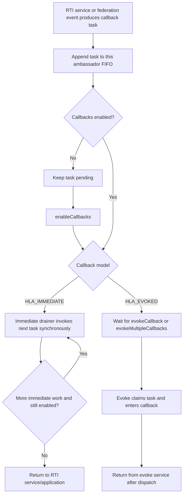
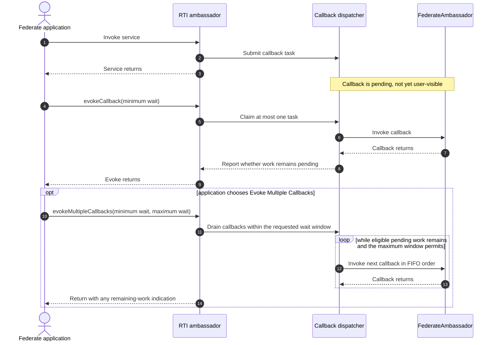
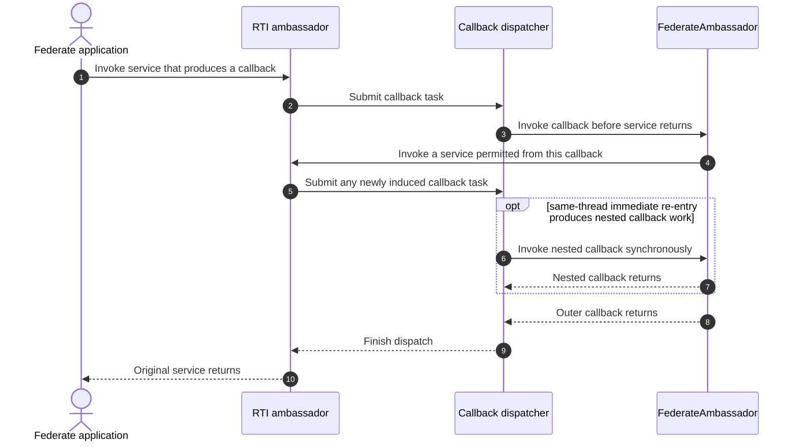
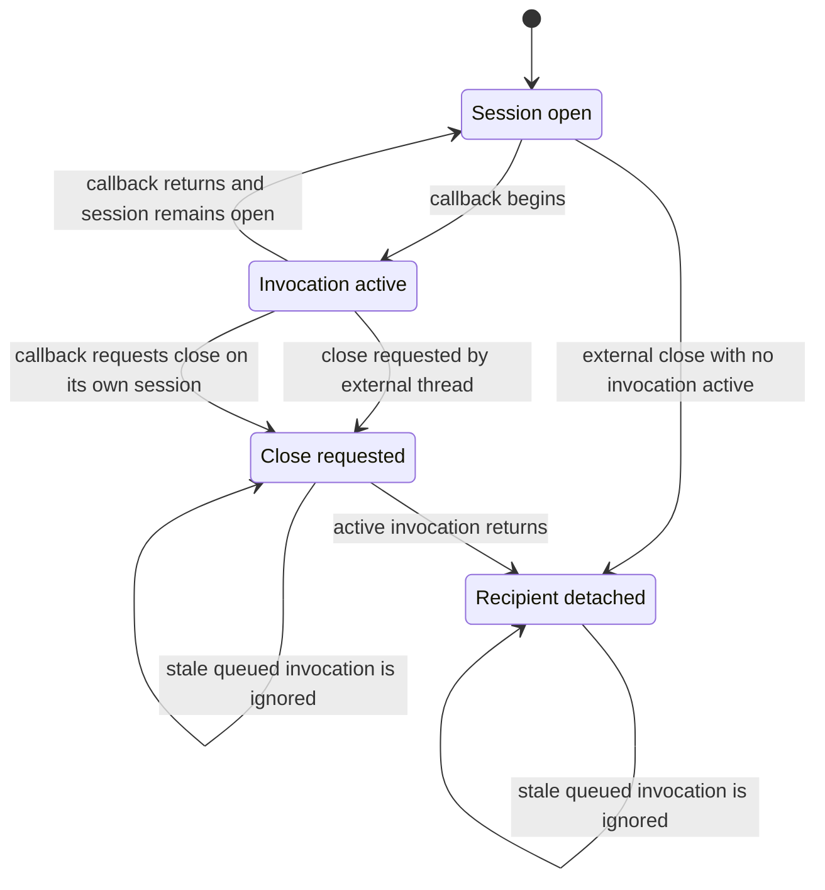
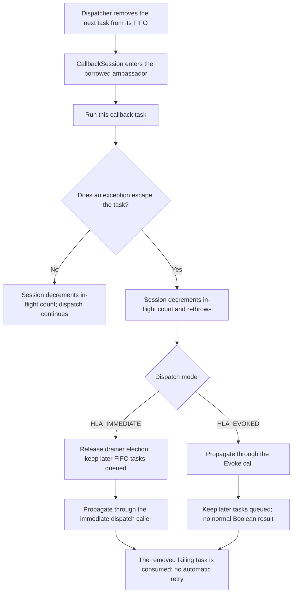
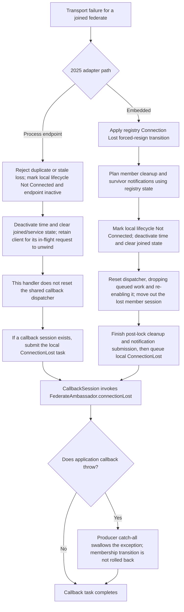
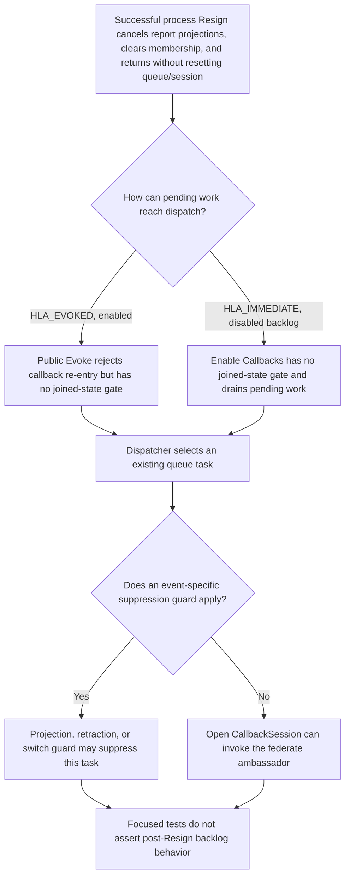
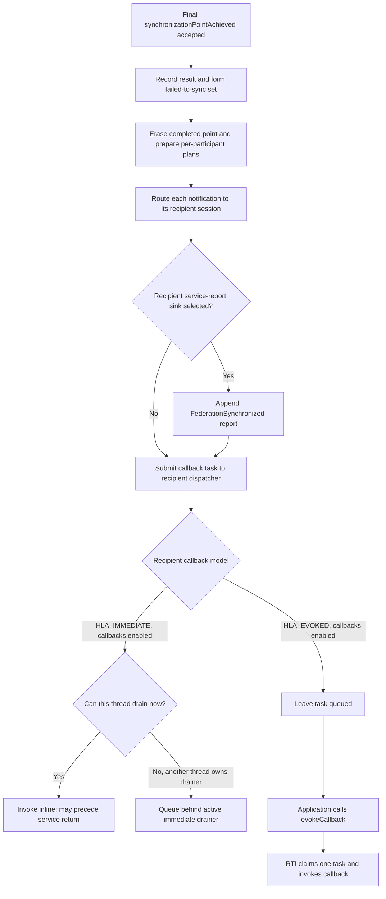

# IEEE 1516.1-2025 Callback and Service Ordering

This guide explains how a federate-facing event moves from an RTI service or
federation event into user callback code, how the HLA_IMMEDIATE and HLA_EVOKED
models change that boundary, and where callback re-entry is allowed or
rejected. It focuses on per-ambassador dispatch and intentionally does not
restate the time-management guide's TSO ordering rules.

## Scope and authority

- **Edition boundary:** IEEE 1516.1-2025 only. The 2010 API/runtime and tests
  are a separate stream. This guide does not infer that their callback timing,
  restrictions, or ordering are equivalent.
- **Implementation boundary:** Umbra's callback dispatcher/session and
  selected embedded and process-endpoint tests. Unit tests establish private
  dispatcher behavior, while public integration cases establish only their
  named API path.
- **Normative authority:** the [official IEEE 1516.1-2025 Federate Interface
  Specification](https://standards.ieee.org/ieee/1516.1/6688/). Use its exact
  service clauses for callback-model and callback-re-entry requirements. The
  summaries below distinguish those concepts from current Umbra mechanics.
- **Evidence rule:** no unit or integration scenario here is presented as
  complete conformance evidence.

The [time-management guide](HLA-2025-TIME-MANAGEMENT-GUIDE.md) owns TSO
eligibility, grant ordering, and callback-gated logical-time state. The
[save/restore guide](HLA-2025-FEDERATION-SAVE-RESTORE-FLOW-GUIDE.md) owns
federation-wide callback barriers. Ownership callbacks and information-flow
callbacks remain in their [ownership](HLA-2025-ATTRIBUTE-OWNERSHIP-FLOW-GUIDE.md)
and [object/interaction](HLA-2025-OBJECT-AND-INTERACTION-INFORMATION-FLOW-GUIDE.md)
guides.

## Standard concepts to keep separate from dispatcher mechanics

| HLA-facing concept | How to read it |
| --- | --- |
| Callback model | The model selected when connecting determines whether callbacks are delivered immediately or through explicit evoke services. It is a delivery policy, not a second copy of the federation's event state. |
| HLA_IMMEDIATE | The RTI can invoke the FederateAmbassador while the inducing RTI service is still executing. Application code must account for that synchronous callback boundary. |
| HLA_EVOKED | The federate application controls callback dispatch by invoking Evoke Callback or Evoke Multiple Callbacks. A returned service call and an undelivered callback are not contradictory. |
| Callback re-entry | Whether an RTI service may be called from user callback code is service-specific. Check the official call restrictions for the exact operation. |
| Callback ordering | Normative order can depend on the originating service, message order, and time-management state. Umbra's per-ambassador FIFO is only one implementation layer, not the whole HLA ordering model. |

## The important boundary: submitted is not invoked

Treat these as separate events:

1. An RTI operation or internal transition produces a callback task.
2. The task is accepted into a per-ambassador dispatch queue.
3. The callback model and callbacks-enabled switch determine when it may run.
4. The RTI enters the federate ambassador method.
5. Any state change defined at callback entry or completion occurs at that
   callback boundary, not merely because the initiating service returned.

This distinction explains why an HLA_EVOKED service call can return before its
callback is application-visible. For operations with callback-gated state,
the corresponding state transition can also remain pending until that
callback boundary. It also explains why an immediate callback can run before
its inducing service call returns.

## Callback-task dispatch

This is the current dispatcher model at a high level. Important qualifications:

- In HLA_IMMEDIATE mode, an enabled task normally runs synchronously on the
  submitting/draining thread. If another thread already owns the immediate
  drainer, its task is queued behind the current callback rather than entering
  the same federate ambassador concurrently.
- A callback may disable callbacks. The immediate drainer checks the setting
  at each callback boundary, leaves the remaining tasks pending, and resumes
  them when callbacks are enabled again.
- In HLA_EVOKED mode, enabling callbacks does not itself invoke queued work.
  The application must call an Evoke service. While callbacks are disabled,
  the current dispatcher leaves evoked tasks queued.
- These are per-ambassador queue mechanics. They do not establish one global
  order across different federates, RTI sessions, or independent callback
  routes.

## HLA_EVOKED: the application owns the drain point

In the current public adapter, Evoke Callback first uses a locally queued task
when one exists and otherwise polls one process-endpoint receive-order event.
Evoke Multiple Callbacks admits currently available process receive-order
events before draining the shared dispatcher. These are transport-profile
details, not additional HLA ordering guarantees.

The Boolean result is also not the callback itself: in the current dispatcher
it reports whether work remains pending after the invocation/window. Tests
cover the one-at-a-time and FIFO cases. Do not interpret a true result as
“another callback already ran.”

## HLA_IMMEDIATE: callback work can be on the service stack

The same-thread nested path is a current implementation capability of the
recursive dispatcher/session, not permission to call every RTI service from a
callback. Each service's callback-re-entry rule still applies. In particular,
the current public adapter explicitly rejects Connect, Disconnect, Join,
Resign, Evoke Callback, and Evoke Multiple Callbacks from inside a federate
callback. Check the exact official API rule and the service implementation
before relying on other re-entry.

Do not conflate the internal CallbackSession close operation with the public
Disconnect service. The session can close itself during an active invocation
without waiting on itself; the public RTI Disconnect call is explicitly
guarded against callback re-entry.

## Callback-session lifetime and concurrency

Umbra borrows the caller-owned FederateAmbassador rather than owning it. The
session serializes callback entry so two RTI paths do not enter the same
ambassador concurrently. An external close waits for a callback already in
flight; same-thread close marks the session closed and lets the active
invocation release the borrowed pointer on return. This internal lifetime
protection is separate from what the public HLA service permits.

## Ordering and state-commit cautions

- **FIFO is local.** The dispatcher deque preserves task submission order for
  one ambassador. A multi-recipient integration test checks per-recipient
  interaction FIFO across its configured process endpoint; it is not proof of
  one total order among all callbacks from all services or federates.
- **No batch pre-extraction in immediate mode.** Tasks are taken one at a time
  so disableCallbacks can stop a backlog at the next boundary.
- **Evoke Multiple is bounded.** The current implementation normalizes wait
  values and drains until no work remains after the minimum window or the
  maximum deadline is reached. Callbacks can consume time inside that window.
- **Disable is not discard.** Pending tasks survive disable/enable transitions
  unless a lifecycle operation explicitly resets or closes that session.
- **Exceptions are dispatch-boundary events.** If an exception escapes its
  callback task, the dispatcher has already removed that task. The session
  releases its in-flight count and rethrows; there is no automatic retry. The
  immediate drainer releases its election state and preserves later FIFO work.
  The Evoke path likewise propagates the exception and leaves later tasks
  pending. Producer-specific catches can change this path; see the focused
  [exception boundary](#if-an-exception-escapes-a-callback-task) below.
- **Time order is specialized.** Receive-order FIFO is not a substitute for
  timestamp ordering. TSO-before-grant ordering, retraction, and loss cutoffs
  are documented in the time-management guide.
- **Completion callbacks are protocol gates.** Save/restore completion,
  ownership transfer, and time-role changes may commit state at their own
  callback boundaries. Follow their focused guides instead of assuming that
  all callbacks have identical commit semantics. In the embedded
  FederationSynchronized path below, the registry instead erases the completed
  point while preparing notifications, before callback dispatch.

## If an exception escapes a callback task

This is the common 2025 dispatcher/session boundary used by callback tasks
that reach it. It does not claim that every producer lets user exceptions
escape; both 2025 `ConnectionLost` producer paths catch callback exceptions
themselves, as traced below. Nor does this low-level flow define each public
service's exception translation or state-commit behavior.

`CallbackDispatcher` takes the task out of the deque before invoking it. The
session's exceptional path decrements its in-flight count before rethrowing.
For HLA_IMMEDIATE, `drainImmediate` clears the drainer election on escape and
does not discard the remaining FIFO backlog. For HLA_EVOKED, `evokeOne` and
`evokeMultiple` invoke an already-extracted task without a catch/requeue step;
an escaping exception bypasses the normal return while later queue entries
remain. In both models the failed task has been consumed, not retried. A
producer may deliberately catch an exception before it reaches this boundary,
so treat this as dispatcher evidence rather than a universal RTI error policy.

Cancellation is a separate transition from exception handling or disabling.
`CallbackDispatcher::reset` clears pending work; the embedded resignation path
does this after the membership transition and before submitting notifications
to surviving members. The focused embedded restore/resignation test verifies
that queued restore callbacks do not reach the departing federate while the
survivor still receives the terminal restore result. The process-profile path
has a different, narrower source-observed boundary, shown next; do not infer
embedded/process parity from either path.

## `ConnectionLost` producer exception containment and backend-specific cleanup

Do not apply the generic escaping-task branch above to this callback: both
2025 producers catch exceptions thrown by `FederateAmbassador::connectionLost`.
Their local state transitions differ, so this chart compares only these
observed adapter paths; it is not a process/embedded parity claim or a 2010
description. Callback-model timing remains as described in the HLA_IMMEDIATE
and HLA_EVOKED sections above.

The process helper commits its local Not Connected state, clears joined/time
metadata, and submits the callback without resetting the shared dispatcher in
that handler. The embedded path first commits registry forced resignation,
then resets pending callback work before its later local `ConnectionLost`
submission. In both paths an application exception from `connectionLost` is
contained before it reaches the generic dispatcher exception boundary. The
embedded service-report append failure is a different RTI-side error: cleanup
and callback routing continue before the adapter reports `RTIinternalError`.

Evidence is source-bounded. The focused embedded service-report test encodes
record-before-callback behavior, but its current local run failed during
`createFederationExecution` (test line 521), before reaching the callback
assertions. The cited tests do not inject an exception from
`connectionLost`; neither that catch behavior nor a process-profile callback
scenario is claimed as runtime-tested.

## Process-profile Resign and queued callback work

This is a 2025 process-endpoint source trace, not a normative Resign rule and
not a test assertion about post-Resign delivery. Source shows a possible
dispatch path for queued work; the projection cancellation is deliberately
narrower than resetting the shared dispatcher.

On a successful response, the [process client](../../cpp/src/internal/federation/process_federation_client_federation_management.cpp#L103)
cancels exception-report projections, not the dispatcher queue. The focused
bridge test proves that a queued receive event whose exception-report
projection was invalidated does not reach the projection handler or federate
callback; a later membership generation can project normally. The ambassador's
process Resign branch then applies its lifecycle transition, clears its joined
fields, and returns before the embedded reset site. Unlike this Resign path,
[`ProcessFederationCallbackBridge::close`](../../cpp/src/internal/federation/process_federation_callback_bridge.cpp#L1865)
closes the callback session and resets the dispatcher.

The source supports a post-Resign dispatch path for work already in the shared
queue, if the corresponding public callback-control service is called. Public
Evoke rejects callback re-entry but contains no joined-state check; its process
poll helper does require joined membership before fetching new process events.
`Enable Callbacks` has no membership check either, and enabling an immediate
dispatcher drains its pending queue. Bridge submissions generally check
`isClosed()` before enqueueing; ordinary task closures capture the session and
invoke it without a general membership recheck. Some event families have
specific staleness gates, including exception-report projection generation,
message retraction, and the Attribute Relevance Advisory switch. The callback
session itself checks whether it is closed or has lost its recipient (normally
on Disconnect/destruction), not whether Resign cleared federation membership.

This is an implementation observation, not a claim that post-Resign Evoke or
callback delivery is normatively permitted. The bridge cancellation tests
exercise exception-report projection guards, not the full public Resign path.
The process receive/Evoke integration drains its interaction callbacks before
resigning both participants, so it does not exercise this edge. The focused
cases cited here do not assert the post-Resign result for an unrelated pending
task. Keep that behavioral/test gap visible until the official service
contract and intended implementation behavior are checked.

## Federation Synchronized after barrier completion

This is a zoom-in on one 2025 embedded callback producer, not another
synchronization-point state machine. The [synchronization guide](HLA-2025-FEDERATION-SYNCHRONIZATION-FLOW-GUIDE.md#achievement-is-a-fan-in-not-a-per-caller-completion)
defines who must report and how the failed-to-synchronize set is formed. Here,
the registry finishes that barrier and returns one notification plan per
current participant; the ambassador then routes each plan through that
participant's callback session.

In this embedded path, point removal and notification planning precede the
per-recipient callback route. A selected FederationSynchronized service-report
record is appended before that route submits the callback task. The shared
dispatcher determines whether submission invokes inline, waits behind another
thread's immediate drainer, or remains queued for an evoke call; it does not
establish a single total order across different recipients. The exact
service-specific IMMEDIATE-before-return timing is source-derived rather than
asserted by the public synchronization-point test.
The HLA_EVOKED service-report test covers its selected-file record before the
resignation-triggered callback is evoked. Neither result establishes process
endpoint parity.

## Evidence map: implementation versus exercised scenarios

| Topic | Current implementation entry points | Focused test evidence |
| --- | --- | --- |
| Queue, dispatch model, and per-ambassador serialization | [dispatcher submission and drain](../../cpp/src/internal/callbacks/callback_dispatcher.cpp#L121), [dispatcher API](../../cpp/src/internal/callbacks/callback_dispatcher.hpp#L24), [borrowed ambassador session](../../cpp/src/internal/callbacks/callback_session.hpp#L17) | [immediate synchronous dispatch and FIFO](../../cpp/tests/callback_dispatcher_catch2.cpp#L82), [concurrent immediate producers](../../cpp/tests/callback_dispatcher_catch2.cpp#L98), [evoked one-at-a-time and serialized entry](../../cpp/tests/callback_dispatcher_catch2.cpp#L209) |
| Escaping callback-task exceptions | [task extraction and immediate exception cleanup](../../cpp/src/internal/callbacks/callback_dispatcher.cpp#L244), [evoked task extraction/invocation](../../cpp/src/internal/callbacks/callback_dispatcher.cpp#L155), [session cleanup and rethrow](../../cpp/src/internal/callbacks/callback_session.cpp#L45) | Successful immediate and evoked dispatch are covered above; `callback_dispatcher_catch2.cpp` has no focused throwing-task test for task consumption, backlog retention, or drainer recovery. |
| ConnectionLost producer exception containment | [process local transition and callback catch](../../cpp/src/internal/runtime/umbra_rti_ambassador_membership_loss.cpp#L104), [embedded forced-loss transition and queue reset](../../cpp/src/internal/runtime/umbra_rti_ambassador_membership_loss.cpp#L167), [dispatcher reset semantics](../../cpp/src/internal/callbacks/callback_dispatcher.cpp#L72) | [embedded ConnectionLost report-before-callback case](../../cpp/tests/ieee1516_2025_service_report_catch2.cpp#L506) encodes the normal callback route, but its current local run fails during federation creation before those assertions; the cited tests do not throw from `connectionLost` or establish process-profile parity. |
| Evoke operations and callback controls | [Evoke Callback and Evoke Multiple Callbacks](../../cpp/src/internal/runtime/umbra_rti_ambassador_callback_control_services.cpp#L32), [enable/disable](../../cpp/src/internal/runtime/umbra_rti_ambassador_callback_control_services.cpp#L114) | [FIFO through Evoke Multiple](../../cpp/tests/callback_dispatcher_catch2.cpp#L301), [disabled work remains pending](../../cpp/tests/callback_dispatcher_catch2.cpp#L314), [process interaction delivered through Evoke](../../cpp/tests/ieee1516_2025_connection_receive_evoke_catch2.cpp#L457) |
| Embedded queue cancellation on lifecycle transitions | [embedded Resign reset and survivor notification ordering](../../cpp/src/internal/runtime/umbra_rti_ambassador_federation_lifecycle.cpp#L985), [Disconnect reset and session close](../../cpp/src/internal/runtime/umbra_rti_ambassador.cpp#L2403), [session close/wait behavior](../../cpp/src/internal/callbacks/callback_session.cpp#L34) | [embedded evoked restore callbacks dropped for resigning member](../../cpp/tests/ieee1516_2025_federation_management_save_restore_catch2.cpp#L486), [close drains an external in-flight invocation](../../cpp/tests/callback_dispatcher_catch2.cpp#L325), [close from the active callback](../../cpp/tests/callback_dispatcher_catch2.cpp#L427). |
| Process-profile Resign and queued work | [process Resign branch and early return](../../cpp/src/internal/runtime/umbra_rti_ambassador_federation_lifecycle.cpp#L818), [client membership clear and projection cancellation](../../cpp/src/internal/federation/process_federation_client_federation_management.cpp#L103), [Evoke entry points](../../cpp/src/internal/runtime/umbra_rti_ambassador_callback_control_services.cpp#L32), [joined gate applies to new process polling](../../cpp/src/internal/runtime/umbra_rti_ambassador_callback_control_services.cpp#L125), [Enable Callbacks entry point](../../cpp/src/internal/runtime/umbra_rti_ambassador_callback_control_services.cpp#L114), [immediate enable drains pending work](../../cpp/src/internal/callbacks/callback_dispatcher.cpp#L81), [ordinary queued task invokes the captured session](../../cpp/src/internal/federation/process_federation_callback_bridge.cpp#L1346), [exception-projection guard](../../cpp/src/internal/federation/process_federation_callback_bridge.cpp#L1197), [retraction guard](../../cpp/src/internal/federation/process_federation_callback_bridge.cpp#L1162), [advisory-switch guard](../../cpp/src/internal/federation/process_federation_callback_bridge.cpp#L1539), [bridge close tears down session and queue](../../cpp/src/internal/federation/process_federation_callback_bridge.cpp#L1865) | [queued exception-report projection cancelled while later generation still works](../../cpp/tests/process_federation_callback_bridge_catch2.cpp#L58), [cancellation after projection but before callback-session entry](../../cpp/tests/process_federation_callback_bridge_catch2.cpp#L131), [process Evoke callbacks drained before test Resign](../../cpp/tests/ieee1516_2025_connection_receive_evoke_catch2.cpp#L720), [test Resign occurs after delivery assertions](../../cpp/tests/ieee1516_2025_connection_receive_evoke_catch2.cpp#L752). The focused cases cited here do not assert unrelated queued-task behavior after Resign. |
| FederationSynchronized after barrier completion | [registry result and point removal](../../cpp/src/internal/federation/federation_registry.cpp#L262), [achievement service submission](../../cpp/src/internal/runtime/umbra_rti_ambassador_federation_lifecycle.cpp#L1380), [recipient report and callback routing](../../cpp/src/internal/runtime/umbra_rti_ambassador_synchronization_notification_dispatch.cpp#L82), [dispatcher submission](../../cpp/src/internal/callbacks/callback_dispatcher.cpp#L121) | [public synchronization-point scenarios under both callback models](../../cpp/tests/synchronization_point_catch2.cpp#L242), [generic immediate/evoked dispatcher tests](../../cpp/tests/callback_dispatcher_catch2.cpp#L82), [HLA_EVOKED report before resignation-triggered callback](../../cpp/tests/service_report_file_federation_synchronized_resignation_catch2.cpp#L131). The synchronization integration does not assert service-specific IMMEDIATE-before-return timing. |
| Re-entry restrictions and session close | [callback execution guards](../../cpp/src/internal/runtime/umbra_rti_ambassador_callback_control_services.cpp#L34), [Connect guard](../../cpp/src/internal/runtime/umbra_rti_ambassador_connect_services.cpp#L74), [Disconnect guard](../../cpp/src/internal/runtime/umbra_rti_ambassador.cpp#L2375), [Join guard](../../cpp/src/internal/runtime/umbra_rti_ambassador_federation_lifecycle.cpp#L371), [Resign guard](../../cpp/src/internal/runtime/umbra_rti_ambassador_federation_lifecycle.cpp#L803) | [Evoke calls rejected inside immediate callback](../../cpp/tests/callback_dispatcher_catch2.cpp#L166), [close waits for external in-flight call](../../cpp/tests/callback_dispatcher_catch2.cpp#L325), [close from active callback](../../cpp/tests/callback_dispatcher_catch2.cpp#L427) |
| Cross-service ordering evidence | [process callback polling before dispatch](../../cpp/src/internal/runtime/umbra_rti_ambassador_callback_control_services.cpp#L125) | [per-recipient process interaction FIFO](../../cpp/tests/ieee1516_2025_connection_multi_recipient_interaction_ordering_catch2.cpp#L459), [TSO callback/evoke scenarios](../../cpp/tests/ieee1516_2025_connection_timestamped_receive_evoke_catch2.cpp#L457) |

The unit dispatcher tests are implementation evidence. The process-endpoint
integration tests demonstrate only their specific public callback paths and
profiles. For timestamped callback ordering, use the time-management guide's
focused evidence table rather than extrapolating from receive-order tests.

## Deliberate limits and next evidence

This guide does not define the complete normative call-allowed-from-callback
matrix, total ordering across different callback producers, transport-wide
delivery guarantees, error policy for every FederateAmbassador exception, or
all service-specific callback commit points. In particular, process-endpoint
Resign leaves a source-supported path for already-queued tasks to reach public
Evoke/Enable dispatch, but the exact normative service permission and a focused
post-Resign regression test are absent. It also does not merge 2010 and 2025
callback semantics. Those require their own exact-standard and source/test
surveys.

Next: survey the existing 2025 exception-reporting and service-invocation
reporting guides against their producer paths and focused tests, prioritizing
state/ordering edges that are not already diagrammed. Keep source-observed,
test-observed, and normative claims distinct; do not merge the 2010 stream or
edit the Requirements Lab.
