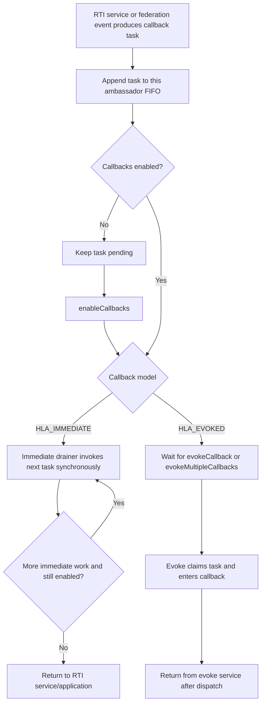
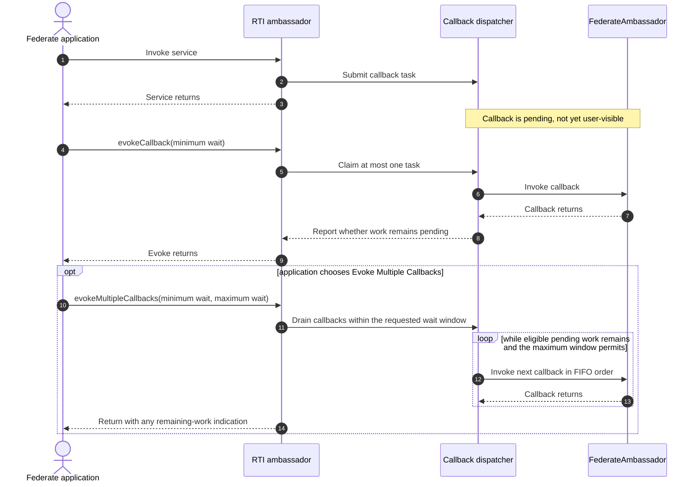
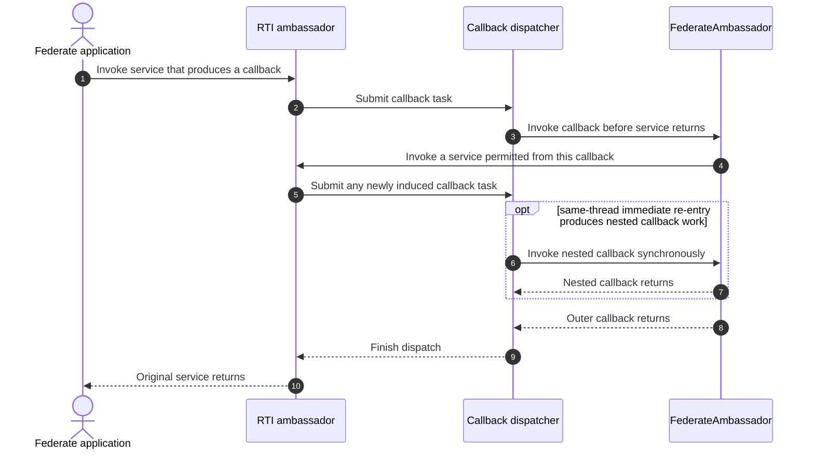
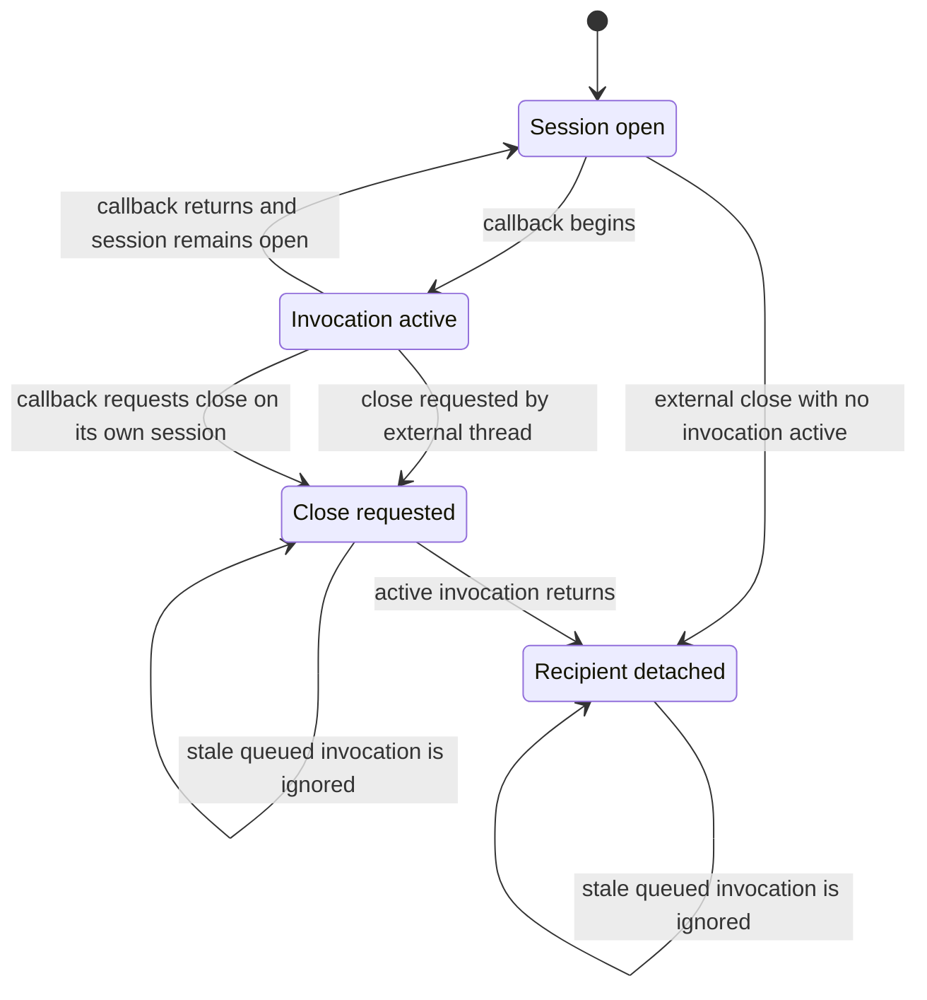

# IEEE 1516.1-2025 Callback and Service Ordering

This guide explains how a federate-facing event moves from an RTI service or
federation event into user callback code, how the HLA_IMMEDIATE and HLA_EVOKED
models change that boundary, and where callback re-entry is allowed or
rejected. It focuses on per-ambassador dispatch and intentionally does not
restate the time-management guide's TSO ordering rules.

## Scope and authority

- **Edition boundary:** IEEE 1516.1-2025 only. The 2010 API/runtime and tests
  are a separate stream. This guide does not infer that their callback timing,
  restrictions, or ordering are equivalent.
- **Implementation boundary:** Umbra's callback dispatcher/session and
  selected embedded and process-endpoint tests. Unit tests establish private
  dispatcher behavior, while public integration cases establish only their
  named API path.
- **Normative authority:** the [official IEEE 1516.1-2025 Federate Interface
  Specification](https://standards.ieee.org/ieee/1516.1/6688/). Use its exact
  service clauses for callback-model and callback-re-entry requirements. The
  summaries below distinguish those concepts from current Umbra mechanics.
- **Evidence rule:** no unit or integration scenario here is presented as
  complete conformance evidence.

The [time-management guide](HLA-2025-TIME-MANAGEMENT-GUIDE.md) owns TSO
eligibility, grant ordering, and callback-gated logical-time state. The
[save/restore guide](HLA-2025-FEDERATION-SAVE-RESTORE-FLOW-GUIDE.md) owns
federation-wide callback barriers. Ownership callbacks and information-flow
callbacks remain in their [ownership](HLA-2025-ATTRIBUTE-OWNERSHIP-FLOW-GUIDE.md)
and [object/interaction](HLA-2025-OBJECT-AND-INTERACTION-INFORMATION-FLOW-GUIDE.md)
guides.

## Standard concepts to keep separate from dispatcher mechanics

| HLA-facing concept | How to read it |
| --- | --- |
| Callback model | The model selected when connecting determines whether callbacks are delivered immediately or through explicit evoke services. It is a delivery policy, not a second copy of the federation's event state. |
| HLA_IMMEDIATE | The RTI can invoke the FederateAmbassador while the inducing RTI service is still executing. Application code must account for that synchronous callback boundary. |
| HLA_EVOKED | The federate application controls callback dispatch by invoking Evoke Callback or Evoke Multiple Callbacks. A returned service call and an undelivered callback are not contradictory. |
| Callback re-entry | Whether an RTI service may be called from user callback code is service-specific. Check the official call restrictions for the exact operation. |
| Callback ordering | Normative order can depend on the originating service, message order, and time-management state. Umbra's per-ambassador FIFO is only one implementation layer, not the whole HLA ordering model. |

## The important boundary: submitted is not invoked

Treat these as separate events:

1. An RTI operation or internal transition produces a callback task.
2. The task is accepted into a per-ambassador dispatch queue.
3. The callback model and callbacks-enabled switch determine when it may run.
4. The RTI enters the federate ambassador method.
5. Any state change defined at callback entry or completion occurs at that
   callback boundary, not merely because the initiating service returned.

This distinction explains why an HLA_EVOKED service call can return before its
callback is application-visible. For operations with callback-gated state,
the corresponding state transition can also remain pending until that
callback boundary. It also explains why an immediate callback can run before
its inducing service call returns.

## Callback-task dispatch

This is the current dispatcher model at a high level. Important qualifications:

- In HLA_IMMEDIATE mode, an enabled task normally runs synchronously on the
  submitting/draining thread. If another thread already owns the immediate
  drainer, its task is queued behind the current callback rather than entering
  the same federate ambassador concurrently.
- A callback may disable callbacks. The immediate drainer checks the setting
  at each callback boundary, leaves the remaining tasks pending, and resumes
  them when callbacks are enabled again.
- In HLA_EVOKED mode, enabling callbacks does not itself invoke queued work.
  The application must call an Evoke service. While callbacks are disabled,
  the current dispatcher leaves evoked tasks queued.
- These are per-ambassador queue mechanics. They do not establish one global
  order across different federates, RTI sessions, or independent callback
  routes.

## HLA_EVOKED: the application owns the drain point

In the current public adapter, Evoke Callback first uses a locally queued task
when one exists and otherwise polls one process-endpoint receive-order event.
Evoke Multiple Callbacks admits currently available process receive-order
events before draining the shared dispatcher. These are transport-profile
details, not additional HLA ordering guarantees.

The Boolean result is also not the callback itself: in the current dispatcher
it reports whether work remains pending after the invocation/window. Tests
cover the one-at-a-time and FIFO cases. Do not interpret a true result as
“another callback already ran.”

## HLA_IMMEDIATE: callback work can be on the service stack

The same-thread nested path is a current implementation capability of the
recursive dispatcher/session, not permission to call every RTI service from a
callback. Each service's callback-re-entry rule still applies. In particular,
the current public adapter explicitly rejects Connect, Disconnect, Join,
Resign, Evoke Callback, and Evoke Multiple Callbacks from inside a federate
callback. Check the exact official API rule and the service implementation
before relying on other re-entry.

Do not conflate the internal CallbackSession close operation with the public
Disconnect service. The session can close itself during an active invocation
without waiting on itself; the public RTI Disconnect call is explicitly
guarded against callback re-entry.

## Callback-session lifetime and concurrency

Umbra borrows the caller-owned FederateAmbassador rather than owning it. The
session serializes callback entry so two RTI paths do not enter the same
ambassador concurrently. An external close waits for a callback already in
flight; same-thread close marks the session closed and lets the active
invocation release the borrowed pointer on return. This internal lifetime
protection is separate from what the public HLA service permits.

## Ordering and state-commit cautions

- **FIFO is local.** The dispatcher deque preserves task submission order for
  one ambassador. A multi-recipient integration test checks per-recipient
  interaction FIFO across its configured process endpoint; it is not proof of
  one total order among all callbacks from all services or federates.
- **No batch pre-extraction in immediate mode.** Tasks are taken one at a time
  so disableCallbacks can stop a backlog at the next boundary.
- **Evoke Multiple is bounded.** The current implementation normalizes wait
  values and drains until no work remains after the minimum window or the
  maximum deadline is reached. Callbacks can consume time inside that window.
- **Disable is not discard.** Pending tasks survive disable/enable transitions
  unless a lifecycle operation explicitly resets or closes that session.
- **Exceptions are dispatch-boundary events.** An application callback can
  throw through the immediate submitter or Evoke call. The immediate drainer
  releases its election state and preserves later queued work rather than
  leaving the dispatcher permanently latched.
- **Time order is specialized.** Receive-order FIFO is not a substitute for
  timestamp ordering. TSO-before-grant ordering, retraction, and loss cutoffs
  are documented in the time-management guide.
- **Completion callbacks are protocol gates.** Save/restore completion,
  ownership transfer, and time-role changes may commit state at their own
  callback boundaries. Follow their focused guides instead of assuming that
  all callbacks have identical commit semantics.

## Evidence map: implementation versus exercised scenarios

| Topic | Current implementation entry points | Focused test evidence |
| --- | --- | --- |
| Queue, dispatch model, and per-ambassador serialization | [dispatcher submission and drain](../../cpp/src/internal/callbacks/callback_dispatcher.cpp#L121), [dispatcher API](../../cpp/src/internal/callbacks/callback_dispatcher.hpp#L24), [borrowed ambassador session](../../cpp/src/internal/callbacks/callback_session.hpp#L17) | [immediate synchronous dispatch and FIFO](../../cpp/tests/callback_dispatcher_catch2.cpp#L82), [concurrent immediate producers](../../cpp/tests/callback_dispatcher_catch2.cpp#L98), [evoked one-at-a-time and serialized entry](../../cpp/tests/callback_dispatcher_catch2.cpp#L209) |
| Evoke operations and callback controls | [Evoke Callback and Evoke Multiple Callbacks](../../cpp/src/internal/runtime/umbra_rti_ambassador_callback_control_services.cpp#L32), [enable/disable](../../cpp/src/internal/runtime/umbra_rti_ambassador_callback_control_services.cpp#L114) | [FIFO through Evoke Multiple](../../cpp/tests/callback_dispatcher_catch2.cpp#L301), [disabled work remains pending](../../cpp/tests/callback_dispatcher_catch2.cpp#L314), [process interaction delivered through Evoke](../../cpp/tests/ieee1516_2025_connection_receive_evoke_catch2.cpp#L457) |
| Re-entry restrictions and session close | [callback execution guards](../../cpp/src/internal/runtime/umbra_rti_ambassador_callback_control_services.cpp#L34), [Connect guard](../../cpp/src/internal/runtime/umbra_rti_ambassador_connect_services.cpp#L74), [Disconnect guard](../../cpp/src/internal/runtime/umbra_rti_ambassador.cpp#L2375), [Join guard](../../cpp/src/internal/runtime/umbra_rti_ambassador_federation_lifecycle.cpp#L371), [Resign guard](../../cpp/src/internal/runtime/umbra_rti_ambassador_federation_lifecycle.cpp#L803) | [Evoke calls rejected inside immediate callback](../../cpp/tests/callback_dispatcher_catch2.cpp#L166), [close waits for external in-flight call](../../cpp/tests/callback_dispatcher_catch2.cpp#L325), [close from active callback](../../cpp/tests/callback_dispatcher_catch2.cpp#L427) |
| Cross-service ordering evidence | [process callback polling before dispatch](../../cpp/src/internal/runtime/umbra_rti_ambassador_callback_control_services.cpp#L125) | [per-recipient process interaction FIFO](../../cpp/tests/ieee1516_2025_connection_multi_recipient_interaction_ordering_catch2.cpp#L459), [TSO callback/evoke scenarios](../../cpp/tests/ieee1516_2025_connection_timestamped_receive_evoke_catch2.cpp#L457) |

The unit dispatcher tests are implementation evidence. The process-endpoint
integration tests demonstrate only their specific public callback paths and
profiles. For timestamped callback ordering, use the time-management guide's
focused evidence table rather than extrapolating from receive-order tests.

## Deliberate limits and next evidence

This guide does not define the complete normative call-allowed-from-callback
matrix, total ordering across different callback producers, transport-wide
delivery guarantees, error policy for every FederateAmbassador exception, or
all service-specific callback commit points. It also does not merge 2010 and
2025 callback semantics. Those require their own exact-standard and
source/test surveys.

The next step is a GitHub-compatible render and review pass across every flow
guide, followed by a bounded edition-boundary audit. Verify each Mermaid
diagram in its real Markdown context, correct layout/syntax problems, and
record any guide-specific residual limitation. Then independently survey
whether 2010 needs parallel guides; create those only as distinct 2010
documents and never infer equivalence from the 2025 material. Keep the
Requirements Lab out of scope.
