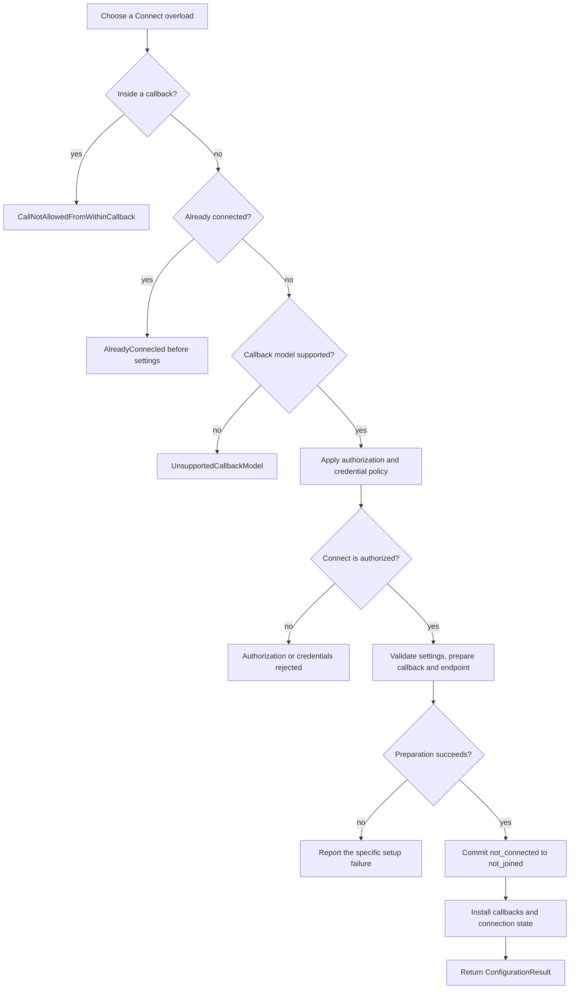
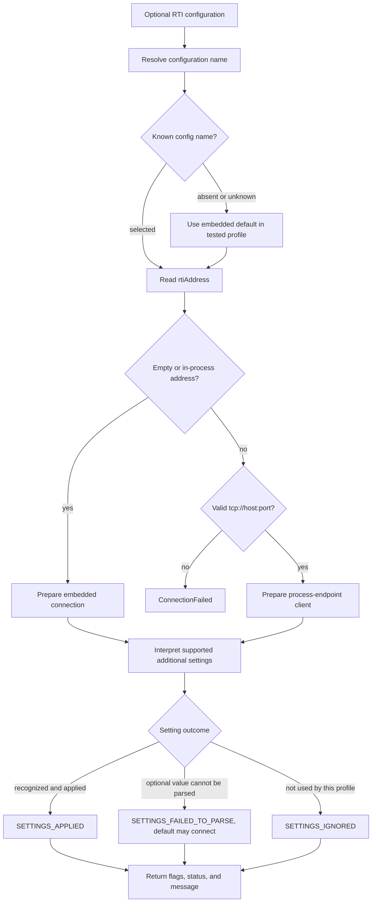
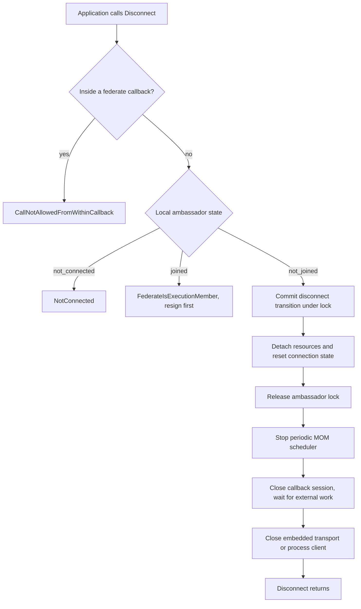

# HLA 1516.1-2025 Connect, Disconnect, and Configuration

This 2025-only companion explains the RTI ambassador's local connection
boundary: factory construction, the four `Connect` overloads, callback-model
and authorization gates, configuration selection, and ordered `Disconnect`
teardown. It does not merge the connection state with federation membership
or federation-execution lifetime.

Keep the [separate 2010 reference-RTI guide](HLA-2010-REFERENCE-RTI-FLOW-GUIDE.md)
separate. All behavior below is grounded in the pinned 2025 API, the 2025
`RTIambassador` implementation, and the cited tests. The official standard is
the normative authority; this guide is explanatory and makes no conformance
claim.

## The short mental model

`Connect` establishes a local relationship between an unjoined federate and an
RTI ambassador. It is not `Join Federation Execution`: a connected ambassador
can still be unjoined. `Disconnect` is legal only after that ambassador has
left the execution. Connection loss is a different RTI-initiated event that
also cleans up membership; that path stays in the
[federation and federate lifecycle guide](HLA-2025-FEDERATION-AND-FEDERATE-LIFECYCLE-FLOW-GUIDE.md).

The public interface offers four overloads, combining optional
`RtiConfiguration` and `Credentials`. They converge on the same internal
connection preparation path. The chosen callback model is installed on the
connection; callback queueing and service re-entry rules are described in the
[callback/service-ordering guide](HLA-2025-CALLBACK-AND-SERVICE-ORDERING-FLOW-GUIDE.md).

## 1. Connect validates first, prepares, then commits

The ordering matters. Umbra rejects a reentrant call and an already-connected
ambassador before it prepares caller-supplied configuration. It validates the
callback model and authorization policy, prepares the callback session and
profile-specific connection resources, and only then commits the local
`not_connected` → `not_joined` transition.



An invalid callback model or rejected credentials do not establish a
connection. When no authorizer is configured, the current implementation
accepts absent credentials and its `HLAnoCredentials` value; other supplied
credentials are rejected as `Unauthorized`. When authorization is configured,
the result maps to `Unauthorized`, `InvalidCredentials`, or an internal error.
That is the Connect gate only. The same credential snapshot also participates
in later Create, Destroy, and Join authorization; see the separate [2025
authorization guide](HLA-2025-AUTHORIZATION-FLOW-GUIDE.md) for those operation
gates and their different exception mappings.

The implementation checks `AlreadyConnected` before parsing configuration,
then checks again while committing under the ambassador lock. The second check
guards the state transition; it is not a second configuration phase. A focused
test verifies that a second `Connect` reports `AlreadyConnected` even when the
new settings point to an unusable service-report path.

## 2. Configuration selects a profile and reports what happened

`RtiConfiguration` carries a configuration name, RTI address, and
additional-settings string. These are separate inputs; do not interpret an
ignored optional setting as a failed connection, or a successful connection
as proof that every requested setting was applied.



The focused fallback test establishes only that absent and unknown
configuration names fall back to the default in the tested embedded profile.
In the embedded federation-management build, an empty or `in-process` address
selects the embedded transport; the configured process route expects a parsed
`tcp://host:port` address. A malformed address fails with `ConnectionFailed`.
The result flags and additional-settings status
are independent: for example, an optional malformed FOM-edition value can
produce `SETTINGS_FAILED_TO_PARSE` while Connect still succeeds on the default
2025 model-compatibility path.

### Factory construction is not Connect-time profile selection

The standard factory call creates the ambassador object; in Umbra's 2025
binding it does not itself read the RTI Initialization Data file or connect to
an execution. Umbra checks `UMBRA_RTI_RID_FILE` later, during `Connect`, after
the callback, reentrancy, and already-connected gates. The supplied
`RtiConfiguration::configurationName` selects Umbra's authorization profile
(or `default` when absent); `rtiAddress` and `additionalSettings` remain
separate connection inputs. This RID format and environment variable are
Umbra-specific, not standard-defined configuration behavior.

```mermaid
sequenceDiagram
  participant App as Application
  participant Factory as RTIambassadorFactory
  participant RTI as 2025 RTI ambassador
  participant Env as Process environment
  participant RID as Umbra RTI Initialization Data

  App->>Factory: createRTIambassador()
  Factory->>RTI: Construct UmbraRtiAmbassador
  RTI-->>App: Ambassador object, still disconnected
  App->>RTI: Connect(configuration, credentials)
  RTI->>RTI: Pass callback, reentrancy, and connection-state gates
  RTI->>Env: Read UMBRA_RTI_RID_FILE
  Env-->>RTI: Path or unset
  alt RID variable is unset
    RTI->>RTI: No RID authorizer factory
  else RID path is configured
    RTI->>RID: Validate protected files and parse authorization profile
    RID-->>RTI: Profile set; select configurationName or default
    alt RID or selected profile is invalid
      RTI-->>App: RTIinternalError before connection commit
    else No authorization service is selected
      RID-->>RTI: No authorizer factory
    else Profile selects HLAauthorizer
      RID-->>RTI: Factory configuration; resolve relative password path from RID directory
    end
  end
  RTI->>RTI: Apply authorization policy and prepare connection
  RTI-->>App: ConfigurationResult after successful commit
```

The factory-to-RID test is listed in the [authorization guide](HLA-2025-AUTHORIZATION-FLOW-GUIDE.md).
Its last focused run failed while creating the temporary RID test file, before
its profile-selection assertions; the sequence above is therefore a
source-grounded flow, not a passing test result. The authorization guide owns
the credential-to-exception mapping and the no-authorizer credential branch.

The internal `fomEdition=2010` option selects legacy-model compatibility under
the 2025 ambassador. It does not select the separate 2010 RTI implementation
and does not establish behavioral parity with that stream. Keep any 2010
reference-RTI explanation in its own guide.

## 3. Disconnect requires an unjoined connection and tears down in order

The public Disconnect operation is not a shortcut for resignation. Umbra
rejects it while the ambassador is joined. After the local transition succeeds,
connection-owned state is detached under the lock; scheduler and callback/
transport shutdown happen after leaving that critical section.



The callback session is closed outside the ambassador lock so an external
callback already in flight can finish without deadlocking on a reentrant RTI
call. `CallbackSession::close` marks the session closed before waiting, so new
invocations cannot begin; its same-session path avoids waiting on itself.
Connection loss remains a separate forced-resignation path; see the lifecycle
guide rather than inferring it from this voluntary Disconnect sequence.

## What Umbra currently demonstrates

- Tests exercise all four official overload combinations and verify that an
  unsupported callback model leaves the ambassador connectable.
- The embedded tests cover credential rejection when authorization is
  disabled, successful retry after selected setup failures, applied and
  ignored configuration results, and the early `AlreadyConnected` guard.
- A malformed process address is rejected before connection; absent and
  unknown configuration names fall back only in the tested embedded profile.
- Disconnect rejects an absent connection in Umbra's implementation, rejects
  a joined ambassador until it resigns, and succeeds from the unjoined state.
- The selected callback dispatch model is installed at Connect. Details of
  callback queuing, disable/enable behavior, and service-call ordering remain
  in the callback/service-ordering guide.

## Evidence and source map

Normative/API references:

- The pinned [IEEE 1516.1-2025 RTIambassador API](../../third_party/ieee1516.1-2025/include/RTI/RTIambassador.h#L50)
  declares Connect in 4.2 and Disconnect in 4.3. The [official standard page](https://standards.ieee.org/ieee/1516.1/6688/)
  is the normative source; verify clause text there before making conformance claims.
- [RtiConfiguration](../../third_party/ieee1516.1-2025/include/RTI/RtiConfiguration.h#L11),
  [callback and additional-settings enums](../../third_party/ieee1516.1-2025/include/RTI/Enums.h#L12),
  and [ConfigurationResult](../../third_party/ieee1516.1-2025/include/RTI/Typedefs.h#L62)
  define the public configuration inputs and result fields.
- The pinned [RTIambassadorFactory API](../../third_party/ieee1516.1-2025/include/RTI/RTIambassadorFactory.h#L34)
  defines `createRTIambassador` in §10.35; the RID selection described here is
  Umbra-specific and occurs later, at Connect.

Umbra implementation:

- [Connect overloads and shared preparation/commit path](../../cpp/src/internal/runtime/umbra_rti_ambassador_connect_services.cpp#L29)
- [Factory construction](../../cpp/src/ieee1516_2025_binding_shell.cpp#L142),
  [Connect-time RID lookup](../../cpp/src/internal/runtime/umbra_rti_ambassador_connect_services.cpp#L92),
  and [RID parsing/profile selection](../../cpp/src/internal/runtime/rti_initialization_data.cpp#L339)
- [Callback-model, credential, address, and setting helpers](../../cpp/src/internal/runtime/ambassador_connection_support.cpp#L31)
- [Process endpoint address selection](../../cpp/src/internal/runtime/ambassador_connection_support.cpp#L45),
  [credential policy](../../cpp/src/internal/runtime/ambassador_connection_support.cpp#L130),
  and [optional FOM-edition parsing](../../cpp/src/internal/runtime/ambassador_connection_support.cpp#L196)
- [Disconnect preconditions and post-lock cleanup](../../cpp/src/internal/runtime/umbra_rti_ambassador.cpp#L2373)
- [Callback-session close and in-flight invocation wait](../../cpp/src/internal/callbacks/callback_session.cpp#L34)
- [Local lifecycle transitions](../../cpp/src/internal/federation/federate_lifecycle.cpp#L11)

Focused tests (citations identify scenario evidence; see the factory/RID run
result above):

- [All four Connect overloads](../../cpp/tests/ieee1516_2025_connection_catch2.cpp#L280)
- [Factory-created ambassador and named/default RID authorization profiles](../../cpp/tests/ieee1516_2025_authorization_catch2.cpp#L555)
- [Credentials rejected when authorization is disabled](../../cpp/tests/ieee1516_2025_connection_catch2.cpp#L314)
- [Applied service-report configuration](../../cpp/tests/ieee1516_2025_connection_catch2.cpp#L341)
- [Invalid-path failure leaves the ambassador connectable](../../cpp/tests/ieee1516_2025_connection_catch2.cpp#L389)
- [AlreadyConnected checked before invalid configuration](../../cpp/tests/ieee1516_2025_connection_catch2.cpp#L415)
- [Unsupported callback model](../../cpp/tests/ieee1516_2025_connection_catch2.cpp#L445)
- [Absent Disconnect](../../cpp/tests/ieee1516_2025_connection_catch2.cpp#L456)
- [Disconnect rejected while joined](../../cpp/tests/ieee1516_2025_federation_resign_lifecycle_catch2.cpp#L51)
- [Absent/unknown configuration fallback](../../cpp/tests/ieee1516_2025_connection_configuration_fallback_catch2.cpp#L459)
- [Optional setting parse failure with successful Connect](../../cpp/tests/ieee1516_2025_connection_configuration_additional_settings_catch2.cpp#L459)
- [Malformed process address rejected before connection](../../cpp/tests/ieee1516_2025_connection_address_validation_catch2.cpp#L457)
- [Successful configured TCP process-endpoint Connect and result flags](../../cpp/tests/ieee1516_2025_connection_catch2.cpp#L41)

## Known gaps and boundaries

- The focused sources and tests primarily exercise the embedded profile; they
  do not prove full process/embedded equivalence for configuration, callback
  shutdown, or error mapping.
- Umbra's source and test report `NotConnected` when Disconnect is called on an
  absent connection, but the pinned `RTIambassador.h` 4.3 `@throws` list does
  not include that exception. Treat this as an API/source discrepancy to
  compare with the full 2025 normative clause, not as a conformance conclusion.
- The four overloads have focused coverage, but this guide does not claim that
  every overload has an independent test for every authorization, endpoint,
  malformed-setting, allocation, or callback race.
- This guide covers the 2025 binding only. The 2010 reference RTI, its
  connection code, and its callback semantics remain in the separate 2010
  profile; a 2025 `fomEdition=2010` compatibility setting is not evidence about
  that implementation.

Visual rendering is pending; track it in the
[behavior-flow guide backlog](HLA-BEHAVIOR-FLOW-GUIDES.md).
