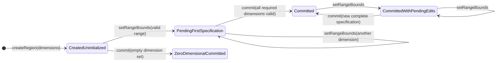
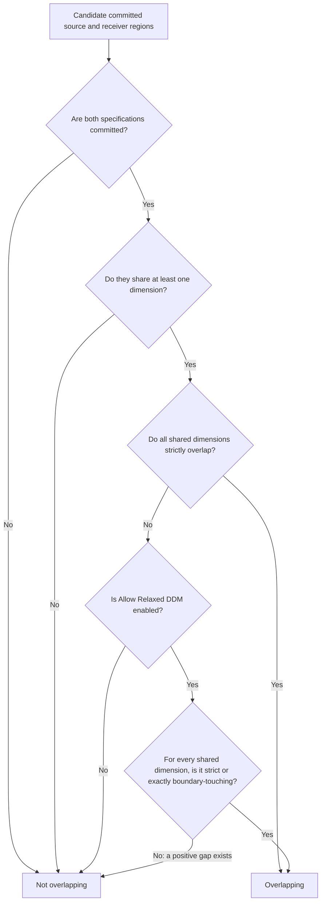
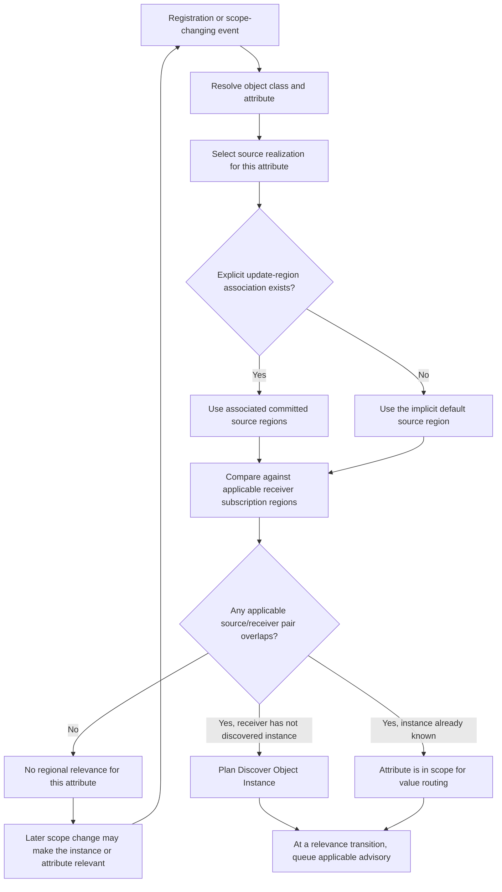
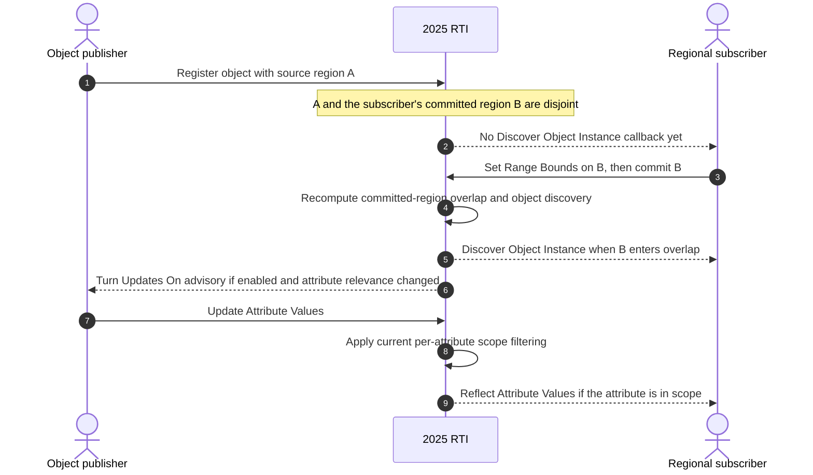
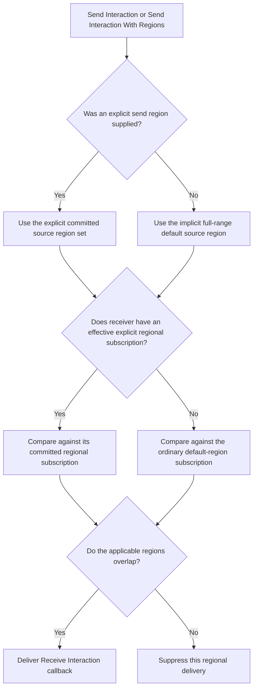

# IEEE 1516.1-2025 Data Distribution Management and Regions: Flow Guide

This guide explains how region templates, subscriptions, object update-region
associations, overlap, discovery, and interaction routing fit together in
Umbra's current 2025 paths. It is a contributor guide, not an implementation
contract or a conformance claim.

## Scope and authority

- **Standard boundary:** IEEE 1516.1-2025 only. The [official IEEE
  standard](https://standards.ieee.org/ieee/1516.1/6688/) is the normative
  authority for DDM services and behavior.
- **Implementation boundary:** the non-installable 2025 development profile
  and selected 2025 process-boundary tests. Some private registry code is
  shared implementation machinery; this guide does not infer 2010 behavior
  from it.
- **Edition separation:** IEEE 1516.1-2010 is deliberately outside this guide.
  No cross-edition equivalence is asserted.
- **Evidence boundary:** source files describe current Umbra behavior. Focused
  tests show only their exercised scenarios; neither source nor tests replace
  normative requirements or prove full support, interoperability, or
  conformance.

For temporal ordering, grants, and TSO callback timing, see the separate
[2025 time-management guide](HLA-2025-TIME-MANAGEMENT-GUIDE.md). Ownership
transfer is explained separately in the
[2025 ownership flow guide](HLA-2025-ATTRIBUTE-OWNERSHIP-FLOW-GUIDE.md).
This document keeps their interaction points visible without merging those
state machines into DDM.

## The mental model

DDM answers **which receivers are in scope for this information**, based on
class/attribute declarations and region realizations. It does not decide when
a time-constrained federate may receive a timestamped message. Keep these
questions separate:

1. Which interaction class or object attribute is being sent?
2. Which source region or regions realize that send/update?
3. Which receiver subscription realization applies?
4. Do the applicable source and receiver regions overlap?
5. If the receiver is relevant, is this an initial discovery, a change in
   attribute relevance, or a new value delivery?
6. If the value is timestamp ordered, when does time management permit its
   callback?

A region is a federate-owned template of dimensions and range bounds. Each
dimension's range has a lower and upper bound; a region may cover more than one
dimension. Object attributes can have update-region associations. Interactions
can be sent with an explicit region set. Receivers express regional interest
with object-class attribute or interaction-class subscriptions. The DDM
decision is based on the committed region specifications used by those
service paths.

## Region template lifecycle

The useful distinction is between the latest range values supplied by the
application and the committed specification used for routing.

In the current 2025 C++ path:

- **createRegion** establishes the dimension set and ownership of the region
  handle. An empty dimension set is accepted by the tested API path; it creates
  a zero-dimensional region, not a wildcard region.
- **setRangeBounds** writes pending bounds. The implementation checks that the
  dimension belongs to the region, that lower is less than upper, and that the
  upper bound is within the FDD dimension bound.
- **getRangeBounds** reports the latest pending value for a dimension when one
  has been set, even before commit. This query view is not the same thing as
  the routing snapshot.
- **commitRegionModifications** requires a complete, valid specification for
  every committed dimension. Only then does the new committed snapshot become
  active for overlap/relevance calculations. If a region already had a
  committed snapshot, later pending edits do not replace it until commit.
- A region can be deleted only when it is not still referenced by an object
  update association or a regional subscription. Remove the association or
  unsubscribe first; a passive regional subscription is still a live region
  dependency in the tested profile.
- Mutating or deleting a region created by another federate is rejected.

The central implementations are
[region services](../../cpp/src/internal/runtime/umbra_rti_ambassador_dimension_region_services.cpp)
and
[region registry state](../../cpp/src/internal/federation/federation_registry_regions.cpp).
The focused 2025
[region lifecycle test](../../cpp/tests/ieee1516_2025_federation_management_region_lifecycle_catch2.cpp)
exercises zero-dimensional templates, incomplete commits, pending-versus-
committed bounds, range validation, creator ownership, and the in-use deletion
guard.

## Overlap: strict rule and Umbra's optional expansion

For each dimension shared by a source and receiver region, the normal
half-open ranges are written <code>[lower, upper)</code>. Strict overlap in one
shared dimension is:

<code>source.lower &lt; receiver.upper &amp;&amp; receiver.lower &lt; source.upper</code>

The current registry requires at least one shared dimension and checks every
shared dimension. With Umbra's Allow Relaxed DDM switch disabled, all shared
dimensions must strictly overlap. When enabled, this Umbra profile additionally
accepts an exact boundary touch in a shared dimension, provided every other
shared dimension is either strictly overlapping or also exactly touching.
A positive gap is never expanded.

Examples for one dimension:

- <code>[0, 10)</code> and <code>[9, 12)</code> strictly overlap.
- <code>[0, 10)</code> and <code>[10, 15)</code> only touch. They do not
  strictly overlap; this implementation accepts the touch only when Allow
  Relaxed DDM is enabled.
- <code>[0, 10)</code> and <code>[11, 15)</code> have a positive gap and do
  not overlap, even when the switch is enabled.
- A zero-dimensional region has no shared dimension, so it matches no region,
  including the implicit default region.

The exact-touch expansion is an **Umbra implementation policy**, not a
universal HLA rule. The local
[Allow Relaxed DDM policy note](RELAXED-DDM-POLICY.md) records the standard
distinction and the narrower current evidence. In particular, the switch is
not an epsilon, a configurable distance, a geographic interpretation, or a
permission to drop any strict overlap.

## Object attributes: source association, discovery, relevance, and updates

Object-attribute DDM is evaluated per attribute. The publisher's update-region
association and the receiver's subscription determine the regions to compare.
The current object-attribute planner evaluates ordinary/default-region
subscriptions and explicit regional subscriptions independently; do not
import the interaction-class selection behavior in the next section into this
path.

This regional path describes per-instance attribute relevance and overlap.
The distinct publisher/class declaration advisories and owner-directed
Turn Updates callbacks are separated in the [2025 relevance-advisory guide](HLA-2025-RELEVANCE-ADVISORY-FLOW-GUIDE.md).
Receiver-directed Attributes In/Out Of Scope callbacks have their own
[2025 Attribute Scope Advisory guide](HLA-2025-ATTRIBUTE-SCOPE-ADVISORY-FLOW-GUIDE.md);
that guide covers scope-state transitions and stale callback filtering, while
this one remains the home for region geometry, discovery, and routing.

There are two different public effects that are easy to conflate:

- **Discovery:** a receiver that did not know the object can become eligible
  for **discoverObjectInstance**. In this implementation, registration is not
  the only discovery boundary. Committing a receiver region into overlap or
  associating a new overlapping update region can also make an already-
  registered object discoverable.
- **Attribute relevance advisory:** when the in-scope state of a known
  object's attribute changes, the producer can receive
  **turnUpdatesOnForObjectInstance** or **turnUpdatesOffForObjectInstance**
  when the advisory behavior is enabled. This is an advisory transition, not
  the value update itself and not a replacement for subscription or overlap
  filtering.

The focused
[commit-triggered discovery case](../../cpp/tests/ieee1516_2025_federation_management_region_lifecycle_catch2.cpp)
starts with a disjoint source and receiver range, observes no discovery, then
commits the receiver's moved range and observes one discovery without another
registration or subscription call. The adjacent
[association-triggered discovery case](../../cpp/tests/ieee1516_2025_federation_management_region_lifecycle_catch2.cpp)
shows the other boundary: adding a second overlapping update-region
association makes an existing object discoverable. A separate 2025
[relevance-advisory transition test](../../cpp/tests/ieee1516_2025_connection_regional_attribute_relevance_transition_catch2.cpp)
exercises the producer's On/Off callbacks as overlapping associations are
removed and restored, under both evoked and immediate callback models.

## Interactions: explicit and default-region paths

Interaction routing uses an interaction-class publication, a send-region
realization, and the receiver's subscription realization. In the current 2025
default-region test, when a receiver has an explicit regional subscription for
an interaction class, that regional realization is effective for a send with
an explicit region; a retained ordinary subscription does not bypass a
disjoint regional subscription. Removing the regional subscription lets the
ordinary subscription's default-region realization apply again.

The diagram describes the tested 2025 interaction path, not an edition-
independent rule. It is intentionally separate from the object-attribute
planner described above. A useful focused case is
[default-region interaction routing](../../cpp/tests/ieee1516_2025_default_region_interaction_routing_catch2.cpp):

- An explicit source region reaches an overlapping regional subscriber and is
  suppressed for a mixed receiver whose explicit regional subscription is
  disjoint, even though it retains an ordinary subscription.
- Once the explicit regional subscription is removed, the ordinary
  subscription again uses the default region and qualifies for the explicit
  source region.
- An ordinary **sendInteraction** uses the implicit full-range source region.
  With Convey Region Designator Sets enabled, the callback can report that a
  region set was supplied and that the set is empty. That empty designator set
  is not the same thing as a non-empty explicit region set.

The default region is an RTI-provided realization, not a region handle the
application creates. In the current registry it represents the full range for
every FDD dimension. See the
[default-region overlap helper](../../cpp/src/internal/federation/federation_registry_regions.cpp)
and
[regional interaction subscription services](../../cpp/src/internal/runtime/umbra_rti_ambassador_regional_interaction_subscription.cpp).

## Keep time and DDM as separate filters

For a timestamped regional interaction, current Umbra code captures the
accepted send's region realization into the queued message. A later region
mutation does not rewrite the already accepted message's source-scope snapshot.
The time-management policy can still delay the timestamped callback after that
DDM decision. In short:

**DDM selects eligible recipients and scope; time management selects when an
eligible TSO callback may run.**

This is an implementation boundary, not a complete TSO routing algorithm.
Follow the separate [time-management flow guide](HLA-2025-TIME-MANAGEMENT-GUIDE.md)
for grant and queue state.

## Focused source and test evidence

- Region creation, pending/committed bounds, validation, and deletion:
  [2025 region services](../../cpp/src/internal/runtime/umbra_rti_ambassador_dimension_region_services.cpp),
  [region registry](../../cpp/src/internal/federation/federation_registry_regions.cpp),
  and [region lifecycle tests](../../cpp/tests/ieee1516_2025_federation_management_region_lifecycle_catch2.cpp).
- Object update-region association and its discovery/scope effects:
  [association planner](../../cpp/src/internal/federation/federation_registry_update_region_associations.cpp),
  [attribute relevance planner](../../cpp/src/internal/federation/federation_registry_attribute_relevance.cpp),
  and the region lifecycle / [relevance transition](../../cpp/tests/ieee1516_2025_connection_regional_attribute_relevance_transition_catch2.cpp) tests.
- Regional interaction send and subscription:
  [send services](../../cpp/src/internal/runtime/umbra_rti_ambassador_regional_interaction_send_services.cpp),
  [subscription services](../../cpp/src/internal/runtime/umbra_rti_ambassador_regional_interaction_subscription.cpp),
  and the [default-region routing test](../../cpp/tests/ieee1516_2025_default_region_interaction_routing_catch2.cpp).
- Touching-range behavior and scope:
  [Allow Relaxed DDM policy](RELAXED-DDM-POLICY.md),
  [regional interaction boundary test](../../cpp/tests/ieee1516_2025_allow_relaxed_ddm_regional_interaction_boundary_catch2.cpp),
  and [region overlap implementation](../../cpp/src/internal/federation/federation_registry_regions.cpp).

The current query card for
umbra-cpp-default-region-interaction-routing-integration maps its focused case
to IEEE 1516.1-2025 clauses 9, 9.1.3.3, 9.1.4, and 9.1.8. This is a
traceability pointer for that tested case, not conformance evidence; consult
the official standard for normative wording. The linked source files and test
titles remain the direct evidence for the scenarios described above.

## Deliberate limits and next step

This guide does not model the full exception matrix, every combination of
object-class inheritance and regional declarations, all interaction
subscription replacement cases, every update-rate advisory path, or the full
timestamped/retraction/save-restore matrix. Discovery-triggered provider
solicitation has its own [Auto Provide guide](HLA-2025-AUTO-PROVIDE-FLOW-GUIDE.md).
This guide does not compare 2010 and 2025 behavior. Treat the remaining
branches as separate guides or focused extensions when source and test
evidence support them; do not flatten them into this overview.

The separate [federation save and restore guide](HLA-2025-FEDERATION-SAVE-RESTORE-FLOW-GUIDE.md)
covers save-state transitions, callback completion and failure, restore
selection/rejoin, and deferred-work restoration. The current cross-guide
handoff is to visually review the Mermaid diagrams in GitHub before choosing
another uncovered learner-facing state machine.
