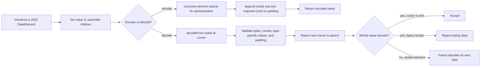
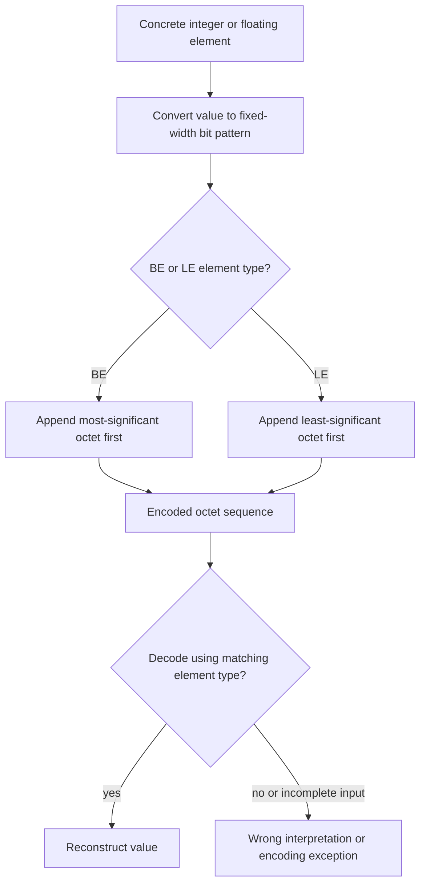
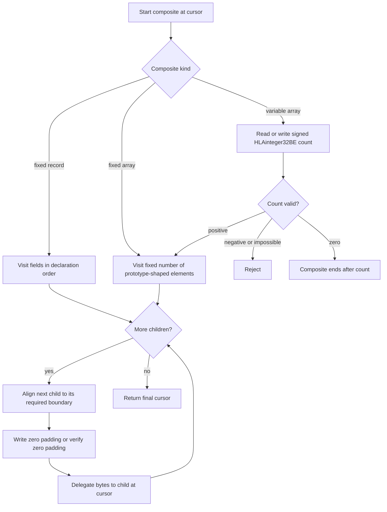
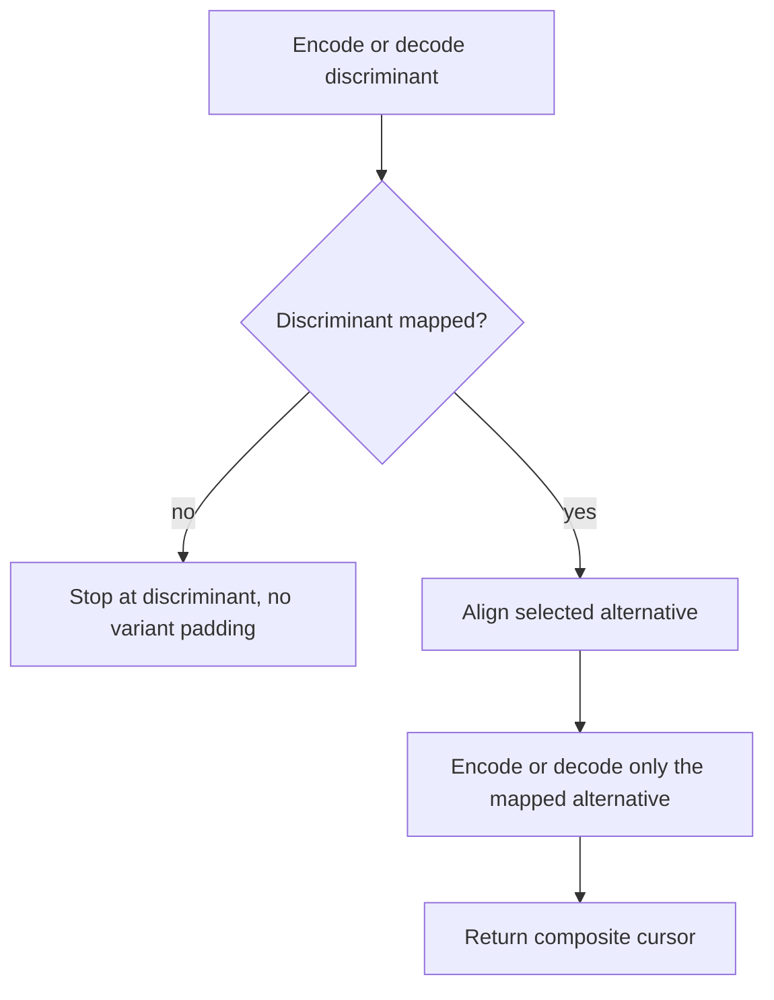
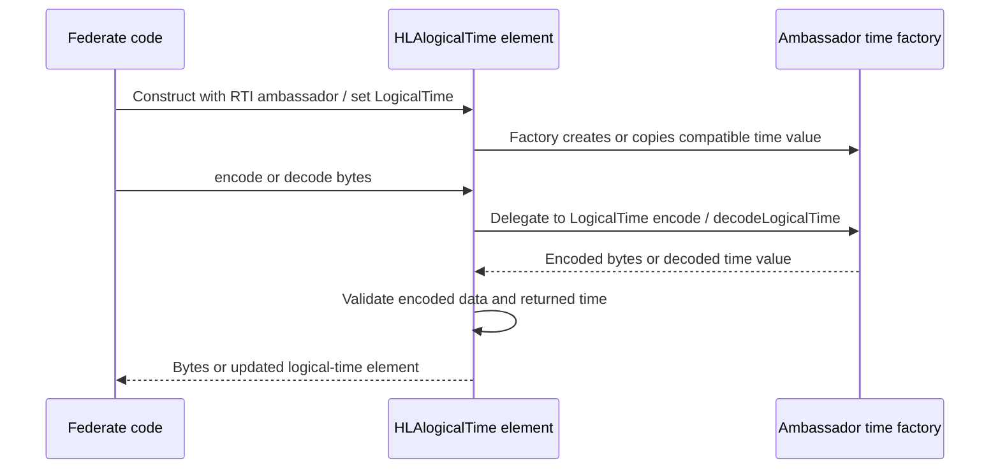
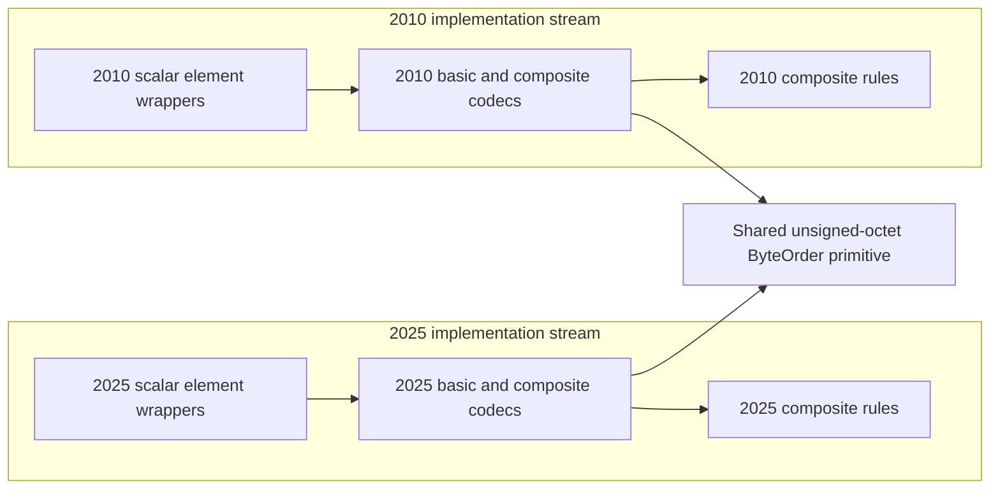

# IEEE 1516.1-2025 C++ DataElement Encoding: Flow Guide

This guide explains how a value becomes encoded octets in Umbra's 2025 C++
encoding API. It is a reading aid for the value-encoding layer, not a transport
protocol specification or a claim of conformance.

## Scope and authority

- **Edition:** IEEE 1516.1-2025 C++ API only. The 2010 API and implementation
  remain a separate compatibility stream; this guide does not infer parity.
- **Implementation boundary:** public 2025 `DataElement` codecs and focused
  unit tests. No federation-management profile, process message framing, or
  2010 API behavior is inferred.
- **Layer:** `rti1516_2025::DataElement` values, their nested encodings, and
  logical-time wrappers. This is not the internal process-RPC wire format,
  FOM serialization, or the RTI's network framing.
- **Authority:** the [official IEEE 1516.1-2025 Federate Interface
  Specification](https://standards.ieee.org/ieee/1516.1/6688/) defines the
  interface; the [official IEEE 1516.2-2025 OMT
  Specification](https://standards.ieee.org/ieee/1516.2/6689/) is the related
  model-template standard. The pinned [2025 `DataElement` API](../../third_party/ieee1516.1-2025/include/RTI/encoding/DataElement.h)
  and [basic element declarations](../../third_party/ieee1516.1-2025/include/RTI/encoding/BasicDataElements.h)
  make the C++ operations navigable. Source describes current Umbra behavior;
  focused tests show only the concrete cases they exercise.
- **Shared primitive boundary:** both edition-specific basic-element sources
  call the small [explicit-byte-order primitive](../../cpp/src/internal/encoding/byte_order.hpp#L15).
  This shared helper only appends/reads unsigned octets in a requested order.
  The 2010 and 2025 type wrappers, time encoders, composite helpers, and tests
  remain separate; in particular, [2025 composite rules](../../cpp/src/internal/encoding/composite_2025.hpp)
  are not the [2010 composite rules](../../cpp/src/internal/encoding/composite_2010.hpp).

## One value, from API call to octets

`encodeInto` appends a value at the current end of an output vector. A nested
`decodeFrom` starts at a caller-supplied cursor and returns the next cursor;
that return value is how a parent knows where its child stopped. A whole-value
`decode` adds a stricter outer check: the child must consume the complete input,
or trailing data is rejected.

The API contract for [encoding and decoding operations](../../third_party/ieee1516.1-2025/include/RTI/encoding/DataElement.h#L35)
is distinct from the implementation's scalar and composite policies. The
whole-input trailing-data guard is visible, for example, in the 2025
[`HLAvariableArray::decode`](../../cpp/src/ieee1516_2025_variable_array.cpp#L234)
and [`HLAfixedRecord::decode`](../../cpp/src/ieee1516_2025_fixed_record.cpp#L156)
paths.

## Explicit byte order belongs to each value type

Host endianness is not consulted by the shared primitive. A concrete encoder
passes `ByteOrder::big` or `ByteOrder::little` at the call site; the BE/LE API
type chooses which. Floating values are converted to their bit representation
and then encoded through the matching-width path. This is a byte-order choice
for that element, not a setting that silently changes every value in a
composite.

For a concrete test vector, signed `-2` encodes as `FF FF FF FE` in
`HLAinteger32BE` and `FE FF FF FF` in `HLAinteger32LE`; the 64-bit test checks
the corresponding eight-octet forms. Those exact vectors and truncated-input
rejections are in the [2025 basic-element tests](../../cpp/tests/ieee1516_2025_basic_data_elements_catch2.cpp#L303)
and [64-bit cases](../../cpp/tests/ieee1516_2025_basic_data_elements_catch2.cpp#L328).
The 2025 implementation's [named BE/LE helpers](../../cpp/src/ieee1516_2025_basic_data_elements.cpp#L58)
make the choice explicit. The common [byte-order primitive](../../cpp/src/internal/encoding/byte_order.hpp#L18)
does not choose an order on behalf of a caller.

These are `DataElement` value octets, not process-frame headers. The private
[transport adapter](../../cpp/src/internal/encoding/transport_wire.hpp#L14)
has separate fixed-big-endian framing helpers, and the
[process transport path](../../cpp/src/internal/federation/process_transport.cpp#L195)
reads frame metadata independently of the encoded payload. Do not infer a
value element's BE/LE choice from the transport frame's byte order.

Other scalar families have their own representation, rather than inheriting
the integer suffix rule: for example, `HLAboolean` is validated as a four-octet
0/1 value, `HLAunicodeChar` is one UTF-16 code unit, and the string encoders
carry lengths before payloads. See the [basic encoding tests](../../cpp/tests/ieee1516_2025_basic_data_elements_catch2.cpp#L86)
and [Unicode string tests](../../cpp/tests/ieee1516_2025_basic_data_elements_catch2.cpp#L367).

## Composite values: shape, cursor, and alignment

Composite elements delegate the actual bytes of each child to that child.
Their own job is to define shape and placement: a fixed record has ordered
fields; a fixed array has a fixed number of prototype-compatible elements; a
variable array writes a signed 32-bit big-endian count first. Before a later
child needs a stronger octet boundary, the parent inserts zero padding and
requires those padding octets to be zero when decoding. The 2025 implementations
do not append inter-element padding after the final child.

This boundary is observable in the [fixed-record codec](../../cpp/src/ieee1516_2025_fixed_record.cpp#L138),
[fixed-array codec](../../cpp/src/ieee1516_2025_fixed_array.cpp#L177), and
[variable-array codec](../../cpp/src/ieee1516_2025_variable_array.cpp#L210).
The variable-array test demonstrates the four-octet count, padding before an
eight-boundary element, nested decoding from a nonzero cursor, negative-count
rejection, malformed padding rejection, and whole-input trailing-data
rejection: [focused Catch2 case](../../cpp/tests/ieee1516_2025_basic_data_elements_catch2.cpp#L723).

## Variants are discriminant-driven branches

`HLAvariantRecord` first encodes its discriminant. A mapped discriminant selects
one alternative and causes the alternative bytes to be aligned to the maximum
boundary of the mapped alternatives; an unmapped discriminant ends the
encoding immediately, with no alternative padding. The decoder reads the
discriminant first and follows that same mapping. Do not conflate this with
`HLAextendableVariantRecord`, which carries an encoded-length field and has its
own alternative boundary and padding checks.

The 2025 [`HLAvariantRecord` implementation](../../cpp/src/ieee1516_2025_variant_record.cpp#L269)
and its [focused mapped/unmapped test](../../cpp/tests/ieee1516_2025_basic_data_elements_catch2.cpp#L859)
cover this branch. The source anchors the unmapped case to IEEE 1516.2
§4.14.10.2. The distinct [extendable variant codec](../../cpp/src/ieee1516_2025_extendable_variant_record.cpp#L280)
and [test](../../cpp/tests/ieee1516_2025_basic_data_elements_catch2.cpp#L993)
should be read separately; it is not merely a longer ordinary variant.

## Logical time is factory-defined, not assumed to be BE or LE

The public `HLAlogicalTime` and `HLAlogicalTimeInterval` elements wrap values
created by the supplied RTI ambassador's logical-time factory. Encoding
delegates to that value; decoding delegates to the matching factory and then
checks the returned object. The wrapper reports an opaque one-octet boundary
instead of imposing an integer BE/LE representation. This is the codec handoff
to time-management services, not the time-advance/grant state machine itself;
see the separate [2025 time-management guide](HLA-2025-TIME-MANAGEMENT-GUIDE.md).

See the [2025 logical-time encoding adapter](../../cpp/src/ieee1516_2025_logical_time_encoding.cpp#L213)
and the [public logical-time encoding tests](../../cpp/tests/ieee1516_2025_time_catch2.cpp).

## Edition boundary and what this guide does not claim

The 2010 and 2025 API implementations each have their own basic-element and
composite translation units. They happen to use the same stateless
`ByteOrder` octet primitive, but that one shared helper does not make the
surrounding codec implementations interchangeable. The 2025 aggregate code
uses `composite_2025.hpp`; the 2010 aggregate code uses `composite_2010.hpp`.
The separate [2010 encoding companion](HLA-2010-DATA-ELEMENT-ENCODING-FLOW-GUIDE.md)
documents its own source and smoke-test observations. No 2010 behavior is
inferred from a 2025 test, and no change to either stream is proposed by this
guide. The following ownership sketch shows only the
shared stateless leaf primitive; it does not assert that the edition-specific
wrappers or composite formats are equivalent.

This is not an exhaustive element-by-element conformance inventory, a claim
that every malformed input is covered, or a description of how encoded values
are framed or transported between RTIs. The Catch2 cases demonstrate selected
vectors, alignment, malformed-input rejection, and ownership behavior. All six
diagrams in this guide have been rendered and screenshot-reviewed locally;
GitHub rendering remains a separate publication check.

## Evidence map

- [2025 C++ encoding API declarations](../../third_party/ieee1516.1-2025/include/RTI/encoding/DataElement.h)
- [2025 basic and composite implementation sources](../../CMakeLists.txt#L208)
- [2025 encoder-focused Catch2 cases](../../cpp/tests/ieee1516_2025_basic_data_elements_catch2.cpp)
- [Shared byte-order primitive](../../cpp/src/internal/encoding/byte_order.hpp)
- [Separate 2010 basic element source](../../cpp/src/ieee1516_2010_basic_data_elements.cpp#L88)
- [Separate 2010 composite primitive rules](../../cpp/src/internal/encoding/composite_2010.hpp)
