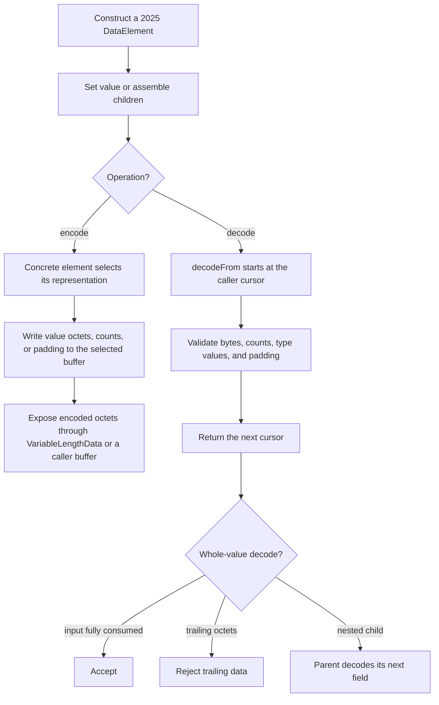
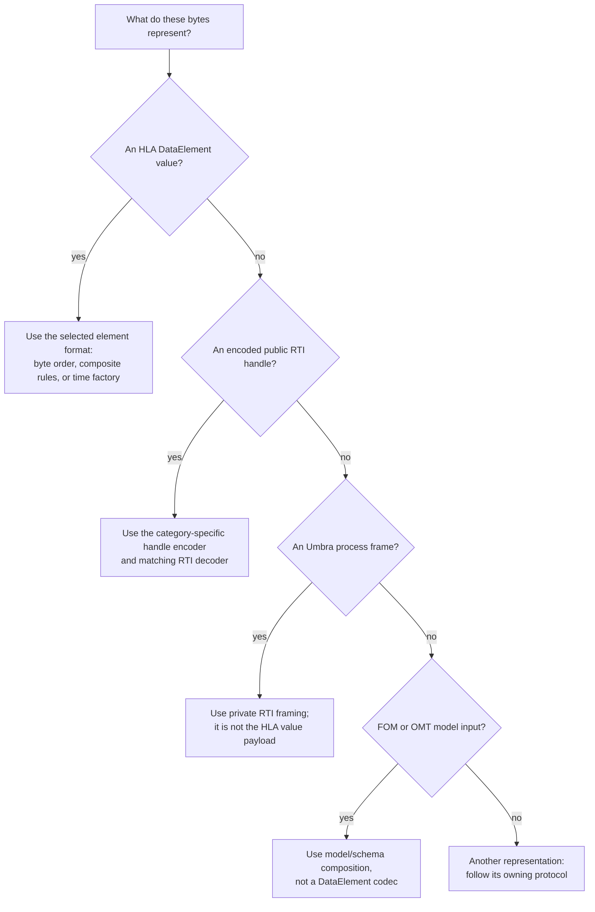
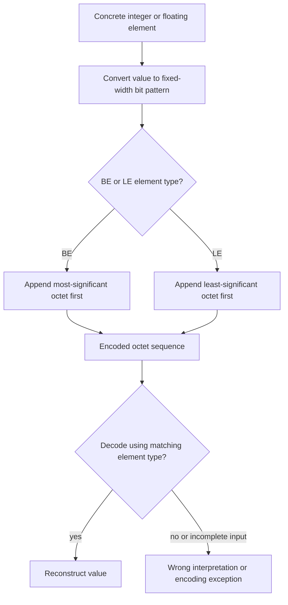
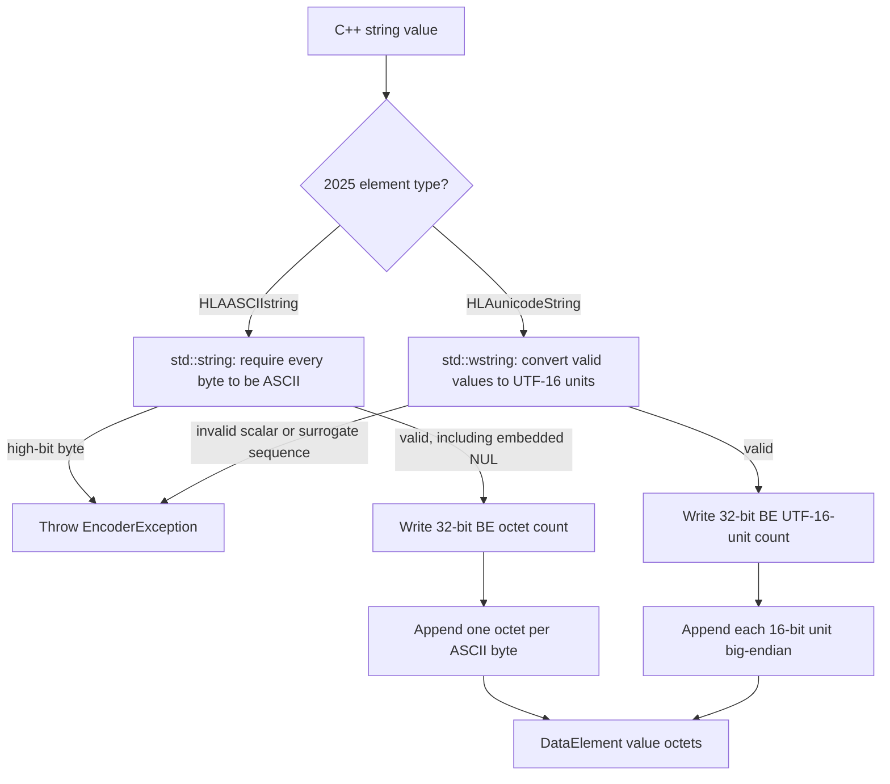
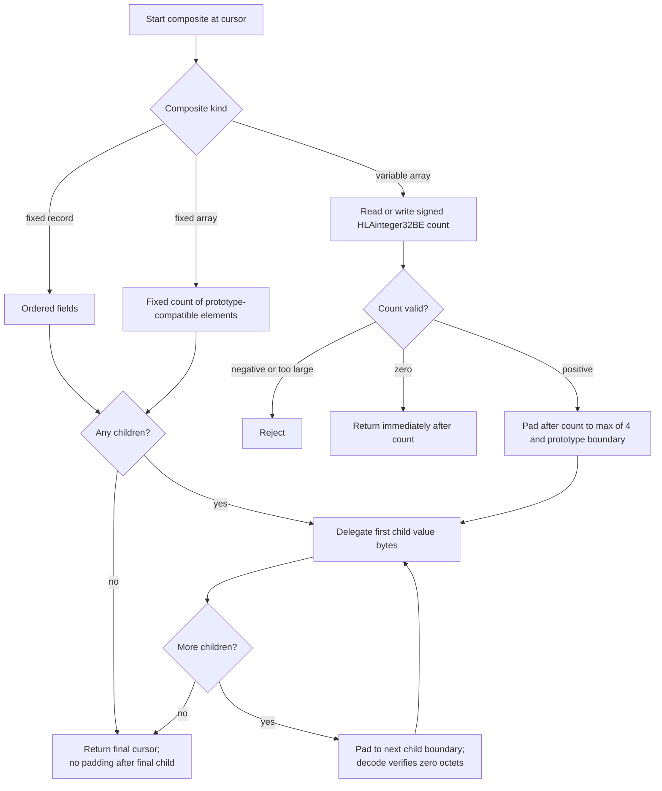
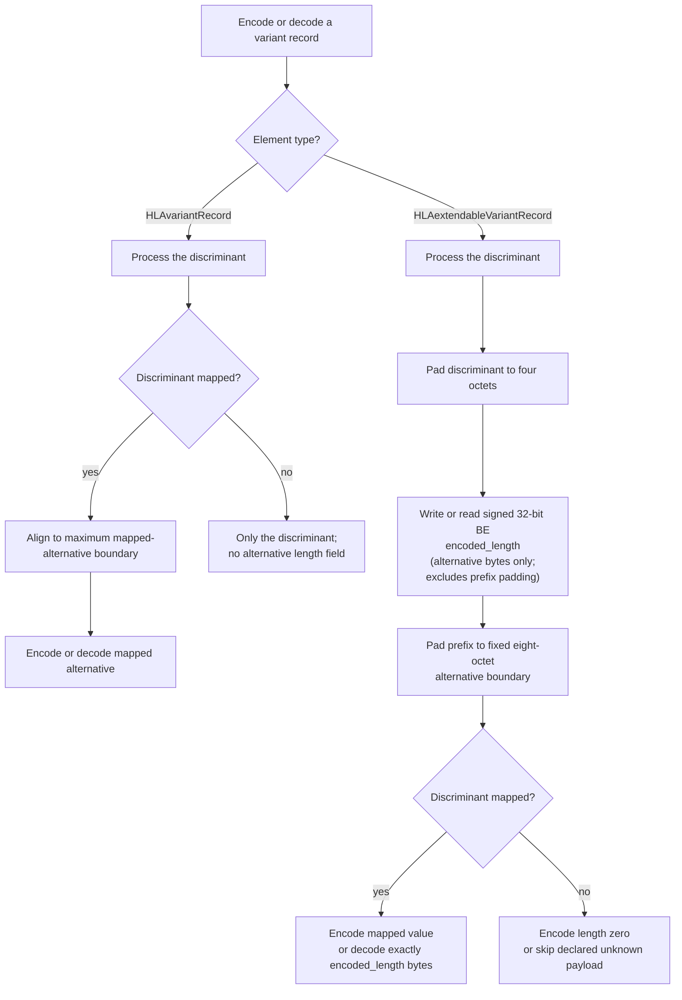
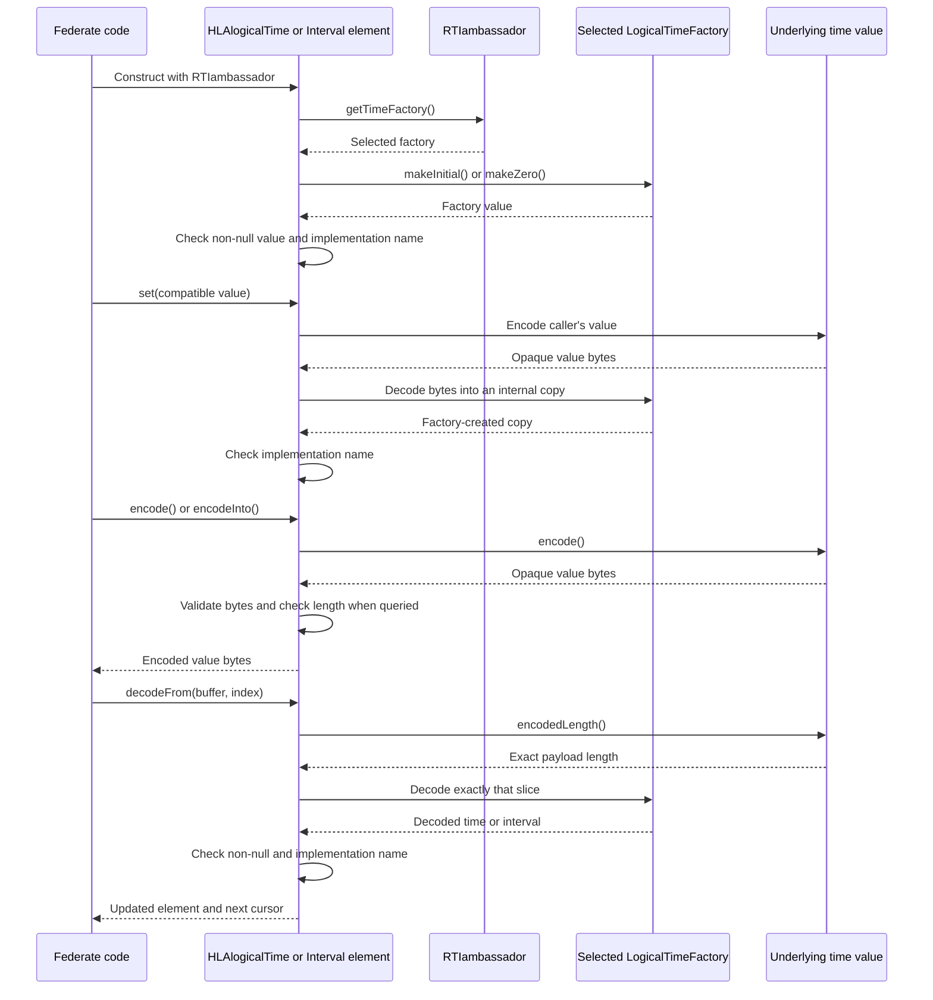
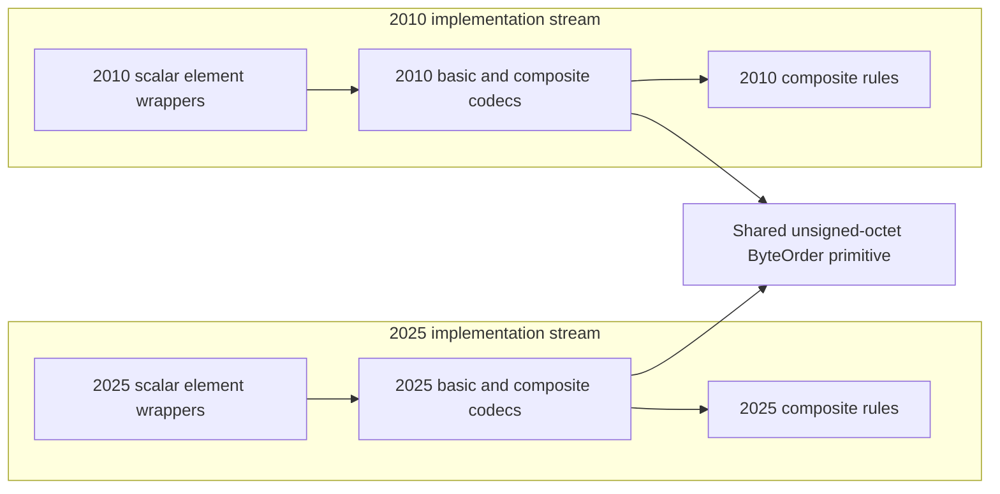

# IEEE 1516.1-2025 C++ DataElement Encoding: Flow Guide

The IEEE 1516.1-2025 C++ `DataElement` interface defines the application-facing
value-encoding boundary: a typed value is represented as octets according to
the selected element's format. This guide explains that portable boundary and
distinguishes it from handle encoding, model input, and private transport
framing. Umbra's source and focused tests illustrate selected implementation
paths; they are not normative authority or evidence of complete conformance.

## Scope and authority

- **Edition:** IEEE 1516.1-2025 C++ API only. The 2010 API and implementation
  remain a separate compatibility stream; this guide does not infer parity.
- **Implementation boundary:** public 2025 `DataElement` codecs and focused
  unit tests. No federation-management profile, process message framing, or
  2010 API behavior is inferred.
- **Layer:** `rti1516_2025::DataElement` values, their nested encodings, and
  logical-time wrappers. This is not the internal process-RPC wire format,
  FOM serialization, or the RTI's network framing.
- **Authority:** the [official IEEE 1516.1-2025 Federate Interface
  Specification](https://standards.ieee.org/ieee/1516.1/6688/) defines the
  interface; the [official IEEE 1516.2-2025 OMT
  Specification](https://standards.ieee.org/ieee/1516.2/6689/) is the related
  model-template standard. The pinned [2025 `DataElement` API](../../third_party/ieee1516.1-2025/include/RTI/encoding/DataElement.h)
  and [basic element declarations](../../third_party/ieee1516.1-2025/include/RTI/encoding/BasicDataElements.h)
  make the C++ operations navigable. Source describes current Umbra behavior;
  focused tests show only the concrete cases they exercise.
- **Shared primitive boundary:** both edition-specific basic-element sources
  call the small [explicit-byte-order primitive](../../cpp/src/internal/encoding/byte_order.hpp#L15).
  This shared helper only appends/reads unsigned octets in a requested order.
  The 2010 and 2025 type wrappers, time encoders, composite helpers, and tests
  remain separate; in particular, [2025 composite rules](../../cpp/src/internal/encoding/composite_2025.hpp)
  are not the [2010 composite rules](../../cpp/src/internal/encoding/composite_2010.hpp).

## One value, from API call to octets

The public `VariableLengthData` is the C++ carrier for encoded value octets.
Its `size()` reports how many octets the carrier currently holds; it does not
prepend a payload length. The selected `DataElement` defines any structure
inside those bytes, while a private RTI process frame is an outer layer.

For the broader public HLA path—from a FOM member's declared type through
compatible `DataElement` selection, the handle-keyed `VariableLengthData` map,
service/callback, and receiver decoding—see the object guide's
[encoded-value flow](HLA-2025-OBJECT-AND-INTERACTION-INFORMATION-FLOW-GUIDE.md#encoded-values-enter-services-as-handle-keyed-octets).
This guide zooms in on the value octets themselves; it does not describe the
private process-frame format.

| Surface | Buffer effect |
| --- | --- |
| `encode()` | Returns a new `VariableLengthData` containing this value's encoding. |
| `encode(VariableLengthData&)` | In the examined basic, fixed-record, and variable-array codecs, writes a fresh encoding through `setData`, replacing prior carrier contents; this is source-observed behavior. |
| `encodeInto(vector<Octet>&)` | Appends encoded octets to the caller's vector; composites use this to build nested values. |
| `decode(VariableLengthData const&)` | Whole-value entry point; the selected implementations reject unconsumed trailing octets. |
| `decodeFrom(vector<Octet> const&, index)` | Cursor entry point; returns the next offset so a parent can decode another child. |

These are distinct from the format's own count fields. For example,
`HLAvariableArray` puts a signed 32-bit big-endian element count inside its
encoded value, while `VariableLengthData::size()` simply reports the octets
already stored in the carrier. Neither is the RTI's private process-frame
metadata.

The pinned [DataElement operations](../../third_party/ieee1516.1-2025/include/RTI/encoding/DataElement.h#L33)
and [`VariableLengthData` accessors](../../third_party/ieee1516.1-2025/include/RTI/VariableLengthData.h#L50)
define the public surfaces. Current overwrite/append behavior is illustrated
by the [basic codecs](../../cpp/src/ieee1516_2025_basic_data_elements.cpp#L381),
[fixed record](../../cpp/src/ieee1516_2025_fixed_record.cpp#L132), and
[variable array](../../cpp/src/ieee1516_2025_variable_array.cpp#L204).
The selected [variable-array test](../../cpp/tests/ieee1516_2025_basic_data_elements_catch2.cpp#L723)
asserts its in-value count and that `encodeInto` appends; separate
[`VariableLengthData` tests](../../cpp/tests/variable_length_data_catch2.cpp#L29)
cover copying caller-owned bytes and value copies, not every encoder overload.
For retaining callback payloads, including the `data()` pointer lifetime, see
the object guide's [callback-payload ownership note](HLA-2025-OBJECT-AND-INTERACTION-INFORMATION-FLOW-GUIDE.md#callback-payload-references-decode-now-or-copy-to-retain).

A nested `decodeFrom` begins at the caller-supplied cursor and returns the next
cursor; a whole-value `decode` adds the stricter outer check that the selected
element consumed the complete input.

```mermaid
flowchart TD
  A[Construct a 2025 DataElement] --> B[Set value or assemble children]
  B --> C{Operation?}
  C -->|encode| D[Concrete element selects its representation]
  D --> E[Write value octets, counts, or padding to the selected buffer]
  E --> F[Expose encoded octets through VariableLengthData or a caller buffer]
  C -->|decode| G[decodeFrom starts at the caller cursor]
  G --> H[Validate bytes, counts, type values, and padding]
  H --> I[Return the next cursor]
  I --> J{Whole-value decode?}
  J -->|input fully consumed| K[Accept]
  J -->|trailing octets| L[Reject trailing data]
  J -->|nested child| M[Parent decodes its next field]
```

The API contract for [encoding and decoding operations](../../third_party/ieee1516.1-2025/include/RTI/encoding/DataElement.h#L35)
is distinct from the implementation's scalar and composite policies. The
whole-input trailing-data guard is visible, for example, in the 2025
[`HLAvariableArray::decode`](../../cpp/src/ieee1516_2025_variable_array.cpp#L234)
and [`HLAfixedRecord::decode`](../../cpp/src/ieee1516_2025_fixed_record.cpp#L156)
paths.

## Pick the representation boundary before reasoning about bytes

Several paths eventually produce octets, but their encodings are not
interchangeable. First ask what the bytes represent:

```mermaid
flowchart TD
  A[What do these bytes represent?] --> B{An HLA DataElement value?}
  B -->|yes| B1[Use the selected element format:<br/>byte order, composite rules, or time factory]
  B -->|no| C{An encoded public RTI handle?}
  C -->|yes| C1[Use the category-specific handle encoder<br/>and matching RTI decoder]
  C -->|no| D{An Umbra process frame?}
  D -->|yes| D1[Use private RTI framing;<br/>it is not the HLA value payload]
  D -->|no| E{FOM or OMT model input?}
  E -->|yes| E1[Use model/schema composition,<br/>not a DataElement codec]
  E -->|no| F[Another representation:<br/>follow its owning protocol]
```

Only the DataElement branch is described by this guide's scalar and composite
rules. Public handle encoding has its own opaque, category-specific contract;
see the [names and handle guide](HLA-2025-NAME-AND-HANDLE-RESOLUTION-FLOW-GUIDE.md#5-typed-handle-encoding-is-not-numeric-identity).
The RTI process-frame branch is an Umbra transport detail, not an HLA wire
format; its [frame helpers](../../cpp/src/internal/encoding/transport_wire.hpp#L14)
are separate from the value payload. Even where private frame metadata uses
fixed big-endian encoding, it does not select the byte order of the
DataElement payload; the [frame-header reader](../../cpp/src/internal/federation/process_transport.cpp#L94)
shows that boundary directly. For model inputs, see the [FOM module admission
and composition guide](HLA-2025-FOM-MODULE-ADMISSION-AND-COMPOSITION-FLOW-GUIDE.md).

## Explicit byte order belongs to each value type

Host endianness is not consulted by the shared primitive. A concrete encoder
passes `ByteOrder::big` or `ByteOrder::little` at the call site; the BE/LE API
type chooses which. Floating values are converted to their bit representation
and then encoded through the matching-width path. This is a byte-order choice
for that element, not a setting that silently changes every value in a
composite.

The public `DataElement` API has no global byte-order setting or byte-order
argument on `encode`/`decode`. In the examined 2025 surface, the concrete type,
the type's fixed encoding rule, or a delegated logical-time implementation
owns that choice:

| Byte-order owner | Example in the examined 2025 path |
| --- | --- |
| Application selects a concrete type | A `BE`/`LE` suffix selects the representation of that concrete value type; it is not a host-endian or process-wide switch. The exact 2025 type set and its byte-vector coverage are listed below. |
| Element's fixed encoding | `HLAboolean` is 32-bit BE 0/1; `HLAunicodeChar` is one UTF-16BE code unit; string lengths are 32-bit BE and Unicode string units are UTF-16BE. These formats have no caller-selected `BE`/`LE` sibling; see the [scalar encoders](../../cpp/src/ieee1516_2025_basic_data_elements.cpp#L661), [basic vectors](../../cpp/tests/ieee1516_2025_basic_data_elements_catch2.cpp#L86), [Unicode character test](../../cpp/tests/ieee1516_2025_basic_data_elements_catch2.cpp#L216), and [Unicode string test](../../cpp/tests/ieee1516_2025_basic_data_elements_catch2.cpp#L367). |
| No multi-octet order to select | `HLAoctet`, `HLAbyte`, and `HLAASCIIchar` each encode one octet; see the [focused scalar case](../../cpp/tests/ieee1516_2025_basic_data_elements_catch2.cpp#L111). |
| Child element, not composite-wide | Records, arrays, and variants delegate value bytes to their elements; a variable array's leading count is `HLAinteger32BE`, followed by its boundary/padding rules. See the [array codec](../../cpp/src/ieee1516_2025_variable_array.cpp#L210) and [array vectors](../../cpp/tests/ieee1516_2025_basic_data_elements_catch2.cpp#L723). |
| Contained time value and selected factory | `HLAlogicalTime` and `HLAlogicalTimeInterval` encode through the contained value and decode through the selected factory. In Umbra's 2025 wrapper, `getOctetBoundary() == 1` is an alignment boundary, not an encoded-size or byte-order promise; see the [wrapper source](../../cpp/src/ieee1516_2025_logical_time_encoding.cpp#L213) and [two-factory tests](../../cpp/tests/ieee1516_2025_time_catch2.cpp#L210). |
| Umbra's outer process-frame layer | Private framing helpers encode framing integers as big-endian; this does not select the HLA value's format. See the [framing helpers](../../cpp/src/internal/encoding/transport_wire.hpp#L14) and [frame header read](../../cpp/src/internal/federation/process_transport.cpp#L94). |

The pinned [2025 type list](../../third_party/ieee1516.1-2025/include/RTI/encoding/BasicDataElements.h#L144)
declares BE/LE siblings for signed and unsigned
16-, 32-, and 64-bit integers, 32- and 64-bit floating values, and
`HLAoctetPair` ([declaration](../../third_party/ieee1516.1-2025/include/RTI/encoding/BasicDataElements.h#L167));
the list contains no 8-bit integer BE/LE pair. The
focused tests provide literal octet vectors and decode round trips for
[16-bit integers and `HLAoctetPair`](../../cpp/tests/ieee1516_2025_basic_data_elements_catch2.cpp#L249),
[32-bit BE integers](../../cpp/tests/ieee1516_2025_basic_data_elements_catch2.cpp#L86),
[32-bit LE integers](../../cpp/tests/ieee1516_2025_basic_data_elements_catch2.cpp#L302),
[64-bit integers](../../cpp/tests/ieee1516_2025_basic_data_elements_catch2.cpp#L327),
and [32-/64-bit floats](../../cpp/tests/ieee1516_2025_basic_data_elements_catch2.cpp#L173).
The pinned declarations identify `HLAASCIIchar`, `HLAbyte`, and `HLAoctet` as
one-octet types ([ASCII char](../../third_party/ieee1516.1-2025/include/RTI/encoding/BasicDataElements.h#L146),
[byte](../../third_party/ieee1516.1-2025/include/RTI/encoding/BasicDataElements.h#L149),
[octet](../../third_party/ieee1516.1-2025/include/RTI/encoding/BasicDataElements.h#L166));
they have no multi-octet order to select.

The fixed-format and factory rows describe the inspected 2025 codec paths;
they are not a claim that every `DataElement` has a byte-order choice or that
the generic API promises one representation for every logical-time factory.

```mermaid
flowchart TD
  V[Concrete integer or floating element] --> T[Convert value to fixed-width bit pattern]
  T --> O{BE or LE element type?}
  O -->|BE| B[Append most-significant octet first]
  O -->|LE| L[Append least-significant octet first]
  B --> W[Encoded octet sequence]
  L --> W
  W --> D{Decode using matching element type?}
  D -->|yes| R[Reconstruct value]
  D -->|no or incomplete input| X[Wrong interpretation or encoding exception]
```

For a concrete test vector, signed `-2` encodes as `FF FF FF FE` in
`HLAinteger32BE` and `FE FF FF FF` in `HLAinteger32LE`; the 64-bit test checks
the corresponding eight-octet forms. Those exact vectors and truncated-input
rejections are in the [32-bit BE case](../../cpp/tests/ieee1516_2025_basic_data_elements_catch2.cpp#L86),
[32-bit LE case](../../cpp/tests/ieee1516_2025_basic_data_elements_catch2.cpp#L302),
and [64-bit case](../../cpp/tests/ieee1516_2025_basic_data_elements_catch2.cpp#L327).
The 2025 implementation's [16-bit BE/LE helpers](../../cpp/src/ieee1516_2025_basic_data_elements.cpp#L58),
[32-bit wrappers](../../cpp/src/ieee1516_2025_basic_data_elements.cpp#L522),
and [64-bit wrappers](../../cpp/src/ieee1516_2025_basic_data_elements.cpp#L598)
make the choice visible at each value path. The common [byte-order primitive](../../cpp/src/internal/encoding/byte_order.hpp#L18)
does not choose an order on behalf of a caller.

These are `DataElement` value octets, not process-frame headers. The private
[transport adapter](../../cpp/src/internal/encoding/transport_wire.hpp#L14)
has separate fixed-big-endian framing helpers, and the
[process transport path](../../cpp/src/internal/federation/process_transport.cpp#L195)
reads frame metadata independently of the encoded payload. Do not infer a
value element's BE/LE choice from the transport frame's byte order.

Other scalar families have their own representation, rather than inheriting
the integer suffix rule: for example, `HLAboolean` is validated as a four-octet
0/1 value and `HLAunicodeChar` is one UTF-16 code unit. Strings add an
important C++ boundary of their own.

## String elements: ASCII bytes versus UTF-16 code units

The pinned API declares `HLAASCIIstring` with a `std::string` value and
`HLAunicodeString` with `std::wstring`; those C++ types alone do not mean that
both strings are UTF-8 or that `std::wstring::size()` is the wire count. In
Umbra's inspected 2025 codecs, the two elements have different validation and
counting units:

| Element | Current 2025 C++ value contract | Encoded value payload |
| --- | --- | --- |
| `HLAASCIIstring` | Each `std::string` byte must be ASCII (`0x00`–`0x7F`). A UTF-8 byte sequence containing non-ASCII characters is rejected rather than passed through. Embedded NUL is valid data because the value is length-delimited, not NUL-terminated. | Four-octet big-endian byte count, then one octet per ASCII byte. |
| `HLAunicodeString` | `std::wstring` values are converted to UTF-16 units. With 16-bit `wchar_t`, surrogate units must form valid pairs; with wider `wchar_t`, input must be a valid Unicode scalar value. Decoding rejects unmatched surrogate units. | Four-octet big-endian count of UTF-16 code units, then each 16-bit unit in big-endian order. A supplementary character contributes two units; the count is not a byte count, Unicode-scalar count, or necessarily `std::wstring::size()`. |

This table describes the current Umbra source path, not a cross-edition
assumption. The pinned declarations for [`HLAASCIIstring`](../../third_party/ieee1516.1-2025/include/RTI/encoding/BasicDataElements.h#L147)
and [`HLAunicodeString`](../../third_party/ieee1516.1-2025/include/RTI/encoding/BasicDataElements.h#L170)
show the C++ carrier types; the [ASCII codec](../../cpp/src/ieee1516_2025_basic_data_elements.cpp#L726)
and the [UTF-16 encoder](../../cpp/src/ieee1516_2025_basic_data_elements.cpp#L153)
and [decoder](../../cpp/src/ieee1516_2025_basic_data_elements.cpp#L201) helpers
show the implementation rules. The focused [ASCII test](../../cpp/tests/ieee1516_2025_basic_data_elements_catch2.cpp#L111)
preserves `A\0Z`, rejects `0x80`, and checks truncation. The [Unicode string test](../../cpp/tests/ieee1516_2025_basic_data_elements_catch2.cpp#L367)
encodes `A` plus a supplementary character with a unit count of three, and
rejects malformed UTF-16 and an unmatched input surrogate. These selected
tests do not establish exhaustive Unicode conformance.

```mermaid
flowchart TD
  V["C++ string value"] --> K{"2025 element type?"}
  K -->|HLAASCIIstring| A["std::string: require every byte to be ASCII"]
  A -->|high-bit byte| X["Throw EncoderException"]
  A -->|valid, including embedded NUL| AC["Write 32-bit BE octet count"]
  AC --> AP["Append one octet per ASCII byte"]
  K -->|HLAunicodeString| U["std::wstring: convert valid values to UTF-16 units"]
  U -->|invalid scalar or surrogate sequence| X
  U -->|valid| UC["Write 32-bit BE UTF-16-unit count"]
  UC --> UP["Append each 16-bit unit big-endian"]
  AP --> OUT["DataElement value octets"]
  UP --> OUT
```

Decoding applies the corresponding length and payload rules: ASCII decoding
rejects high-bit octets, Unicode decoding validates surrogate pairing, and
whole-value decoding rejects truncation or trailing octets. Nested
`decodeFrom` remains cursor-based so a parent can continue with its next field;
none of these string counts is the private process-frame length.

## Composite values: shape, cursor, and alignment

Composite elements delegate each child's value octets—including that child's
own big- or little-endian representation—to the child encoder. The composite
defines shape and placement: a fixed record has ordered fields; a fixed array
has a fixed number of prototype-compatible elements; and a variable array
starts with a signed 32-bit big-endian element count. Endianness is not a
property inherited from the composite: its count is explicitly big-endian,
while an element keeps the byte order of its own type.

Alignment is relative to the beginning of the composite, not the absolute
cursor in a containing byte vector. The containing value aligns the composite
as one child; inside a fixed record, field offsets are tracked from the record's
local origin. Fixed and variable arrays pad between elements to the prototype
element's boundary. A non-empty variable array has one additional prefix rule:
after its four-octet count, it inserts zero padding to the array boundary
(`max(4, prototype boundary)`) before the first element. An empty variable array
ends immediately after the count. Decoding verifies each required padding
octet is zero. These 2025 implementations do not append inter-element padding
after the final child.

Here, “octet boundary” and “alignment” describe serialized layout—not C++
`alignof`, an object's address in memory, native struct padding, or private
process-frame alignment. Each element reports its encoding boundary through
[`getOctetBoundary`](../../third_party/ieee1516.1-2025/include/RTI/encoding/DataElement.h#L62).
For `decodeFrom`, the returned cursor is an index into the shared byte vector,
but the composite's internal padding pattern is measured from that composite's
start. A prefix byte therefore changes the returned index, not the shape of
the nested value. The fixed-record codec maintains a record-local offset, and
the array codecs use the child encoding length for inter-element padding
([fixed record](../../cpp/src/ieee1516_2025_fixed_record.cpp#L138),
[fixed array](../../cpp/src/ieee1516_2025_fixed_array.cpp#L177),
[variable array](../../cpp/src/ieee1516_2025_variable_array.cpp#L210)). This
is why a composite's serialized shape should be read from the HLA element
rules, not inferred from a matching-looking C++ container or struct.

```mermaid
flowchart TD
  S[Start composite at cursor] --> K{Composite kind}
  K -->|fixed record| R[Ordered fields]
  K -->|fixed array| A[Fixed count of prototype-compatible elements]
  K -->|variable array| C[Read or write signed HLAinteger32BE count]
  R --> H{Any children?}
  A --> H
  H -->|no| F[Return cursor]
  H -->|yes| V[Delegate first child value bytes]
  C --> N{Count valid?}
  N -->|negative or too large| E[Reject]
  N -->|zero| Z[Return immediately after count]
  N -->|positive| L[Pad after count to max of 4 and prototype boundary]
  L --> V
  V --> P{More children?}
  P -->|yes| B[Pad to next child boundary;<br/>decode verifies zero octets]
  B --> V
  P -->|no| F[Return final cursor;<br/>no padding after final child]
```

This boundary is observable in the [fixed-record codec](../../cpp/src/ieee1516_2025_fixed_record.cpp#L138),
[fixed-array codec](../../cpp/src/ieee1516_2025_fixed_array.cpp#L177), and
[variable-array codec](../../cpp/src/ieee1516_2025_variable_array.cpp#L210).
The [fixed-array test](../../cpp/tests/ieee1516_2025_basic_data_elements_catch2.cpp#L612)
checks fixed cardinality, record-shaped elements, zero inter-element padding,
and decoding from a nonzero cursor. The [variable-array test](../../cpp/tests/ieee1516_2025_basic_data_elements_catch2.cpp#L723)
checks the signed BE count, initial padding before an eight-boundary element,
between-element padding, empty-array termination, nested decoding from a
nonzero cursor, negative-count rejection, malformed padding, and trailing-data
rejection. These vectors distinguish the cursor returned by a nested decoder
from the composite-relative offsets used to lay out its children.

## Variants are discriminant-driven branches

`HLAvariantRecord` first encodes its discriminant. A mapped discriminant selects
one alternative and causes the alternative bytes to be aligned to the maximum
boundary of the mapped alternatives; an unmapped discriminant ends the
encoding immediately, with no alternative padding. Its decoder returns just
after an unmapped discriminant, so whole-value `decode` rejects any extra
octets as trailing data.

`HLAextendableVariantRecord` has a different unknown-discriminant path. The
2025 Umbra codec writes the discriminant, pads to a four-octet boundary, writes
a signed `HLAinteger32BE` `encoded_length`, then pads the prefix to a fixed
eight-octet alternative boundary before the alternative bytes. The length
counts only those alternative bytes—not the padding before them. On decode, a
known mapping must consume exactly the declared number of bytes; an unknown
mapping can be skipped using that length. This supports advancing past an
unrecognized alternative in a larger cursor-based value, but the current
element does not retain that unknown payload: `getVariant()` still throws,
and this implementation's encoder writes a zero length for an unmapped
current discriminant.

The value bytes still belong to the selected alternative type: for example,
the focused extendable-variant vector keeps an `HLAfloat32LE` alternative in
little-endian order after the structurally big-endian length field
([test](../../cpp/tests/ieee1516_2025_basic_data_elements_catch2.cpp#L1064)).

```mermaid
flowchart TD
  Start[Encode or decode a variant record] --> Kind{Element type?}
  Kind -->|HLAvariantRecord| Ordinary[Process the discriminant]
  Ordinary --> OrdinaryMapped{Discriminant mapped?}
  OrdinaryMapped -->|yes| OrdinaryAlign[Align to maximum mapped-alternative boundary]
  OrdinaryAlign --> OrdinaryValue[Encode or decode mapped alternative]
  OrdinaryMapped -->|no| OrdinaryUnknown[Only the discriminant;<br/>no alternative length field]
  Kind -->|HLAextendableVariantRecord| Extendable[Process the discriminant]
  Extendable --> LengthBoundary[Pad discriminant to four octets]
  LengthBoundary --> Length["Write or read signed 32-bit BE<br/>encoded_length<br/>(alternative bytes only;<br/>excludes prefix padding)"]
  Length --> AlternativeBoundary[Pad prefix to fixed eight-octet<br/>alternative boundary]
  AlternativeBoundary --> ExtendableMapped{Discriminant mapped?}
  ExtendableMapped -->|yes| ExtendableValue[Encode mapped value<br/>or decode exactly encoded_length bytes]
  ExtendableMapped -->|no| ExtendableUnknown[Encode length zero<br/>or skip declared unknown payload]
```

The 2025 [`HLAvariantRecord` implementation](../../cpp/src/ieee1516_2025_variant_record.cpp#L269)
and its [focused mapped/unmapped test](../../cpp/tests/ieee1516_2025_basic_data_elements_catch2.cpp#L859)
cover the ordinary branch; the source anchors its unmapped behavior to IEEE
1516.2 §4.14.10.2. The distinct [extendable encoder](../../cpp/src/ieee1516_2025_extendable_variant_record.cpp#L280),
[decoder](../../cpp/src/ieee1516_2025_extendable_variant_record.cpp#L322),
and [focused test](../../cpp/tests/ieee1516_2025_basic_data_elements_catch2.cpp#L994)
show the length field, the two prefix-alignment stages, a declared-length
mismatch, truncation, and [skipping a three-octet unmapped payload](../../cpp/tests/ieee1516_2025_basic_data_elements_catch2.cpp#L1081).
The test also checks a too-short positive length
([assertion](../../cpp/tests/ieee1516_2025_basic_data_elements_catch2.cpp#L1038));
the source rejects negative lengths
([guard](../../cpp/src/ieee1516_2025_extendable_variant_record.cpp#L343)).
Neither that test nor the source review here covers a parent decode continuing
after an unknown alternative. These are source/test observations for the 2025
path, not a claim of 2010 equivalence.

Keep this codec step separate from model composition: a runtime
`HLAextendableVariantRecord` has an explicit discriminant/alternative map
configured through `addVariant`
([API](../../third_party/ieee1516.1-2025/include/RTI/encoding/HLAextendableVariantRecord.h#L84)),
and the focused encoder test constructs that map directly
([test](../../cpp/tests/ieee1516_2025_basic_data_elements_catch2.cpp#L994)); it
does not read a composed FOM catalog. The FOM guide separately traces how
`DrinkGarnish` is merged and resolved
([model composition](HLA-2025-FOM-MODULE-ADMISSION-AND-COMPOSITION-FLOW-GUIDE.md#variant-record-alternatives-resolve-against-the-merged-discriminant)).
These are adjacent layers, not evidence that the composer automatically builds
the runtime codec or that an end-to-end catalog-to-octets path is tested.

## Logical time is factory-defined, not assumed to be BE or LE

The pinned [`LogicalTime`](../../third_party/ieee1516.1-2025/include/RTI/time/LogicalTime.h#L96)
and [`LogicalTimeInterval`](../../third_party/ieee1516.1-2025/include/RTI/time/LogicalTimeInterval.h#L106)
interfaces expose `encode()` and `encodedLength()` on the value. The selected
[`LogicalTimeFactory`](../../third_party/ieee1516.1-2025/include/RTI/time/LogicalTimeFactory.h#L70)
provides the matching decode operations. Those API boundaries do not make
`HLAlogicalTime` or `HLAlogicalTimeInterval` a fixed-width BE/LE scalar.

In Umbra's 2025 path, each wrapper captures the factory returned by its
RTIambassador and the factory's implementation name. Construction requests an
initial logical time or zero interval from that factory. `set` first checks
that the supplied value has the same implementation name, then copies it by
encoding the source and decoding those bytes through the captured factory; it
does not retain the caller's value. Decode follows the same factory and checks
that a non-null result has the expected implementation name. `decodeFrom`
measures the current value's encoded length, takes exactly that many bytes from
the supplied cursor, and returns the next shared-buffer index. The wrappers'
one-octet `getOctetBoundary()` is their composite-placement boundary value: it
is neither payload length nor a byte-order declaration. These are bounded 2025
implementation details, not claims about every RTI's factory.

Umbra's bundled 2025 reference time types currently encode their 64-bit value
representations in big-endian order: the [integer and floating encoder
helpers](../../cpp/src/ieee1516_2025_time.cpp#L108) explicitly select
`ByteOrder::big`, and the [integer64](../../cpp/src/ieee1516_2025_time.cpp#L307)
and [float64](../../cpp/src/ieee1516_2025_time.cpp#L577) value implementations
use those helpers. This is a statement about those concrete reference
implementations, not a rule inferred from names such as
`HLAinteger64Time` or a universal format for arbitrary factories. The logical-
time wrapper still treats the selected value's bytes as opaque. This is the
codec handoff to time-management services, not the time-advance/grant state
machine itself; see the separate [2025 time-management guide](HLA-2025-TIME-MANAGEMENT-GUIDE.md).

```mermaid
sequenceDiagram
  participant App as Federate code
  participant E as HLAlogicalTime or Interval element
  participant A as RTIambassador
  participant F as Selected LogicalTimeFactory
  participant V as Underlying time value
  App->>E: Construct with RTIambassador
  E->>A: getTimeFactory()
  A-->>E: Selected factory
  E->>F: makeInitial() or makeZero()
  F-->>E: Factory value
  E->>E: Check non-null value and implementation name
  App->>E: set(compatible value)
  E->>V: Encode caller's value
  V-->>E: Opaque value bytes
  E->>F: Decode bytes into an internal copy
  F-->>E: Factory-created copy
  E->>E: Check implementation name
  App->>E: encode() or encodeInto()
  E->>V: encode()
  V-->>E: Opaque value bytes
  E->>E: Validate bytes and check length when queried
  E-->>App: Encoded value bytes
  App->>E: decodeFrom(buffer, index)
  E->>V: encodedLength()
  V-->>E: Exact payload length
  E->>F: Decode exactly that slice
  F-->>E: Decoded time or interval
  E->>E: Check non-null and implementation name
  E-->>App: Updated element and next cursor
```

The [2025 wrapper implementation](../../cpp/src/ieee1516_2025_logical_time_encoding.cpp#L62)
shows factory capture, compatibility checks, and the encode/decode copy; its
[time encoder](../../cpp/src/ieee1516_2025_logical_time_encoding.cpp#L213)
and [interval encoder](../../cpp/src/ieee1516_2025_logical_time_encoding.cpp#L301)
delegate the payload to the underlying value. Focused [logical-time vectors](../../cpp/tests/ieee1516_2025_time_catch2.cpp#L234)
show `HLAfloat64Time(1.5)` as `3F F8 00 00 00 00 00 00`; the [interval case](../../cpp/tests/ieee1516_2025_time_catch2.cpp#L289)
shows `HLAinteger64Interval(9)` as `00 00 00 00 00 00 00 09`. Together the
cases exercise factory mismatch rejection, independent copies/clones, truncated
payloads, and `decodeFrom` from cursor 1 returning cursor 9. These vectors
describe the bundled reference types only; they do not establish a universal
wire representation for every factory or a time-management transition. The
separate [2025 time-management guide](HLA-2025-TIME-MANAGEMENT-GUIDE.md)
documents that state machine.

## Edition boundary and what this guide does not claim

The 2010 and 2025 API implementations each have their own basic-element and
composite translation units. They happen to use the same stateless
`ByteOrder` octet primitive, but that one shared helper does not make the
surrounding codec implementations interchangeable. The 2025 aggregate code
uses [`composite_2025.hpp`](../../cpp/src/internal/encoding/composite_2025.hpp);
the 2010 aggregate code uses
[`composite_2010.hpp`](../../cpp/src/internal/encoding/composite_2010.hpp).
Those version-specific adapters also import the same type-free checked-size,
range, and padding operations from the shared
[`composite_primitives.hpp`](../../cpp/src/internal/encoding/composite_primitives.hpp);
the codecs reach them through separate 2010 and 2025 namespaces. This is a
limited internal reuse statement, not evidence that the public composite
formats, wrappers, or edge cases are equivalent. The following ownership
sketch isolates only the byte-order primitive; it does not assert that the
edition-specific wrappers or composite formats are equivalent.
The separate [2010 encoding companion](HLA-2010-DATA-ELEMENT-ENCODING-FLOW-GUIDE.md)
documents its own source and smoke-test observations. No 2010 behavior is
inferred from a 2025 test, and no change to either stream is proposed by this
guide.

The public C++ method signatures also differ even where the operation names
look familiar. The pinned [2010 `DataElement` declaration](../../third_party/ieee1516.1-2010/include/RTI/encoding/DataElement.h#L36)
returns `std::auto_ptr<DataElement>` from `clone()` and `void` from full-buffer
`decode`; the pinned [2025 declaration](../../third_party/ieee1516.1-2025/include/RTI/encoding/DataElement.h#L31)
uses `std::unique_ptr<DataElement>` and returns `DataElement&`, respectively.
Both headers separately declare the value-encoding operations such as
`encode()`, `encodeInto()`, and cursor-based `decodeFrom()`. These are C++ API
signature differences, not evidence by themselves of a different encoded
octet format. The format claims above remain tied to each edition's own
implementation and test evidence.

The pinned `RTI/encoding` header inventories also differ in named element
surfaces. Both contain `HLAvariantRecord`, but the 2025 package additionally
declares [`HLAextendableVariantRecord`](../../third_party/ieee1516.1-2025/include/RTI/encoding/HLAextendableVariantRecord.h),
[`HLAlogicalTime`](../../third_party/ieee1516.1-2025/include/RTI/encoding/HLAlogicalTime.h),
and [`HLAlogicalTimeInterval`](../../third_party/ieee1516.1-2025/include/RTI/encoding/HLAlogicalTimeInterval.h);
there are no corresponding headers in the pinned 2010 `RTI/encoding`
inventory ([2010 `DataElement`](../../third_party/ieee1516.1-2010/include/RTI/encoding/DataElement.h),
[2010 `HLAvariantRecord`](../../third_party/ieee1516.1-2010/include/RTI/encoding/HLAvariantRecord.h)).
This is a narrow package-surface observation, not a claim that 2010 lacks
logical-time APIs: its separate [`LogicalTime`](../../third_party/ieee1516.1-2010/include/RTI/LogicalTime.h),
[`LogicalTimeInterval`](../../third_party/ieee1516.1-2010/include/RTI/LogicalTimeInterval.h),
and [`LogicalTimeFactory`](../../third_party/ieee1516.1-2010/include/RTI/LogicalTimeFactory.h)
interfaces are outside `RTI/encoding`. Nor does the shared `HLAvariantRecord`
name guarantee equivalent behavior. The 2025 logical-time element delegates
to its selected factory representation, as described above.

```mermaid
flowchart LR
  subgraph E2025[2025 implementation stream]
    A[2025 scalar element wrappers] --> B[2025 basic and composite codecs]
    B --> C[2025 composite rules]
  end
  subgraph E2010[2010 implementation stream]
    D[2010 scalar element wrappers] --> F[2010 basic and composite codecs]
    F --> G[2010 composite rules]
  end
  B --> H[Shared unsigned-octet ByteOrder primitive]
  F --> H
```

This is not an exhaustive element-by-element conformance inventory, a claim
that every malformed input is covered, or a description of how encoded values
are framed or transported between RTIs. The Catch2 cases demonstrate selected
vectors, alignment, malformed-input rejection, and ownership behavior.

## Evidence map

- [2025 C++ encoding API declarations](../../third_party/ieee1516.1-2025/include/RTI/encoding/DataElement.h)
- [2025 basic and composite implementation sources](../../CMakeLists.txt#L208)
- [2025 encoder-focused Catch2 cases](../../cpp/tests/ieee1516_2025_basic_data_elements_catch2.cpp)
- [Shared byte-order primitive](../../cpp/src/internal/encoding/byte_order.hpp)
- [Separate 2010 basic element source](../../cpp/src/ieee1516_2010_basic_data_elements.cpp#L88)
- [Separate 2010 composite primitive rules](../../cpp/src/internal/encoding/composite_2010.hpp)
