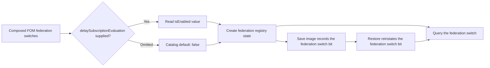
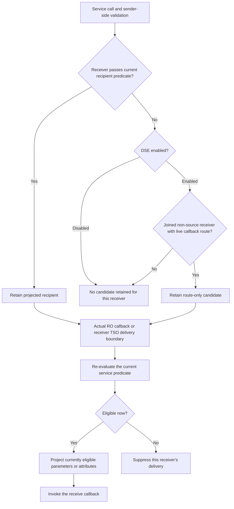
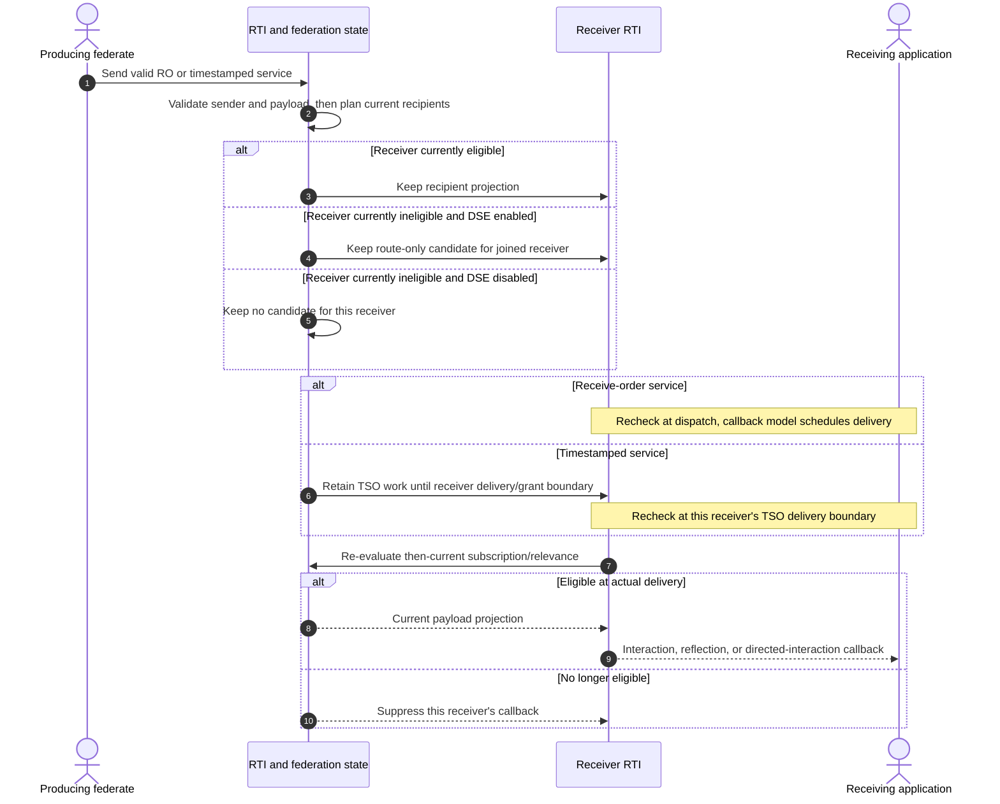

# HLA 1516.1-2025 Delay Subscription Evaluation Flow Guide

Delay Subscription Evaluation (DSE) changes **when the RTI decides whether a receiver is subscribed and relevant**. It does not change sender-side service validation, make delivery unconditional, or replace callback and time management. The practical difference is whether a joined receiver that is ineligible at send time can remain a candidate until the actual delivery boundary.

## Scope and authority

- **Edition:** IEEE 1516.1-2025 only. The 2010 implementation is a separate compatibility stream and is not described or compared here.
- **Implementation profile/boundary:** embedded federation registry and the shared-registry process interaction route. The focused DSE tests found in this bounded scan use the embedded profile; process behavior is not promoted from shared source alone.
- **Normative pointer:** IEEE 1516.1-2025 §8.1.8 is cited by the DSE planner and focused tests as the actual-delivery evaluation rule. The official [IEEE 1516.1-2025 Federate Interface Specification](https://standards.ieee.org/ieee/1516.1/6688/) is normative authority; implementation observations below are labeled separately and are not a conformance claim.
- **Switch surface:** the RTI exposes [`getDelaySubscriptionEvaluationSwitch()`](../../third_party/ieee1516.1-2025/include/RTI/RTIambassador.h#L2228). The 2025 MIM reports `HLAdelaySubscriptionEvaluation` as a Static switch value ([MIM entry](../../third_party/ieee1516.2-2025/resources/mim/HLAstandardMIM-2025.xml#L857)).
- **OMT authority:** the bundled MIM entry belongs to the official [IEEE 1516.2-2025 Object Model Template Specification](https://standards.ieee.org/ieee/1018/6689/).
- **Evidence limit:** focused tests show only their exercised scenarios, not every service, region topology, transport, callback schedule, or deployment. No Requirements Lab rows are created or changed.

For adjacent behavior, see the [2025 time-management guide](HLA-2025-TIME-MANAGEMENT-GUIDE.md), [DDM and regions guide](HLA-2025-DATA-DISTRIBUTION-AND-REGIONS-FLOW-GUIDE.md), [save/restore guide](HLA-2025-FEDERATION-SAVE-RESTORE-FLOW-GUIDE.md), and [directed-interaction guide](HLA-2025-DIRECTED-INTERACTION-FLOW-GUIDE.md). This guide focuses on the cross-cutting eligibility timing rule instead of absorbing those state machines.

## Three independent decision boundaries

Do not conflate these three questions:

1. **Was the service valid when called?** Sender membership, interaction publication, object/attribute authority, parameter handles, target knowledge, and supplied region validity remain ordinary send-side checks.
2. **When is receiver eligibility evaluated?** With DSE disabled, a receiver that fails the send-time recipient predicate is not retained as a candidate. With DSE enabled, Umbra may keep a route-only candidate for an already joined, non-source federate with a callback route, even if it currently has no matching subscription. The actual subscription and relevance projection is then computed later.
3. **When can the callback run?** Receive-order callback scheduling still follows `HLA_EVOKED` or `HLA_IMMEDIATE`. For TSO, a receiver's grant boundary also constrains delivery. DSE is orthogonal to both mechanisms.

An enabled switch therefore means **“defer this eligibility decision,” not “deliver regardless.”** A later subscription can make a retained candidate eligible; an unsubscribe or region change can make an already-planned recipient ineligible before its callback.

## Switch lifetime: federation policy, not a per-send option

In the surveyed implementation, the federation switch is read from the composed FOM when the federation is created. If the switch is omitted, the catalog's default remains disabled; focused tests check that default and an enabled FOM value through the public getter. The switch is federation state shared by its joined members, not a setting passed to each send.

This lifetime is backed by [FOM switch parsing](../../cpp/src/internal/fom/libxml2_fom_composer.cpp#L1799), [federation initialization](../../cpp/src/internal/federation/federation_registry_membership_lifecycle.cpp#L127), and [state-image capture](../../cpp/src/internal/federation/federation_registry_state_image_capture.cpp#L60)/[restore](../../cpp/src/internal/federation/federation_registry_state_image_restore.cpp#L60). The switch persistence links are source evidence; the bounded DSE test set did not include a focused save/restore DSE case. See the save/restore guide for the larger restoration lifecycle.

## Recipient state machine

The important state is not simply “subscribed” or “not subscribed.” For each send and receiver, distinguish a recipient projected now, a route-only candidate retained for later evaluation, no candidate, and a candidate later suppressed by current state.

For an enabled switch, the embedded planners retain a route-only candidate for each joined non-source member with a callback route when the normal send-time predicate found no recipient. Ordinary interaction and attribute-update entries leave their received parameter/attribute projection unset until delivery; a directed interaction retains its sent class but still rechecks its target and receiver selector. At delivery, the service-specific recipient predicate runs again. This is why a late subscription may admit a callback, but an unsubscribe before callback dispatch suppresses it even if the receiver qualified earlier.

The send-time recipient loop is over the federation's **current members**. DSE does not save a candidate for a federate that has not joined yet, and it does not bypass sender-side validation. For attribute and directed-object services, the ordinary known-object and ownership predicates still apply at the delivery boundary.

## Receive order, TSO, and callback model are separate axes

For a receive-order service, the later subscription check is at callback dispatch. Under `HLA_EVOKED`, that means the receiver evokes callbacks; with `HLA_IMMEDIATE`, the service may dispatch immediately. Tests use `disableCallbacks()`/`enableCallbacks()` to create a controlled interval in which subscription state changes before the queued immediate callback is allowed to run.

For TSO, the candidate waits for the receiver's time-management delivery boundary. A subscription added before the eligible grant can admit the delivery; removing it before that boundary suppresses the receiver's callback. DSE does not advance time, grant a request, or change the per-recipient retraction lifecycle.

The specific predicates differ by service. Interactions re-evaluate the interaction subscription; attribute updates re-evaluate relevant attributes and, for regional forms, receiver region overlap; directed interactions also re-evaluate target knowledge and the universal/by-ownership selector. DSE does not collapse those semantics into one common subscription type. The directed-service path is detailed in the linked directed-interaction guide.

For regional sends, the accepted send also preserves the producer's committed region realization while the receiver's subscription/overlap is considered at delivery. DSE changes receiver eligibility timing; it does not erase DDM constraints or make non-overlapping regions relevant. See the DDM/regions guide for region commit and overlap state.

## Focused test evidence

| Path | Focused evidence and what it establishes |
| --- | --- |
| Ordinary receive-order interaction | [Test](../../cpp/tests/ieee1516_2025_delay_subscription_evaluation_receive_order_interaction_catch2.cpp#L3): a late subscription admits the send only when DSE is enabled; an unsubscribe before the actual callback suppresses in both switch modes. Covers `HLA_EVOKED` and controlled `HLA_IMMEDIATE`. |
| Ordinary receive-order attribute update | [Test](../../cpp/tests/ieee1516_2025_delay_subscription_evaluation_receive_order_attribute_update_catch2.cpp#L3): isolates update delivery from discovery, admits after a late attribute subscription only when enabled, and suppresses after unsubscribe in both modes. |
| Timestamped interaction | [Test](../../cpp/tests/ieee1516_2025_delay_subscription_evaluation_timestamped_interaction_catch2.cpp#L3): a subscription added before the receiver's time-2 grant admits the queued interaction when enabled; unsubscribing before time 3 suppresses it. Exercises callback models and order/time fields. |
| Timestamped attribute update | [Test](../../cpp/tests/ieee1516_2025_delay_subscription_evaluation_timestamped_attribute_update_catch2.cpp#L3): covers delayed subscription evaluation at a TSO reflection boundary. |
| Timestamped regional interaction | [Test](../../cpp/tests/ieee1516_2025_delay_subscription_evaluation_timestamped_regional_interaction_catch2.cpp#L3): adds a matching regional subscription after send and before grant; the enabled case delivers, while removing the declaration before the next grant suppresses. |
| Timestamped regional attribute update | [Test](../../cpp/tests/ieee1516_2025_delay_subscription_evaluation_timestamped_regional_attribute_catch2.cpp#L3): exercises the same late regional eligibility and later suppression for reflection. |
| Receive-order directed interaction | [Test](../../cpp/tests/delay_subscription_evaluation_directed_interaction_catch2.cpp#L95): adds a universal selector between send and callback; the enabled case delivers. |
| Timestamped directed interaction | [Test](../../cpp/tests/delay_subscription_evaluation_timestamped_directed_interaction_catch2.cpp#L129): checks selector evaluation at TSO delivery, including switch-dependent recipient/retraction behavior in this directed-service path. |

All eight focused source files are embedded/development-profile tests. The implementation's process send path calls the shared receive-order planner and re-resolves deferred candidates, but the bounded test-name search found no focused process-endpoint DSE case. Treat the process profile as source-observed, not test-demonstrated.

## Implementation map and limits

- [2025 FOM parsing of the DSE switch](../../cpp/src/internal/fom/libxml2_fom_composer.cpp#L1799)
- [Federation switch initialization](../../cpp/src/internal/federation/federation_registry_membership_lifecycle.cpp#L127)
- [Receive-order interaction recipient planning](../../cpp/src/internal/federation/federation_registry_receive_order_interactions.cpp#L16)
- [Receive-order attribute-update recipient planning](../../cpp/src/internal/federation/federation_registry_attribute_value_update_requests.cpp#L93)
- [Process receive-order interaction planner call](../../cpp/src/internal/federation/process_federation_service_interaction_send.cpp#L389) and [deferred recipient recheck](../../cpp/src/internal/federation/process_federation_service_interaction_send.cpp#L514)
- [Embedded receive-order callback projection](../../cpp/src/internal/runtime/umbra_rti_ambassador_interaction_callbacks.cpp#L77)
- [TSO interaction delivery projection](../../cpp/src/internal/runtime/umbra_rti_ambassador_time_advance_dispatch.cpp#L270) and [attribute reflection projection](../../cpp/src/internal/runtime/umbra_rti_ambassador_time_advance_dispatch.cpp#L361)

This guide does not enumerate every service-specific sender check, callback exception, region update race, time-management combination, save/restore payload, or transport. It explains the cross-cutting eligibility timing rule and points to focused guides for those states. The 2010 stream remains a separate, unsurveyed boundary for this behavior; do not infer 2010 parity from 2025 sources or tests.
