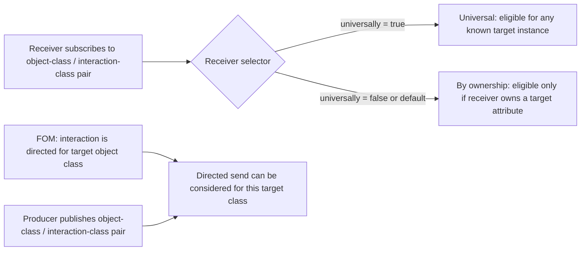
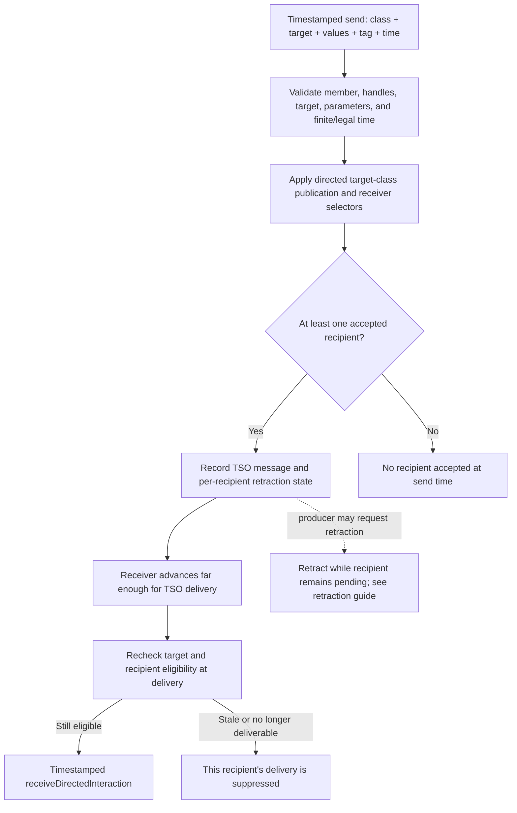

# HLA 1516.1-2025 Directed Interaction Flow Guide

This guide follows one directed-interaction send from the declarations that
make it legal to the receiver callback. The key to reading the flow is that
the sender chooses a **target object instance**; the RTI then selects zero or
more receiving federates. The target is not a recipient list.

## Scope and authority

- **Edition:** IEEE 1516.1-2025 only. The 2010 API/runtime is a separate
  compatibility stream; this guide does not infer equivalence or parity.
- **Umbra profiles surveyed:** embedded federation management and selected
  process-endpoint integration paths.
- **Normative authority:** the [official IEEE 1516.1-2025 Federate Interface
  Specification](https://standards.ieee.org/ieee/1516.1/6688/). The vendored
  2025 C++ interface labels both `sendDirectedInteraction` overloads as 6.14
  and `receiveDirectedInteraction` as 6.15. Consult the standard itself for
  normative rules; implementation and test links below describe Umbra behavior
  only.
- **Evidence limit:** a focused passing test establishes its exercised
  scenario, not complete support or conformance. No Requirements Lab rows are
  created or changed by this guide.

For the broader information path, see the [object and interaction information
flow overview](HLA-2025-OBJECT-AND-INTERACTION-INFORMATION-FLOW-GUIDE.md).
For shared timing/retraction and declaration details, use the [time
management](HLA-2025-TIME-MANAGEMENT-GUIDE.md), [TSO retraction
companion](HLA-2025-TSO-RETRACTION-FLOW-GUIDE.md), [DDM and
regions](HLA-2025-DATA-DISTRIBUTION-AND-REGIONS-FLOW-GUIDE.md), and [attribute
ownership](HLA-2025-ATTRIBUTE-OWNERSHIP-FLOW-GUIDE.md) guides. This document
keeps those adjacent state machines bounded rather than repeating them.

## Keep three identities separate

| Identity | Chosen by | Role in this service |
| --- | --- | --- |
| Producing federate | The caller of `sendDirectedInteraction` | Must satisfy membership, target-knowledge, and directed-publication checks. It is excluded from its own receiver fan-out. |
| Target object instance | The sender's `ObjectInstanceHandle` argument | Supplies the object class against which the directed-interaction declaration and receiver selector are evaluated. |
| Receiving federate(s) | The RTI's routing pass | Each candidate must have a live callback route, know the target, and satisfy an applicable directed subscription/selector. One send may reach multiple receivers. |

The target owner and sender need not be the same federate. A receiver can also
be the target owner without being the sender. Directed interactions therefore
combine an interaction payload with an object-instance context, but do not
turn into an attribute update.

## The declaration matrix and receiver selector

Two declarations participate on different sides:

- The producer uses `publishObjectClassDirectedInteractions(objectClass,
  interactionClasses)`. The declaration is associated with an **object class
  and interaction class**, not just the ordinary interaction publication.
- A receiver uses `subscribeObjectClassDirectedInteractions(objectClass,
  interactionClasses, universally)`. In Umbra, the default `false` selector is
  by-ownership; `true` is universal. An empty class set preserves the existing
  selector kind in the focused test below.
- The FOM must declare the interaction as valid for the target's registered
  object class. Umbra searches that class and its object-class ancestors.
- Umbra searches producer and receiver declarations from the target's
  registered class toward its ancestors. For receiver routing, the applicable
  subscription found along that walk supplies the selector; it is not a
  global interaction subscription.



The selector answers **which receivers may get a send for this target**. It
does not transfer ownership, make an unknown object known, or select the
interaction's parameters. The public API signatures are in the [2025 RTI
ambassador header](../../third_party/ieee1516.1-2025/include/RTI/RTIambassador.h#L495)
for publication and [subscription](../../third_party/ieee1516.1-2025/include/RTI/RTIambassador.h#L603).

## Receive-order send: validate, fan out, then dispatch

The receive-order path has two important moments: the registry plans candidate
recipients at send time, and Umbra rechecks an embedded candidate at callback
dispatch. That second boundary is why an unsubscribe, target departure, or
other intervening state change can make queued work stale.

```mermaid
sequenceDiagram
  autonumber
  actor Sender as Producing application
  participant SRTI as Sender RTI
  participant Registry as Federation registry
  participant RRTI as Eligible receiver RTI
  actor Receiver as Receiver application

  Sender->>SRTI: sendDirectedInteraction(class, target, parameters, tag)
  SRTI->>SRTI: Validate membership, handles, target knowledge, and parameters
  SRTI->>Registry: Plan receive-order directed interaction
  Registry->>Registry: Check target exists and directed class is valid for target class
  Registry->>Registry: Check producer's applicable object-class publication
  loop Each federation member other than sender
    Registry->>Registry: Check receiver membership, known target, and callback route
    Registry->>Registry: Resolve applicable subscription on target-class ancestry
    alt Universal selector
      Registry->>RRTI: Add receiver with projected parameters
    else By-ownership selector and receiver owns any target attribute
      Registry->>RRTI: Add receiver with projected parameters
    else No applicable selector or no target ownership
      Registry->>Registry: Do not add this receiver
    end
  end
  Note over Sender,Receiver: HLA_IMMEDIATE may call back inline; HLA_EVOKED waits for callback evocation
  RRTI->>Registry: Recheck recipient and target at callback boundary
  alt Candidate remains eligible
    Registry-->>RRTI: Current target/class/selector projection
    RRTI-->>Receiver: receiveDirectedInteraction(class, target, values, tag, transport, sender)
  else Candidate became stale
    Registry-->>RRTI: No current projection
    Note over RRTI,Receiver: Suppress stale callback
  end
```

In the embedded registry, a by-ownership candidate passes when it owns **at
least one attribute on the target instance**. The producing federate is not
considered a receiver. The sender's publication check and the receiver's
selector are separate checks: satisfying one does not imply the other.

The `receiveDirectedInteraction` overloads include the target object handle,
parameter values, user tag, transportation, and producing federate; the
timestamped overload additionally carries time, sent/received order, and an
optional retraction handle ([2025 callback declarations](../../third_party/ieee1516.1-2025/include/RTI/FederateAmbassador.h#L290)).
This callback payload is another reason to keep target context distinct from
recipient identity.

## Timestamped send is the same routing question at a different time boundary

Timestamped directed interaction still names one target and uses directed
publication/subscription selection. It adds time validation, a TSO queue, and
retraction state; it does not replace the target selector with a recipient
list. A receiver observes the callback only when its time-management rules
permit that queued delivery. See the dedicated [time-management
guide](HLA-2025-TIME-MANAGEMENT-GUIDE.md) and [retraction
guide](HLA-2025-TSO-RETRACTION-FLOW-GUIDE.md) for the complete grant and
per-recipient retraction machines.



This diagram intentionally abstracts the detailed time/lookahead legality,
grant ordering, and recipient delivery ledger. Those are not directed-routing
rules and already have a separate guide.

## What the surveyed tests demonstrate

| Scenario | Evidence and bounded observation |
| --- | --- |
| Universal versus by-ownership selector | [Embedded selector-kind case](../../cpp/tests/directed_interaction_subscription_kind_catch2.cpp#L112): the target owner and universal subscriber receive; a known non-owner using the default selector does not. It also checks the empty-class-set selector behavior. |
| Known target, sender excluded, declaration routing | [Embedded known-target case](../../cpp/tests/directed_interaction_known_target_catch2.cpp#L121): validates callback routing, target/payload context, and stale-work cases around declaration changes and target departure. |
| Parameter set is checked | [Directed parameter contract case](../../cpp/tests/directed_interaction_known_target_catch2.cpp#L318): rejects unavailable parameters and forwards exactly the supplied values. |
| Timestamped eligibility can be deferred | [Timestamped Delay Subscription Evaluation case](../../cpp/tests/delay_subscription_evaluation_timestamped_directed_interaction_catch2.cpp#L129): covers delayed selector evaluation for a TSO directed send. |
| TSO queue and retraction | [Timestamped directed-interaction retraction case](../../cpp/tests/timestamped_directed_interaction_retraction_catch2.cpp#L150): covers queue-before-grant behavior and retraction in the embedded profile. |
| Multiple process-endpoint receivers | [2025 process multi-recipient case](../../cpp/tests/ieee1516_2025_connection_directed_interaction_multi_recipient_catch2.cpp#L457): one directed send is delivered to two subscribed recipients through the configured process endpoint, in the callback models exercised by that case. |

The process-endpoint test establishes multi-recipient delivery for its tested
path. The deeper class-ancestry selector explanation and callback-time stale
work description above are primarily linked to the embedded registry and
should not be generalized to every process transport implementation without
checking that path's own revalidation code.

## Source map and known limits

- [2025 public directed service declarations](../../third_party/ieee1516.1-2025/include/RTI/RTIambassador.h#L495)
- [Embedded directed declaration and selector rules](../../cpp/src/internal/federation/federation_registry_directed_interactions.cpp#L14)
- [Embedded receive-order recipient predicate](../../cpp/src/internal/federation/federation_registry_directed_interactions.cpp#L139)
- [Embedded receive-order send planning](../../cpp/src/internal/federation/federation_registry.cpp#L1769)
- [Embedded send service paths](../../cpp/src/internal/runtime/umbra_rti_ambassador_directed_interaction_services.cpp#L44)
- [Embedded callback-time recipient recheck](../../cpp/src/internal/runtime/umbra_rti_ambassador_interaction_callbacks.cpp#L140)
- [Process directed-send service routing](../../cpp/src/internal/federation/process_federation_service_interaction_send.cpp#L657)

This survey is intentionally bounded to the send/declaration/receiver flow.
It does not claim to explain every exception mapping, MOM side effect,
transport implementation, producer resignation case, save/restore interaction,
or all time-management combinations. Follow the linked source and tests when
investigating one of those specific boundaries. The 2010 reference RTI remains
documented separately in the [2010 flow guide](HLA-2010-REFERENCE-RTI-FLOW-GUIDE.md).
