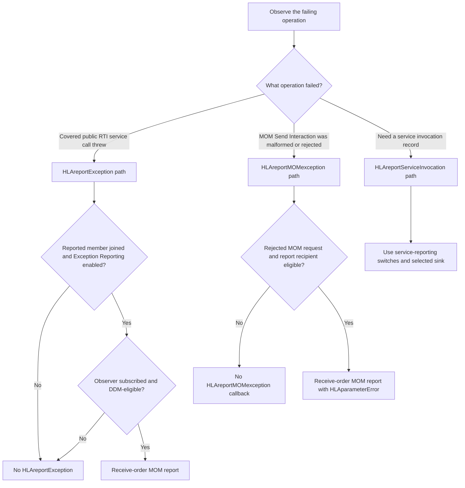
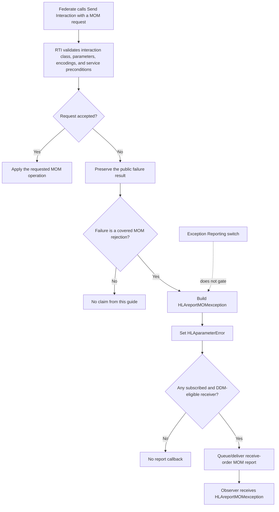

# IEEE 1516.1-2025 Exception-Reporting Flow Guide

This guide explains two RTI-originated MOM interactions that are easy to
conflate: `HLAreportException` and `HLAreportMOMexception`. It is a contributor
orientation to the current Umbra implementation, not a substitute for the
standard, a complete service-coverage inventory, or a conformance claim.

**Edition:** IEEE 1516.1-2025 / IEEE 1516.2-2025 MIM only. This guide does not
describe the 2010 reference-RTI stream or imply cross-edition equivalence.

**Implementation profile:** the management-enabled Umbra provider, including
embedded-federation and process-endpoint paths where noted. Branches and test
observations below are scoped to the linked implementation and cases.

## The three report paths to keep distinct

The word “exception report” is often used loosely. First identify what failed
and what the report is trying to tell the receiver:

| Path | What it describes | Selection rule in the covered Umbra paths | Does the reported member’s Exception Reporting switch gate it? |
| --- | --- | --- | --- |
| `HLAreportServiceInvocation` | A service invocation record (success or failure), optionally routed to the file or interaction sink. | Service-reporting configuration and destination/subscription rules; see the [service-invocation guide](HLA-2025-SERVICE-INVOCATION-REPORTING-FLOW-GUIDE.md). | No; this is a separate reporting feature. |
| `HLAreportException` | An exception raised by a covered public RTI service call. | The reported member’s Exception Reporting switch must be enabled; an observer must also be eligible for the report interaction. | **Yes.** |
| `HLAreportMOMexception` | A MOM interaction that is malformed or rejected by MOM/service preconditions. | Subscription to the report interaction, plus the implementation’s recipient/DDM rules. | **No.** |

The last column is about this exception-report route, not about whether the
original service call succeeds. A caller can still receive its public typed
exception when a report is suppressed. The report is advisory traffic and must
not replace that original outcome.

## A quick decision map



The diagram is an orientation aid, not a universal rule for every RTI service
or every malformed MOM class. `HLAreportException` is emitted only at public
API catch sites that call the exception-report hook. The linked tests exercise
specific such sites and MOM inputs.

## Route A: a covered public service raises an exception

```mermaid
sequenceDiagram
    participant App as Calling federate
    participant API as Umbra 2025 API
    participant Hook as emitExceptionReport
    participant Authority as Embedded registry or process service
    participant Observer as Eligible subscribed federate

    App->>API: Invoke covered service
    API->>API: Catch original typed exception at covered service boundary
    API->>Hook: Report at instrumented catch site
    Hook->>Hook: Require joined identity; format exception name and detail
    alt Not joined, no process client, or report hook unavailable
        Hook-->>Hook: Stop advisory path
    else Embedded federation
        Hook->>Authority: Plan HLAreportException
        Authority->>Authority: Check member and Exception Reporting switch
        Authority->>Authority: Select subscribed, DDM-eligible receive-order recipients
    else Process endpoint
        Hook->>Authority: report_service_exception(federation, member, service, exception)
        Authority->>Authority: Recheck authoritative member and switch state
        Authority->>Authority: Select subscribed, DDM-eligible recipients
    end
    alt No eligible report or no recipients
        Authority-->>Observer: No callback
    else Eligible recipient remains at delivery/admission
        Authority-->>Observer: HLAreportException (receive order, reliable)
        Observer->>Observer: Invoke receiveInteraction callback
    end
    API-->>App: Original typed service exception remains the public outcome
    Note over API,Observer: Callback scheduling is separate; process push delivery may be observed before its request response.
    Note over API,Hook: Reporting is best effort; it does not replace the original service exception.
```

### Read this flow in phases

1. **The service result remains primary.** A covered service catches the
   public 2025 `Exception` and invokes the report hook. The report hook is
   `noexcept` and catches failures in its own planning/transport work. The
   caller still observes the service exception; report delivery is not a
   second result channel for the caller.
2. **The exception switch belongs to the member being reported.** A successful
   report plan requires that member to still belong to the federation and that
   its Exception Reporting switch be on. The default tested state is off.
3. **Switch-on does not mean broadcast.** The reporting interaction itself
   must be subscribed to, and its `HLAfederate`-scoped endpoint/region and
   parameter projection determine eligible recipients. A matching parent
   subscription may receive only inherited parameters.
4. **The process endpoint treats the server as authority.** The binding sends
   the exception data to the process service; the service re-reads its own
   registry instead of trusting a cached client switch. Prepared report events
   carry private routing identity so delivery can be rechecked against current
   membership, switch, subscription, and recipient state. That identity is
   not an application parameter or the callback’s producing-federate handle.
5. **Callback timing is separate from report eligibility.** Push versus pull
   event transport and `HLA_EVOKED` versus `HLA_IMMEDIATE` callback models
   affect when delivery is observed. An unsubscribe or switch change before
   callback admission can suppress a prepared report in the covered process
   path. The report being receive-order does not create a new timestamped
   delivery rule.

### `HLAreportException` payload at the callback boundary

The implementation encodes the inherited `HLAfederate` reference together
with the leaf parameters `HLAservice` and `HLAexception`. The callback is an
RTI-originated receive-order interaction using reliable transportation, an
empty user tag, an invalid/default producer handle, and no sent-region set in
the focused cases. Do not mistake the private “reported member” routing value
for the callback producer: the member being described is carried by
`HLAfederate`.

## Route B: a MOM interaction is rejected



The current focused cases use `HLAsetSwitches` and show two distinct
rejection classes:

| Rejection | Example in the focused cases | `HLAparameterError` in the report |
| --- | --- | --- |
| Malformed request | No required parameter, unknown parameter, or malformed parameter value. | `true` |
| Well-formed request rejected by a service precondition | Attempt to enable Service Reporting while the relevant report interaction is subscribed. | `false` |

`HLAparameterError` describes the rejection category; it does not say whether
the API caller receives an exception. In these cases the caller receives the
failure while eligible observers can receive the distinct MOM report. In the
process endpoint, report planning/delivery and the rejected response share a
transport boundary; if the reporting send itself fails, the process path can
surface an internal transport failure. Do not generalize best-effort behavior
from the embedded `noexcept` hook to every process failure mode.

### `HLAreportMOMexception` payload and recipient projection

The leaf report includes inherited `HLAfederate` plus `HLAservice`,
`HLAexception`, and `HLAparameterError`. The focused tests decode the
`HLAfederateHandle` reference encoding rather than treating it as an integer.
An observer subscribed to the report subclass receives all applicable
parameters; a subscription to the parent report class can project only the
inherited `HLAfederate` parameter. The tested callback metadata is RTI-owned,
receive-order, reliable, empty-tag, invalid/default producer, and without sent
regions.

`HLAreportMOMexception` is independent of the subject's Exception Reporting
switch. A test intentionally leaves that switch off and still observes the
MOM rejection report. The report interaction subscription and current recipient
eligibility still matter; “not switch-gated” does not mean “broadcast.”

## One concrete trace

The process service-exception case makes the two independent controls visible:

1. Join with Exception Reporting off.
2. Fail `Get Object Class Handle` for an unknown object class. The caller gets
   `NameNotFound`; after callbacks are drained, the observer has no report.
3. Enable Exception Reporting and repeat the failure. A subscribed, eligible
   observer receives one `HLAreportException` with the original service label
   and exception text.
4. Disable the switch through the MOM `HLAsetSwitches` interaction. Another
   failure produces no new exception report; re-enable it and reporting
   resumes.
5. Disable callbacks, create a pending report, unsubscribe before callback
   admission, then re-enable and drain. The stale report is suppressed; a new
   report is delivered after resubscription.
6. Force the report operation itself to fail. The public failed lookup still
   exposes the original typed `NameNotFound`, rather than replacing it with
   report-transport failure.

The linked scenario repeats under evoked/immediate callbacks and process
pull/push event delivery. These are tested combinations, not a proof that every
interleaving or callback scheduler has identical behavior.

## Normative source, implementation evidence, and a known source ambiguity

- **Normative edition:** use [IEEE 1516.1-2025](https://standards.ieee.org/ieee/1516.1/6688/)
  and the matching 2025 OMT/MIM source for MOM declarations and the exception
  reporting behavior in §11.5.1. The IEEE page identifies the active 2025
  edition and its supersession of 2010; it is not a substitute for the licensed
  clause text.
- **Vendored model source:**
  [`HLAstandardMIM-2025.xml`](../../third_party/ieee1516.2-2025/resources/mim/HLAstandardMIM-2025.xml)
  supplies the interaction hierarchy, parameters, dimensions, and delivery
  declarations consumed by this implementation.
- **Known wording ambiguity:** the vendored MIM's `HLAservice` semantics under
  `HLAreportException` appear to describe `HLAreportMOMexception`, including
  the latter interaction name. The issue and bounded interpretation are
  recorded in [MOM service reporting design](MOM-SERVICE-REPORTING-DESIGN.md).
  Keep the two routes separate in code and explanation; do not silently repair
  or reinterpret the official artifact in this guide.
- **Implementation is not normative text:** source links below identify the
  current Umbra paths. A comment or passing test establishes implementation
  behavior only for the stated scenario.

## Evidence map

### `HLAreportException`

- [2025 ambassador report hook and callback encoder](../../cpp/src/internal/runtime/umbra_rti_ambassador_mom_service_report_interaction.cpp#L184)
- [Embedded report planning, switch check, recipients, and callback-time recheck](../../cpp/src/internal/federation/federation_registry.cpp#L1661)
- [Process endpoint authoritative switch/recipient planning](../../cpp/src/internal/federation/process_federation_service_reporting.cpp#L107)
- [Process callback-time recheck handler](../../cpp/src/internal/federation/process_federation_service_reporting.cpp#L398)
- [Process client exception-report recheck](../../cpp/src/internal/federation/process_federation_client_federation_management.cpp#L502)
- [Public process exception report, switch changes, subscription changes, callback timing, and preserved original exception](../../cpp/tests/ieee1516_2025_connection_process_mom_service_exception_report_catch2.cpp#L460)
- [Concurrent report recheck and public request ownership](../../cpp/tests/ieee1516_2025_connection_process_exception_report_concurrency_catch2.cpp#L460)
- [Exception Reporting switch through public and MOM controls](../../cpp/tests/ieee1516_2025_connection_process_mom_exception_reporting_switch_catch2.cpp#L459)

### `HLAreportMOMexception`

- [Embedded registry route and recipient selection](../../cpp/src/internal/federation/federation_registry_mom_exception_reporting.cpp#L19)
- [Process Send Interaction validation and rejected-request reporting](../../cpp/src/internal/federation/process_federation_service_interaction_send.cpp#L183)
- [Separate report payload types and switch-gating distinction](../../cpp/src/internal/federation/federation_registry_mom_report_types.hpp#L80)
- [Embedded malformed/rejected MOM interactions, including parameter-error classification](../../cpp/tests/ieee1516_2025_federation_mom_exception_report_catch2.cpp#L4)
- [Process malformed `HLAsetSwitches` report with Exception Reporting still off](../../cpp/tests/ieee1516_2025_connection_process_mom_malformed_exception_catch2.cpp#L459)
- [Process inherited `HLAfederate`, four-parameter payload, parent projection, both callback models and event transports](../../cpp/tests/ieee1516_2025_connection_process_mom_exception_report_parameters_catch2.cpp#L460)

## Limits and handoff

- The guide does not claim every public service catch site is instrumented or
  that every public service exception should generate `HLAreportException`.
- It does not cover the full `HLAreportServiceInvocation` payload/file/report
  lifecycle; use its separate [guide](HLA-2025-SERVICE-INVOCATION-REPORTING-FLOW-GUIDE.md).
- Focused MOM tests do not cover every MOM interaction family, malformed
  encoding, rejection policy, remote failure, or all concurrency schedules.
- Callback ordering observed in the tests is Umbra behavior for those cases;
  it is not presented here as a universal normative ordering guarantee.
- The 2010 reference RTI has its own [separate bounded flow guide](HLA-2010-REFERENCE-RTI-FLOW-GUIDE.md).
  This 2025 guide does not infer that the 2010 stream emits either report.
- No Requirements Lab rows were edited or added for this documentation work.
  This guide neither changes requirement mappings nor establishes conformance.

Before calling this guide visually reviewed, render each Mermaid diagram with
GitHub's Markdown/Mermaid renderer or an approved local renderer. Static link
and fence checks alone do not verify diagram layout. Continue the collection
with the next distinct high-value behavior area in
[the flow-guide backlog](HLA-BEHAVIOR-FLOW-GUIDES.md), without crossing the
2010/2025 boundary.
