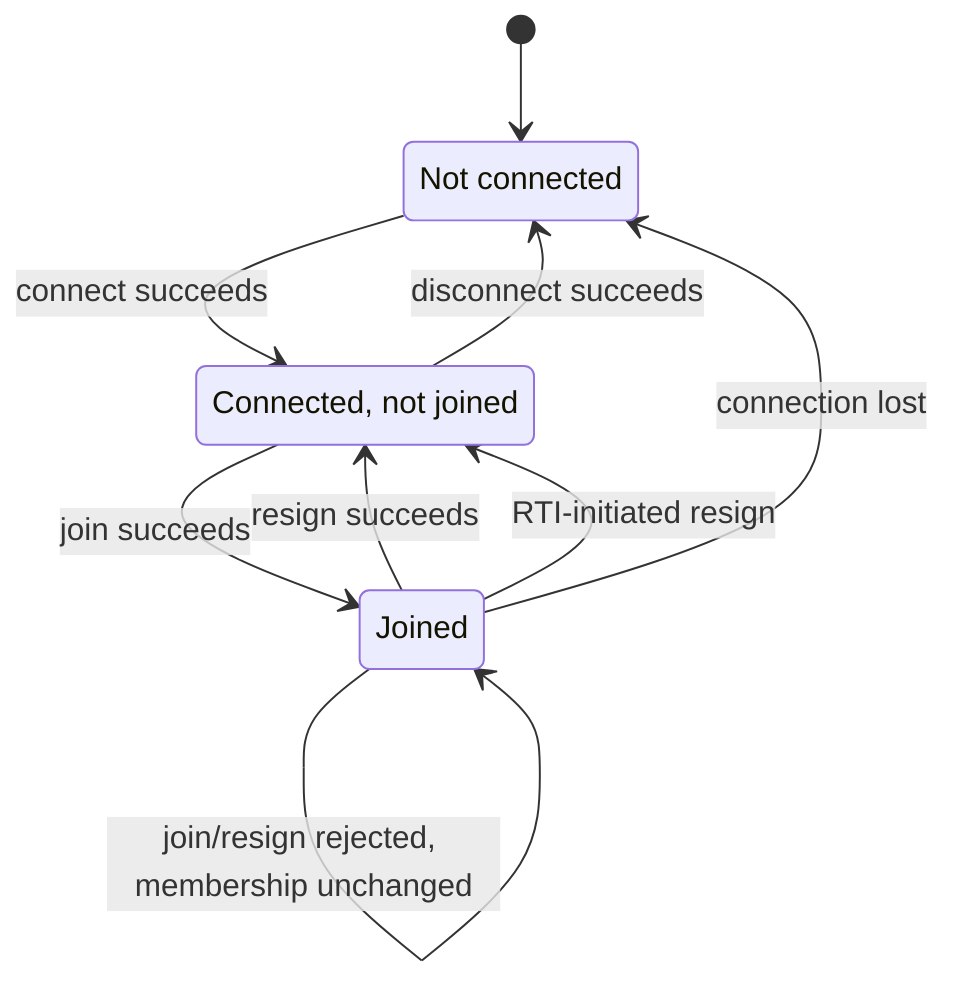
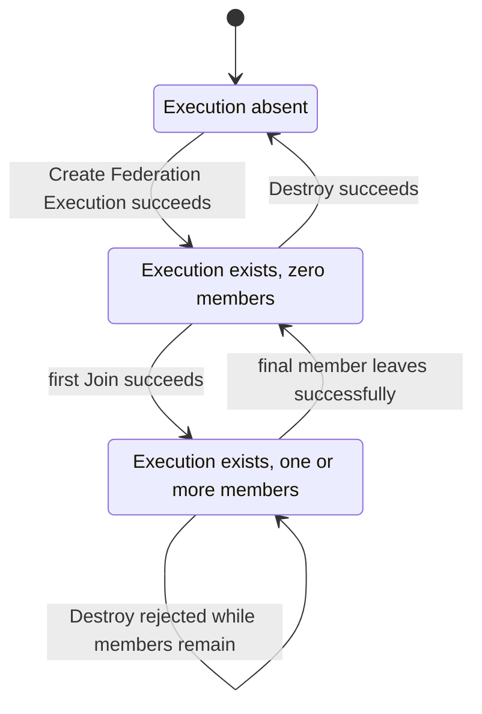
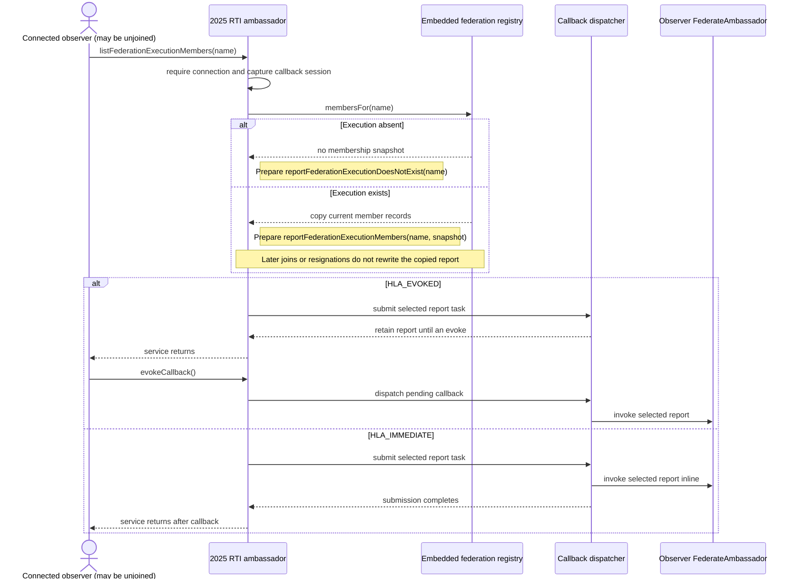
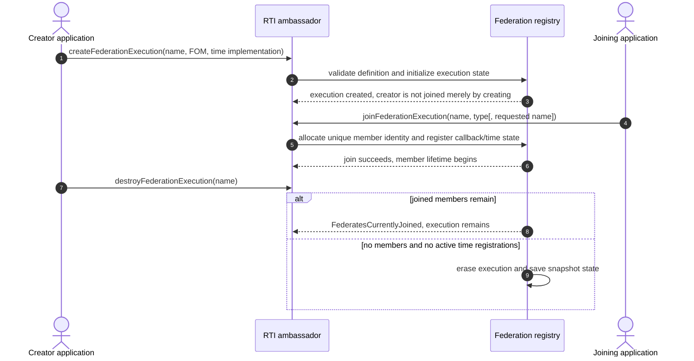
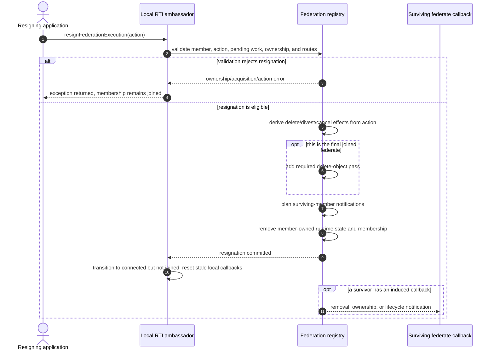
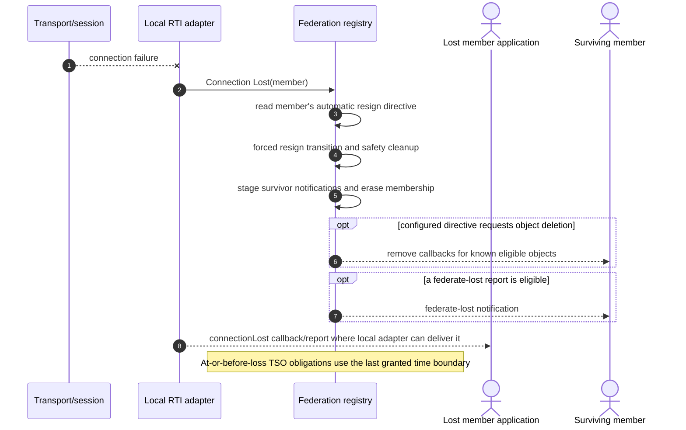
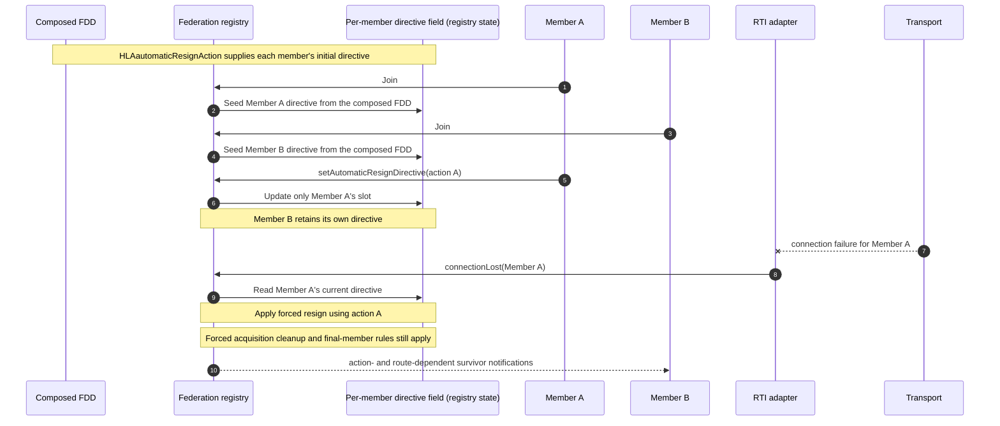
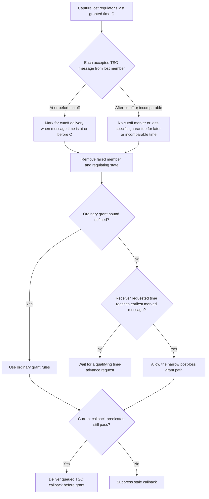

# IEEE 1516.1-2025 Federation and Federate Lifecycle

This guide separates the lifetime of an RTI ambassador, a joined federate, and
the federation execution itself. It then traces how voluntary resignation and
connection loss remove membership, because those exits have different
validation, cleanup, and callback paths.

## Scope and authority

- **Edition boundary:** IEEE 1516.1-2025 only. The 2010 API/runtime and its
  tests remain a separate compatibility stream; this guide makes no
  cross-edition equivalence claim.
- **Implementation boundary:** the embedded federation-management development
  profile and selected 2025 integration tests. Process-endpoint service
  handling is linked where useful but is not claimed to have identical
  lifecycle coverage.
- **Normative authority:** the [official IEEE 1516.1-2025 Federate Interface
  Specification](https://standards.ieee.org/ieee/1516.1/6688/). Check exact
  service clauses before using this guide as a requirement or conformance
  statement. Clause notes already present in source comments are navigation
  clues, not a substitute for that standard.
- **Evidence rule:** implementation links describe current Umbra behavior;
  tests establish only their named scenario. This guide is explanatory
  documentation, not new Requirements Lab evidence.

Related state machines stay separate: see the [time-management guide](HLA-2025-TIME-MANAGEMENT-GUIDE.md),
[object and interaction information-flow guide](HLA-2025-OBJECT-AND-INTERACTION-INFORMATION-FLOW-GUIDE.md),
[ownership guide](HLA-2025-ATTRIBUTE-OWNERSHIP-FLOW-GUIDE.md), and
[save/restore guide](HLA-2025-FEDERATION-SAVE-RESTORE-FLOW-GUIDE.md). The
separate [2025 authorization guide](HLA-2025-AUTHORIZATION-FLOW-GUIDE.md)
traces credential gates before Create, Destroy, and Join; successful
authorization is not a federation-state transition by itself.

## Three lifetimes, not one

Keep these identities distinct:

1. **RTI ambassador connection:** whether this local ambassador is connected
   to its RTI session.
2. **Federate membership:** whether that ambassador currently represents a
   member of a particular federation execution.
3. **Federation execution:** whether the named execution exists in RTI state.

Creating an execution does not itself join it. Resigning ends one member
lifetime, but does not necessarily destroy the execution. A member that
successfully resigns can connect again and join a new member lifetime. In the
current embedded implementation, an execution with no joined federates remains
available until an explicit Destroy succeeds.

### Local ambassador/federate state

The runtime has a small local lifecycle state machine. A failed join or resign
does not commit the corresponding transition. Connection loss is different
from voluntary resignation: the local connection state becomes disconnected
while the registry performs forced member cleanup.

This diagram is local to an RTI ambassador. It does not describe whether the
federation execution exists or how other members are affected.
For the detailed Connect preconditions, configuration result, callback setup,
and post-resign Disconnect teardown, see the
[2025 connection/configuration companion](HLA-2025-CONNECTION-AND-CONFIGURATION-FLOW-GUIDE.md).

### Federation-execution state

The empty-execution state is a real, useful state, not a synonym for
“destroyed.” It allows a later federate to join the same execution. The 2025
final-member tests additionally show the implementation's mandatory object
cleanup at that boundary; see the resignation section below.

## Federation member listing reports a snapshot

`listFederationExecutionMembers` is an observation, not a Join or a membership
subscription. In the embedded 2025 path, a connected ambassador can request a
list without itself joining the named execution. The adapter captures the
current members, builds a report, and submits a callback task. If the named
execution is absent, it submits `reportFederationExecutionDoesNotExist`
instead; absence is not a synchronous `FederationExecutionDoesNotExist` throw
in this path. A disconnected caller is rejected synchronously with
`NotConnected` before a report is submitted.

The captured member vector is a point-in-time snapshot. With `HLA_EVOKED`,
membership can change after the service call but before the application evokes
the report, so the delivered list need not describe callback-time membership.
The focused test checks the EVOKED success and missing-execution callbacks. The
test does not change membership between request and evoke, so snapshot
staleness is inferred from the source's copy-before-dispatch order rather than
demonstrated as a race scenario. The
adapter uses the shared dispatcher, whose immediate model drains during
`submit`, but the listing test's immediate-mode assertion exercises
`listFederationExecutions`, not this member-list service; direct IMMEDIATE
coverage for `listFederationExecutionMembers` remains a test gap.

The pinned 2025 C++ API labels the request §4.9 and the success / missing
callbacks §4.10 / §4.11 ([request](../../third_party/ieee1516.1-2025/include/RTI/RTIambassador.h#L194),
[member report](../../third_party/ieee1516.1-2025/include/RTI/FederateAmbassador.h#L54),
[missing-execution report](../../third_party/ieee1516.1-2025/include/RTI/FederateAmbassador.h#L61)).
These clause labels and interface shapes orient the reader; the implementation
flow below is source-observed behavior, not a complete normative clause
interpretation.

This query does not create a lasting member feed: a later Join or Resign is not
automatically reported by this request. Ask again for a new snapshot. The
embedded source and focused EVOKED case are linked in the evidence map; no
equivalent process-endpoint member-list path is claimed here.

## Create, join, and destroy

Creation validates a federation definition and establishes federation-owned
catalog, handle directories, switches, and time-coordination state. Join
creates a new member identity and registers that member with the execution's
coordination and callback routes. Destroy is a separate operation and is
rejected while members remain (or the time coordinator is not empty).

In this implementation, additional-FOM joins reconcile handle directories
against the replacement catalog and cannot silently change the time
implementation while existing members are joined. These are useful review
boundaries, not an exhaustive account of FOM merge rules; composition belongs
to its own documentation and tests.

The ordinary 2025 federation-lifecycle scenario exercises invalid creation
designators, duplicate execution creation, duplicate member names, disconnect
while joined, destroy while joined, a valid additional-FOM join, invalid
ResignAction rejection, successful resignations, and explicit destroy after
the members leave. See the evidence table for the exact source and test.

## Voluntary resignation: validate before removing membership

A resignation is not just a local state toggle. Umbra first validates the
action and current member state, then evaluates pending ownership work,
attribute ownership, delete privilege, and callback routes needed by that
action. A rejected resignation leaves the member joined. On success the
registry applies the selected cleanup, removes the member from time and
declaration ledgers, clears its reservations/regions and per-instance
knowledge, then erases the member identity. The local ambassador transitions
out of the joined state and discards callbacks that are stale for that
departing member; callbacks prepared for survivors are delivered on their own
routes.

### ResignAction effects in the current implementation

This is a compact reading aid, not the full normative decision table. Exact
preconditions and action ordering must be checked in the standard and source.
The ownership-specific pending-acquisition guard and member-scoped
reject-versus-cancel path are diagrammed in the [ownership persistence and
resignation companion](HLA-2025-OWNERSHIP-PERSISTENCE-AND-RESIGNATION-FLOW-GUIDE.md#2-resignation-with-pending-acquisition-work);
the table here stays focused on object and divestiture effects.

| Action family | Current implementation effect | Important guard or caveat |
| --- | --- | --- |
| NO_ACTION | No requested object deletion or unconditional divestiture. | A voluntary resign can be rejected while the member still owns attributes or has certain pending acquisitions. |
| UNCONDITIONALLY_DIVEST_ATTRIBUTES | Request attribute divestiture without requesting object deletion. | Ownership callbacks and pending negotiations affect the path; see the ownership guide. |
| DELETE_OBJECTS | Request deletion of objects for which the member holds delete privilege. | May be rejected if owned attributes would remain on an object it cannot delete. |
| DELETE_OBJECTS_THEN_DIVEST | Delete eligible objects, then divest remaining owned attributes. | Its combination of effects differs from DELETE_OBJECTS alone. |
| CANCEL_PENDING_OWNERSHIP_ACQUISITIONS | Cancel pending acquisition work. | Does not by itself request object deletion or general divestiture. |
| CANCEL_THEN_DELETE_THEN_DIVEST | Combine acquisition cancellation, eligible object deletion, and divestiture. | Keep each phase visible; do not treat it as an alias for another action. |

For the current implementation, the last joined member causes a delete-object
pass even if it supplied NO_ACTION. This does not mean the federation
execution itself is destroyed. In the focused test, the last member resigns
with NO_ACTION, rejoins the same still-existing execution under a fresh member
lifetime, and reserves the name of the object removed during final-member
cleanup.

## Connection loss: forced resignation is a different entry path

On connection loss, the registry uses that member's configured automatic
resign directive and calls the same central resign transition with a forced
loss flag. Forced cleanup has extra safety rules: pending acquisition work is
cancelled even if the configured action would not cancel it, and attributes
still owned by the departing member are removed from its ownership set. If
this is the final member, the final-member delete pass still applies.

The callback to the lost application is local adapter reporting; it is not a
message sent over the connection that has already failed. Whether survivors
receive removal or federate-lost notifications depends on the configured
directive, known objects, support switches, callback routes, and profile.
Connection-loss TSO cutoff behavior is deliberately only marked here; the
[time-management guide](HLA-2025-TIME-MANAGEMENT-GUIDE.md) owns timestamp
eligibility and delivery ordering.

### The automatic directive is seeded per member, then overridden per member

In the current embedded implementation, the composed FDD's
`HLAautomaticResignAction` support-switch value seeds each membership when it
joins. `getAutomaticResignDirective` reads that member's value and
`setAutomaticResignDirective` changes only the caller's membership; it does
not rewrite the federation default or a peer's directive. When a transport
loss is reported, the registry reads the lost member's current value and
passes it into the forced resignation transition. Forced loss still cancels
pending acquisition work regardless of that selected action, and final-member
departure still adds its separate delete-object pass.

The focused support-switch case observes both joins seeded from the FDD and
one member's setter leaving its peer unchanged. A separate connection-loss
case sets `DELETE_OBJECTS` immediately before faulting that member's transport
and observes the configured action's object-removal result. These selected
embedded 2025 scenarios do not establish process-profile parity or the full
normative ResignAction decision table.

### A lost regulator's TSO cutoff is a narrow exception

Umbra captures the lost time-regulating member's **last granted logical
time** before forced resignation removes its temporal state. For each of that
member's accepted TSO messages, the embedded registry marks loss-specific
delivery work only when the message time is comparable and `message time <=
cutoff`. A later message receives no guarantee from this cutoff rule; that is
not the same as proving every later message is immediately discarded. The
capture and marker are visible in the [forced-resign transition](../../cpp/src/internal/federation/federation_registry_resign_lifecycle.cpp#L29)
and its [TSO ledger update](../../cpp/src/internal/federation/federation_registry_resign_lifecycle.cpp#L1001).

Removing the regulator can leave the ordinary grant bound undefined. In that
case, a constrained receiver may use the narrow post-loss grant path only when
it has a time-advance request whose requested time reaches the earliest
pending marked message. A receiver that had not requested time before the loss
can still make a later request; the [grant exception](../../cpp/src/internal/federation/federation_registry.cpp#L1181)
is not a general way for an unregulated federate to receive arbitrary TSO
traffic. The source identifies this as the 2025 clause 4.4 behavior; the flow
below documents Umbra's implementation, not an independent interpretation of
the normative clause.
This diagram follows the embedded registry and its embedded transport-fault
tests only; selected process-endpoint lifecycle coverage elsewhere in this
guide does not establish equivalent process TSO-cutoff behavior.

The exact-time and strictly-before tests exercise delivery at timestamps 6
and 5 against a lost regulator's last grant at 6; a separate test establishes
that a receiver can request time after the loss and then reach a marked
timestamp. These focused tests assert the TSO callback precedes the associated
grant callback. A further test unsubscribes after loss: the cutoff does not
override callback-time eligibility, so the attribute reflection is suppressed
and object cleanup follows its own later boundary. See the [cutoff test](../../cpp/tests/ieee1516_2025_connection_lost_tso_cutoff_catch2.cpp#L5),
[strictly-before test](../../cpp/tests/ieee1516_2025_connection_lost_tso_cutoff_less_than_catch2.cpp#L5),
[later-request test](../../cpp/tests/ieee1516_2025_connection_lost_tso_cutoff_later_tar_catch2.cpp#L5),
and [stale-subscription cleanup test](../../cpp/tests/connection_loss_attribute_update_tso_suppressed_cleanup_catch2.cpp#L154).
The TSO and retraction guides still own general timestamp legality, recipient
ledger transitions, and Retract behavior.

## What is state that survives an exit?

| Boundary | State that ends or changes | State that is not implied to end |
| --- | --- | --- |
| Successful voluntary resign | This member identity, its declarations/routes/time role, its reservations and owned regions, and local queued callbacks. Action-dependent objects/ownership and survivor notifications are processed. | The federation execution, unless Destroy is separately accepted. |
| Connection loss | The member is forcibly removed using its automatic resign directive plus forced safety cleanup. | The federation execution; remaining members continue. |
| Final-member departure | The execution reaches zero joined members; the mandatory object cleanup path runs. | The execution itself; a new member may join before explicit Destroy. |
| Successful Destroy | The execution and associated save snapshot state are erased. | Other RTI ambassador connections and unrelated federation executions. |

These distinctions are particularly useful when debugging “I resigned but
could not re-create,” “the peer still received removal,” or “the final member
left but the federation name still exists.”

## Evidence map: implementation versus exercised scenarios

| Topic | Current implementation entry points | Focused test evidence |
| --- | --- | --- |
| Local ambassador lifecycle | [FederateLifecycle transitions](../../cpp/src/internal/federation/federate_lifecycle.cpp#L11), [public lifecycle adapter](../../cpp/src/internal/runtime/umbra_rti_ambassador_federation_lifecycle.cpp#L147) | [federation create/join/resign/destroy scenario](../../cpp/tests/ieee1516_2025_federation_resign_lifecycle_catch2.cpp#L4) |
| Execution and membership registry | [create/destroy/join](../../cpp/src/internal/federation/federation_registry_membership_lifecycle.cpp#L65), [process service handlers](../../cpp/src/internal/federation/process_federation_service_lifecycle.cpp#L130) | [federation create/join/resign/destroy scenario](../../cpp/tests/ieee1516_2025_federation_resign_lifecycle_catch2.cpp#L4) |
| Federation member-list snapshot and callback | [embedded query adapter](../../cpp/src/internal/runtime/umbra_rti_ambassador.cpp#L2576), [callback dispatcher submission](../../cpp/src/internal/callbacks/callback_dispatcher.cpp#L121) | [listing test entry](../../cpp/tests/federation_listing_catch2.cpp#L72), [EVOKED member snapshot](../../cpp/tests/ieee1516_2025_federation_listing_test_support.hpp#L85), [missing-execution callback](../../cpp/tests/ieee1516_2025_federation_listing_test_support.hpp#L94); HLA_IMMEDIATE is exercised there only for the sibling execution-list service. |
| Voluntary ResignAction | [resign transition and guards](../../cpp/src/internal/federation/federation_registry_resign_lifecycle.cpp#L13), [public resignation adapter](../../cpp/src/internal/runtime/umbra_rti_ambassador_federation_lifecycle.cpp#L800) | [final-member NO_ACTION cleanup and rejoin](../../cpp/tests/ieee1516_2025_embedded_resign_action_final_federate_catch2.cpp#L4), [delete/removal on resignation](../../cpp/tests/ieee1516_2025_embedded_resign_action_delete_objects_catch2.cpp#L4) |
| Automatic directive scope and connection loss | [Pinned 2025 get/set API](../../third_party/ieee1516.1-2025/include/RTI/RTIambassador.h#L2135), [FDD default copied into each member at Join](../../cpp/src/internal/federation/federation_registry_membership_lifecycle.cpp#L389), [get adapter](../../cpp/src/internal/runtime/umbra_rti_ambassador_support_switches.cpp#L17), [set adapter](../../cpp/src/internal/runtime/umbra_rti_ambassador_support_switches.cpp#L72), [member directive registry state](../../cpp/src/internal/federation/federation_registry_control_state.cpp#L255), [Connection Lost reads the current member value](../../cpp/src/internal/federation/federation_registry.cpp#L410), [forced cleanup and action phases](../../cpp/src/internal/federation/federation_registry_resign_lifecycle.cpp#L13) | [FDD seeding and peer-isolated override](../../cpp/tests/support_switch_state_catch2.cpp#L4), [configured DELETE_OBJECTS applied on transport loss](../../cpp/tests/ieee1516_2025_connection_lost_automatic_delete_resign_directive_catch2.cpp#L5), [final-member connection loss](../../cpp/tests/ieee1516_2025_connection_lost_final_federate_directive_two_catch2.cpp#L5) |
| Connection-loss TSO cutoff | [Capture and `<=` message marker](../../cpp/src/internal/federation/federation_registry_resign_lifecycle.cpp#L29), [post-loss grant exception](../../cpp/src/internal/federation/federation_registry.cpp#L1181) | [At-cutoff and before-cutoff delivery](../../cpp/tests/ieee1516_2025_connection_lost_tso_cutoff_catch2.cpp#L5), [request after loss](../../cpp/tests/ieee1516_2025_connection_lost_tso_cutoff_later_tar_catch2.cpp#L5), [callback-time stale suppression](../../cpp/tests/connection_loss_attribute_update_tso_suppressed_cleanup_catch2.cpp#L154) |

Selected embedded 2025 action tests make the table's boundaries concrete:

- **Pending-work guard and cancellation:** [rejection followed by the
  combined action](../../cpp/tests/ieee1516_2025_embedded_resign_action_pending_acquisition_catch2.cpp#L4),
  [regular-request cancellation](../../cpp/tests/ieee1516_2025_embedded_resign_action_cancel_pending_acquisition_catch2.cpp#L4),
  [If-Available cancellation](../../cpp/tests/ieee1516_2025_embedded_resign_action_cancel_if_available_pending_catch2.cpp#L4),
  and [negotiated-transfer cancellation](../../cpp/tests/ieee1516_2025_embedded_resign_action_cancel_negotiated_pending_catch2.cpp#L4).
- **Object and ownership effects:** [delete only](../../cpp/tests/ieee1516_2025_embedded_resign_action_delete_objects_catch2.cpp#L4),
  [delete then divest](../../cpp/tests/ieee1516_2025_embedded_resign_action_delete_then_divest_catch2.cpp#L4),
  [unconditional divestiture](../../cpp/tests/ieee1516_2025_embedded_resign_action_divestiture_catch2.cpp#L4),
  and the [final-member `NO_ACTION` pass](../../cpp/tests/ieee1516_2025_embedded_resign_action_final_federate_catch2.cpp#L4).

These are selected scenarios, not a full action-by-pending-ledger matrix or a
substitute for the normative decision table.

## Deliberate limits and next evidence

This guide does not specify the full IEEE action decision table, connection
failure detection policy for every transport, callback ordering for all
survivor notifications, every cleanup ledger, or complete MOM reporting.
Save/restore interlocks and general TSO cutoff details stay in their dedicated
guides. The cutoff flow records the implementation's clause 4.4 interpretation;
confirm the exact normative wording from the full standard before using it as
conformance guidance.
The 2010 lifecycle behavior is described separately in the [2010 reference-RTI
guide](HLA-2010-REFERENCE-RTI-FLOW-GUIDE.md); its different implementation
profile does not imply parity with these 2025 transitions or tests.

Callback queues, HLA_EVOKED versus HLA_IMMEDIATE behavior, re-entry boundaries,
delivery commit points, and ordering interactions with TSO and federation
callbacks are covered in the separate [callback and service-ordering guide](HLA-2025-CALLBACK-AND-SERVICE-ORDERING-FLOW-GUIDE.md).
The open work for this lifecycle guide is to render its new cutoff diagram and
the other local-only or revised diagrams in a GitHub-compatible preview, then
record parse and readability results in the [flow-guide backlog](HLA-BEHAVIOR-FLOW-GUIDES.md).
Verify exact clause 4.4 wording against the full official standard before
presenting the implementation flow as normative guidance. A 2010 lifecycle
survey remains a separate future topic; do not infer it from this 2025 guide.
Do not edit the HLA Requirements Lab during this Umbra documentation work.
