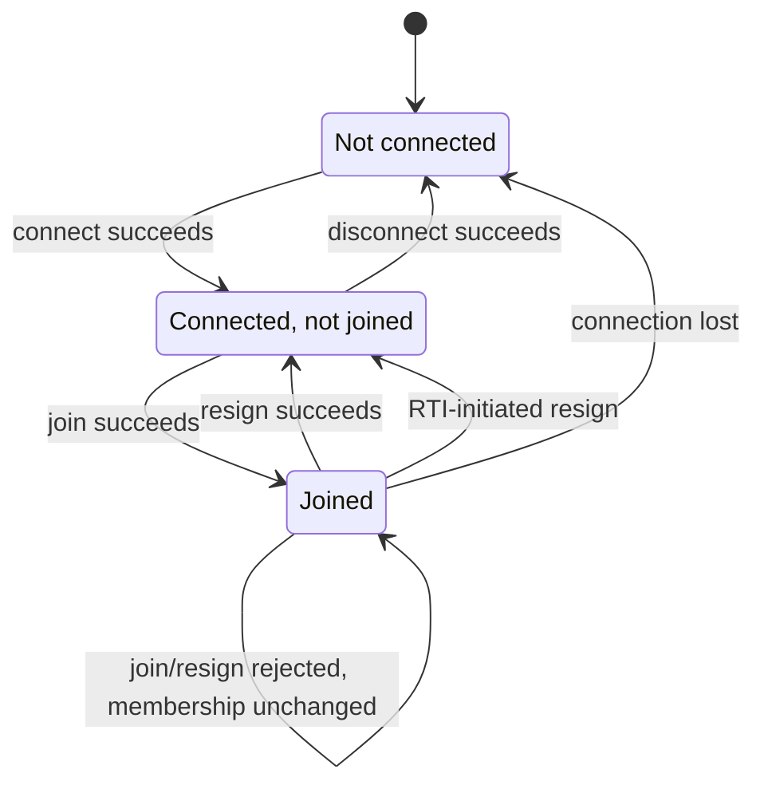
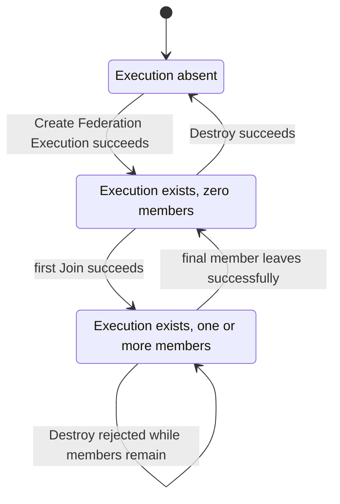
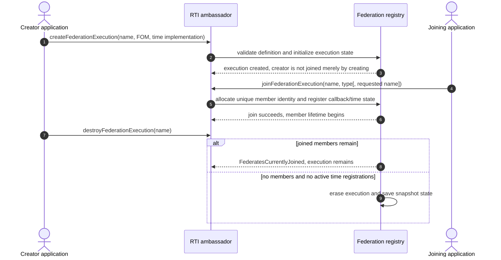
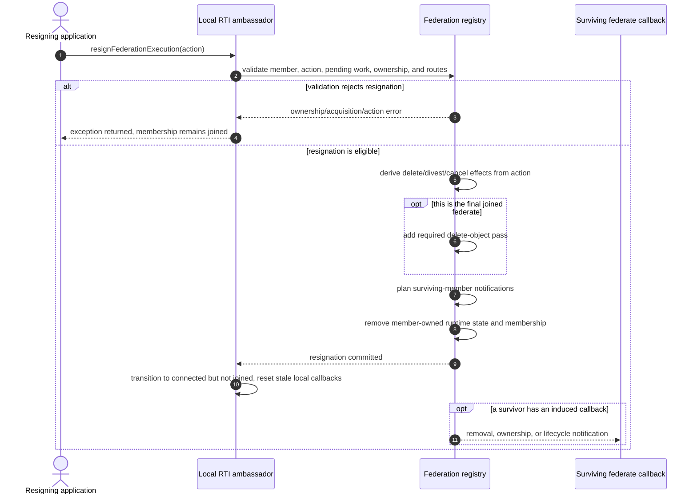

# IEEE 1516.1-2025 Federation and Federate Lifecycle

This guide separates the lifetime of an RTI ambassador, a joined federate, and
the federation execution itself. It then traces how voluntary resignation and
connection loss remove membership, because those exits have different
validation, cleanup, and callback paths.

## Scope and authority

- **Edition boundary:** IEEE 1516.1-2025 only. The 2010 API/runtime and its
  tests remain a separate compatibility stream; this guide makes no
  cross-edition equivalence claim.
- **Implementation boundary:** the embedded federation-management development
  profile and selected 2025 integration tests. Process-endpoint service
  handling is linked where useful but is not claimed to have identical
  lifecycle coverage.
- **Normative authority:** the [official IEEE 1516.1-2025 Federate Interface
  Specification](https://standards.ieee.org/ieee/1516.1/6688/). Check exact
  service clauses before using this guide as a requirement or conformance
  statement. Clause notes already present in source comments are navigation
  clues, not a substitute for that standard.
- **Evidence rule:** implementation links describe current Umbra behavior;
  tests establish only their named scenario. This guide is explanatory
  documentation, not new Requirements Lab evidence.

Related state machines stay separate: see the [time-management guide](HLA-2025-TIME-MANAGEMENT-GUIDE.md),
[object and interaction information-flow guide](HLA-2025-OBJECT-AND-INTERACTION-INFORMATION-FLOW-GUIDE.md),
[ownership guide](HLA-2025-ATTRIBUTE-OWNERSHIP-FLOW-GUIDE.md), and
[save/restore guide](HLA-2025-FEDERATION-SAVE-RESTORE-FLOW-GUIDE.md).

## Three lifetimes, not one

Keep these identities distinct:

1. **RTI ambassador connection:** whether this local ambassador is connected
   to its RTI session.
2. **Federate membership:** whether that ambassador currently represents a
   member of a particular federation execution.
3. **Federation execution:** whether the named execution exists in RTI state.

Creating an execution does not itself join it. Resigning ends one member
lifetime, but does not necessarily destroy the execution. A member that
successfully resigns can connect again and join a new member lifetime. In the
current embedded implementation, an execution with no joined federates remains
available until an explicit Destroy succeeds.

### Local ambassador/federate state

The runtime has a small local lifecycle state machine. A failed join or resign
does not commit the corresponding transition. Connection loss is different
from voluntary resignation: the local connection state becomes disconnected
while the registry performs forced member cleanup.



This diagram is local to an RTI ambassador. It does not describe whether the
federation execution exists or how other members are affected.

### Federation-execution state



The empty-execution state is a real, useful state, not a synonym for
“destroyed.” It allows a later federate to join the same execution. The 2025
final-member tests additionally show the implementation's mandatory object
cleanup at that boundary; see the resignation section below.

## Create, join, and destroy

Creation validates a federation definition and establishes federation-owned
catalog, handle directories, switches, and time-coordination state. Join
creates a new member identity and registers that member with the execution's
coordination and callback routes. Destroy is a separate operation and is
rejected while members remain (or the time coordinator is not empty).



In this implementation, additional-FOM joins reconcile handle directories
against the replacement catalog and cannot silently change the time
implementation while existing members are joined. These are useful review
boundaries, not an exhaustive account of FOM merge rules; composition belongs
to its own documentation and tests.

The ordinary 2025 federation-lifecycle scenario exercises invalid creation
designators, duplicate execution creation, duplicate member names, disconnect
while joined, destroy while joined, a valid additional-FOM join, invalid
ResignAction rejection, successful resignations, and explicit destroy after
the members leave. See the evidence table for the exact source and test.

## Voluntary resignation: validate before removing membership

A resignation is not just a local state toggle. Umbra first validates the
action and current member state, then evaluates pending ownership work,
attribute ownership, delete privilege, and callback routes needed by that
action. A rejected resignation leaves the member joined. On success the
registry applies the selected cleanup, removes the member from time and
declaration ledgers, clears its reservations/regions and per-instance
knowledge, then erases the member identity. The local ambassador transitions
out of the joined state and discards callbacks that are stale for that
departing member; callbacks prepared for survivors are delivered on their own
routes.



### ResignAction effects in the current implementation

This is a compact reading aid, not the full normative decision table. Exact
preconditions and action ordering must be checked in the standard and source.

| Action family | Current implementation effect | Important guard or caveat |
| --- | --- | --- |
| NO_ACTION | No requested object deletion or unconditional divestiture. | A voluntary resign can be rejected while the member still owns attributes or has certain pending acquisitions. |
| UNCONDITIONALLY_DIVEST_ATTRIBUTES | Request attribute divestiture without requesting object deletion. | Ownership callbacks and pending negotiations affect the path; see the ownership guide. |
| DELETE_OBJECTS | Request deletion of objects for which the member holds delete privilege. | May be rejected if owned attributes would remain on an object it cannot delete. |
| DELETE_OBJECTS_THEN_DIVEST | Delete eligible objects, then divest remaining owned attributes. | Its combination of effects differs from DELETE_OBJECTS alone. |
| CANCEL_PENDING_OWNERSHIP_ACQUISITIONS | Cancel pending acquisition work. | Does not by itself request object deletion or general divestiture. |
| CANCEL_THEN_DELETE_THEN_DIVEST | Combine acquisition cancellation, eligible object deletion, and divestiture. | Keep each phase visible; do not treat it as an alias for another action. |

For the current implementation, the last joined member causes a delete-object
pass even if it supplied NO_ACTION. This does not mean the federation
execution itself is destroyed. In the focused test, the last member resigns
with NO_ACTION, rejoins the same still-existing execution under a fresh member
lifetime, and reserves the name of the object removed during final-member
cleanup.

## Connection loss: forced resignation is a different entry path

On connection loss, the registry uses that member's configured automatic
resign directive and calls the same central resign transition with a forced
loss flag. Forced cleanup has extra safety rules: pending acquisition work is
cancelled even if the configured action would not cancel it, and attributes
still owned by the departing member are removed from its ownership set. If
this is the final member, the final-member delete pass still applies.

```mermaid
sequenceDiagram
  autonumber
  participant Link as Transport/session
  participant RTI as Local RTI adapter
  participant Registry as Federation registry
  actor Lost as Lost member application
  actor Peer as Surviving member

  Link--xRTI: connection failure
  RTI->>Registry: Connection Lost(member)
  Registry->>Registry: read member's automatic resign directive
  Registry->>Registry: forced resign transition and safety cleanup
  Registry->>Registry: stage survivor notifications and erase membership
  opt configured directive requests object deletion
    Registry-->>Peer: remove callbacks for known eligible objects
  end
  opt a federate-lost report is eligible
    Registry-->>Peer: federate-lost notification
  end
  RTI-->>Lost: connectionLost callback/report where local adapter can deliver it
  Note over Registry: At-or-before-loss TSO obligations use the last granted time boundary
```

The callback to the lost application is local adapter reporting; it is not a
message sent over the connection that has already failed. Whether survivors
receive removal or federate-lost notifications depends on the configured
directive, known objects, support switches, callback routes, and profile.
Connection-loss TSO cutoff behavior is deliberately only marked here; the
[time-management guide](HLA-2025-TIME-MANAGEMENT-GUIDE.md) owns timestamp
eligibility and delivery ordering.

## What is state that survives an exit?

| Boundary | State that ends or changes | State that is not implied to end |
| --- | --- | --- |
| Successful voluntary resign | This member identity, its declarations/routes/time role, its reservations and owned regions, and local queued callbacks. Action-dependent objects/ownership and survivor notifications are processed. | The federation execution, unless Destroy is separately accepted. |
| Connection loss | The member is forcibly removed using its automatic resign directive plus forced safety cleanup. | The federation execution; remaining members continue. |
| Final-member departure | The execution reaches zero joined members; the mandatory object cleanup path runs. | The execution itself; a new member may join before explicit Destroy. |
| Successful Destroy | The execution and associated save snapshot state are erased. | Other RTI ambassador connections and unrelated federation executions. |

These distinctions are particularly useful when debugging “I resigned but
could not re-create,” “the peer still received removal,” or “the final member
left but the federation name still exists.”

## Evidence map: implementation versus exercised scenarios

| Topic | Current implementation entry points | Focused test evidence |
| --- | --- | --- |
| Local ambassador lifecycle | [FederateLifecycle transitions](../../cpp/src/internal/federation/federate_lifecycle.cpp#L11), [public lifecycle adapter](../../cpp/src/internal/runtime/umbra_rti_ambassador_federation_lifecycle.cpp#L147) | [federation create/join/resign/destroy scenario](../../cpp/tests/ieee1516_2025_federation_resign_lifecycle_catch2.cpp#L4) |
| Execution and membership registry | [create/destroy/join](../../cpp/src/internal/federation/federation_registry_membership_lifecycle.cpp#L65), [process service handlers](../../cpp/src/internal/federation/process_federation_service_lifecycle.cpp#L130) | [federation create/join/resign/destroy scenario](../../cpp/tests/ieee1516_2025_federation_resign_lifecycle_catch2.cpp#L4) |
| Voluntary ResignAction | [resign transition and guards](../../cpp/src/internal/federation/federation_registry_resign_lifecycle.cpp#L13), [public resignation adapter](../../cpp/src/internal/runtime/umbra_rti_ambassador_federation_lifecycle.cpp#L800) | [final-member NO_ACTION cleanup and rejoin](../../cpp/tests/ieee1516_2025_embedded_resign_action_final_federate_catch2.cpp#L4), [delete/removal on resignation](../../cpp/tests/ieee1516_2025_embedded_resign_action_delete_objects_catch2.cpp#L4) |
| Connection loss and automatic action | [Connection Lost registry entry](../../cpp/src/internal/federation/federation_registry.cpp#L410), [automatic directive state](../../cpp/src/internal/federation/federation_registry_control_state.cpp#L255), [shared forced cleanup](../../cpp/src/internal/federation/federation_registry_resign_lifecycle.cpp#L13) | [configured automatic delete directive and peer removal](../../cpp/tests/ieee1516_2025_connection_lost_automatic_delete_objects_immediate_catch2.cpp#L5), [final-member connection loss](../../cpp/tests/ieee1516_2025_connection_lost_final_federate_directive_two_catch2.cpp#L5), [automatic directive selection](../../cpp/tests/ieee1516_2025_connection_lost_automatic_delete_resign_directive_catch2.cpp#L5) |

## Deliberate limits and next evidence

This guide does not specify the full IEEE action decision table, connection
failure detection policy for every transport, callback ordering for all
survivor notifications, every cleanup ledger, or complete MOM reporting.
Save/restore interlocks and TSO cutoff details stay in their dedicated guides.
The 2010 lifecycle stream is not surveyed here and must receive a separate
guide rather than being inferred from these 2025 tests.

The next documentation pass is callback and service ordering: callback queues,
HLA_EVOKED versus HLA_IMMEDIATE behavior, allowed/rejected re-entry, delivery
commit points, and ordering interactions with TSO and federation callbacks.
First verify the Mermaid diagrams in the drafted save/restore,
object/interaction, and lifecycle guides using a GitHub-compatible renderer.
Do not edit the HLA Requirements Lab during this Umbra documentation work.
