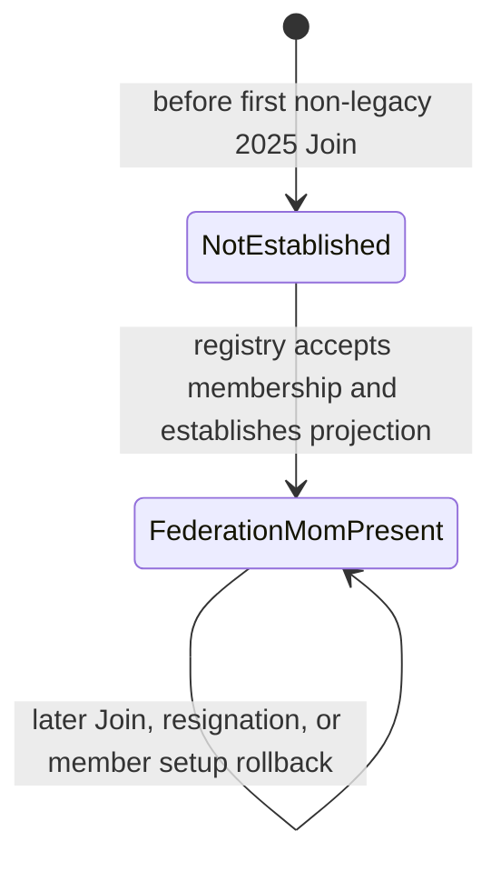
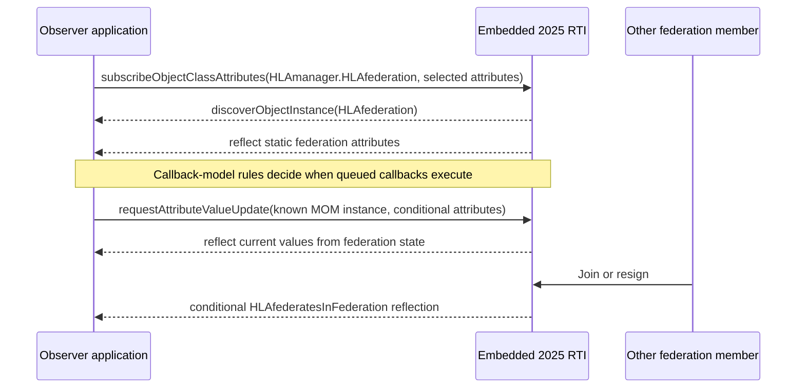
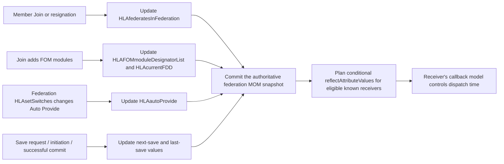
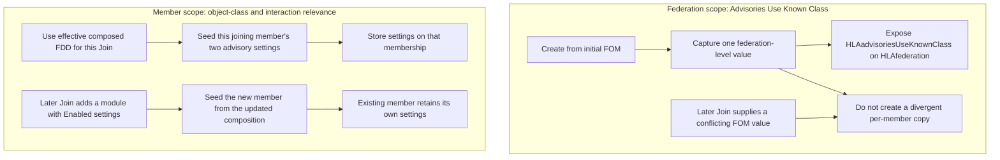
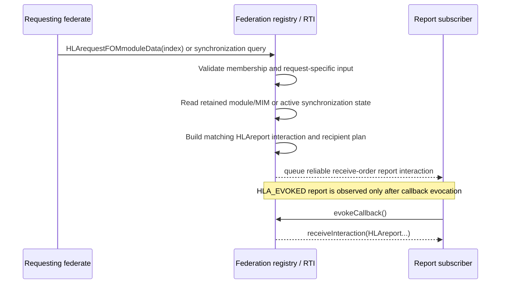

# IEEE 1516.1-2025 Federation-Scoped MOM Flow Guide

This guide follows the federation-scoped `HLAmanager.HLAfederation` object and
its request/report interactions. It explains why the object is not the same
thing as a joined member's `HLAmanager.HLAfederate` instance, how observers
learn its values, which operations update its conditional attributes, and how
federation reports travel as interactions rather than attribute reflections.

## Scope and authority

- **Normative model:** IEEE 1516.1-2025 and its 2025 MIM/OMT definitions.
  The [Federate Interface Specification](https://standards.ieee.org/ieee/1516.1/6688/)
  is the normative service authority. The official
  [1516.2-2025 MIM](../../third_party/ieee1516.2-2025/resources/mim/HLAstandardMIM-2025.xml)
  supplies the federation MOM class, attribute update types, and request/report
  interaction shapes. The MIM describes the model contract; it is not by
  itself proof that Umbra implements every path.
- **Implementation evidence:** the embedded 2025 federation-management
  development profile and its focused public-C++ tests. A corresponding
  process-endpoint join path exists in source, but the tests linked below do
  not establish embedded/process parity.
- **Edition boundary:** this is a 2025 federation MOM explanation, not a 2010
  state machine. In the 2025 runtime's legacy-2010-FOM compatibility path, the
  Join adapter deliberately does not synthesize the 2025 federation MOM
  projection. The separate [2010 reference-RTI guide](HLA-2010-REFERENCE-RTI-FLOW-GUIDE.md)
  remains independent and is not evidence of this object's 2010 behavior.
- **Topic boundary:** this guide is about the execution-scoped
  `HLAmanager.HLAfederation` object and its report interactions. The separate
  [joined-federate MOM guide](HLA-2025-JOINED-FEDERATE-MOM-OBJECT-LIFECYCLE-FLOW-GUIDE.md)
  follows each membership's `HLAmanager.HLAfederate` object. The
  [service-invocation reporting guide](HLA-2025-SERVICE-INVOCATION-REPORTING-FLOW-GUIDE.md)
  follows a different family of MOM interactions.

## Three paths, three kinds of observation

The federation MOM uses ordinary HLA mechanisms, but its state and reports are
not interchangeable:

| What a subscriber observes | Mechanism | Example |
| --- | --- | --- |
| The RTI-owned `HLAfederation` object becomes known | Object-class subscription, `discoverObjectInstance`, and initial attribute reflection | Static federation name, RTI version, MIM designator, and time implementation |
| A value changes or is requested again | `reflectAttributeValues` for that known object instance | Conditional `HLAfederatesInFederation`; a current-value request can also return a conditional value |
| A federation report is requested | A `HLArequest...` interaction causes an RTI-originated `HLAreport...` interaction | FOM module contents or synchronization-point state |

The distinction matters when reading callbacks: a `reflectAttributeValues`
callback updates the known MOM object; a `receiveInteraction` callback carries
a report interaction. Neither callback is the same as the original Join,
resign, or request service completing.

## One object belongs to the federation execution

The embedded 2025 Join path establishes the federation-scoped object once,
independently of each member's private `HLAfederate` snapshot and report-file
lifetime. The registry validates the effective 2025 MIM class metadata and
retains the federation object with the execution. A successful individual
resignation changes membership state; it does not turn the shared object into
that member's object or remove the other members' known-object state.

In the embedded path, registry membership is accepted and the federation MOM
object is established before the joining member's service-report file and
routes finish setup. If that later per-member setup fails, the Join call rolls
back the membership by resigning the new member; the registry resignation path
retains the execution-scoped federation MOM object. Thus this implementation
can establish the object during a Join attempt that ultimately fails. This is
source-observed, not covered by a focused failed-first-Join test. The
[Join rollback path](../../cpp/src/internal/runtime/umbra_rti_ambassador_federation_lifecycle.cpp#L574)
and [federation-object establishment](../../cpp/src/internal/runtime/umbra_rti_ambassador_federation_lifecycle.cpp#L616)
show the ordering; [resignation cleanup](../../cpp/src/internal/federation/federation_registry_resign_lifecycle.cpp#L1021)
keeps the federation object's record while removing the departing member's
known-object state. In the normal path, the object represents the federation
execution, not an individual member. Process-endpoint parity is not established
by these tests.

Discovery remains subscription-scoped. A joined federate subscribes to the
`HLAmanager.HLAfederation` class, then learns the RTI-owned instance through the
ordinary object callback route. A conditional attribute is not necessarily an
initial-value reflection merely because the instance is discovered; a
federate can request the current value after it knows the instance.

The [static-configuration test](../../cpp/tests/ieee1516_2025_federation_mom_static_configuration_catch2.cpp#L4)
subscribes to eight static federation values and checks their initial reflection
along the discovery path. The
[membership-boundary test](../../cpp/tests/ieee1516_2025_federation_mom_membership_boundaries_catch2.cpp#L4)
shows the key edge: `HLAfederatesInFederation` is conditional, so the observer
subscribes, waits for discovery, explicitly requests the current membership
value, and then sees updated reflections at Join and resignation boundaries.
That test also treats the object as a normal known instance and checks its
reliable transportation metadata; it does not make the per-member
`HLAfederate` and federation `HLAfederation` lifetimes equivalent.

## Conditional values have different authoritative triggers

The MIM marks attributes as `Static` or `Conditional` and names the events that
drive conditional updates. Umbra stores the federation object snapshot in the
registry; service-specific paths update that source and queue the normal MOM
attribute-reflection route. A later current-value request reads the current
snapshot, not a replay of the event that originally changed it.

This is a map of representative producers, not a promise that every federation
MOM attribute is implemented. The 2025 MIM identifies `HLAfederatesInFederation`
as conditional on Join/resignation, and the FOM module list and `HLAcurrentFDD`
as conditional on successful Create/Join changes. The save name/time values
have their own save-ledger boundaries, documented in the
[save/restore guide](HLA-2025-FEDERATION-SAVE-RESTORE-FLOW-GUIDE.md). The
federation `HLAsetSwitches` path in this profile handles the Auto Provide
switch; its discovery and provider-eligibility behavior is covered in the
[Auto Provide guide](HLA-2025-AUTO-PROVIDE-FLOW-GUIDE.md).

The [MIM membership rows](../../third_party/ieee1516.2-2025/resources/mim/HLAstandardMIM-2025.xml#L684),
[FOM-list and current-FDD rows](../../third_party/ieee1516.2-2025/resources/mim/HLAstandardMIM-2025.xml#L723),
[conditional-current-FDD test](../../cpp/tests/federation_mom_current_fdd_catch2.cpp#L180),
and [save-conditionals test](../../cpp/tests/federation_mom_save_conditionals_catch2.cpp#L183)
provide focused evidence for these separate state sources. The tests exercise
the embedded development profile; they are not a claim that every conditional
attribute or backend is covered.

## Creation-time federation policy versus per-member switch seeding

“Switch” does not imply one shared lifetime or one shared source. This chart
compares only the tested 2025 advisory settings below: the federation-scoped
`Advisories Use Known Class` value is captured from the Create-time model,
whereas object-class and interaction-relevance advisory values are initialized
for the member being joined from that Join's effective composed FDD.

These are two separate focused test cases, not one combined fixture. The
[known-class test body](../../cpp/tests/advisories_use_known_class_switch_catch2.cpp#L4)
sets up creation with the switch enabled, then a later Join with a conflicting
Disabled value; its assertions require both members to read the shared enabled
value. The
[advisory-seeding test body](../../cpp/tests/join_advisory_switch_seed_catch2.cpp#L4)
sets up an initial member with default-disabled advisory settings, then a Join
with an FOM whose object-class and interaction-relevance values are Enabled;
its assertions require the new member to read Enabled while the first remains
Disabled. The
[static federation MOM test body](../../cpp/tests/ieee1516_2025_federation_mom_static_configuration_catch2.cpp#L4)
also asserts the initial `HLAadvisoriesUseKnownClass` reflection.

Both focused switch cases were built and rerun locally, but each currently
fails during `createFederationExecution` with `Unknown exception`, before its
switch assertions. Treat this chart as source-derived and test-mapped, not as a
behavior verified by those test runs; the setup failure remains to be
investigated.

The source mirrors that distinction: federation creation captures global
catalog values in the federation record
([registry creation](../../cpp/src/internal/federation/federation_registry_membership_lifecycle.cpp#L120));
each Join seeds the new membership from the replacement/current definition,
without rewriting existing membership fields
([member initialization](../../cpp/src/internal/federation/federation_registry_membership_lifecycle.cpp#L373)).
The joined-federate
[`HLAsetSwitches` test](../../cpp/tests/mom_federate_set_switches_catch2.cpp#L67)
also demonstrates why the interaction name must not be treated as a universal
switch setter: its tested parameters update a defined support/reporting subset,
and selected relevance-switch getters remain unchanged. The advisory consumers
and their independent callback rules stay in the
[relevance-advisory guide](HLA-2025-RELEVANCE-ADVISORY-FLOW-GUIDE.md).

Here “Static” in the `HLAfederation` MIM row names its MOM reflection category;
the Create-time capture and no-divergence claim above are the narrower Umbra
behavior established by the cited source and tests. This comparison is for the
embedded 2025 profile only; it says nothing about the separate 2010 stream or
untested backend parity.

## Federation reports are receive-order interactions

Federation MOM requests such as `HLArequestFOMmoduleData`,
`HLArequestMIMdata`, `HLArequestSynchronizationPoints`, and
`HLArequestSynchronizationPointStatus` are not attribute-value requests. The
RTI validates the joined requester and request-specific input, reads the
authoritative module/MIM/synchronization state, builds the paired
`HLAreport...` interaction, and selects report recipients through the ordinary
interaction-subscription route.

The request and report classes are defined in the 2025 MIM's federation
`HLArequest` and `HLAreport` groups. For FOM module data, the index selects an
entry in the federation's retained module list; an invalid index is rejected
synchronously rather than producing a stale report. Synchronization-point
reports read the registry's current in-progress point/status state. The report
is RTI-originated reliable receive-order traffic and is delivered as
`receiveInteraction`, not reflected as an attribute of the `HLAfederation`
object.

Focused public-C++ evidence:

- [FOM-module request/report](../../cpp/tests/ieee1516_2025_federation_mom_fom_module_data_report_catch2.cpp#L4)
  checks a subscribed observer, the receive-order callback boundary, the
  returned module bytes, RTI producer metadata, and synchronous invalid-index
  rejection.
- [MIM data and current-FDD requests](../../cpp/tests/federation_mom_current_fdd_catch2.cpp#L180)
  exercise the retained current model content through the standard MOM route.
- [Synchronization list/status reports](../../cpp/tests/ieee1516_2025_federation_mom_synchronization_reports_catch2.cpp#L4)
  checks the paired report interactions and their encoded current state.

The [federation report planner](../../cpp/src/internal/federation/federation_registry_mom_federation_content_reporting.cpp#L52)
and [synchronization report planner](../../cpp/src/internal/federation/federation_registry_mom_synchronization_reporting.cpp#L22)
show where federation state becomes a report plan. The runtime's
[Join-time object setup](../../cpp/src/internal/runtime/umbra_rti_ambassador_federation_lifecycle.cpp#L616)
and [registry object foundation](../../cpp/src/internal/federation/federation_registry_mom_object_state.cpp#L373)
show the distinct object-lifecycle path.

## Keep these boundaries visible

- **Object versus report:** subscription to the `HLAfederation` object yields
  discovery/reflection callbacks. Subscribing to an `HLAreport...` interaction
  yields `receiveInteraction`; one is not a substitute for the other.
- **Federation versus member:** one federation object represents the execution;
  each joined member may separately have a private `HLAfederate` MOM object.
  `HLAsetTiming` and member-targeted periodic counters belong to that other
  scope and remain in the joined-federate guide/design evidence.
- **2025 versus 2010:** the 2025 runtime explicitly gates this projection when
  a legacy 2010 FOM compatibility profile is selected. This is an implementation
  boundary inside the 2025 runtime, not a flow for the 2010 reference RTI.
- **Evidence versus conformance:** the cited Catch2 tests are tagged
  `[development-profile]`. They establish tested behavior for those scenarios,
  not full IEEE conformance, process-backend parity, or completeness of the
  federation MOM surface.

## Evidence and remaining questions

The [federation MOM section of the implementation dossier](MOM-SERVICE-REPORTING-DESIGN.md#L1510)
records the current value sources and the test/profile limitations. Before
calling this topic complete, review the federation object and report paths
against the licensed IEEE 1516.1-2025 text (not only the MIM), validate any
uncovered report/error cases, and render this guide in both the installed local
Mermaid renderer and GitHub after publication. Keep unresolved normative,
process-endpoint, and 2010 questions labeled rather than inferring answers from
the embedded tests.
