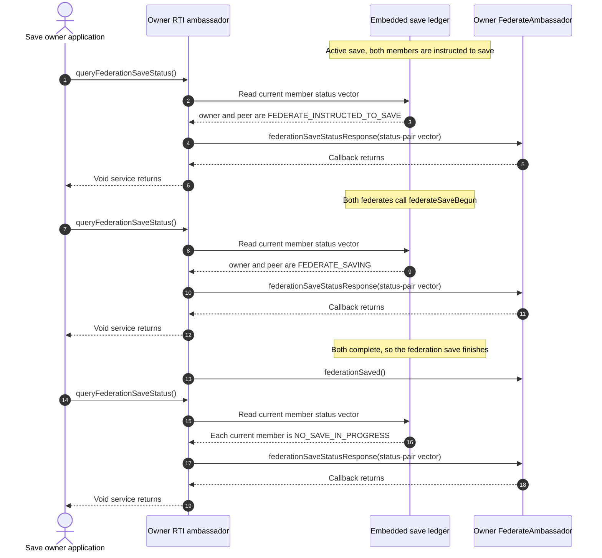
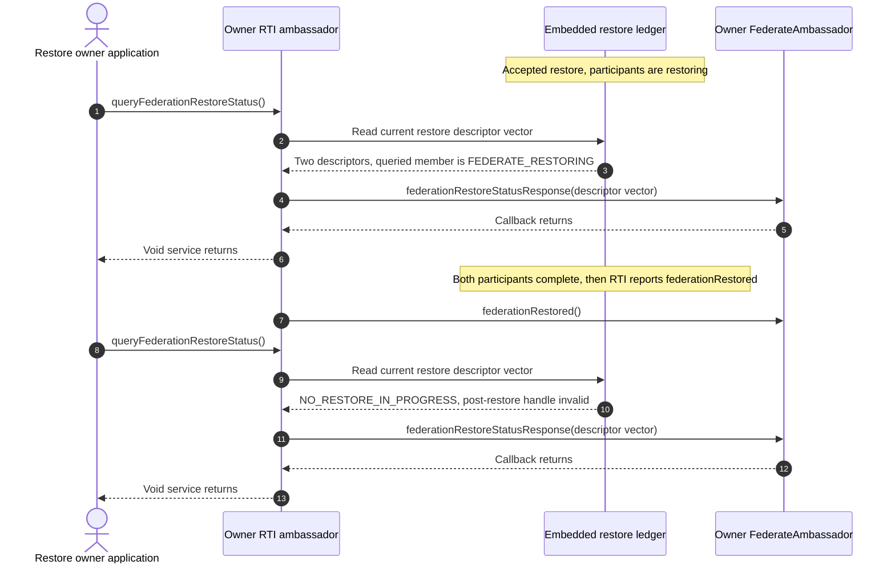
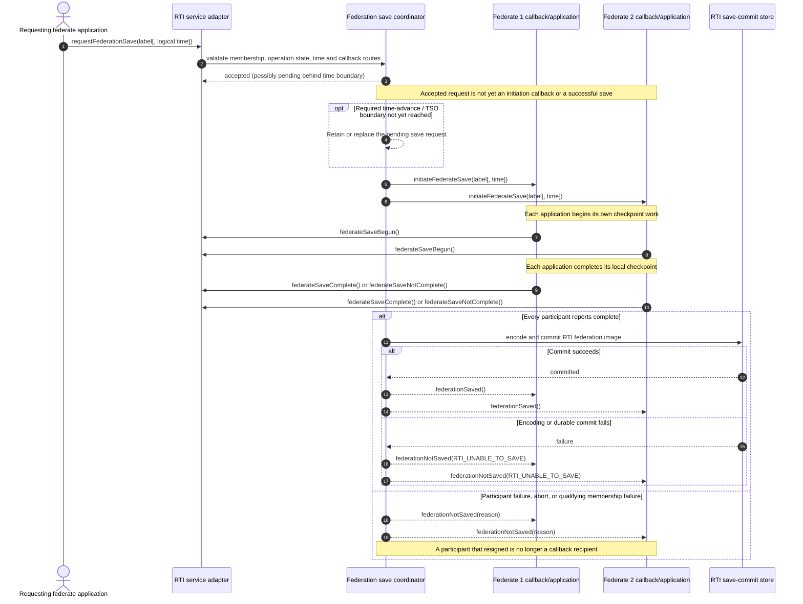
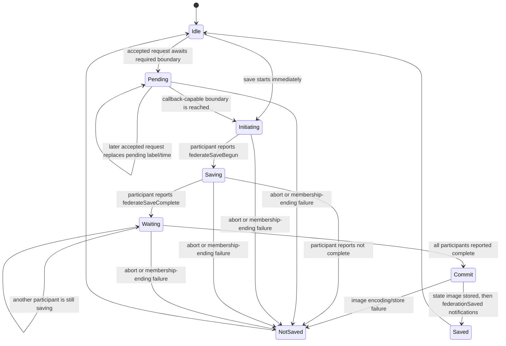
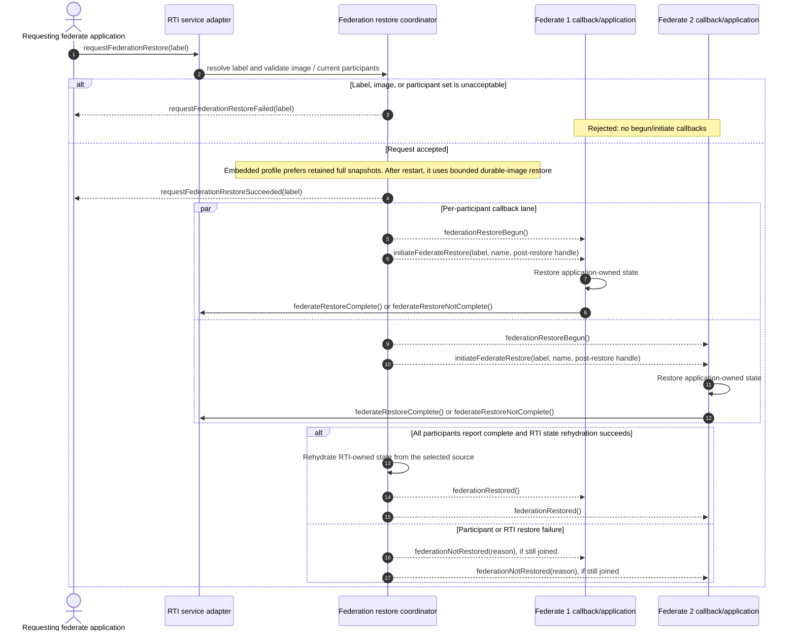
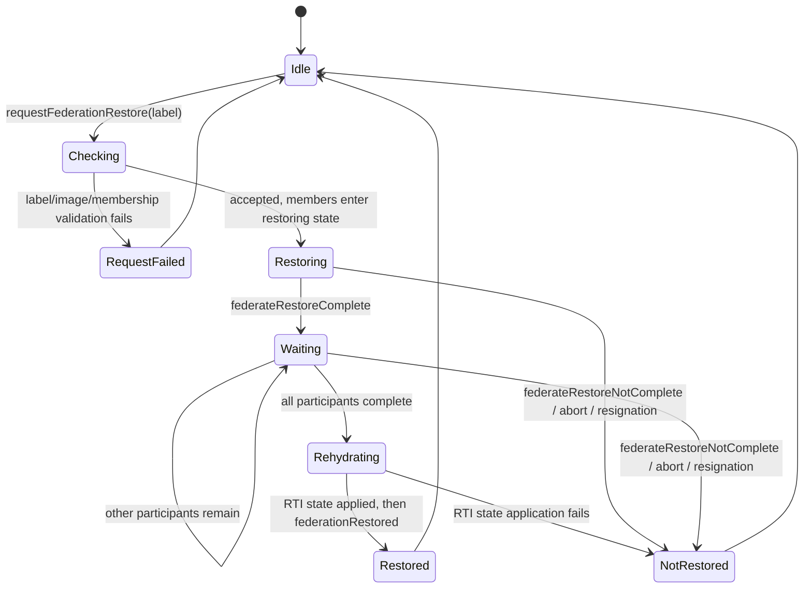

# IEEE 1516.1-2025 Federation Save and Restore: Contributor Guide

This guide explains federation save and restore as a coordinated, asynchronous
protocol. It is intended to help contributors understand the boundaries before
reading the implementation; it is not a substitute for the standard, a new
source of requirements, or a claim of conformance.

## Scope and authority

- **Standard boundary:** IEEE 1516.1-2025 only. The 2010 API and runtime are a
  separate compatibility stream and are deliberately not described or compared
  here.
- **Implementation boundary:** the current embedded federation-management
  development profile, its durable state-image path, and selected 2025
  process-endpoint callback tests. These are distinct evidence scopes; neither
  represents all installation or deployment modes.
- **Authority order:** the [official IEEE 1516.1-2025 Federate Interface
  Specification](https://standards.ieee.org/ieee/1516.1/6688/) defines
  normative behavior. Its federation-management save/restore service clauses
  are in the §4.19–§4.35 range; §4.19.6 is a useful timed-save pointer. Confirm
  exact text and applicability in the official standard. The repository's
  pinned traceability mappings are navigation aids, not normative authority.
- **Evidence boundary:** source files show Umbra's present control flow; tests
  prove only their named scenarios. Internal registry tests are implementation
  evidence, not public-API or conformance evidence.

For related but separate state machines, see the [2025 time-management guide](HLA-2025-TIME-MANAGEMENT-GUIDE.md), the [core attribute ownership guide](HLA-2025-ATTRIBUTE-OWNERSHIP-FLOW-GUIDE.md) and its [persistence/resignation companion](HLA-2025-OWNERSHIP-PERSISTENCE-AND-RESIGNATION-FLOW-GUIDE.md), and the [DDM/regions guide](HLA-2025-DATA-DISTRIBUTION-AND-REGIONS-FLOW-GUIDE.md). This guide points to those areas where their state affects a save image; it does not merge their rules into save/restore.

## The mental model

There are two coordinated checkpoints, not one:

1. Each federate saves its **application-owned state** after the RTI tells it
   to begin. The federate then reports progress or failure through the RTI
   service API.
2. The RTI captures and commits its **federation-owned state**. A participant
   successfully reporting `federateSaveComplete` is not proof that the
   federation image was committed; the federation-wide success callback is
   the later completion boundary.

Restore has the corresponding two responsibilities. Each federate restores
its own application state after `initiateFederateRestore`; the RTI coordinates
the participants and reinstates the RTI-owned state only after all participants
report completion. A restore request can fail before that protocol begins, and
a begun restore can still fail later.

The practical distinction is:

> “I saved/restored my federate” is not the same event as “the federation save/
> restore completed.”

An accepted save request can also wait for a time-management boundary before
initiation. In this implementation, constrained members and timestamped
messages can therefore affect *when* `initiateFederateSave` is dispatched.
Use the time-management guide for grant/TSO ordering; this guide only marks
that boundary.

## Vocabulary and callback/service roles

| Phase | Federate-facing API | Meaning in this guide |
| --- | --- | --- |
| Request a save | `requestFederationSave` | Ask the RTI to coordinate a federation save, optionally at logical time. Acceptance does not necessarily mean initiation has happened. |
| Save begins | `initiateFederateSave` callback, then `federateSaveBegun` | The RTI tells each participant to take its local checkpoint; the participant reports that its save work has begun. |
| Local save result | `federateSaveComplete` or `federateSaveNotComplete` | One participant reports its result. This alone does not complete the federation save. |
| Federation save result | `federationSaved` or `federationNotSaved` callback | RTI-wide result after participant coordination and RTI image handling. |
| Request a restore | `requestFederationRestore` | Select a prior save label. A request failure is distinct from a restore that has already begun and later fails. |
| Restore begins | `requestFederationRestoreSucceeded`, `federationRestoreBegun`, `initiateFederateRestore` callbacks | The accepted request is announced, then each participating federate is told to restore its local state. |
| Local restore result | `federateRestoreComplete` or `federateRestoreNotComplete` | One participant reports its result. The RTI waits for the federation-level barrier. |
| Federation restore result | `federationRestored` or `federationNotRestored` callback | Final RTI-wide outcome after internal state rehydration or a failure path. |

`abortFederationSave`, `abortFederationRestore`, and the status query/report
services are related control paths. They do not replace the per-participant
completion protocol.

## Status queries are read-only callback snapshots

The 2025 API methods `queryFederationSaveStatus` (§4.25) and
`queryFederationRestoreStatus` (§4.34) return `void`; their data arrives
through the distinct `federationSaveStatusResponse` (§4.26) and
`federationRestoreStatusResponse` (§4.35) callbacks. The pinned
[save-status query](../../third_party/ieee1516.1-2025/include/RTI/RTIambassador.h#L364)
and [restore-status query](../../third_party/ieee1516.1-2025/include/RTI/RTIambassador.h#L413),
with their [save-status callback](../../third_party/ieee1516.1-2025/include/RTI/FederateAmbassador.h#L124)
and [restore-status callback](../../third_party/ieee1516.1-2025/include/RTI/FederateAmbassador.h#L166),
show that service/callback split.

In the current embedded path, a query snapshots the operation ledger for the
requesting member, releases native locks, and routes one status-response
callback to that requester. It does not start, advance, complete, or abort a
save or restore. Save responses are `(federate, save status)` pairs. Restore
responses carry pre-restore handle, post-restore handle, and restore status;
with no restore active, the current implementation reports
`NO_RESTORE_IN_PROGRESS` and an invalid post-restore handle. The opposite
operation remains a service gate: querying save status while restore is in
progress, or restore status while save is in progress, is rejected.

In the embedded implementation, the adapter entry points are
[queryFederationSaveStatus](../../cpp/src/internal/runtime/umbra_rti_ambassador_federation_save_restore.cpp#L859)
and
[queryFederationRestoreStatus](../../cpp/src/internal/runtime/umbra_rti_ambassador_federation_save_restore.cpp#L1511);
the registry constructs the corresponding [save snapshot](../../cpp/src/internal/federation/federation_registry_save_control.cpp#L958)
and [restore snapshot](../../cpp/src/internal/federation/federation_registry_restore_control.cpp#L1038).

The following save sequence is the embedded `HLA_IMMEDIATE` integration
scenario. It shows three independent snapshots: participants instructed to
save, participants saving, and no save in progress after the federation save
finishes. The final `federationSaved` notification remains the operation's
completion signal; the status query is only an observation.

Restore uses a different status descriptor and includes the post-restore
handle. This embedded `HLA_IMMEDIATE` scenario queries while participants are
restoring, then again after `federationRestored`:

These are current-profile observations, not a complete normative status table.
The save case checks both members at `FEDERATE_INSTRUCTED_TO_SAVE`, then
`FEDERATE_SAVING`, then `NO_SAVE_IN_PROGRESS`. The restore case checks two
restoring members and the post-completion idle result. Each diagram is bounded
to its named embedded test and `HLA_IMMEDIATE`; the adapter also has a separate
process-endpoint protocol path, so the diagrams do not assert process/embedded
parity, HLA_EVOKED callback timing, or all status transitions.

## Save flow: request, participant work, and the commit barrier

The sequence below separates the application's checkpoint from the RTI's
durable commit. It omits the detailed time-grant algorithm; the optional gate
is the handoff to the time-management state machine.

The current registry state machine is:

The state diagram is a teaching summary of current coordinator behavior, not a
replacement for the standard's participant-status rules. In particular:

- In the embedded profile, an untimed save is immediate only when no
  time-constrained member requires a callback-capable boundary. Otherwise the
  accepted request is retained until the constrained members can receive
  initiation at the right time-advance boundary.
- A timed request is validated against the federation's logical-time
  representation and constrained-member state. The current coordinator checks
  whether constrained members have reached the requested time and whether
  queued or in-transit TSO messages at or before that time still block save
  initiation. A later accepted request replaces the previous pending request.
- `federateSaveBegun` only changes that participant's coordinator status to
  saving. `federateSaveComplete` moves it to the waiting-for-federation barrier;
  it is the *last* participant's completion that makes the RTI encode and
  commit the image.
- The commit precedes `federationSaved`. If the store throws or the image
  cannot be materialized, the coordinator reports a failed federation save
  instead of claiming a restorable snapshot exists.
- The participant failure callback, RTI abort, and a participant leaving
  during save are different inputs to the failure path; use the reason value
  carried by the final callback rather than inferring a single generic cause.

## Restore flow: admission is not completion

The restore request first selects and validates a saved image. Only an accepted
request starts the participant protocol. Each participant restores local
application state in its own callback path, then reports completion to the
RTI.

The two participant lanes show the per-federate callback progression. They do
not claim a global wall-clock interleaving between different callback queues.
In the current embedded registry, an accepted request queues the requester's
success notification and then a begun/initiate notification pair for each
joined member. The process-endpoint tests exercise the callback sequence under
`HLA_IMMEDIATE`; callback-model and dispatch behavior beyond those scenarios
must be checked separately.

### Early rejection versus begun failure

| Observation | Request rejected before restore begins | Restore begins, then fails |
| --- | --- | --- |
| Typical current-profile trigger | Missing/corrupt/mismatched saved image or saved/current participant mismatch | A participant reports not complete, the request owner aborts, a participant resigns, or RTI rehydration fails |
| Request callback | `requestFederationRestoreFailed(label)` to the requester | Requester's earlier `requestFederationRestoreSucceeded(label)` remains true as a statement that the request was accepted |
| Federation callbacks | No `federationRestoreBegun`, `initiateFederateRestore`, or final `federationNotRestored` for this rejected request | Participants already entered the restore protocol; `federationNotRestored(reason)` communicates the terminal outcome |
| Current source evidence | Request validation emits a `request_failed` notification and returns before creating the restore operation | Completion/failure helper fans the failure reason out to the still-joined restore participants |

Do not tell an application that a successful restore-request callback means the
restore itself succeeded. It means only that the request was admitted; the
terminal federation callback is later.

## What the RTI image does—and does not—mean

The application save and the RTI state image are separate responsibilities.
The RTI image is not an automatic checkpoint of arbitrary application memory.

| State / artifact | Current Umbra handling | Reader's boundary |
| --- | --- | --- |
| Federate application state | Application code captures/restores it around `initiateFederateSave` / `initiateFederateRestore` | The RTI cannot reconstruct application-owned state unless the federate implements that work. |
| Process-local federation snapshot | The embedded registry retains a private snapshot keyed by save label | This is the richest restore source while that process-local snapshot remains available. |
| Durable RTI image | Versioned `FederationStateImage` is encoded and submitted to `FederationSaveCommitStore` before success notification | A successful storage call is required before Umbra reports federation save success. |
| Callback routes / closures | Kept as live runtime routes, not serialized into the durable state image | A process restart cannot revive a callback closure from the saved bytes. |
| Restart restore projection | The durable-image path validates federation, label, logical-time implementation, and member identity; it rehydrates supported route-free state and rebuilds selected work against current routes | Restart restore is bounded to explicitly supported ledgers. Do not infer that every live callback-bearing operation is portable across process restart. |
| Temporal queues | Selected TSO payload, delivery-phase, and retraction records are represented in the image | Save/restore changes the future event queue; see the focused TSO-phase test and the time-management guide. |
| Other service-owned ledgers | Current code has typed rehydration helpers for regions, synchronization points, declarations, ownership, and other bounded state | Each ledger has its own supported-state predicates and focused tests; this table is not an exhaustive image schema. |

### Restore is not an assumed crash-and-rejoin recipe

This guide starts from federates that are already joined to the current
execution. Umbra's current restore admission compares the saved member set with
the live member set and rejects a mismatch. Process-local restore can use the
full in-memory snapshot; the durable restart path instead validates the saved
image and admits only supported route-free state. The tests cited below do not
establish that an arbitrary crashed federate can reconnect under a new runtime
identity and rejoin a save. Treat that as an open recovery/deployment question,
not as a consequence of the diagrams.

## Implementation map

| Responsibility | Current source |
| --- | --- |
| Public save/restore services and embedded/process dispatch | [RTI ambassador save/restore services](../../cpp/src/internal/runtime/umbra_rti_ambassador_federation_save_restore.cpp) |
| Callback, report, and notification dispatch | [Save/restore notifications](../../cpp/src/internal/runtime/umbra_rti_ambassador_save_restore_notifications.cpp) |
| Process-boundary service forwarding | [Federation save/restore process service](../../cpp/src/internal/federation/process_federation_service_save_restore.cpp) |
| Save participant ledger, time gates, image creation, abort and status | [Federation save control](../../cpp/src/internal/federation/federation_registry_save_control.cpp) |
| Restore admission, participant barrier, and rehydration | [Federation restore control](../../cpp/src/internal/federation/federation_registry_restore_control.cpp) |
| Commit abstraction | [Federation save commit store](../../cpp/src/internal/federation/federation_save_commit_store.cpp) and [store interface](../../cpp/src/internal/federation/federation_save_commit_store.hpp) |
| Encoded federation state image | [Federation state-image codec](../../cpp/src/internal/federation/federation_state_image.cpp) |

The public ambassador adapter has both embedded and process-endpoint branches.
Follow the corresponding branch and test family when making a behavior claim;
do not assume a result in one transport path automatically proves the other.

## Focused test evidence

| Scenario | Test evidence | What it demonstrates—and what it does not |
| --- | --- | --- |
| Save status query snapshots | [Embedded save-control integration](../../cpp/tests/ieee1516_2025_federation_save_control_catch2.cpp#L4) | Under `HLA_IMMEDIATE`, checks both members as `FEDERATE_INSTRUCTED_TO_SAVE`, then both as `FEDERATE_SAVING`, then both as `NO_SAVE_IN_PROGRESS`; not every status or transition. |
| Restore status query snapshots | [Embedded save/restore integration](../../cpp/tests/ieee1516_2025_federation_management_save_restore_catch2.cpp#L268) | Under `HLA_IMMEDIATE`, checks two active descriptors and the queried member's `FEDERATE_RESTORING` status, then `NO_RESTORE_IN_PROGRESS` and an invalid post-restore handle after completion; not every descriptor value or callback profile. |
| Timed save waits for constrained delivery and pending requests can be replaced | [Embedded timed federation save integration](../../cpp/tests/ieee1516_2025_federation_management_save_restore_catch2.cpp#L5) | Development-profile integration evidence for a timed save interaction with constrained time/TSO; not a general proof of all time policies. |
| Failed restore request, participant failure, abort, and resignation | [Embedded restore failure recovery](../../cpp/tests/ieee1516_2025_federation_management_save_restore_catch2.cpp#L365) | Shows missing-label failure callback, `FEDERATE_REPORTED_FAILURE_DURING_RESTORE`, `RESTORE_ABORTED`, and survivor notification after resignation. |
| RTI-owned synchronization-point and region state is reconstituted | [Synchronization/region restore](../../cpp/tests/ieee1516_2025_federation_management_save_restore_catch2.cpp#L421); [barrier achievement persistence and evidence boundary](HLA-2025-FEDERATION-SYNCHRONIZATION-FLOW-GUIDE.md#save-restore-preserves-an-in-flight-barrier) | The public-API case restores a single-member announced-but-unachieved point; it does not exercise a multi-member barrier with partial achievement. |
| RTI commit happens before success notification | [Save commit ordering](../../cpp/tests/ieee1516_2025_federation_registry_save_commit_ordering_catch2.cpp#L3) | Internal registry evidence that the store receives a versioned image, including a queued TSO record, before success is reported. |
| Durable commit failure becomes a failed federation save | [Save commit failure](../../cpp/tests/ieee1516_2025_federation_registry_save_commit_failure_catch2.cpp#L3) | Injected internal storage failure yields an unsuccessful result and `RTI_UNABLE_TO_SAVE`; it is not a storage-engine crash-consistency test. |
| TSO queued, in-transit, and delivered phases are restored distinctly | [TSO queue phase restore](../../cpp/tests/ieee1516_2025_federation_registry_restore_tso_queue_phase_state_image_catch2.cpp#L3) | Internal state-image evidence for a bounded queue ledger; not proof that every TSO-related callback ledger is restartable. |
| Process-endpoint success callback path | [Restore success lifecycle under HLA_IMMEDIATE](../../cpp/tests/ieee1516_2025_connection_restore_success_lifecycle_immediate_catch2.cpp#L459) | Process-boundary callback-order evidence for its scenario; not an HLA_EVOKED or every transport proof. |
| Process-endpoint early request failure | [Restore request failure under HLA_IMMEDIATE](../../cpp/tests/ieee1516_2025_connection_restore_request_failure_immediate_catch2.cpp#L459) | Checks the request-failed path without treating it as a begun federation restore. |
| Process-endpoint terminal restore failure | [Restore failure lifecycle under HLA_IMMEDIATE](../../cpp/tests/ieee1516_2025_connection_restore_failure_lifecycle_immediate_catch2.cpp#L459) | Exercises a later federation-not-restored result and callback progression in its immediate-mode process scenario. |

The internal `[unit]` registry cases above are explicitly implementation
evidence. Development-profile integration tests and process-endpoint tests
have their own narrower scopes. None of these tests establishes full 2025
conformance.

## What this guide does not claim

- It does not describe IEEE 1516.1-2010 or assert that 2010 save/restore
  behavior matches 2025.
- It does not specify how an application serializes its own memory, files,
  random-number generators, or external resources.
- It does not promise arbitrary process-crash recovery, identity remapping,
  membership changes during restore, cross-version image migration, or
  portability of callback-bearing operations across a restart.
- It does not restate the time-management grant algorithm, attribute-ownership
  transfer protocol, or DDM routing rules. Their state can be present in or
  affected by a save image, but their own guides remain authoritative for those
  topics.
- It does not treat a query-plan mapping, passing development test, or durable
  record as evidence of standard conformance.

## Next reading path

For a first pass, read the save and restore diagrams, then follow the source
map's registry entry points, and finally run or inspect one focused scenario
from each evidence class: embedded integration, registry unit, and
process-endpoint integration. When interpreting a wait at a timed save
boundary, use the [time-management guide](HLA-2025-TIME-MANAGEMENT-GUIDE.md).
For the next topic in the broader documentation series, see the
[flow-guide backlog](HLA-BEHAVIOR-FLOW-GUIDES.md).
