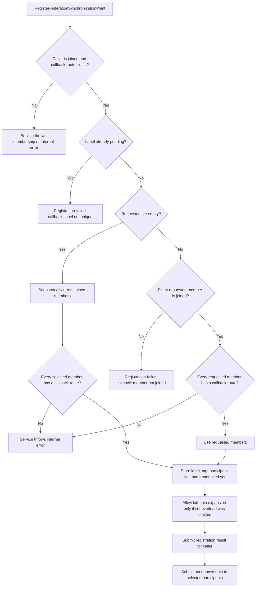

# IEEE 1516.1-2025 Federation Synchronization Points: Contributor Guide

This guide explains the synchronization-point barrier as a sequence of
participant selection, announcement, achievement, and completion. It is written
for contributors and new readers who need to understand the implementation's
less obvious edges before navigating the code. It is not a substitute for the
standard, a new source of requirements, or a claim of conformance.

## Scope and authority

- **Standard boundary:** IEEE 1516.1-2025 only. The 2010 API/runtime is a
  separate compatibility stream and is not combined with this guide.
- **Implementation boundary:** synchronization-point behavior in Umbra's 2025
  embedded federation-management development profile, with selected tests for
  the configured process endpoint. Those are separate implementation paths;
  the tests do not establish full backend parity.
- **Normative authority:** the [official IEEE 1516.1-2025 Federate Interface
  Specification](https://standards.ieee.org/ieee/1516.1/6688/) defines the
  standard behavior. Source links below describe Umbra's current behavior;
  tests establish only their named scenarios. Neither code nor tests override
  the standard.
- **Traceability boundary:** this is explanatory Umbra documentation. It adds
  no Requirements Lab mappings or conformance evidence.

For adjacent but distinct protocols, see the [2025 federation lifecycle
guide](HLA-2025-FEDERATION-AND-FEDERATE-LIFECYCLE-FLOW-GUIDE.md), [callback and
service ordering guide](HLA-2025-CALLBACK-AND-SERVICE-ORDERING-FLOW-GUIDE.md),
and [save/restore guide](HLA-2025-FEDERATION-SAVE-RESTORE-FLOW-GUIDE.md).

## The mental model

A synchronization point is a named barrier over a set of joined federates.
Registration establishes the point and announces it to participants; each
participant reports whether it achieved the point; the RTI closes the barrier
when every participant still in the set has reported. The final callback tells
participants who failed to synchronize. This is a federation-management
barrier, not a logical-time grant or an application-wide atomic transaction.

Keep these four sets/states distinct when reading the registry:

| State | Meaning |
| --- | --- |
| Synchronization set | Current participants whose achievement is required before the barrier completes. |
| Announced federates | Participants to whom the label has been announced; achievement is accepted only for an announced member. |
| Achieved federates | Participants that have reported, paired with their success/failure result. |
| Failed-to-synchronize set | The false results among the achieved participants when completion is formed; it is not the same thing as the participants who have not yet achieved. |

## Registration chooses the barrier participants

The API has an overload without a synchronization set and an overload with
one. Both initially create a barrier over the current joined members when the
requested set is empty. There is an implementation-specific distinction:
Umbra permits late-join expansion only when the set was **omitted**. Passing an
explicitly empty set snapshots the current members but does not opt into later
expansion. The direct test covers an explicit non-empty set and the omitted-set
overload; the explicitly empty-set distinction is currently source-derived and
does not have its own focused test.



The ordering in the final two boxes is the embedded adapter's submission
ordering: it submits the registering federate's succeeded/failed callback
before it submits the announcement batch. Whether callbacks run immediately or
wait for an evoke boundary depends on the callback model; this diagram does not
claim that the application has already executed the callback when the service
returns. The cited scenarios exercise both callback models, but do not assert
the relative registration/announcement order. That order is source-derived.
See [callback and service ordering](HLA-2025-CALLBACK-AND-SERVICE-ORDERING-FLOW-GUIDE.md).

## Late joiners change only an expandable barrier

The barrier's participant set is not always fixed at registration. After a
federate joins, Umbra checks every pending point. If expansion is enabled, the
new federate is added to both the synchronization set and announced set and is
sent that point's label and tag. It must then achieve the point too. An
explicit-set point, including one created through the explicit-empty overload,
does not expand.

```mermaid
stateDiagram-v2
  direction LR
  [*] --> PendingBarrier: registration committed
  PendingBarrier --> PendingBarrier: late join + expansion enabled / add and announce new member
  PendingBarrier --> PendingBarrier: late join + expansion disabled / participant set unchanged
  PendingBarrier --> WaitingForRemaining: one participant achieves
  WaitingForRemaining --> WaitingForRemaining: another participant achieves; barrier still incomplete
  WaitingForRemaining --> Completed: every current participant has achieved
  PendingBarrier --> Completed: resignation removes last required participant
  WaitingForRemaining --> Completed: resignation removes remaining unachieved participant(s)
  Completed --> [*]: notify current participants and erase point
```



The chart compresses two details: a barrier can receive several achievements
before or after a late join; and a resignation completes it only if every
participant left in the synchronization set has already achieved. If it does
complete, the resigning federate is removed from the set before the final
failed-to-synchronize set is calculated.

## Achievement is a fan-in, not a per-caller completion

In the current registry implementation, an accepted
`synchronizationPointAchieved` records that caller's first result.
Until all current members have reported, there is no federation-synchronized
notification. When the last required result arrives, Umbra collects the
participants whose recorded result was false, prepares a notification for each
current participant in the barrier, and removes the pending point. A repeat
achievement does not replace a participant's first result or generate a second
completion. After removal, a further achievement is rejected as an unannounced
label.

```mermaid
sequenceDiagram
  participant A as Federate A
  participant RTI as RTI / federation registry
  participant B as Federate B
  A->>RTI: synchronizationPointAchieved(label, true)
  RTI->>RTI: Record A's first result
  Note over RTI: Barrier remains pending while B has not achieved
  B->>RTI: synchronizationPointAchieved(label, false)
  RTI->>RTI: Record B; all current participants have now achieved
  RTI->>RTI: Failed-to-sync set = {B}; erase pending point
  RTI-->>A: federationSynchronized(label, {B})
  RTI-->>B: federationSynchronized(label, {B})
```

If a participant resigns before the barrier completes, resignation removes it
from the participant, announced, and achieved sets and re-evaluates completion.
It is not automatically reported as a failed achievement. For example, if A
has achieved and B resigns, A can receive `federationSynchronized` with an empty
failed-to-synchronize set. This is an Umbra behavior demonstrated by a focused
HLA_EVOKED service-report test; consult the standard before treating it as a
normative interpretation.

## Save/restore preserves an in-flight barrier

The state image records a pending point's label, user tag, synchronization set,
announced set, late-join-expansion flag, and each achievement result. Restore
rebuilds that pending state and rejects inconsistent participant/achievement
references. A focused public-API test saves an announced-but-unachieved point,
completes the live point, restores, and then achieves the restored point. The
codec test also round-trips a recorded false achievement. Those tests do not
establish an end-to-end restore of a multi-member barrier with only some members
already achieved. Save/restore is not the same as completing or re-registering
the point. The [save/restore guide](HLA-2025-FEDERATION-SAVE-RESTORE-FLOW-GUIDE.md)
covers the broader state-image protocol and its separate restore gates.

## Implementation and test evidence

| Concern | Umbra implementation | Focused evidence |
| --- | --- | --- |
| Public overloads, set-supplied distinction, callback routing | [2025 ambassador service](../../cpp/src/internal/runtime/umbra_rti_ambassador_federation_lifecycle.cpp#L1073) | [evoked embedded scenario](../../cpp/tests/synchronization_point_catch2.cpp#L242), [immediate embedded scenario](../../cpp/tests/synchronization_point_catch2.cpp#L253) |
| Participant selection, duplicate-label rejection, announcement, achievement fan-in | [embedded federation registry](../../cpp/src/internal/federation/federation_registry.cpp#L111) | [late-join expansion and explicit-set boundary](../../cpp/tests/ieee1516_2025_federation_registry_synchronization_point_late_join_explicit_set_catch2.cpp#L16), [public API scenario](../../cpp/tests/synchronization_point_catch2.cpp#L113) |
| Registration result submitted before announcement batch | [callback submission adapter](../../cpp/src/internal/runtime/umbra_rti_ambassador.cpp#L1182) | [evoked](../../cpp/tests/synchronization_point_catch2.cpp#L242) and [immediate](../../cpp/tests/synchronization_point_catch2.cpp#L253) callback-model scenarios demonstrate dispatch, but do not assert relative callback order |
| Late-join hook and announcement submission | [join lifecycle hook](../../cpp/src/internal/runtime/umbra_rti_ambassador_federation_lifecycle.cpp#L740) | [late-join expansion test](../../cpp/tests/ieee1516_2025_federation_registry_synchronization_point_late_join_explicit_set_catch2.cpp#L16) |
| Resignation removes a member and can close the barrier | [resignation cleanup](../../cpp/src/internal/federation/federation_registry_resign_lifecycle.cpp#L918) | [resignation completion and callback/report ordering](../../cpp/tests/service_report_file_federation_synchronized_resignation_catch2.cpp#L186) |
| Pending barrier state image | [capture](../../cpp/src/internal/federation/federation_registry_state_image_capture.cpp#L341), [restore and validation](../../cpp/src/internal/federation/federation_registry_state_image_restore.cpp#L410) | [public save/restore of an announced point](../../cpp/tests/ieee1516_2025_federation_management_save_restore_catch2.cpp#L422), [filesystem restart](../../cpp/tests/ieee1516_2025_federation_registry_synchronization_point_filesystem_restart_catch2.cpp#L3), [codec round-trip including an achievement result](../../cpp/tests/ieee1516_2025_federation_state_image_codec_catch2.cpp#L406) |
| Configured process endpoint, explicit set and failure results | [process branch in ambassador service](../../cpp/src/internal/runtime/umbra_rti_ambassador_federation_lifecycle.cpp#L1128) | [evoked process-endpoint case](../../cpp/tests/ieee1516_2025_connection_synchronization_failure_catch2.cpp#L457), [immediate/pushed process-endpoint case](../../cpp/tests/ieee1516_2025_connection_synchronization_failure_catch2.cpp#L674) |

These tests exercise named paths in Umbra's development profiles. In
particular, the focused late-join test exercises registry behavior directly,
and the filesystem restart test exercises persistence. Neither is by itself
public-API conformance evidence.

## What this guide does not claim

- It does not merge or infer behavior for IEEE 1516.1-2010. That edition has a
  separate [bounded reference-RTI guide](HLA-2010-REFERENCE-RTI-FLOW-GUIDE.md).
- It does not assert that the source-derived explicitly empty set behavior is
  covered by a focused test.
- It does not establish an end-to-end save/restore test for a multi-member
  barrier with a partially completed achievement set, or a focused test of a
  repeated achievement before barrier completion.
- It does not establish that the process endpoint has every embedded behavior,
  ordering property, failure mode, or restart capability.
- It does not model every registration failure, transport race, callback queue
  policy, or save/restore failure path.
- It does not state exact normative clause text or replace checking the
  applicable clauses in the official standard.
- It does not add or revise Requirements Lab records.
