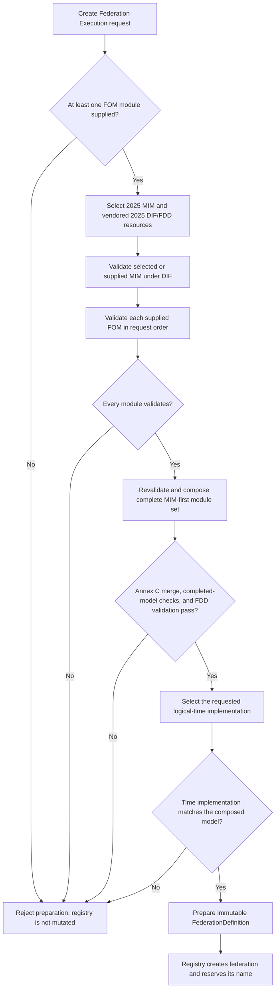
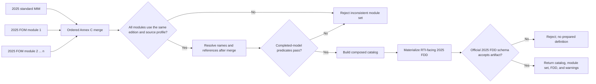
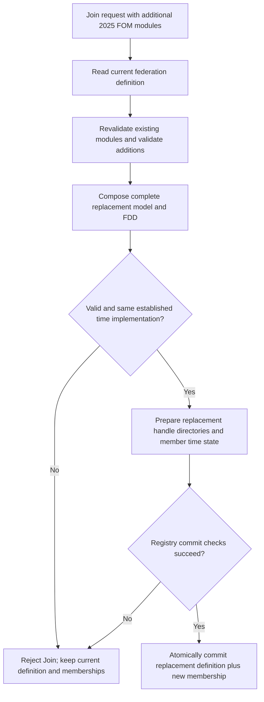

# IEEE 1516.1-2025 FOM Module Admission and Composition: Flow Guide

This guide explains how the 2025 embedded federation-management profile turns
the ordered FOM-module arguments of Create or Join Federation Execution into a
validated federation definition. It focuses on the boundaries where an
individually valid module can still fail as part of a federation model.

## Scope and authority

- **Edition boundary:** RTI services are from IEEE 1516.1-2025; model-module
  syntax and the DIF/FDD/OMT schemas are from the [official IEEE
  1516.2-2025 OMT specification](https://standards.ieee.org/ieee/1018/6689/).
  The [IEEE 1516.1-2025 Federate Interface
  Specification](https://standards.ieee.org/ieee/1516.1/6688/) is the authority
  for the public Create/Join services.
- **Implementation boundary:** this is the 2025 strict-source, embedded
  development profile. Process-endpoint evidence is not treated as proof of
  embedded-path equivalence.
- **Documentation boundary:** this guide explains current source and selected
  tests; it is not a new requirement mapping or conformance claim.

The existing [FOM validation design](../fom/FOM-VALIDATION-DESIGN.md#required-runtime-boundary)
documents the larger validator policy and its evidence. This guide supplies
the learner-facing sequence and calls out the create/join state boundary.

## Three different meanings of “valid”

Do not collapse these stages:

| Stage | Question answered | What it does not establish |
| --- | --- | --- |
| Per-module DIF validation | Is this supplied 2025 MIM/FOM/SOM document well-formed for its module role and valid against the selected 2025 DIF schema? | That its declarations are compatible with other modules or can form a valid FDD. |
| Complete-set composition/preflight | Can the ordered, same-edition module set be merged under the implemented Annex C rules, and do completed-model references resolve? | That the resulting FDD serialization is acceptable to the official FDD schema. |
| FDD materialization and validation | Can Umbra represent the merged 2025 model in its RTI-facing FDD artifact, and does that artifact validate against the selected 2025 FDD schema? | That every behavior described by every FOM is implemented by the RTI. |

The OMT schema has a separate strict-complete-model role in test/design policy;
it is not substituted for DIF when validating each input module. In
particular, some cross-module key/keyref references are intentionally
unresolved until composition.

## Create: prepare the entire definition before reserving its name

In the embedded profile, creation is a prepare-then-commit transition. A
failed validation, composition, FDD, or time-selection step occurs before the
registry's create operation, so it must not reserve the federation name.

If the standard MIM is omitted, the coordinator loads Umbra's selected 2025
standard MIM first. A supplied MIM designator is validated as the MIM input;
it is not an extra FOM. At least one FOM designator is required by this
development profile's Create path. The coordinator returns a prepared
definition without mutating the registry; the ambassador calls registry
`create` only after preparation succeeds.

The public designator and the canonical local file path have different jobs:
the designator is retained as the supplied module identity, while the
canonical path is used to open the source safely. The composer reloads and
revalidates its module descriptors at the composition boundary rather than
treating an earlier validation result as a permanent parsed document.

## Composition: merge first, resolve the completed model second

Every module must first pass its selected DIF validation. That is necessary,
but not sufficient: composition applies table-specific duplicate rules and
then resolves references against the **whole** merged model.

Consequences that are easy to miss:

- A reference in an earlier module may resolve to a declaration in a later
  module. The composer intentionally delays completed-model resolution until
  after the full MIM-first set has merged.
- “Merge” is not “concatenate” and is not universally “last definition wins.”
  Annex C defines different duplicate behavior by table. Equivalent class
  definitions may merge; incompatible definitions fail. The implemented
  Annex C.8 switch path retains the first module's setting and reports a
  warning for a conflicting later setting, so preserve module order.
- A DIF-valid extension can still make the merged set unrepresentable in the
  official FDD schema. FDD generation/validation is its own failure boundary,
  not a guarantee implied by per-module validation.
- Fixed module order is repeatable in the tested materializer. That is not a
  promise that arbitrary reorderings produce identical FDD bytes or equivalent
  first-setting outcomes.

For the 2025 schemas, use DIF on individual modules, FDD on Umbra's composed
artifact, and OMT only for the separate complete-model validation policy.
Never make a single module appear complete by inventing cross-module rows.

## Join with additional FOM modules: replace definition and add member together

An ordinary Join without extra FOM modules uses the existing federation
definition. When additional modules are supplied, Umbra prepares a replacement
definition before committing the new membership. It revalidates the existing
modules as well as the added ones, composes the entire replacement set, and
keeps the federation's established logical-time implementation.

This makes the additional-module Join an atomic shared-state transition, not a
sequence of “install FOM, then maybe join.” A failed addition must not leave a
partially installed catalog or prevent another member from joining against the
prior definition. A successful addition must reconcile existing class,
attribute, interaction, parameter, dimension, and transportation handle
directories before the replacement definition and membership are committed.

## Keep the 2010 model lane separate

This flow is **not** the IEEE 1516.2-2010 compatibility path and is not a
2010 RTI implementation guide. The current code rejects a mixed 2010/2025
module set. The opt-in 2010 model-compatibility milestone selects separate
2010 resources and is catalog-only; it does not manufacture a 2025 FDD or
claim a 2010 RTI API/conformance profile. See the edition-specific boundary
and limitations in the [FOM validation design](../fom/FOM-VALIDATION-DESIGN.md#L595).

## Implementation and focused evidence

| Boundary | Implementation | Focused evidence |
| --- | --- | --- |
| Per-module 2025 DIF validation | [LibXml2 module validator](../../cpp/src/internal/fom/libxml2_fom_validator.cpp#L7), [Create preparation](../../cpp/src/internal/federation/federation_management_coordinator.cpp#L151) | [valid official modules, missing/malformed/wrong-namespace/DTD cases](../../cpp/tests/libxml2_fom_validator_catch2.cpp#L41) |
| Ordered merge and complete-model reference resolution | [2025 composer entry point](../../cpp/src/internal/fom/libxml2_fom_composer.cpp#L2115) | [cross-module data-type and class references](../../cpp/tests/fom_composer_reference_resolution_catch2.cpp#L11) |
| FDD serialization/schema boundary | [FDD materializer](../../cpp/src/internal/fom/libxml2_fom_composer.cpp#L1430) | [MIM plus supplied base FOM produces catalog and validated FDD](../../cpp/tests/libxml2_fom_composer_catch2.cpp#L345), [DIF-valid extension rejected at FDD boundary](../../cpp/tests/ieee1516_2025_embedded_fom_preparation_atomicity_catch2.cpp#L29) |
| Duplicate behavior and fixed-order repeatability | [Annex C merge implementation](../../cpp/src/internal/fom/libxml2_fom_composer.cpp#L843) | [first switch retained with warning](../../cpp/tests/libxml2_fom_composer_catch2.cpp#L885), [fixed-input repeatability](../../cpp/tests/libxml2_fom_composer_catch2.cpp#L837), [equivalent duplicate vs. conflict](../../cpp/tests/libxml2_fom_composer_catch2.cpp#L2131) |
| Create failure before federation-name reservation | [Prepare, then registry create](../../cpp/src/internal/runtime/umbra_rti_ambassador_federation_lifecycle.cpp#L201) | [failed Create leaves name available; valid Create then succeeds](../../cpp/tests/ieee1516_2025_embedded_fom_preparation_atomicity_catch2.cpp#L4) |
| Additional-module Join commit boundary | [Prepare replacement and commit definition with membership](../../cpp/src/internal/runtime/umbra_rti_ambassador_federation_lifecycle.cpp#L508), [atomic registry transition](../../cpp/src/internal/federation/federation_registry_membership_lifecycle.cpp#L216) | [failed addition leaves base federation joinable](../../cpp/tests/ieee1516_2025_embedded_fom_preparation_atomicity_catch2.cpp#L29), [registry replacement-definition contract](../../cpp/tests/federation_registry_foundation_catch2.cpp#L123) |

The linked tests prove only their named cases. They do not establish exhaustive
coverage of every Annex C table, every schema-valid FOM, process/embedded
equivalence, or general IEEE conformance.

## What this guide does not claim

- It does not describe the 2010 catalog compatibility path as a 2025 pipeline
  or infer a 2010 RTI implementation.
- It does not treat validation of every individual module as proof that the
  composite model is valid or representable as an FDD.
- It does not claim the current composer implements every 2025 OMT rule or
  that the resulting runtime implements every declared model feature.
- It does not expand or map the HLA Requirements Lab.
