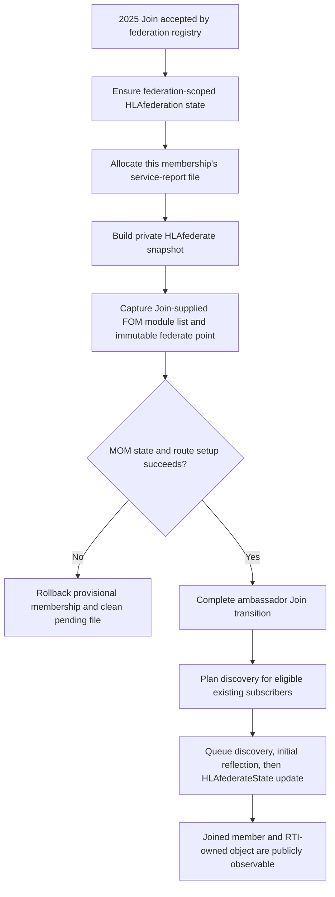
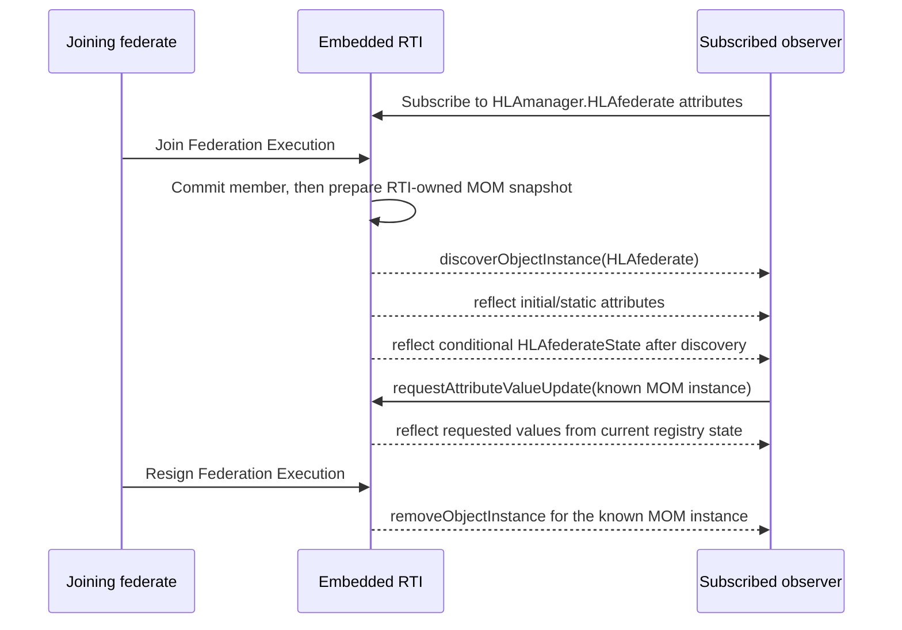
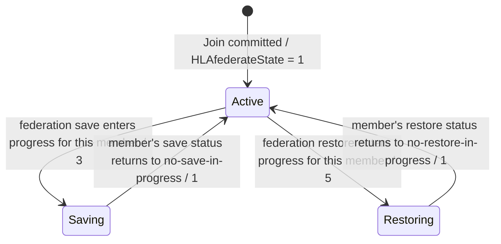
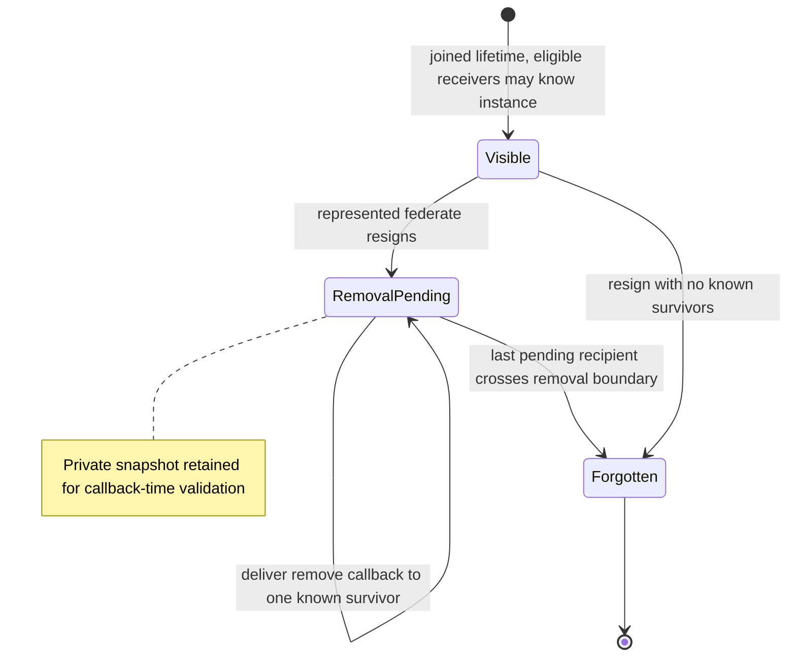

# IEEE 1516.1-2025 Joined-Federate MOM Object: Lifecycle and State Flow Guide

This guide follows the RTI-owned `HLAmanager.HLAfederate` object from a
successful 2025 Join through discovery, current-value requests, save/restore
state changes, and resignation. The aim is to distinguish the RTI's private
snapshot from the public object-management callbacks used to expose it.

## Scope and authority

- **Edition boundary:** IEEE 1516.1-2025 behavior, with the 2025 standard MIM
  and its `HLAfederate` definitions. The [official Federate Interface
  Specification](https://standards.ieee.org/ieee/1516.1/6688/) is normative;
  the [IEEE 1516.2-2025 OMT specification](https://standards.ieee.org/ieee/1018/6689/)
  defines the model/schema context.
- **Implementation boundary:** the 2025 embedded federation-management
  development profile. Process endpoints and 2010 compatibility are not
  inferred from this path.
- **Topic boundary:** this is the joined-federate object lifecycle and the
  focused `HLAfederateState` field. It is not a guide to every HLAfederate
  periodic counter, every HLAfederation projection, or service/exception
  reporting interactions.

For its implementation context, see the broader
[MOM service-reporting design](MOM-SERVICE-REPORTING-DESIGN.md) and the
[federation lifecycle guide](HLA-2025-FEDERATION-AND-FEDERATE-LIFECYCLE-FLOW-GUIDE.md).

## Private snapshot versus public MOM object

Umbra keeps an RTI-owned joined-federate snapshot in the federation registry.
That snapshot is the source for public object discovery, initial reflections,
current-value requests, and selected conditional updates. It is not itself a
callback, and it is not registered by a federate through the public
`registerObjectInstance` service.

The 2025 Join path also establishes one federation-scoped `HLAfederation`
object, separately from each member's `HLAfederate` instance. The shared object
is not a substitute for the per-membership object described here.

## Join builds the object before making the member visible

The embedded 2025 join path first commits a provisional registry membership,
then establishes its RTI-owned MOM state and report-file lifetime. The
per-member object is prepared before the ambassador completes the visible Join
transition; discovery work is planned after that transition so existing
subscribers see a coherent joined lifetime.

The HLAfederate instance is created only for the 2025 MOM projection when the
production Join path has a public report-file location. The test-only memory
report store intentionally does not invent such a public path. Setup failures
roll back the provisional member and clean its pending report file; the
federation-scoped MOM object has a different lifetime and must not be assumed
to be per-member cleanup.

## Subscription controls public discovery; Join is not a callback

A receiving federate sees the RTI-owned instance through the normal object
class subscription and discovery/reflection callback route. The RTI is the
producer, so the reflected `producingFederate` handle is invalid in the focused
tests. Callback execution still follows the receiver's callback model:
`HLA_EVOKED` work is delivered when the receiver evokes callbacks; the focused
scenario also exercises `HLA_IMMEDIATE`.

The standard object handle is usable through public object services after
discovery, including object-class/name lookup and attribute value requests.
This does not mean the instance is visible to every member: recipients still
depend on the applicable declarations and discovery projection. DDM-specific
scope behavior is documented separately in the
[DDM and regions guide](HLA-2025-DATA-DISTRIBUTION-AND-REGIONS-FLOW-GUIDE.md).

## Snapshot values and live state are different kinds of data

The initial per-Join values include the federate handle, name and type, host,
RTI version, the FOM designators supplied at **this member's Join**, and the
immutable service-report-file path. The Join-scoped module list is not the
federation's complete FOM list. Switch changes do not replace the object's
identity or its already selected report-file path. For the difference between
Create-time federation policy and per-member advisory seeding, see the
[federation MOM switch-lifecycle flow](HLA-2025-FEDERATION-MOM-FLOW-GUIDE.md#creation-time-federation-policy-versus-per-member-switch-seeding).

Other attributes are derived from the authoritative current federation/member
ledgers when a value is requested or an update is planned. `HLAfederateState`
is one example: Umbra derives it from save/restore operation status, not from
whether a particular callback has already been delivered.

In the current source, the 2025 state encodings used by the focused flow are:

| State | Encoded value | Source of the state |
| --- | ---: | --- |
| Active federate | `1` | No save or restore operation is active for this member. |
| Federate save in progress | `3` | The current save ledger records an in-progress status for this member. |
| Federate restore in progress | `5` | The current restore ledger records an in-progress status for this member. |

The state is conditional: it is absent from the initial static reflection in
the focused test, can be explicitly queried for its current value, and changes
at save/restore boundaries.

Treat this as the current implementation's state projection, not as a
replacement for the save/restore protocol's own callbacks and gates. In the
focused save/restore scenario, observers receive the conditional `3 → 1` and
`5 → 1` updates; the federate currently saving does not receive its own
save-state reflection. Initial/requested values and transition reflections are
separate observations of the same registry state.

## Resignation removes visibility before forgetting the snapshot

On resignation, Umbra does not send the joined-federate MOM instance through
the ordinary federate-created-object ownership/resign-action path. It plans
RTI-originated removal for surviving federates that knew the instance. If
removal callbacks are still pending, the private snapshot is retained until
those recipients cross the callback-time removal boundary; it is erased once
no known-recipient removal remains. This keeps callback data available without
keeping the departed membership active.

A later rejoin is a new membership and gets a distinct joined-federate object
instance. The focused integration case verifies public discovery/reflection,
request-time values, resignation removal, and fresh identity on a second
joined lifetime under both callback models.

## Keep the 2010 path separate

The code explicitly skips synthesis of the 2025 RTI-owned MOM object when the
selected model edition is IEEE 1516.2-2010. The 2010 compatibility lane may
still have a service-report-file lifetime, but it does **not** acquire this
2025 `HLAfederate` projection by inference. This guide makes no claim about a
2010 RTI API or 2010 MOM-object parity; see the explicit boundary in the
[FOM validation design](../fom/FOM-VALIDATION-DESIGN.md#L595).

## Implementation and focused evidence

| Concern | Umbra implementation | Focused evidence |
| --- | --- | --- |
| Private per-Join snapshot and MIM initial values | [Registry object construction](../../cpp/src/internal/federation/federation_registry_mom_object_state.cpp#L187) | [Snapshot values and new identity after rejoin](../../cpp/tests/ieee1516_2025_joined_federate_mom_snapshot_foundation_catch2.cpp#L5) |
| Join-time setup, visibility, and callback scheduling | [Join lifecycle](../../cpp/src/internal/runtime/umbra_rti_ambassador_federation_lifecycle.cpp#L610), [discovery and conditional state queue](../../cpp/src/internal/runtime/umbra_rti_ambassador_federation_lifecycle.cpp#L737) | [Public discovery/reflection/request/removal scenario](../../cpp/tests/ieee1516_2025_joined_federate_mom_public_object_lifecycle_catch2.cpp#L4) |
| Join-scoped FOM module designators | [Snapshot descriptor](../../cpp/src/internal/federation/federation_registry_mom_object_state.cpp#L303) | [Additional-module Join snapshot](../../cpp/tests/ieee1516_2025_joined_federate_mom_fom_module_snapshot_integration_catch2.cpp#L5) |
| Dynamic current value and `HLAfederateState` encoding | [Value derivation from member operation ledgers](../../cpp/src/internal/federation/federation_registry_mom_object_state.cpp#L609), [attribute-value request route](../../cpp/src/internal/federation/federation_registry_attribute_value_update_requests.cpp#L360) | [Save/restore conditional state transitions](../../cpp/tests/joined_federate_mom_federate_state_save_restore_catch2.cpp#L138) |
| Pending removal and snapshot retention | [Resignation removal ledger](../../cpp/src/internal/federation/federation_registry_resign_lifecycle.cpp#L1021) | [Public object removal after resign](../../cpp/tests/ieee1516_2025_joined_federate_mom_public_object_lifecycle_catch2.cpp#L290) |
| Edition guard against synthesizing the 2025 MOM object from a 2010 model | [Join's 2010 compatibility guard](../../cpp/src/internal/runtime/umbra_rti_ambassador_federation_lifecycle.cpp#L606) | The 2010 compatibility flow is intentionally outside this guide; the source guard is not evidence of 2010 API/MOM conformance. |

These tests cover selected embedded scenarios, not every MIM attribute, every
subscription/DDM combination, all save/restore interleavings, process
endpoints, or complete IEEE conformance.

## What this guide does not claim

- It does not describe `HLAreportServiceInvocation`, `HLAreportException`, or
  `HLAreportMOMexception` routing.
- It does not model all periodic `HLAfederate` statistics or the full
  `HLAfederation` object.
- It does not claim the same RTI-owned MOM projection exists in the 2010 lane.
- It does not expand or map the HLA Requirements Lab.
