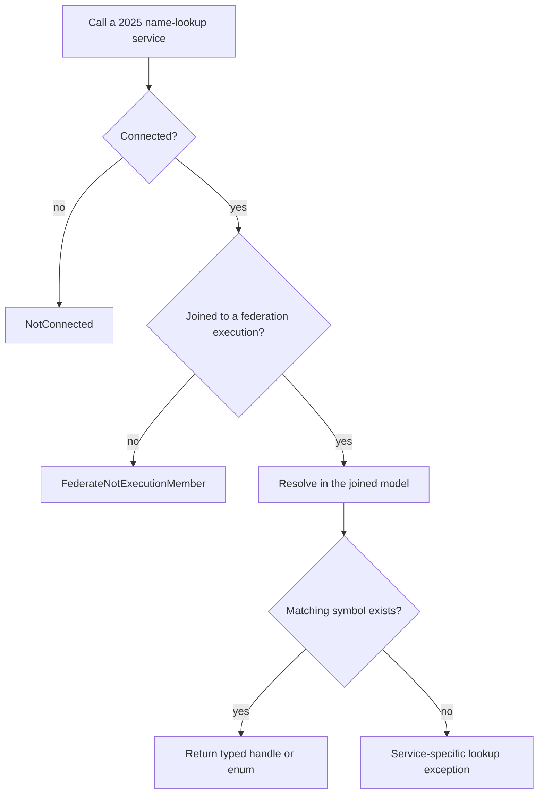
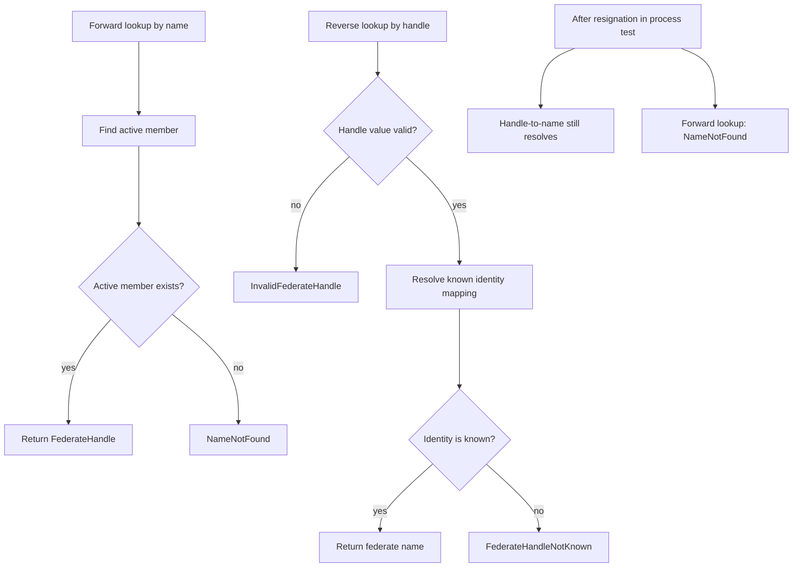
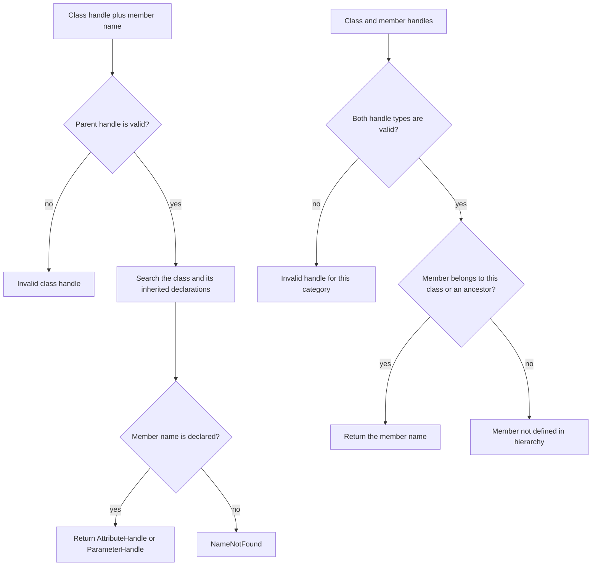
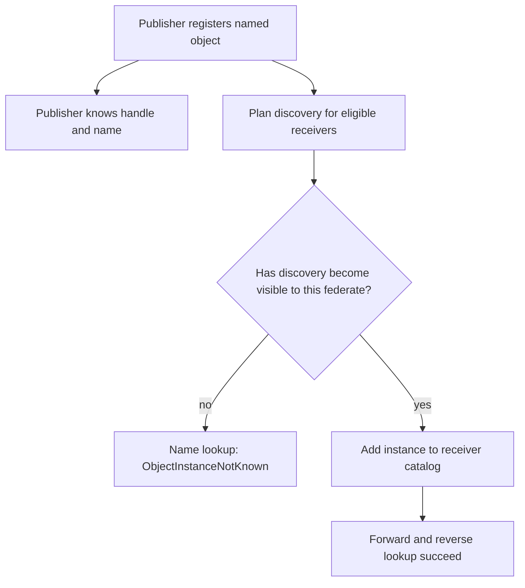
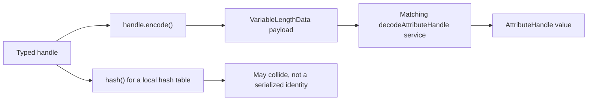
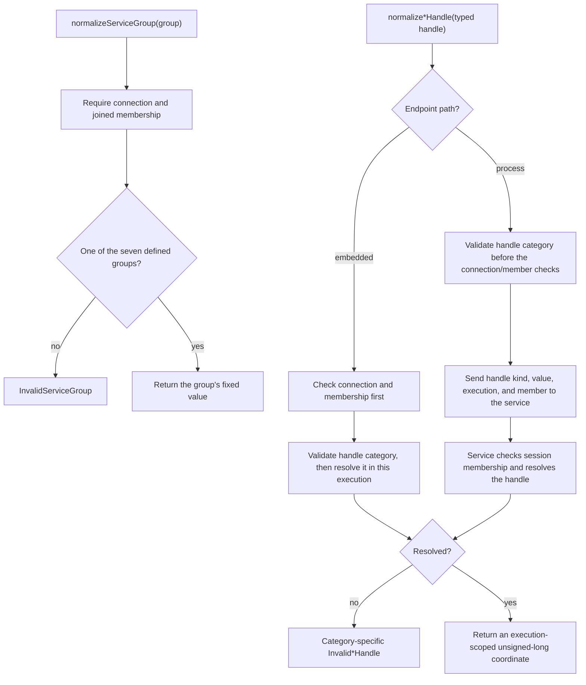

# HLA 1516.1-2025 Names and Handle Resolution

This is a 2025-only guide to how support-service names resolve to typed API
handles, how class-scoped member lookup follows inheritance, and why an object
instance name is only resolvable by a federate that currently knows that
instance. It also distinguishes forward lookup of an active federate name from
reverse lookup of a federate handle. It is a map of the public API and the
observed Umbra implementation, not a claim of complete HLA conformance.

Keep the [2010 reference-RTI guide](HLA-2010-REFERENCE-RTI-FLOW-GUIDE.md)
separate. This document cites only the pinned IEEE 1516.1-2025 API and the
`rti1516_2025` implementation/tests; it makes no 2010 parity claim.

## The short mental model

There are three identity questions that can sound alike:

- “Is this declaration in the joined federation's composed FOM?” For example,
  resolving an object-class name or a dimension name.
- “Does this federate currently know this object instance?” An object-instance
  name is not just another declaration in the FOM; the per-federate known-object
  state matters.
- “Is this federate name active, or is this handle known?” The two federate
  lookup directions have distinct API exceptions and should not be assumed to
  have identical lifetime semantics.

The C++ API also makes the symbol category part of the type. An
`ObjectClassHandle` is not an `InteractionClassHandle`, and an
`AttributeHandle` is not a `ParameterHandle`. The official handle header defines
each as a distinct class, even though the interfaces share operations. Its
`hash()` value is explicitly allowed to collide, so use handle equality for
identity. Use the matching handle `encode()`/`decode...Handle()` API when a
handle must be carried as data; do not treat a hash or guessed integer as the
portable handle value.

## 1. Resolve a model symbol only in an execution context

The public name-lookup services are support services, but they are not
pre-join FOM inspection. Umbra first requires a live connection and membership
in a federation execution. It then asks the configured backend to resolve the
name against that execution's model catalog and returns the category-specific
handle.

In the embedded path, the ambassador checks its joined-member record and uses
the federation registry. With a configured process endpoint, it asks the
process client using the joined federation and federate identity instead of
consulting a potentially stale process-local catalog. Both paths are present
in source. The focused evidence below is split by backend: embedded tests cover
the broader hierarchy, dimension, and known-instance flows, while one
process-endpoint integration test covers object/interaction class
name-to-handle and handle-to-name lookups plus unknown reverse handles. This
does not establish parity for every lookup family.

## 2. Federate name and handle lookup have distinct lifetime paths

The 2025 API exposes `getFederateHandle(name)` and
`getFederateName(handle)` as separate support services. In Umbra, forward lookup
resolves an active member name; reverse lookup consults the federation's known
identity mapping. A focused configured-process-endpoint test observes that,
after a federate resigns, its handle still resolves to its name while its name
no longer resolves to an active handle. This is an implementation/test
observation for that process scenario, not a claim that every profile or
conforming RTI must retain the same post-resignation mapping.

The public API documents different exception sets for the two calls (10.2 and
10.3). The post-resignation branch above is deliberately marked as an observed
process-test result; do not generalize it to the embedded profile without
corresponding evidence.

## 3. Class-scoped names follow the declared hierarchy

An attribute name is looked up with an `ObjectClassHandle`; a parameter name is
looked up with an `InteractionClassHandle`. The parent handle is part of the
lookup key. A member inherited from an ancestor can be resolved through a child
class, and the same declared member handle is returned. Reverse lookup likewise
checks the supplied class/member pair; a valid member handle by itself is not
enough to establish that the member belongs to the requested class.

The official API lists the precise exception contract per operation. In
particular, `getAttributeName` and `getParameterName` distinguish an invalid
handle from a valid handle that is not defined for the supplied class. Do not
collapse these into a generic “lookup failed” rule.

## 4. Object-instance lookup is federate-local knowledge

An object class is a model declaration. An object instance is created at
runtime, and a receiver does not become able to resolve its name merely
because another federate registered it. The relevant boundary is that
federate's known-object state, which is updated along the discovery/callback
path.

The distinction is observable with evoked callbacks: in the focused embedded
registration/discovery test, a receiver cannot resolve the instance before its
discovery callback has been evoked; after discovery, it can resolve the name
and query the known class. This guide does not restate the full publication,
subscription, relevance, or callback-order state machines; follow the
[object/interaction information guide](HLA-2025-OBJECT-AND-INTERACTION-INFORMATION-FLOW-GUIDE.md)
for those routing decisions.

## 5. Typed handle encoding is not numeric identity

The official `Handle.h` defines separate public classes for each handle kind.
Each kind supports encoding, but the hash is only a container aid and may
collide. Umbra's internal conversion helpers preserve the category at the
boundary while using a private numeric value in the embedded registry. That
representation is an implementation detail, not a cross-execution identity
contract.

Match the decoder to the handle category. The encoding on the public handle is
separate from DataElement serialization, FOM XML materialization, and RTI
transport framing; none of those boundaries should be inferred from the
handle's private numeric representation.

### Normalization support services produce coordinates, not handles

The 2025 API lists `normalizeServiceGroup` and four typed-handle normalization
services in RTI Support (10.29–10.33). They return `unsigned long`; that result
is not another handle and is not the handle's private sequential value. The
Umbra registry describes normalized handle values as execution-scoped
coordinates for standard MIM dimensions, stable for the same designator
throughout an execution, including restore. Its source reserves the maximum
coordinate so a point range `[value, value + 1)` cannot overflow. This is
current Umbra behavior, not a claim that the private mixing algorithm is
standardized.

The service-group result is its fixed enumerator value; it does not use the
execution-specific handle mapping. For handles, the embedded registry accepts
an active federate, a class present in the joined FOM catalog, or an object
instance in the execution's object/MOM-instance directories. In both endpoint
paths the process service ultimately asks that federation registry to resolve
the typed handle. A malformed process-side typed handle is rejected before
the local connection/member gate, while the embedded path checks that gate
first. Treat that error-precedence distinction as source-observed behavior;
the focused cases do not establish all combined-invalid-argument precedence.
Process transport/protocol failures become `RTIinternalError` rather than a
normalized coordinate.

Do not use the returned coordinate as a persistent identity across different
executions, or substitute it for public `encode()`/`decode...Handle()` data.
The embedded focused case observes repeatability and equality across two
joined ambassadors for the same execution-scoped designator; it does not test
cross-execution equality or prove a portable coordinate algorithm.

## Lookup categories and failure distinctions

| Symbol | Forward lookup | Reverse lookup | Important distinction |
| --- | --- | --- | --- |
| Object class | Name → `ObjectClassHandle` | Handle → name | Missing name is `NameNotFound`; an invalid/unknown handle is `InvalidObjectClassHandle`. |
| Attribute | Class + name → `AttributeHandle` | Class + handle → name | Inherited members resolve through child classes; a valid attribute outside the supplied class hierarchy is `AttributeNotDefined`. |
| Interaction class | Name → `InteractionClassHandle` | Handle → name | Separate type from object-class handles; lookup is in the joined execution's interaction catalog. |
| Parameter | Interaction class + name → `ParameterHandle` | Interaction class + handle → name | Inherited parameters resolve through child interaction classes; a valid unrelated handle is `InteractionParameterNotDefined`. |
| Dimension | Name → `DimensionHandle` | Handle → name / upper bound | Availability for a particular object or interaction class is a separate query and belongs with DDM. |
| Federate | Active name → `FederateHandle` | Known handle → name | The API documents distinct lookup exceptions; the cited process test observes reverse lookup surviving resignation while active-name lookup does not. |
| Transportation | Name → `TransportationTypeHandle` | Handle → name | Invalid names use `InvalidTransportationName`, not the generic `NameNotFound`. See the [order and transportation guide](HLA-2025-ORDER-AND-TRANSPORTATION-FLOW-GUIDE.md). |
| Order | Name → `OrderType` enum | Enum → name | This is an enum lookup, not a handle lookup; invalid values use order-specific exceptions. |
| Object instance | Known name → `ObjectInstanceHandle` | Known handle → name | Both directions are scoped to the federate's known instances; unknown-to-this-federate uses `ObjectInstanceNotKnown`. |

## What Umbra currently demonstrates

- Embedded FOM lookup returns stable object-class and interaction-class
  handles after a compatible additional FOM is joined; the tests also show the
  new declarations becoming resolvable. This evidence is for the embedded
  development profile, not a promise about numeric values across different
  federation executions.
- Embedded attribute and parameter lookup resolves inherited declarations
  through child classes and round-trips the same member name/handle pair.
- Dimension lookup resolves declared names, returns upper bounds, and exposes
  dimensions available to each class in its hierarchy. DDM behavior itself is
  covered by the separate regions guide.
- The registration/discovery test observes object-instance name lookup fail
  before discovery is delivered to a receiver and succeed after discovery.
- The configured process-endpoint identity test observes active-name lookup
  fail after resignation while reverse lookup by the former member's handle
  still returns its name. This is scoped to that tested process path.
- The API handle tests exercise value copying, hashing consistency, encoded
  round trips, malformed encodings, and undersized output buffers. The official
  header—not those tests—defines that hashes may collide.
- The embedded normalization case checks the seven-value service-group result,
  in-domain point coordinates, repeatability, and same-execution agreement
  across joined ambassadors. A configured-process case exercises typed
  normalization through the process service. These are 2025 implementation
  observations and do not establish cross-execution coordinate equality.

## Evidence and source map

Normative/API references:

- The pinned [IEEE 1516.1-2025 RTIambassador API](../../third_party/ieee1516.1-2025/include/RTI/RTIambassador.h#L1688)
  documents federate lookup in 10.2–10.3 and labels class, instance,
  attribute, interaction, order, transportation, and dimension lookup in its
  Section 10 support-service operations; handle decode
  operations are listed at [the decode services](../../third_party/ieee1516.1-2025/include/RTI/RTIambassador.h#L2313).
- The pinned [IEEE 1516.1-2025 handle definitions](../../third_party/ieee1516.1-2025/include/RTI/Handle.h#L14)
  document distinct handle classes, encoding, and the non-unique hash rule.
- The pinned [IEEE 1516.1-2025 normalization API declarations](../../third_party/ieee1516.1-2025/include/RTI/RTIambassador.h#L1984)
  list the five RTI Support operations at 10.29–10.33 and their declared
  exception categories; this header is not a substitute for the full standard
  clause text.

Umbra implementation paths:

- [Object-class name/handle lookup](../../cpp/src/internal/runtime/umbra_rti_ambassador_object_class_lookup.cpp#L17)
- [Attribute name/handle lookup](../../cpp/src/internal/runtime/umbra_rti_ambassador_attribute_lookup.cpp#L19)
- [Interaction-class and parameter lookup](../../cpp/src/internal/runtime/umbra_rti_ambassador_interaction_class_lookup.cpp#L16)
- [Known object-instance lookup](../../cpp/src/internal/runtime/umbra_rti_ambassador_object_instance_lookup.cpp#L16)
- [Federate name/handle identity lookup](../../cpp/src/internal/runtime/umbra_rti_ambassador_federate_identity_lookup.cpp#L16)
- [2025 `normalizeServiceGroup` path](../../cpp/src/internal/runtime/umbra_rti_ambassador_handle_normalization.cpp#L22)
- [2025 typed-handle normalization paths and endpoint-specific ordering](../../cpp/src/internal/runtime/umbra_rti_ambassador_handle_normalization.cpp#L115)
- [Execution-scoped coordinate stability across restore](../../cpp/src/internal/federation/federation_registry.hpp#L780)
- [Execution-scoped normalized-value mapping and point-range bound](../../cpp/src/internal/federation/federation_registry_membership_lifecycle.cpp#L614)
- [Process service handle-normalization registry dispatch](../../cpp/src/internal/federation/process_federation_service_request_handlers.cpp#L86)
- [Dimension name lookup](../../cpp/src/internal/runtime/umbra_rti_ambassador_dimension_region_services.cpp#L238)
- [Typed internal ObjectClassHandle boundary](../../cpp/src/internal/handles/object_class_handle.hpp#L9)
- [Typed internal AttributeHandle boundary](../../cpp/src/internal/handles/attribute_handle.hpp#L9)

Focused test sources (these links identify test evidence; this documentation
change does not claim to have run the tests):

- [Object-class lookup and compatible FOM extension](../../cpp/tests/object_class_lookup_catch2.cpp#L51)
- [Inherited attribute lookup and reverse-pair errors](../../cpp/tests/attribute_lookup_catch2.cpp#L51)
- [Interaction-class lookup and compatible FOM extension](../../cpp/tests/interaction_class_lookup_catch2.cpp#L51)
- [Inherited parameter lookup and reverse-pair errors](../../cpp/tests/parameter_lookup_catch2.cpp#L51)
- [Dimension lookup, hierarchy availability, and bounds](../../cpp/tests/dimension_lookup_catch2.cpp#L53)
- [Per-federate object-instance discovery and name lookup](../../cpp/tests/object_instance_registration_discovery_catch2.cpp#L78)
- [Configured process-endpoint federate identity lookup and post-resignation observation](../../cpp/tests/ieee1516_2025_connection_federate_identity_lookup_catch2.cpp#L459)
- [Configured process-endpoint object/interaction class name-handle round trips](../../cpp/tests/ieee1516_2025_connection_reverse_fom_lookup_catch2.cpp#L459)
- [Transportation lookup](../../cpp/tests/transportation_type_lookup_catch2.cpp#L50) and [order enum lookup](../../cpp/tests/order_type_lookup_catch2.cpp#L49)
- [Public handle encoding round-trip and malformed-data tests](../../cpp/tests/object_class_handle_catch2.cpp#L43)
- [Embedded 2025 normalized DDM-coordinate behavior](../../cpp/tests/handle_normalization_catch2.cpp#L60)
- [Configured-process 2025 handle-normalization path](../../cpp/tests/ieee1516_2025_connection_handle_normalization_catch2.cpp#L459)
- [Normalization service-report return arguments](../../cpp/tests/ieee1516_2025_support_handle_normalization_service_report_return_arguments_catch2.cpp#L5)

## Known gaps and boundaries

- The embedded tests cover the broader hierarchy, dimension, and known-instance
  cases. Process-endpoint tests cover object/interaction class lookup and
  federate identity lookup; they do not establish complete process/embedded
  semantic parity for attributes, parameters, dimensions, transportation, or
  federate-local object instances. The post-resignation identity asymmetry is
  one focused process-test observation, not a general profile guarantee.
- This guide does not claim that a numeric handle or its hash is meaningful
  across executions, process restarts, or implementations. Use the public
  typed handle APIs and matching encode/decode operations.
- It does not model all publication, subscription, DDM, name-reservation,
  object-removal, or save/restore transitions; follow the linked topic guides.
- No 2010 behavior is inferred. Keep the reference-RTI profile in its separate
  guide and compare editions only with separate evidence.

Visual verification is pending; track it in the
[behavior-flow guide backlog](HLA-BEHAVIOR-FLOW-GUIDES.md).
