# IEEE 1516.1-2025 Object and Interaction Information Flow

This guide traces how object attributes and interactions become eligible to
move between federates, what an update request actually asks for, and how
object knowledge is ended. It is a contributor's map of the current Umbra
implementation, not a replacement for the standard or a claim of complete
support or conformance.

## Scope and authority

- **Edition boundary:** IEEE 1516.1-2025 only. The 2010 API/runtime and its
  tests are a separate compatibility stream; this guide neither describes nor
  compares them.
- **Implementation boundary:** the current embedded federation-management
  development profile and selected 2025 process-endpoint integration cases.
  These are evidence for specific paths, not every transport or deployment.
- **Normative authority:** the [official IEEE 1516.1-2025 Federate Interface
  Specification](https://standards.ieee.org/ieee/1516.1/6688/). Check exact
  service and callback clauses there before turning this guide into a
  requirement or a conformance claim. The guide intentionally avoids inventing
  clause mappings.
- **Evidence rule:** source links describe current implementation decisions;
  test links show only the scenario each test exercises. Internal tests are
  implementation evidence, not public conformance evidence.

For the state machines that constrain delivery, see the [2025 time-management
guide](HLA-2025-TIME-MANAGEMENT-GUIDE.md), [DDM and regions
guide](HLA-2025-DATA-DISTRIBUTION-AND-REGIONS-FLOW-GUIDE.md), and [attribute
ownership guide](HLA-2025-ATTRIBUTE-OWNERSHIP-FLOW-GUIDE.md). This guide marks
their boundaries instead of folding their rules into one oversized diagram.

## Start with four different questions

“Can this value get to that federate?” is not one yes/no state. Work through
these independently:

1. **May this federate produce it?** Object-class or interaction-class
   publication is the sender-side declaration. For object instances, the
   relevant attributes must also be owned by the sender when they are updated.
2. **Is there a recipient that is relevant?** Subscriptions and class
   inheritance determine candidate receivers. DDM can further restrict an
   object-attribute update or interaction by region and dimension overlap.
3. **Does that receiver know the object?** Registering an object makes it known
   to its producer. Another federate acquires per-federate object knowledge by
   discovery; that state matters for later services and removal.
4. **When does application code observe the event?** A planned/accepted service,
   queued RTI event, callback dispatch, and callback-visible application state
   are distinct boundaries. Callback model and time management affect when the
   last step occurs.

An interaction is not an object update: it has no object-instance knowledge
or attribute ownership transition. Both may share subscription, region, and
time-management machinery, but keep their lifecycle diagrams separate.

For the RTI-initiated notifications those declaration changes can produce, see
the focused [2025 relevance-advisory guide](HLA-2025-RELEVANCE-ADVISORY-FLOW-GUIDE.md).
Directed interactions use a different recipient rule because a send names a
target object instance and receivers can subscribe universally or by owning a
target attribute; see the focused [2025 directed-interaction
guide](HLA-2025-DIRECTED-INTERACTION-FLOW-GUIDE.md).

## Object path: declarations, registration, and discovery

The object publisher declares which class attributes it may publish. A
different federate subscribes to attributes of an object class. Registration
creates an instance and initializes the producer's own knowledge; the RTI then
plans discovery for other eligible federates. A later callback-visible
discoverObjectInstance is the receiver's introduction to that instance.

When registration supplies an explicit name, see the focused [2025
object-instance name reservation guide](HLA-2025-OBJECT-INSTANCE-NAME-RESERVATION-FLOW-GUIDE.md)
for the prior reservation callback, ownership, and consumption-at-commit
transitions. The overview below intentionally leaves those details out.

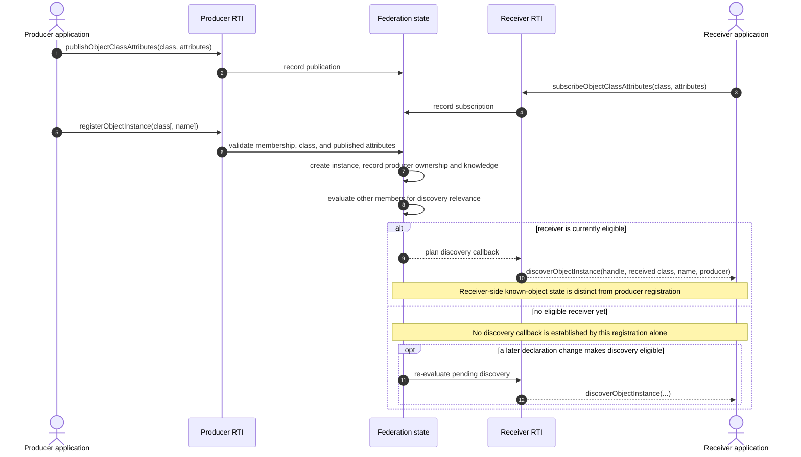

### Reading the object diagram correctly

- Publication is not a broadcast and does not itself create an instance.
- Subscription is not discovery. Discovery concerns a registered instance
  and is tracked per receiver.
- A registered object is initially known to its producer. The current
  discovery resolver excludes the producer from an induced discovery callback
  and derives the receiver's exposed class from the registered class and
  matching declarations.
- In the current implementation, discovery planning checks active
  registration relevance separately from the receiving federate's own
  subscription match. A passive subscription does not establish relevance by
  itself, although it can receive discovery made relevant by another active
  declaration. Treat this as a source-backed implementation nuance, not a
  substitute for checking the standard's exact rule.
- Current source records pending discovery separately from known-object state.
  The discovery transition rechecks eligibility and records the receiver's
  known class as callback dispatch begins. Do not collapse “planned” and
  “already known” into the same state.
- Class hierarchy, active/passive declarations, and regional discovery add
  branches that are intentionally not expanded here. See the DDM guide for
  region-bound behavior.

Discovery can also trigger the separate RTI-driven Auto Provide path: current
owners may be solicited for the newly known receiver's in-scope attributes.
That callback has an empty tag in the current automatic path, does not itself
deliver values, and is distinct from the explicit request flow below. See the
[2025 Auto Provide guide](HLA-2025-AUTO-PROVIDE-FLOW-GUIDE.md) for switch,
regional, fan-out, and stale-work details.

## Attribute path: request is not the value response

An attribute-value request asks the current provider to supply values; it does
not return the bytes as the request service's result. The provider receives a
provideAttributeValueUpdate callback carrying the requested object,
attributes, and request tag. The provider then chooses whether and when to call
updateAttributeValues. That later update has its own bytes and tag and may
produce a reflectAttributeValues callback for eligible subscribers.

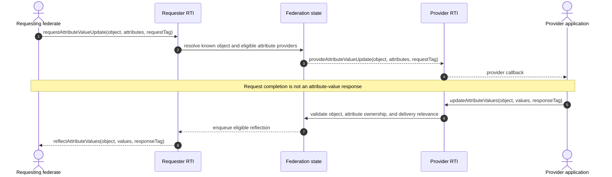

The diagram is the ordinary object-instance request/update path. Class-level
expansion, regional filtering, provider fan-out, and request/response restore
cut points have their own [2025 attribute-value update request guide](HLA-2025-ATTRIBUTE-VALUE-UPDATE-REQUEST-FLOW-GUIDE.md).
The active/passive, additive declaration state behind object-attribute
subscriptions is covered in the
[2025 object-attribute subscription guide](HLA-2025-OBJECT-ATTRIBUTE-SUBSCRIPTION-STATE-FLOW-GUIDE.md).
Per-attribute update-rate admission is covered separately in the
[2025 update-rate guide](HLA-2025-ATTRIBUTE-UPDATE-RATE-ADMISSION-FLOW-GUIDE.md).
In particular:

- The request tag is echoed on the provider callback; it is not automatically
  reused as the later update's tag. The provider supplies that update tag.
- The request can lead to a reflection only if a provider actually sends an
  update and the update is eligible for delivery. The callback is not a return
  value from requestAttributeValueUpdate.
- Object knowledge, attribute ownership, subscription matching, and DDM are
  separate gates. Ownership changes are described in the ownership guide;
  regional relevance is described in the DDM guide.
- Object-attribute declarations also compose per selected attribute: active
  and passive entries can coexist without making every attribute eligible.
  See the [subscription-state guide](HLA-2025-OBJECT-ATTRIBUTE-SUBSCRIPTION-STATE-FLOW-GUIDE.md)
  for the declaration mutation boundary.
- Overlapping class subscriptions should be reasoned about as one receiver's
  matching state, not as a promise to invoke application code once per
  declaration. The linked process test observes one reflection for its
  overlapping-subscription scenario; broader combinations need their own
  evidence.
- A queued reflection is not necessarily callback-visible immediately.
  Callback execution policy and TSO ordering belong to the time-management
  guide and the callback-ordering topic in the backlog.

### Embedded receive-order update: projection, passels, and callback boundary

These diagrams describe the ordinary **2025 embedded, no-time** update path.
They begin when a provider calls `updateAttributeValues`; the request above
only solicits a future provider callback. They do not describe the timestamped
overload or the process endpoint. The three views follow actual responsibility
boundaries: caller-owned input validation, receiver-specific route planning,
and callback-time delivery.

#### 1. Validate and snapshot the sender's update

The submitted set is checked against the sender's registered object class,
ownership, and delivery metadata before caller buffers are copied. The adapter
then makes durable copies and plans again, so the state used for recipient
selection is current after the copy boundary.

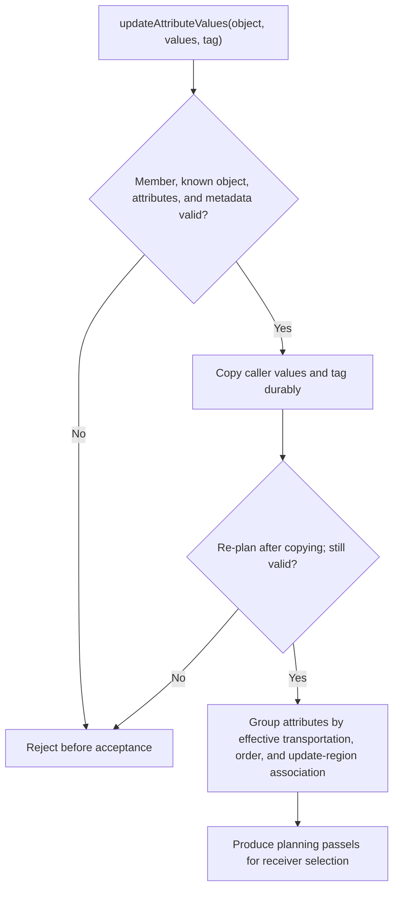

The plan rejects a repeated or undefined attribute and an attribute not owned
by the sender. It also resolves each attribute's effective order,
transportation, and region association. The passels are the unit carried into
recipient selection; the timestamped overload has a different subsequent
queue/grant path.

#### 2. Project each passel for each receiver

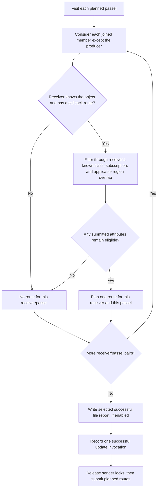

The registry validates sent attributes against the registered class, then
projects separately for each receiver using that receiver's known class. Thus
a receiver that knows only a superclass does not receive an attribute
introduced below that class, even when the sender submitted it. Subscription
relevance and region overlap remain separate per-attribute gates; their full
rules are in the [DDM guide](HLA-2025-DATA-DISTRIBUTION-AND-REGIONS-FLOW-GUIDE.md).
The successful service report, when selected, precedes one successful-update
counter increment for the API invocation, not one per receiver. These source
ordering details are distinct from the focused test assertions below.

#### 3. Dispatch and recheck at the callback boundary

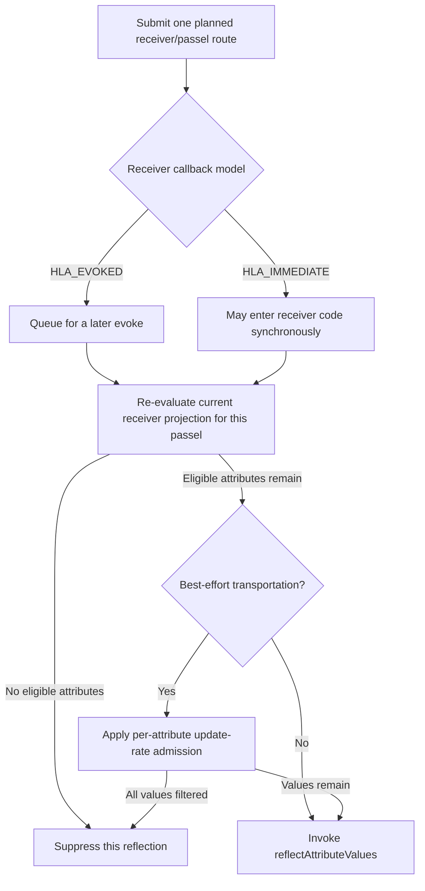

At callback entry the ordinary path recomputes eligibility for the submitted
passel only. A later unsubscribe can therefore suppress queued work, and a
best-effort rate gate can further remove values. The [DSE guide](HLA-2025-DELAY-SUBSCRIPTION-EVALUATION-FLOW-GUIDE.md)
owns the broader route-only candidate and late-subscription rules; the
[time-management guide](HLA-2025-TIME-MANAGEMENT-GUIDE.md) owns timestamped
updates and grant delivery. Region-descriptor conveyance is controlled
separately and remains in the DDM guide.

The focused embedded test exercises the user-visible distinctions: an exact
receiver gets the child attribute, a receiver that knows only the superclass
gets only the base attributes, reliable and best-effort values arrive in two
separate reflections, an `HLA_IMMEDIATE` receiver sees both before the service
returns, and a queued receiver that unsubscribes before `evokeMultipleCallbacks`
gets neither. It also checks rejection for an unknown object, an undefined
attribute, and an attribute the sender does not own. The test establishes those
scenarios; copy/re-plan ordering, the once-per-invocation counter, and lock
release before fan-out are source-derived details, not assertions in that test.
This is selected embedded 2025 evidence, not process parity or a complete
normative matrix.

## Interaction path: class subscription, parameter projection, callback

An interaction send carries an interaction class, parameter/value pairs, and a
user tag; it does not name an object instance. The runtime validates the
sender's publication and resolves eligible receiving members from interaction
subscriptions. The callback carries the values that are visible through the
receiver's matched class plus the user tag. The sender does not receive its
own induced receiveInteraction callback in the current joined-federate path.

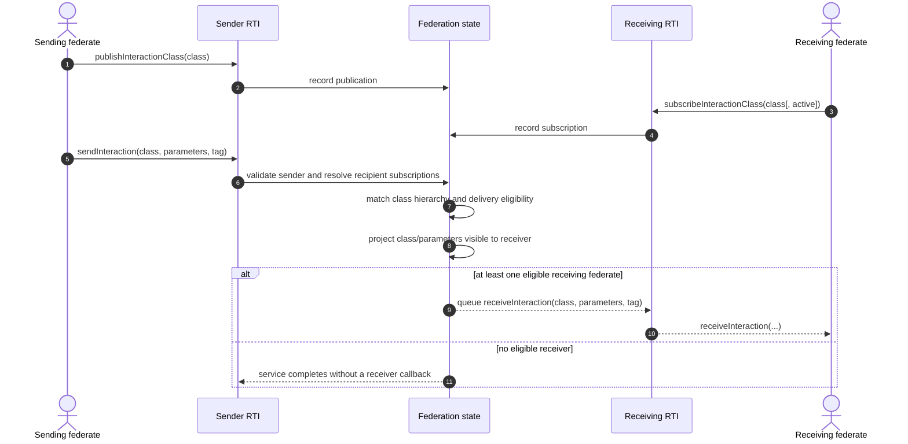

The current resolver walks the sent class and its superclasses, returning the
closest eligible subscribed class for a recipient and projecting parameters
visible through that class. Its source also separates federation-wide active
subscription relevance from a recipient's own matching subscription. These
are important implementation details, but the process-endpoint integration
case linked below exercises a simpler ordinary send; do not mistake that test
for proof of every hierarchy, passive-subscription, parameter, or region
combination.

### Interaction relevance, class promotion, and parameter projection

The registry makes two related but distinct decisions for an ordinary
receive-order interaction. First it determines whether an active subscription
from a non-sending member makes the sent class relevant. Then it evaluates
each other joined member's own subscription and any required region overlap.
A passive subscription does not create relevance by itself, but it can receive
an already-relevant interaction. If a receiver matches a superclass rather
than the sent class, that closest matching class determines both the callback
class and which sent parameters are visible.

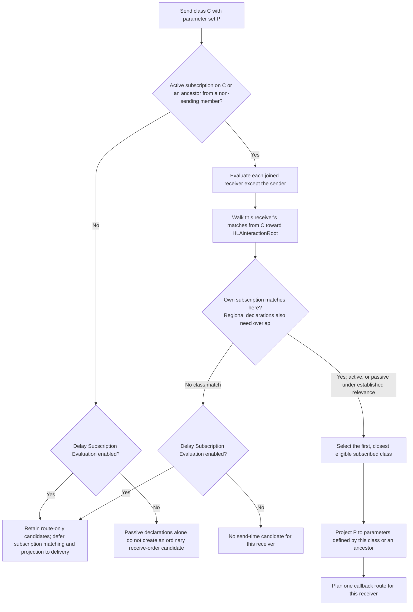

The first relevance check is federation-wide and excludes the sending
federate. The second is recipient-specific: a passive recipient still needs a
matching declaration and, for a regional declaration, an overlapping region.
The parent walk selects the first eligible subscription and returns one plan
for that recipient; projection then drops sent parameters that are not defined
by the selected class or its ancestors. A route-only DSE candidate has no
received class or parameter projection yet; the [DSE guide](HLA-2025-DELAY-SUBSCRIPTION-EVALUATION-FLOW-GUIDE.md)
covers that later re-evaluation boundary.

The registry promotion test makes the projection concrete for a send of
`MainCourseServed` with three parameters:

| Receiver's subscription | Planned callback class | Parameters in this FOM's plan |
| --- | --- | --- |
| `MainCourseServed` | `MainCourseServed` | All three sent parameters |
| `FoodServed` superclass | `FoodServed` | None; those three parameters are introduced below this class |
| `CustomerTransactions` ancestor | `CustomerTransactions` | None; those three parameters are introduced below this class |

The focused registry test also excludes an unrelated class and a receiver
without a callback route. It gives those subscriptions to separate receiver
members, however, so the source algorithm—not that test—establishes the
one-closest-class behavior when one receiver has declarations at multiple
levels. A separate embedded public test shows the passive/regional split: an
active receiver makes the interaction relevant for an overlapping passive
receiver; removing the sole active declaration suppresses both deliveries
while the passive declaration remains; activating that declaration restores
delivery. These are selected 2025 implementation and development-profile test
observations, not a complete normative or process-endpoint matrix.

### Regional active/passive transition and the empty-set no-op

This sequence isolates the two gates behind regional interaction delivery:
an active declaration anywhere among eligible non-senders establishes class
relevance, while each recipient still needs its own matching subscription and
overlapping region. The API flag is `active`; `false` makes the retained
regional pair passive. The empty-set call below is valid after the ordinary
membership/class checks, but has no effect on that pair.

```mermaid
sequenceDiagram
  participant Pub as Publisher
  participant Registry as Embedded 2025 registry
  participant A as Receiver A
  participant B as Receiver B
  Note over Pub,B: Setup: committed publisher/receiver regions overlap; both receivers subscribe to the same interaction class
  A->>Registry: Subscribe(regionA, active=true)
  B->>Registry: Subscribe(regionB, active=true)
  Pub->>Registry: Send interaction with regionP
  Registry-->>A: Receive callback
  Registry-->>B: Receive callback
  B->>Registry: Replace regionB pair with active=false
  Pub->>Registry: Send interaction with regionP
  Registry-->>A: Receive callback (A establishes class relevance)
  Registry-->>B: Receive callback (passive pair overlaps)
  A->>Registry: Unsubscribe(regionA)
  Pub->>Registry: Send interaction with regionP
  Note over Registry,B: B's passive pair remains, but no active declaration establishes class relevance; no recipient callback
  B->>Registry: Subscribe(empty RegionHandleSet, active=true)
  Registry-->>B: Valid no-op; existing pair is unchanged
  Pub->>Registry: Send interaction with regionP
  Note over Registry,B: Still no active declaration; no recipient callback
  B->>Registry: Subscribe(regionB, active=true)
  Pub->>Registry: Send interaction with regionP
  Registry-->>B: Receive callback; B now establishes relevance and overlaps
```

The focused development-profile test encodes these transitions, but the
current local run threw `Unknown exception` while creating the federation
(test line 121), before reaching any transition assertion. Treat this as a
source/test-shaped embedded 2025 explanation, not a passing runtime observation,
a callback-order guarantee, or evidence of process-endpoint/2010 parity.

### Embedded accepted-send boundary and recipient fan-out

This is the current **2025 embedded implementation** for the ordinary
receive-order overload, not a normative callback-order guarantee and not a
claim that the process endpoint has identical sequencing. It separates one
accepted `sendInteraction` invocation from the zero or more application
callbacks that may follow it.

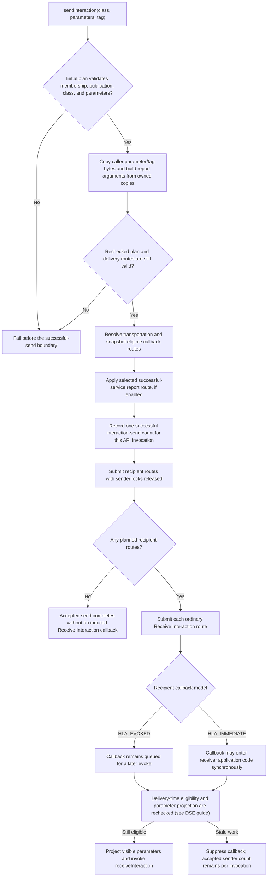

Read the report, counter, and callback stages as separate boundaries. The
selected report may be a `HLAreportServiceInvocation` interaction or a file
record; the [service-reporting guide](HLA-2025-SERVICE-INVOCATION-REPORTING-FLOW-GUIDE.md)
owns its routing and switch rules. In the embedded source, selected report
handling precedes `recordSuccessfulInteractionSend`, which increments once per
accepted invocation rather than once per recipient. A `HLA_IMMEDIATE` service-
report observer may therefore run during that earlier report stage; the
ordinary application Receive Interaction routes are submitted afterward. The
send path releases its sender locks before submitting those routes, since an
immediate recipient callback can synchronously re-enter user code.

With no planned recipients, the source still reaches the report and
per-invocation counter boundary, then has no application route to submit. That
zero-recipient counter detail and the immediate re-entry allowance are
source-derived; the focused tests below do not inspect the counter from inside
a callback or exercise a deliberate re-entrant send. The file-report test
does establish that the successful type-2 service record is present before an
`HLA_EVOKED` receiver enters its separately queued application callback. A
separate immediate-observer test sees the service report while that ordinary
receiver callback is still queued. Receiver-side re-evaluation and stale-work
suppression belong to the [DSE guide](HLA-2025-DELAY-SUBSCRIPTION-EVALUATION-FLOW-GUIDE.md),
not to a second copy of its state machine here.

**Boundary with other guides:** a timestamped send enters the time-management
queue and has grant/retraction/ordering constraints; a regional send adds
source-region and overlap checks. Follow the [time guide](HLA-2025-TIME-MANAGEMENT-GUIDE.md)
and [DDM guide](HLA-2025-DATA-DISTRIBUTION-AND-REGIONS-FLOW-GUIDE.md) for those
branches rather than adding them to this ordinary receive-order picture.

## Object removal: delete, callback, and per-receiver cleanup

Object deletion is not the inverse of registration at one instant. In the
current receive-order path, the registry validates that the deleting federate
knows the instance and holds HLAprivilegeToDeleteObject, plans removal for
other federates that know it, and immediately stops treating the deleting
federate as a known recipient. At the accepted-delete boundary it also
invalidates pending discovery, attribute-value-update, and ownership work for
the deleted object.
A receiver's queued removal is only a reservation: at a backend-specific gate,
the registry rechecks that the reservation, membership, and known-object state
are still valid. If they are, it commits that receiver's transition to unknown
before `removeObjectInstance` begins; stale work is suppressed instead of
manufacturing a callback. This is current 2025 implementation behavior for the
receive-order path, not by itself a normative ordering claim for every RTI.

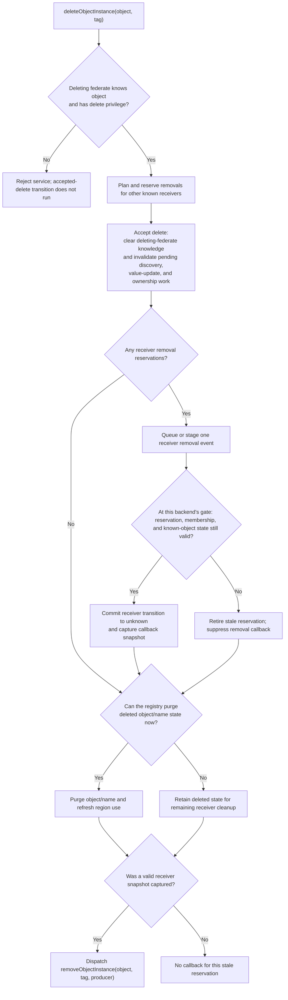

Read the receiver portion once per planned recipient; recipients cross this
gate independently, with no global “all removals before any callback” barrier.

The commit gate differs by delivery path. In the embedded path it runs when
the queued callback closure starts. In process pull mode (the default), it runs
when the receiver drains the event, before the response is bridged to the
callback. Optional process push mode runs it before pushing the event. In all
three source paths, the callback is downstream of the receiver-state commit;
the process-push statement is source-observed here, not covered by the focused
process deletion test cited below.

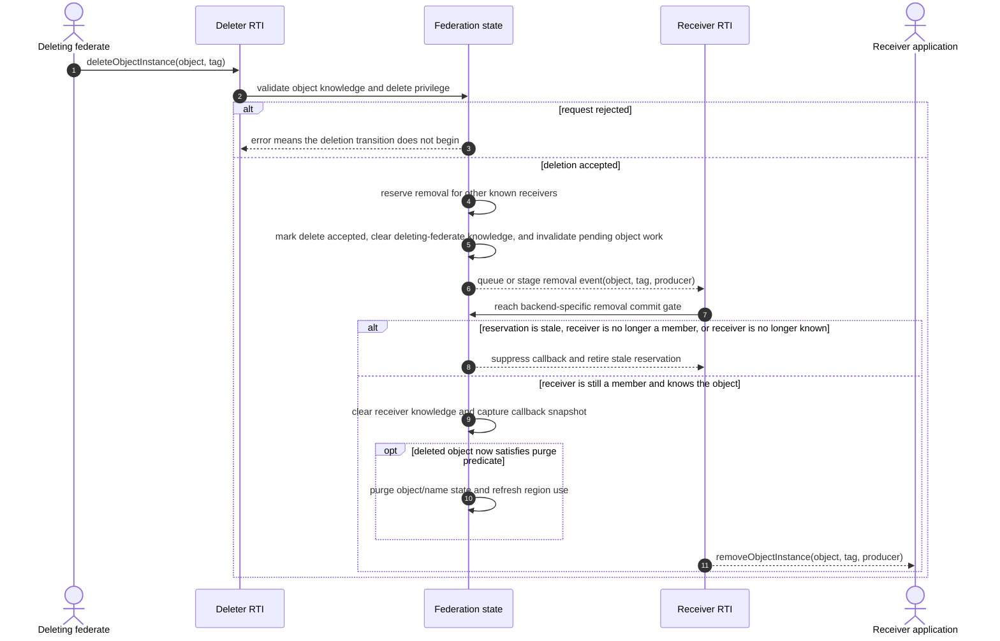

The deletion planner reserves other known recipients before committing the
accepted deletion. That reservation is not proof that a callback will still be
valid later: a receiver can resign or otherwise lose the relevant state before
its gate. The registry's removal snapshot lets the callback carry the producer
identity even when the final receiver transition makes the deleted registry
entry eligible for immediate purge.

| 2025 delivery path | Removal commit point | What the cited test establishes |
| --- | --- | --- |
| Embedded callback queue | Callback closure revalidates and commits before service-report routing and the user callback. | The focused ownership-query case observes `ObjectInstanceNotKnown` before callback dispatch and then one removal report. It does not assert every pending-work ledger is cleared. |
| Process pull (default) | Receive polling revalidates and commits before returning the removal event to the callback bridge. | The process deletion case observes the callback's object, producer, and tag payload using default `ProcessFederationServiceOptions`. |
| Process push (optional) | The service revalidates and commits before pushing the event to the session. | The linked process deletion test does not enable push mode; this row is source evidence only. |

Resignation can enter the same object-removal machinery, but its selected
ResignAction also interacts with ownership and other member-owned state. One
focused 2025 scenario shows NO_ACTION rejected while the resigning federate
still owns attributes; DELETE_OBJECTS then causes a peer removal callback.
That is a scenario-specific observation, not a full resign-action matrix. The
separate federation/federate lifecycle guide will own the complete resign,
connection-loss, and final-member behavior. Timestamped deletion is likewise a
time-management branch, not the receive-order path drawn above.

### Local delete forgets one federate's view; it does not delete the instance

`localDeleteObjectInstance` is a different transition from
`deleteObjectInstance`. In the current 2025 registry implementation, a
successful local delete erases only the caller's known-object and pending
discovery entries. It leaves the execution-wide instance, its other members'
knowledge, and its attribute-owner map intact. It does not plan a peer
`removeObjectInstance` callback. This is source-observed behavior, not a claim
about every RTI or a substitute for the exact text of service 6.18.

The operation has ownership guards before that local-forget transition: the
caller is rejected if an ownership acquisition/cancellation/divestiture path
is still pending for it, or if it still owns any attributes of the instance.
Those guards prevent forgetting an instance while the registry still has
caller-specific ownership work or ownership to account for.

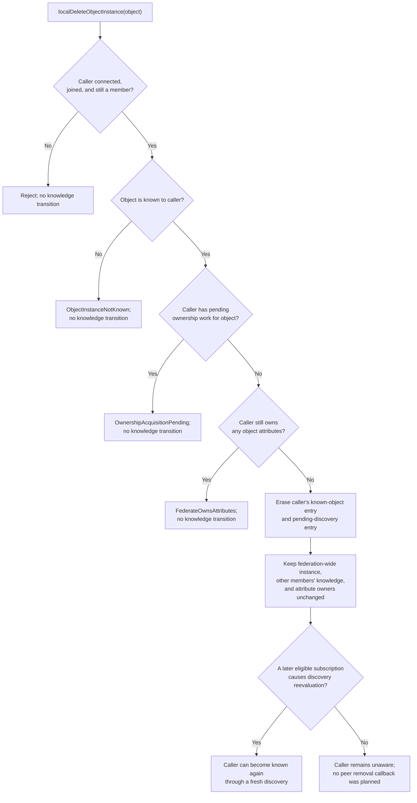

The embedded scenario exercises both rejection guards, observes
`ObjectInstanceNotKnown` from the caller's next known-object query after
success, then subscribes again and observes a fresh discovery. The original
owner subsequently updates the still-existing instance and the rediscovered
federate receives the reflection. A selected process-endpoint case exercises
successful local deletion, but it does not establish full process/embedded
parity for every rejection or rediscovery branch. Timestamped removal and
queued timestamped work remain in the time-management guide's boundary.

## Evidence map: implementation versus exercised scenarios

| Topic | Current implementation entry points | Focused test evidence |
| --- | --- | --- |
| Object declarations and discovery | [publication adapter](../../cpp/src/internal/runtime/umbra_rti_ambassador_object_class_publication.cpp#L19), [subscription adapter](../../cpp/src/internal/runtime/umbra_rti_ambassador_object_class_subscription.cpp#L19), [registration](../../cpp/src/internal/federation/federation_registry_object_instance_registration.cpp#L196), [discovery planning](../../cpp/src/internal/federation/federation_registry_object_instance_discovery_planning.cpp), [discovery state transition](../../cpp/src/internal/federation/federation_registry_object_instance_discovery_state.cpp#L15), [discovery eligibility](../../cpp/src/internal/federation/federation_registry.cpp#L816) | [process-endpoint object discovery](../../cpp/tests/ieee1516_2025_connection_object_discovery_catch2.cpp#L457) |
| Attribute update request and reflection | [update adapter](../../cpp/src/internal/runtime/umbra_rti_ambassador_attribute_update_services.cpp#L61), [provider selection](../../cpp/src/internal/federation/federation_registry_attribute_value_update_requests.cpp#L547), [callback bridge](../../cpp/src/internal/federation/process_federation_callback_bridge.cpp#L396) | [request → provide callback → provider update → reflection](../../cpp/tests/ieee1516_2025_connection_request_attribute_value_update_catch2.cpp#L470), [one reflection for overlapping subscriptions](../../cpp/tests/ieee1516_2025_connection_update_attribute_values_reflect_catch2.cpp#L457) |
| Embedded receive-order update validation, projection, and passels | [preflight, durable copy, re-plan, report/counter boundary, unlocked fan-out](../../cpp/src/internal/runtime/umbra_rti_ambassador_attribute_update_services.cpp#L206), [passel planning](../../cpp/src/internal/federation/federation_registry_attribute_value_update_requests.cpp#L93), [receiver-known-class projection](../../cpp/src/internal/federation/federation_registry_attribute_update_recipients.cpp#L16), [callback-time recheck](../../cpp/src/internal/runtime/umbra_rti_ambassador_object_instance_lifecycle_callbacks.cpp#L734) | [embedded passel/projection/callback-lifecycle case](../../cpp/tests/ieee1516_2025_receive_order_attribute_update_passel_lifecycle_catch2.cpp#L5) |
| Receive-order interactions | [interaction declarations](../../cpp/src/internal/runtime/umbra_rti_ambassador_interaction_declaration_services.cpp), [interaction subscriptions](../../cpp/src/internal/runtime/umbra_rti_ambassador_interaction_subscription_services.cpp), [regional-subscription API](../../third_party/ieee1516.1-2025/include/RTI/RTIambassador.h#L1595), [regional pair mutation and empty-set no-op](../../cpp/src/internal/federation/federation_registry_directed_interactions.cpp#L563), [global relevance and recipient overlap](../../cpp/src/internal/federation/federation_registry.cpp#L1449), [send plan](../../cpp/src/internal/federation/federation_registry_receive_order_interactions.cpp#L16), [class matching and projection](../../cpp/src/internal/federation/federation_registry.cpp#L1407), [send adapter](../../cpp/src/internal/runtime/umbra_rti_ambassador_interaction_send_services.cpp), [interaction callbacks](../../cpp/src/internal/runtime/umbra_rti_ambassador_interaction_callbacks.cpp) | [process-endpoint Send Interaction](../../cpp/tests/ieee1516_2025_connection_send_interaction_catch2.cpp#L457), [regional interaction routing](../../cpp/tests/ieee1516_2025_default_region_interaction_routing_catch2.cpp#L4), [regional active/passive transition and empty-set no-op (assertions not reached in current local run)](../../cpp/tests/passive_regional_interaction_transition_catch2.cpp#L93), [passive-only ordinary/regional suppression](../../cpp/tests/ieee1516_2025_passive_interaction_subscription_catch2.cpp#L5), [class promotion and parameter projection plan](../../cpp/tests/federation_registry_composed_fom_catch2.cpp#L1209) |
| Embedded accepted-send/report/counter boundary | [owned input snapshot, re-plan, report, counter, and unlocked fan-out](../../cpp/src/internal/runtime/umbra_rti_ambassador_interaction_send_services.cpp#L2293), [selected report interaction/file route](../../cpp/src/internal/runtime/umbra_rti_ambassador_service_report_writers.cpp#L131), [delivery-time recipient projection](../../cpp/src/internal/runtime/umbra_rti_ambassador_interaction_callbacks.cpp#L57) | [successful file record before evoked app callback](../../cpp/tests/ieee1516_2025_send_interaction_service_report_file_catch2.cpp#L96), [immediate report observer while receiver callback stays queued](../../cpp/tests/ieee1516_2025_service_report_receive_order_send_interaction_catch2.cpp#L94); the [counter restore test](../../cpp/tests/ieee1516_2025_federation_registry_interaction_send_counters_restore_catch2.cpp#L17) covers persistence/restore, not public-send ordering |
| Delete and resignation effects | [delete planning and pending-work invalidation](../../cpp/src/internal/federation/federation_registry_object_instance_deletion.cpp#L15), [receiver removal commit](../../cpp/src/internal/federation/federation_registry_object_instance_removal.cpp#L48), [embedded callback gate](../../cpp/src/internal/runtime/umbra_rti_ambassador_object_instance_lifecycle_callbacks.cpp#L1331), [process push/pull planning](../../cpp/src/internal/federation/process_federation_service_object_instance_removal.cpp#L12), [process pull commit gate](../../cpp/src/internal/federation/process_federation_service_receive.cpp#L86), [process callback bridge](../../cpp/src/internal/federation/process_federation_callback_bridge.cpp#L650), [resign lifecycle](../../cpp/src/internal/federation/federation_registry_resign_lifecycle.cpp#L80) | [embedded unknown-before-callback query](../../cpp/tests/ieee1516_2025_attribute_ownership_check_catch2.cpp#L75), [process-endpoint delete callback payload](../../cpp/tests/ieee1516_2025_connection_delete_object_instance_catch2.cpp#L779), [DELETE_OBJECTS resign scenario](../../cpp/tests/ieee1516_2025_embedded_resign_action_delete_objects_catch2.cpp#L4) |
| Federate-local object deletion | [6.18 API entry and declared exceptions](../../third_party/ieee1516.1-2025/include/RTI/RTIambassador.h#L863), [runtime adapter](../../cpp/src/internal/runtime/umbra_rti_ambassador_object_deletion_services.cpp#L431), [registry local-forget transition](../../cpp/src/internal/federation/federation_registry_object_instance_deletion.cpp#L136), [process service forwarding](../../cpp/src/internal/federation/process_federation_service_object_instance_deletion.cpp#L8) | [embedded state-preservation, rejection, and rediscovery scenario](../../cpp/tests/local_delete_object_instance_catch2.cpp#L110), [selected process-endpoint success path](../../cpp/tests/ieee1516_2025_connection_local_delete_catch2.cpp#L457) |

## Deliberate limits and next evidence

This guide does not model the full object-class or interaction-class
declaration lattice, every active/passive transition (the interaction diagram
covers only selected ordinary and regional cases), automatic versus
explicit regions, ownership negotiation, complete update-rate cadence/admission,
timestamped reflection/interaction/deletion, callback re-entry, save/restore
interlocks, or every resign action. Use the linked focused guides for the
neighboring state machines; add a new diagram only when it explains a distinct
ownership boundary.

The interaction guide now separates global active relevance, recipient-level
active/passive matching, class promotion, parameter projection, and accepted
send from callback fan-out. The guide now also separates ordinary receive-order
attribute validation, passel grouping, receiver-known-class projection, and
callback-time re-evaluation. The companion [attribute update-rate admission
guide](HLA-2025-ATTRIBUTE-UPDATE-RATE-ADMISSION-FLOW-GUIDE.md) follows active
ordinary/regional rate resolution and per-attribute callback-time filtering,
while keeping TSO grant eligibility separate. Keep timestamped delivery, DDM
overlap, and DSE candidate retention in their existing guides. Keep 2010 in its
separate guide and do not edit the HLA Requirements Lab as part of this Umbra
documentation phase.
