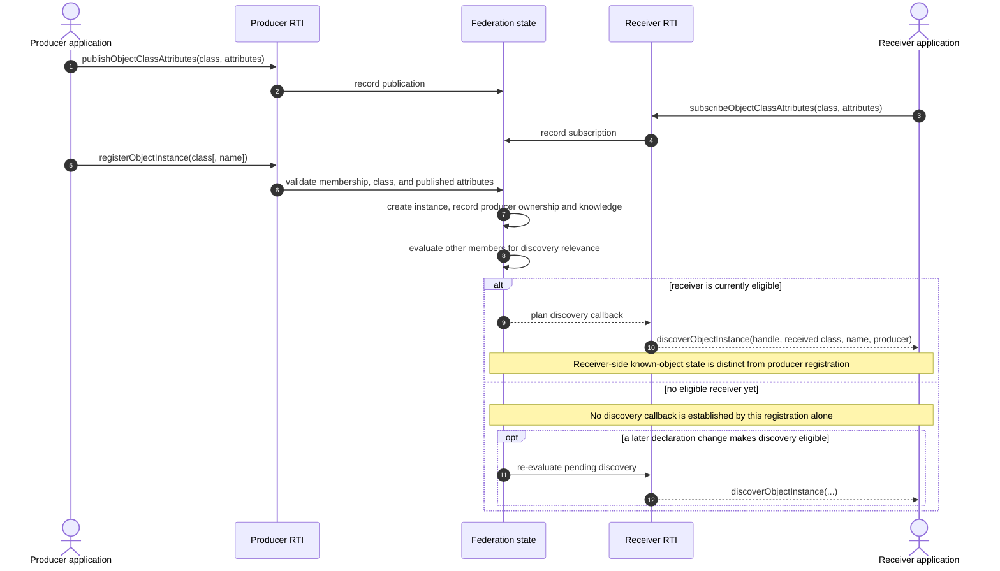
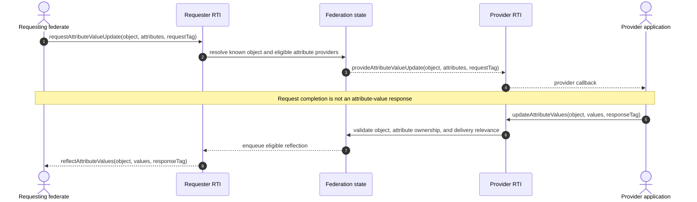
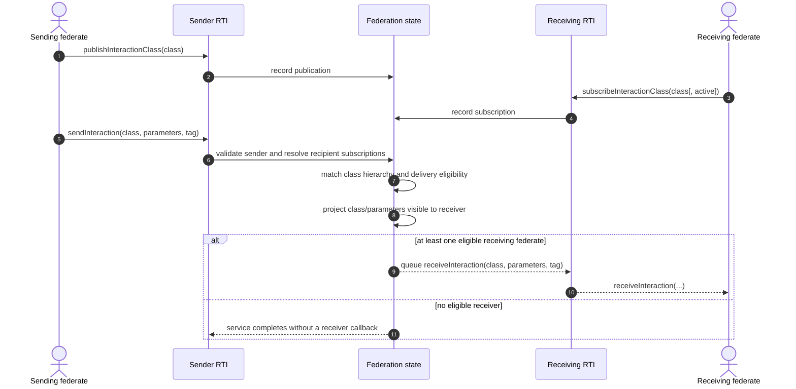
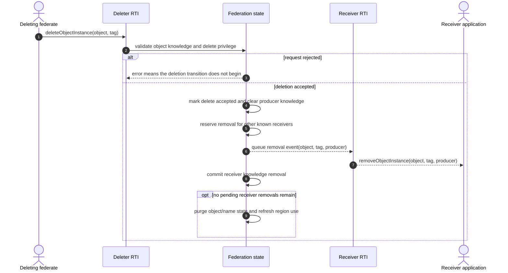

# IEEE 1516.1-2025 Object and Interaction Information Flow

This guide traces how object attributes and interactions become eligible to
move between federates, what an update request actually asks for, and how
object knowledge is ended. It is a contributor's map of the current Umbra
implementation, not a replacement for the standard or a claim of complete
support or conformance.

## Scope and authority

- **Edition boundary:** IEEE 1516.1-2025 only. The 2010 API/runtime and its
  tests are a separate compatibility stream; this guide neither describes nor
  compares them.
- **Implementation boundary:** the current embedded federation-management
  development profile and selected 2025 process-endpoint integration cases.
  These are evidence for specific paths, not every transport or deployment.
- **Normative authority:** the [official IEEE 1516.1-2025 Federate Interface
  Specification](https://standards.ieee.org/ieee/1516.1/6688/). Check exact
  service and callback clauses there before turning this guide into a
  requirement or a conformance claim. The guide intentionally avoids inventing
  clause mappings.
- **Evidence rule:** source links describe current implementation decisions;
  test links show only the scenario each test exercises. Internal tests are
  implementation evidence, not public conformance evidence.

For the state machines that constrain delivery, see the [2025 time-management
guide](HLA-2025-TIME-MANAGEMENT-GUIDE.md), [DDM and regions
guide](HLA-2025-DATA-DISTRIBUTION-AND-REGIONS-FLOW-GUIDE.md), and [attribute
ownership guide](HLA-2025-ATTRIBUTE-OWNERSHIP-FLOW-GUIDE.md). This guide marks
their boundaries instead of folding their rules into one oversized diagram.

## Start with four different questions

“Can this value get to that federate?” is not one yes/no state. Work through
these independently:

1. **May this federate produce it?** Object-class or interaction-class
   publication is the sender-side declaration. For object instances, the
   relevant attributes must also be owned by the sender when they are updated.
2. **Is there a recipient that is relevant?** Subscriptions and class
   inheritance determine candidate receivers. DDM can further restrict an
   object-attribute update or interaction by region and dimension overlap.
3. **Does that receiver know the object?** Registering an object makes it known
   to its producer. Another federate acquires per-federate object knowledge by
   discovery; that state matters for later services and removal.
4. **When does application code observe the event?** A planned/accepted service,
   queued RTI event, callback dispatch, and callback-visible application state
   are distinct boundaries. Callback model and time management affect when the
   last step occurs.

An interaction is not an object update: it has no object-instance knowledge
or attribute ownership transition. Both may share subscription, region, and
time-management machinery, but keep their lifecycle diagrams separate.

For the RTI-initiated notifications those declaration changes can produce, see
the focused [2025 relevance-advisory guide](HLA-2025-RELEVANCE-ADVISORY-FLOW-GUIDE.md).
Directed interactions use a different recipient rule because a send names a
target object instance and receivers can subscribe universally or by owning a
target attribute; see the focused [2025 directed-interaction
guide](HLA-2025-DIRECTED-INTERACTION-FLOW-GUIDE.md).

## Object path: declarations, registration, and discovery

The object publisher declares which class attributes it may publish. A
different federate subscribes to attributes of an object class. Registration
creates an instance and initializes the producer's own knowledge; the RTI then
plans discovery for other eligible federates. A later callback-visible
discoverObjectInstance is the receiver's introduction to that instance.

When registration supplies an explicit name, see the focused [2025
object-instance name reservation guide](HLA-2025-OBJECT-INSTANCE-NAME-RESERVATION-FLOW-GUIDE.md)
for the prior reservation callback, ownership, and consumption-at-commit
transitions. The overview below intentionally leaves those details out.

### Reading the object diagram correctly

- Publication is not a broadcast and does not itself create an instance.
- Subscription is not discovery. Discovery concerns a registered instance
  and is tracked per receiver.
- A registered object is initially known to its producer. The current
  discovery resolver excludes the producer from an induced discovery callback
  and derives the receiver's exposed class from the registered class and
  matching declarations.
- In the current implementation, discovery planning checks active
  registration relevance separately from the receiving federate's own
  subscription match. A passive subscription does not establish relevance by
  itself, although it can receive discovery made relevant by another active
  declaration. Treat this as a source-backed implementation nuance, not a
  substitute for checking the standard's exact rule.
- Current source records pending discovery separately from known-object state.
  The discovery transition rechecks eligibility and records the receiver's
  known class as callback dispatch begins. Do not collapse “planned” and
  “already known” into the same state.
- Class hierarchy, active/passive declarations, and regional discovery add
  branches that are intentionally not expanded here. See the DDM guide for
  region-bound behavior.

Discovery can also trigger the separate RTI-driven Auto Provide path: current
owners may be solicited for the newly known receiver's in-scope attributes.
That callback has an empty tag in the current automatic path, does not itself
deliver values, and is distinct from the explicit request flow below. See the
[2025 Auto Provide guide](HLA-2025-AUTO-PROVIDE-FLOW-GUIDE.md) for switch,
regional, fan-out, and stale-work details.

## Attribute path: request is not the value response

An attribute-value request asks the current provider to supply values; it does
not return the bytes as the request service's result. The provider receives a
provideAttributeValueUpdate callback carrying the requested object,
attributes, and request tag. The provider then chooses whether and when to call
updateAttributeValues. That later update has its own bytes and tag and may
produce a reflectAttributeValues callback for eligible subscribers.

The implementation has additional class-level, regional, update-rate, and
timestamped forms. The diagram is the ordinary object-instance request/update
path. In particular:

- The request tag is echoed on the provider callback; it is not automatically
  reused as the later update's tag. The provider supplies that update tag.
- The request can lead to a reflection only if a provider actually sends an
  update and the update is eligible for delivery. The callback is not a return
  value from requestAttributeValueUpdate.
- Object knowledge, attribute ownership, subscription matching, and DDM are
  separate gates. Ownership changes are described in the ownership guide;
  regional relevance is described in the DDM guide.
- Overlapping class subscriptions should be reasoned about as one receiver's
  matching state, not as a promise to invoke application code once per
  declaration. The linked process test observes one reflection for its
  overlapping-subscription scenario; broader combinations need their own
  evidence.
- A queued reflection is not necessarily callback-visible immediately.
  Callback execution policy and TSO ordering belong to the time-management
  guide and the callback-ordering topic in the backlog.

## Interaction path: class subscription, parameter projection, callback

An interaction send carries an interaction class, parameter/value pairs, and a
user tag; it does not name an object instance. The runtime validates the
sender's publication and resolves eligible receiving members from interaction
subscriptions. The callback carries the values that are visible through the
receiver's matched class plus the user tag. The sender does not receive its
own induced receiveInteraction callback in the current joined-federate path.

The current resolver walks the sent class and its superclasses, returning the
closest eligible subscribed class for a recipient and projecting parameters
visible through that class. Its source also separates federation-wide active
subscription relevance from a recipient's own matching subscription. These
are important implementation details, but the process-endpoint integration
case linked below exercises a simpler ordinary send; do not mistake that test
for proof of every hierarchy, passive-subscription, parameter, or region
combination.

**Boundary with other guides:** a timestamped send enters the time-management
queue and has grant/retraction/ordering constraints; a regional send adds
source-region and overlap checks. Follow the [time guide](HLA-2025-TIME-MANAGEMENT-GUIDE.md)
and [DDM guide](HLA-2025-DATA-DISTRIBUTION-AND-REGIONS-FLOW-GUIDE.md) for those
branches rather than adding them to this ordinary receive-order picture.

## Object removal: delete, callback, and per-receiver cleanup

Object deletion is not the inverse of registration at one instant. In the
current receive-order path, the registry validates that the deleting federate
knows the instance and holds HLAprivilegeToDeleteObject, plans removal for
other federates that know it, and immediately stops treating the producer as a
known recipient. Other receivers remain known until their removal transition
commits as the queued removeObjectInstance callback is dispatched.

Resignation can enter the same object-removal machinery, but its selected
ResignAction also interacts with ownership and other member-owned state. One
focused 2025 scenario shows NO_ACTION rejected while the resigning federate
still owns attributes; DELETE_OBJECTS then causes a peer removal callback.
That is a scenario-specific observation, not a full resign-action matrix. The
separate federation/federate lifecycle guide will own the complete resign,
connection-loss, and final-member behavior. Timestamped deletion is likewise a
time-management branch, not the receive-order path drawn above.

## Evidence map: implementation versus exercised scenarios

| Topic | Current implementation entry points | Focused test evidence |
| --- | --- | --- |
| Object declarations and discovery | [publication adapter](../../cpp/src/internal/runtime/umbra_rti_ambassador_object_class_publication.cpp#L19), [subscription adapter](../../cpp/src/internal/runtime/umbra_rti_ambassador_object_class_subscription.cpp#L19), [registration](../../cpp/src/internal/federation/federation_registry_object_instance_registration.cpp#L196), [discovery planning](../../cpp/src/internal/federation/federation_registry_object_instance_discovery_planning.cpp), [discovery state transition](../../cpp/src/internal/federation/federation_registry_object_instance_discovery_state.cpp#L15), [discovery eligibility](../../cpp/src/internal/federation/federation_registry.cpp#L816) | [process-endpoint object discovery](../../cpp/tests/ieee1516_2025_connection_object_discovery_catch2.cpp#L457) |
| Attribute update request and reflection | [update adapter](../../cpp/src/internal/runtime/umbra_rti_ambassador_attribute_update_services.cpp#L61), [provider selection](../../cpp/src/internal/federation/federation_registry_attribute_value_update_requests.cpp#L547), [callback bridge](../../cpp/src/internal/federation/process_federation_callback_bridge.cpp#L396) | [request → provide callback → provider update → reflection](../../cpp/tests/ieee1516_2025_connection_request_attribute_value_update_catch2.cpp#L470), [one reflection for overlapping subscriptions](../../cpp/tests/ieee1516_2025_connection_update_attribute_values_reflect_catch2.cpp#L457) |
| Receive-order interactions | [interaction declarations](../../cpp/src/internal/runtime/umbra_rti_ambassador_interaction_declaration_services.cpp), [interaction subscriptions](../../cpp/src/internal/runtime/umbra_rti_ambassador_interaction_subscription_services.cpp), [send adapter](../../cpp/src/internal/runtime/umbra_rti_ambassador_interaction_send_services.cpp), [recipient resolution](../../cpp/src/internal/federation/federation_registry.cpp#L1407), [interaction callbacks](../../cpp/src/internal/runtime/umbra_rti_ambassador_interaction_callbacks.cpp) | [process-endpoint Send Interaction](../../cpp/tests/ieee1516_2025_connection_send_interaction_catch2.cpp#L457), [regional interaction routing](../../cpp/tests/ieee1516_2025_default_region_interaction_routing_catch2.cpp#L4) |
| Delete and resignation effects | [delete planning](../../cpp/src/internal/federation/federation_registry_object_instance_deletion.cpp#L15), [removal transition](../../cpp/src/internal/federation/federation_registry_object_instance_removal.cpp#L49), [resign lifecycle](../../cpp/src/internal/federation/federation_registry_resign_lifecycle.cpp#L80), [removal callback bridge](../../cpp/src/internal/federation/process_federation_callback_bridge.cpp#L667) | [process-endpoint delete/removal callback](../../cpp/tests/ieee1516_2025_connection_delete_object_instance_catch2.cpp#L457), [DELETE_OBJECTS resign scenario](../../cpp/tests/ieee1516_2025_embedded_resign_action_delete_objects_catch2.cpp#L4) |

## Deliberate limits and next evidence

This guide does not model the full object-class or interaction-class
declaration lattice, every active/passive transition, automatic versus
explicit regions, ownership negotiation, attribute update-rate gates,
timestamped reflection/interaction/deletion, callback re-entry, save/restore
interlocks, or every resign action. Use the linked focused guides for the
neighboring state machines; add a new diagram only when it explains a distinct
ownership boundary.

The next documentation pass should survey federation/federate lifecycle
separately, with its own evidence for normal resignation, connection loss,
final-member teardown, and the object/ownership consequences of each action.
Keep 2010 in a separate guide if and when that stream is surveyed. Do not edit
the HLA Requirements Lab as part of this Umbra documentation phase.
