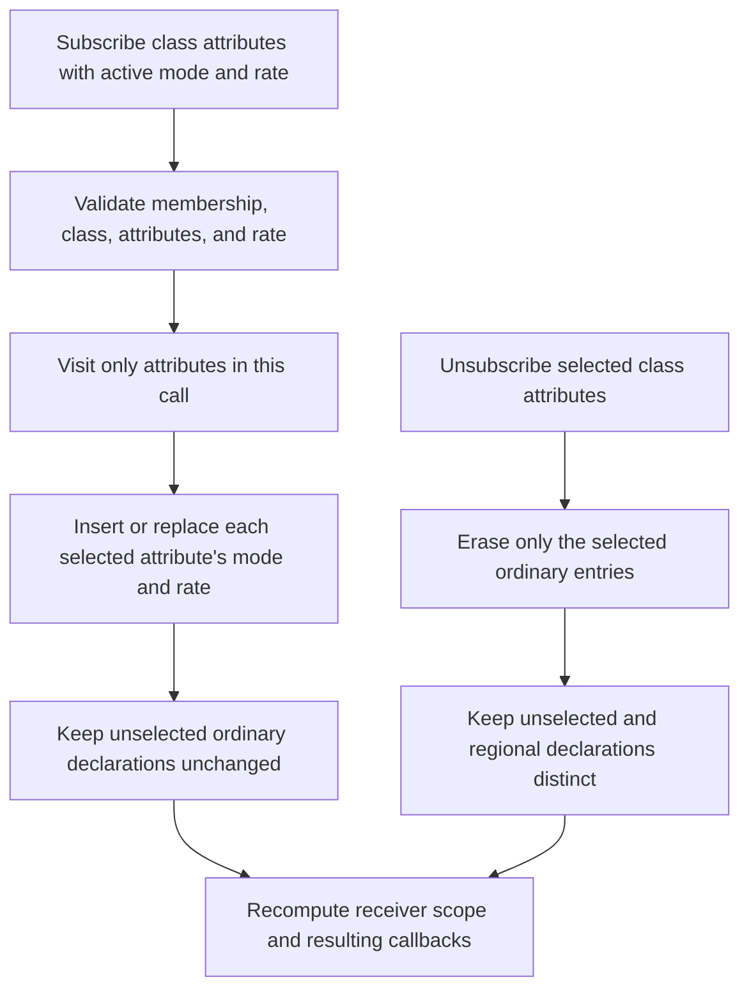
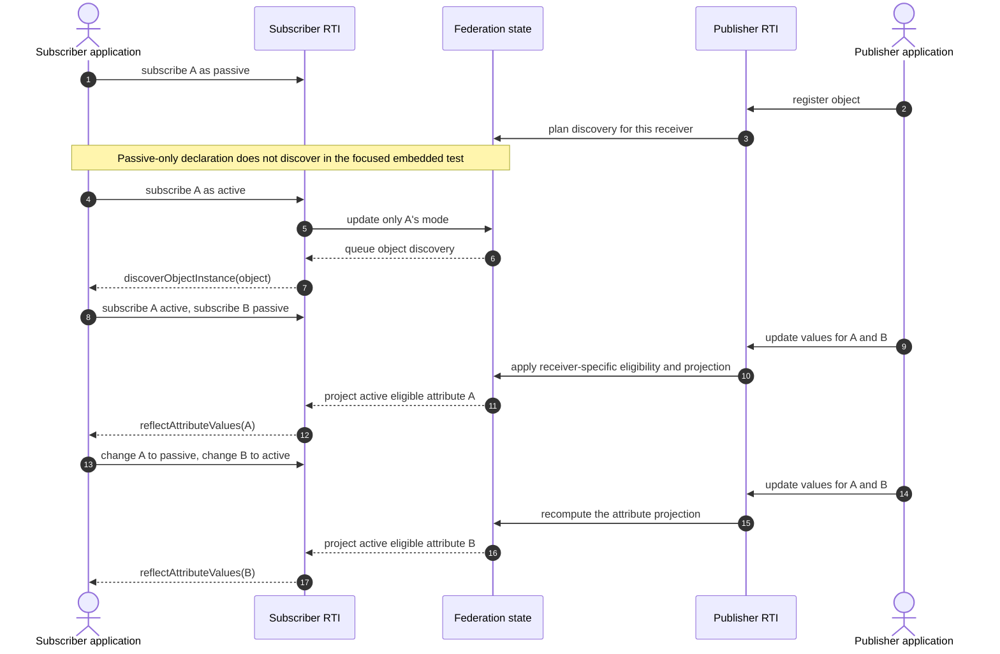
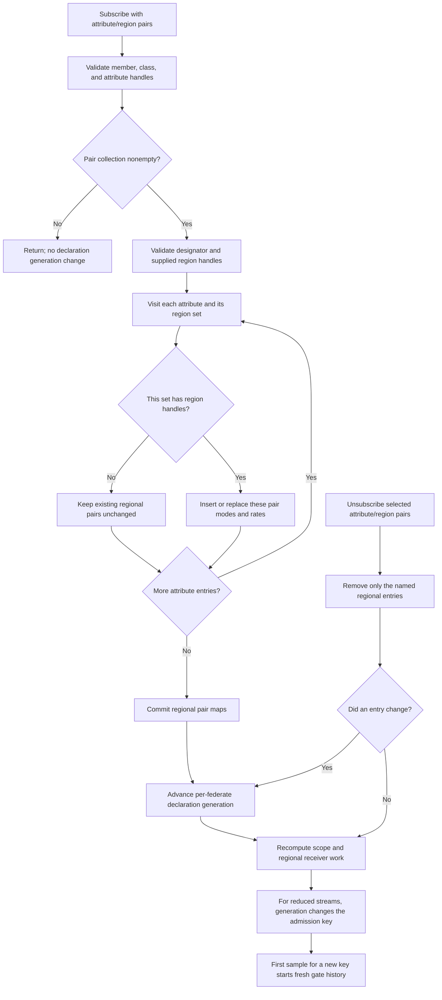

# HLA 1516.1-2025 object-attribute subscription state guide

Object-attribute subscriptions are not one receiver-wide on/off switch. The
current embedded 2025 implementation stores declaration state by object class
and attribute; active/passive mode and update-rate designator apply to the
attributes selected by a call. Regional declarations add a separate
attribute/region relation. This guide explains those mutation and state
boundaries before a message reaches the DDM, update-rate, or callback gates.

The guide is deliberately narrower than the adjacent
[DDM/regions](HLA-2025-DATA-DISTRIBUTION-AND-REGIONS-FLOW-GUIDE.md),
[relevance-advisory](HLA-2025-RELEVANCE-ADVISORY-FLOW-GUIDE.md),
[attribute-scope](HLA-2025-ATTRIBUTE-SCOPE-ADVISORY-FLOW-GUIDE.md), and
[update-rate](HLA-2025-ATTRIBUTE-UPDATE-RATE-ADMISSION-FLOW-GUIDE.md) guides:
it traces object-class attribute subscription declarations, not the full
recipient-routing or advisory state machines. Evidence is from focused
embedded 2025 tests and source. This does not describe or infer 2010 behavior,
and it does not establish process-endpoint parity.

## 1. Ordinary declarations accumulate and change per selected attribute

`subscribeObjectClassAttributes` names a class, an attribute set, an `active`
flag, and an optional update-rate designator. In the embedded registry, each
selected attribute is inserted or replaced in that class's declaration map;
attributes omitted from the call remain as they were. Re-declaring one
attribute does not implicitly erase another. `unsubscribeObjectClassAttributes`
removes the selected ordinary entries; it is a different mutation from a
regional unsubscribe.

The public API calls the mode `active`; the 2025 service-report argument is an
optional *passive* indicator, so the embedded implementation reports the
inverse of the API boolean. Do not read the same boolean spelling into both
surfaces. The internal registry also uses an absent mode to represent the
ordinary unsubscribe mutation; that is not a third public subscription mode.

After a successful change, Umbra replans object scope and may enqueue discovery,
scope-change, or relevance callbacks. The declaration mutation and any later
callback are separate boundaries: callbacks are queued after the registry
transaction, and the details of callback delivery belong to the linked
[callback/service-ordering guide](HLA-2025-CALLBACK-AND-SERVICE-ORDERING-FLOW-GUIDE.md).

## 2. Discovery and value delivery are separate active-subscription gates

Passive declarations are retained state, but the focused embedded tests show
that a passive-only object-attribute subscription does not arrange instance
discovery or ordinary/regional value delivery. An active matching declaration
can make the object known; that does not make every declared attribute active.
For each update, attribute projection still includes only the receiver's
eligible attributes.

This sequence combines transitions from the two focused subscription tests;
it is a teaching view, not a claim that one test executes this exact combined
transcript.

The focused additive-subscription case observes all three important outcomes:

- Adding passive B leaves active A declared; discovery still occurs through A,
  while a later update containing A and B reflects A only.
- Changing A to passive and B to active changes only those selected entries;
  the later reflection contains B only.
- Making A active again preserves B, and the following reflection contains
  both attributes.

The passive-only case separately exercises object registration followed by a
passive-to-active transition. The object becomes known after the active
subscription, while a passive attribute update is not reflected. “Object is
known” and “this attribute is currently eligible for value delivery” are
different pieces of receiver state; becoming known does not itself activate
every attribute.

These are selected observations, not a complete standards or profile matrix.
Class inheritance, publication matches, region overlap, update-rate admission,
late-subscription evaluation, and callback-time rechecks are covered in the
specialized linked guides rather than inferred from this sequence.

## 3. Regional declarations are separate per-attribute region entries

`subscribeObjectClassAttributesWithRegions` addresses attribute/region-set
pairs. The embedded registry records active/passive mode and update-rate
designator for each supplied attribute/region entry. Regional declarations are
stored separately from ordinary declarations; keep the two unsubscribe forms
and their region lifetimes distinct.

The passive/regional test verifies that a passive overlapping pair does not
discover or reflect for the tested object. Replacing that pair as active makes
the object discoverable and permits an overlapping update. It also submits
attribute entries with empty region sets and different active/rate arguments;
the retained pair's queried rate and active delivery remain unchanged in that
case. For the overlap calculation and region resource lifecycle, use the
[DDM/regions guide](HLA-2025-DATA-DISTRIBUTION-AND-REGIONS-FLOW-GUIDE.md).

### A source/test boundary around the empty-region case

For a nonempty attribute/region-pair map whose region sets contain no handles,
the registry leaves the regional pairs unchanged but still advances the
receiver's `subscriptionGeneration`; a fully empty pair map returns before
that update. Regional unsubscribe differs: its generation changes only when
at least one stored pair is actually removed. The generation is stored with
the receiver's declaration set, copied into each recipient projection, and
included in the update-rate admission key. The gate admits the first
observation for a new key, and its deterministic unit test verifies fresh
history for the same receiver/object/attribute identity under a changed
generation. The combined
source and unit-test chain therefore implies that this empty-region call can
start fresh admission history for that receiver's active attribute streams,
despite adding no regional pair. The public passive-subscription test checks
the retained mode, rate, and later delivery, but does not seed a prior rate
window and assert its reset across this exact call. So this is a source/test-
derived implementation inference, not a normative conclusion or an end-to-end
observation. The local checkout does not contain the full licensed standard;
the [official IEEE listing](https://standards.ieee.org/ieee/1516.1/6688/)
indicates access via subscription. Keep the conformance question open until an
authorized copy of the precise regional-subscription rule is reviewed. See the
[update-rate admission guide](HLA-2025-ATTRIBUTE-UPDATE-RATE-ADMISSION-FLOW-GUIDE.md)
for the separate rate gate.

## Evidence map

| Boundary | Source or focused test | What it supports |
| --- | --- | --- |
| 2025 public ordinary subscribe/unsubscribe | [RTIambassador.h:535](../../third_party/ieee1516.1-2025/include/RTI/RTIambassador.h#L535), [RTIambassador.h:563](../../third_party/ieee1516.1-2025/include/RTI/RTIambassador.h#L563) | Selected attribute set, active flag, update-rate designator, and separate unsubscribe service |
| 2025 public regional subscribe/unsubscribe | [RTIambassador.h:1559](../../third_party/ieee1516.1-2025/include/RTI/RTIambassador.h#L1559), [RTIambassador.h:1578](../../third_party/ieee1516.1-2025/include/RTI/RTIambassador.h#L1578) | Attribute/region pairs and the distinct regional unsubscribe form |
| Embedded ordinary declaration update | [Ambassador entry point:19](../../cpp/src/internal/runtime/umbra_rti_ambassador_object_class_subscription.cpp#L19), [registry per-attribute upsert:261](../../cpp/src/internal/federation/federation_registry_object_attribute_declarations.cpp#L261), [selected attribute writes:359](../../cpp/src/internal/federation/federation_registry_object_attribute_declarations.cpp#L359) | Validation, per-attribute mode/rate replacement, and scope recalculation |
| Embedded regional mutation | [Ambassador entry point:463](../../cpp/src/internal/runtime/umbra_rti_ambassador_object_class_subscription.cpp#L463), [registry regional update:422](../../cpp/src/internal/federation/federation_registry_object_attribute_declarations.cpp#L422), [regional pair removal:582](../../cpp/src/internal/federation/federation_registry_object_attribute_declarations.cpp#L582) | Separate regional map, region validation, per-pair changes, and regional removal |
| Passive versus active delivery/discovery | [Passive object subscription test:120](../../cpp/tests/passive_object_attribute_subscription_catch2.cpp#L120) | Passive-only ordinary/regional behavior and passive-to-active transition in selected embedded cases |
| Additive per-attribute mode changes | [Additive subscription test:355](../../cpp/tests/passive_object_attribute_subscription_catch2.cpp#L355) | Adding B preserves A; per-attribute active/passive replacement changes projection without discarding other entries |
| Empty regional set and rate-generation caveat | [Focused regional assertions:244](../../cpp/tests/passive_object_attribute_subscription_catch2.cpp#L244), [per-federate generation:2335](../../cpp/src/internal/federation/federation_registry.hpp#L2335), [generation update:524](../../cpp/src/internal/federation/federation_registry_object_attribute_declarations.cpp#L524), [generation in admission key:96](../../cpp/src/internal/runtime/umbra_rti_ambassador.cpp#L96), [first-use gate:19](../../cpp/src/internal/time/update_rate_gate.cpp#L19), [generation-key unit case:40](../../cpp/tests/ieee1516_2025_update_rate_gate_unit_catch2.cpp#L40) | A deterministic unit case verifies fresh history for a changed generation key; no public integration test isolates the empty-region call's effect |

The diagrams and evidence are limited to the 2025 embedded development
profile. The guide does not claim that each subscription overload, interaction
subscription, or process endpoint has equivalent behavior. For service-report
projection, see [service invocation reporting](HLA-2025-SERVICE-INVOCATION-REPORTING-FLOW-GUIDE.md);
for class-level declaration callbacks, see
[relevance advisories](HLA-2025-RELEVANCE-ADVISORY-FLOW-GUIDE.md).

