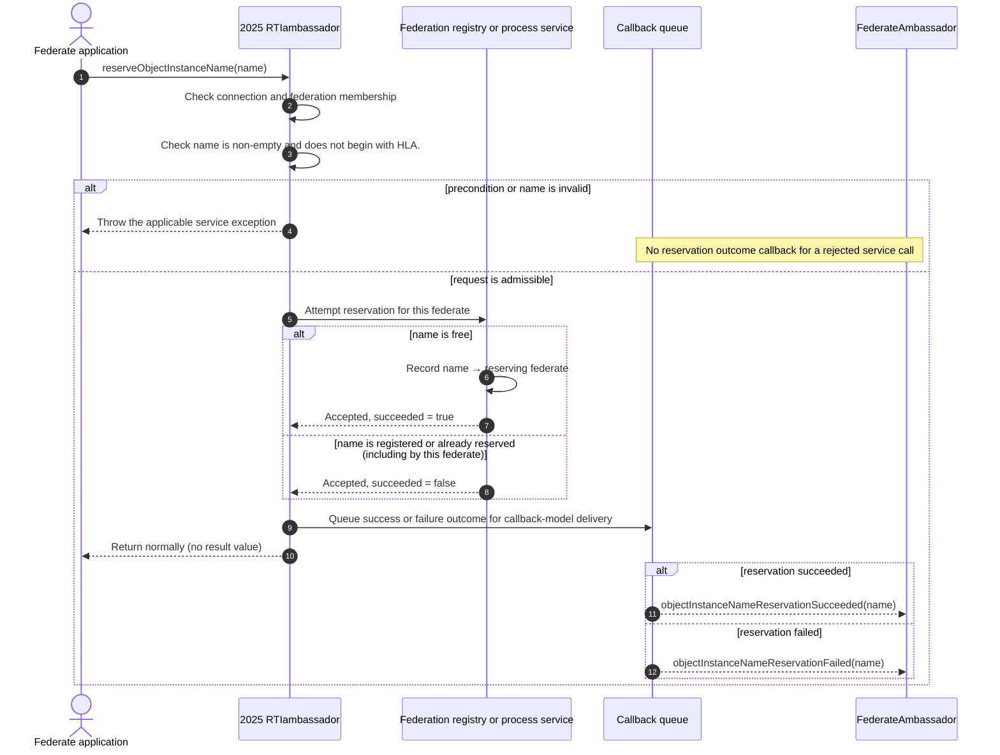
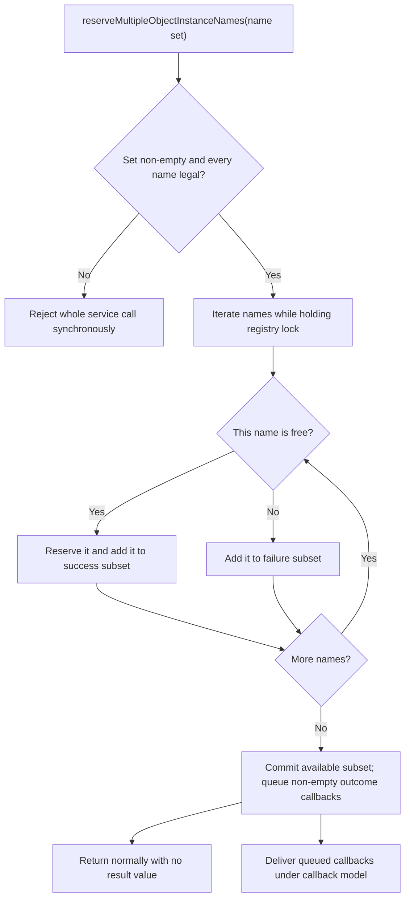
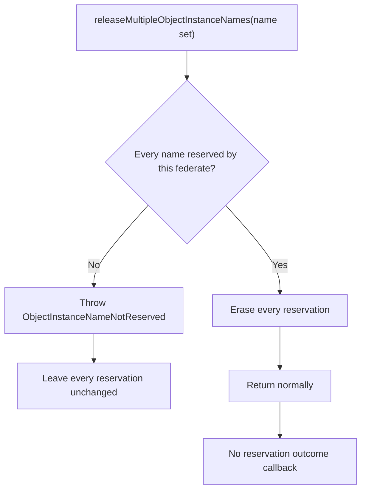
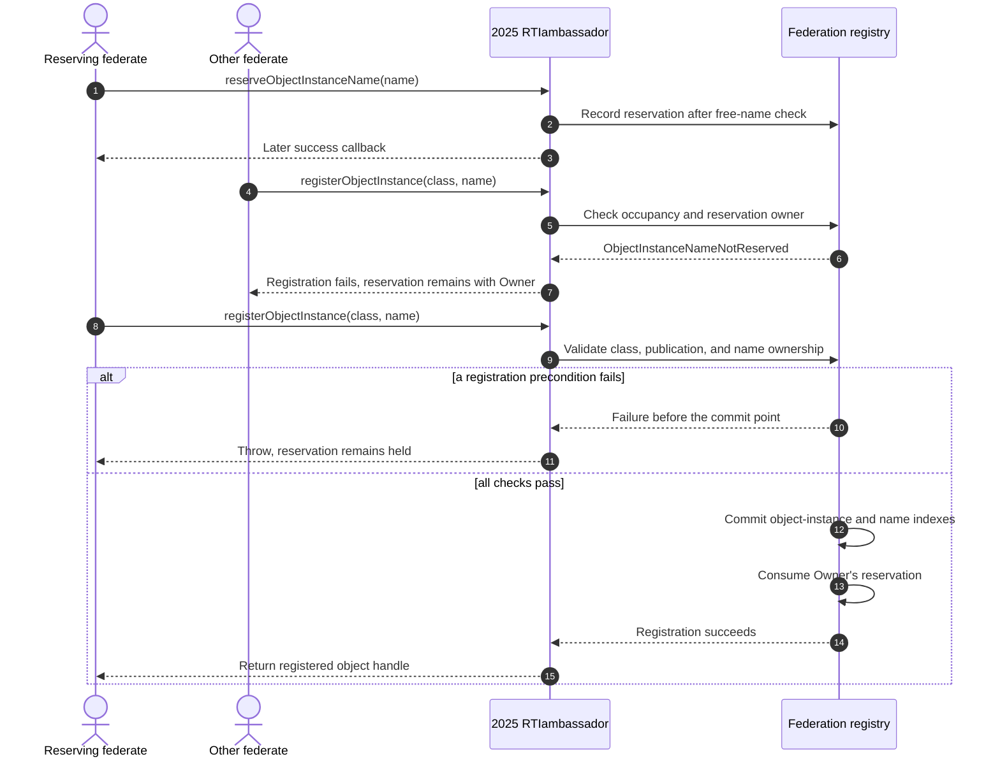
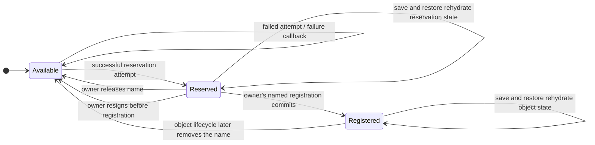

# IEEE 1516.1-2025 Object-Instance Name Reservation Flow

This guide follows an object-instance name from reservation through either
release or named registration. The reservation service is void: synchronous
exceptions reject an inadmissible request, while an admissible attempt reports
availability through a callback. A normal return alone does not mean the name
was acquired.

**Edition:** IEEE 1516.1-2025 API/runtime behavior only. This guide does not
describe the 2010 reference-RTI implementation or infer parity between the
editions.

**Implementation profile:** current Umbra embedded and selected process-
endpoint paths. Source and tests are evidence for those paths and scenarios,
not a claim of complete support or conformance. Umbra's source annotates the
reservation services with 2025 clause pointers; verify exact normative wording
against the [official IEEE 1516.1-2025 edition page](https://standards.ieee.org/ieee/1516.1/6688/)
and its licensed standard text before using this guide as a requirements source.

## The short version

- A joined federate requests a name; the service call returns no reservation
  result value. Availability is reported through a success or failure
  callback.
- Empty names and names beginning with `HLA.` are rejected at the service
  boundary. Membership and other service preconditions are also synchronous.
- A single-name collision is an asynchronous failure callback, not an
  immediate `ObjectInstanceNameInUse` exception.
- Bulk reservation is **partial-success**: available names can be reserved
  even when other names in the same set are unavailable. Success and failure
  callbacks each report their own subset.
- Bulk release is **all-or-nothing**: if any requested name is not reserved by
  the caller, no name in the set is released.
- A reservation belongs to the federate that obtained it. Named registration
  consumes it only at registration commit; an earlier failed registration
  attempt leaves it available to its owner.

## 1. Single-name reservation: synchronous admission, callback outcome

The API call checks that the caller is connected and joined, then submits the
candidate name. In the embedded path, the registry records the reservation
before the ambassador queues the callback. A name conflict still produces an
applied service result; its `succeeded` bit selects the later callback.

The callbacks shown are alternatives, not both outcomes for one single-name
request. Application code must not treat a normal return as proof the name was
reserved. The sequence separates callback queueing from delivery; it is not a
cross-mode scheduling guarantee. In the embedded implementation, a successful
service report occurs after releasing the registry lock and before the
reservation callback is queued. The process endpoint owns its service-report
boundary separately; do not assume the same report-file ordering from the
embedded sequence. User callback observation is subject to the selected
callback delivery model.

## 2. Bulk operations: partial reservation versus atomic release

Bulk reserve and bulk release have intentionally different transaction
semantics. Do not infer that “multiple” means the two services commit alike.

The complete set is checked for basic validity before any per-name availability
result is produced. Once that gate passes, conflicts are per-name results: the
available subset is committed, and the failed subset is reported separately.
The registry performs this update under one lock and rolls back newly inserted
reservations if an exception interrupts insertion; callbacks cannot observe an
intermediate subset.

The release rule means a set containing one valid reservation and one missing
or peer-owned name releases neither. An empty release set is accepted by the
current implementation and focused test; an empty *reservation* set is
rejected with `NameSetWasEmpty`.

## 3. From a reservation to a registered object

Reservation is not registration. It is the federate-specific right to attempt
registration with that spelling. The object class and publication checks still
apply, and another federate cannot use the reservation.

Umbra checks whether the name is already in use and whether the registering
federate owns its reservation. It inserts the object into both registry indexes
before removing the reservation; if index insertion or reservation consumption
fails, it rolls back partial registration state. Unnamed registration uses an
RTI-generated name and skips occupied names and names held in the reservation
table.

## 4. Reservation ownership and lifetime

An unconsumed reservation may be relinquished explicitly. Resignation also
returns that federate's unregistered names to the federation-wide available
pool. Save/restore evidence shows the reservation table is restored with the
federation state; this is distinct from registering an object, which moves the
name into the live-object index.

The final `Registered → Available` edge is included only as the broad object
name lifecycle endpoint; object deletion/resignation rules are not specified
by this reservation guide. See the separate [object and interaction
information-flow guide](HLA-2025-OBJECT-AND-INTERACTION-INFORMATION-FLOW-GUIDE.md)
and [federation/federate lifecycle guide](HLA-2025-FEDERATION-AND-FEDERATE-LIFECYCLE-FLOW-GUIDE.md)
for those adjacent concerns. The restore edge is backed by the focused restore
and filesystem-restart tests linked below, not a claim about every persistence
backend or deployment.

## Embedded and process-endpoint notes

Both paths expose the same 2025 API names and typed callbacks, but the
implementation route differs:

- The **embedded** route invokes the in-process registry, emits the applicable
  successful service report outside the registry lock, and then queues the
  per-name callback. The single-name source calls out this ordering explicitly.
- The **process-endpoint** route sends the service to the process client, then
  queues the returned outcome on the local callback session. The service
  process owns its reporting boundary; do not project embedded file-report
  ordering onto it.
- The focused process test exercises reserve/release/named registration under
  the configured endpoint and callback models. It does not establish identical
  internal timing or report-file ordering across both paths.

## Edition boundary: a 2010 FOM is not a 2010 RTI flow

The repository has a test named “The 2025 API registers objects from an IEEE
1516-2010 model without simulation.” It configures the **2025
`RTIambassador`** with `fomEdition=2010`, then reserves and registers a name.
That is evidence about using a 2010 model as input to the 2025 API/runtime. It
is not evidence for the separate 2010 reference-RTI implementation or for
behavioral parity. The [2010 reference-RTI guide](HLA-2010-REFERENCE-RTI-FLOW-GUIDE.md)
remains a separate profile and does not currently document this reservation
state machine.

## Source and focused test map

| Claim / path | Implementation or test evidence |
| --- | --- |
| Single-name reserve and release; embedded/process routes and callback handoff | [`umbra_rti_ambassador_object_instance_name_reservation.cpp`](../../cpp/src/internal/runtime/umbra_rti_ambassador_object_instance_name_reservation.cpp#L14) |
| Bulk per-name reservation results and all-or-nothing release validation | [`umbra_rti_ambassador_multiple_object_instance_name_reservation.cpp`](../../cpp/src/internal/runtime/umbra_rti_ambassador_multiple_object_instance_name_reservation.cpp#L15), [`federation_registry_object_instance_registration.cpp`](../../cpp/src/internal/federation/federation_registry_object_instance_registration.cpp#L15) |
| Reservation ownership, generated-name avoidance, and consumption after registration commit | [`federation_registry_object_instance_registration.cpp`](../../cpp/src/internal/federation/federation_registry_object_instance_registration.cpp#L276) |
| Embedded validation, asynchronous outcomes, partial bulk reserve, atomic bulk release, generated-name skip, resignation | [`object_instance_name_reservation_catch2.cpp`](../../cpp/tests/object_instance_name_reservation_catch2.cpp#L95) |
| Failed named registration keeps reservation; named and regional registration | [`object_instance_named_registration_catch2.cpp`](../../cpp/tests/object_instance_named_registration_catch2.cpp#L93) |
| Process-endpoint reservation/release and named registration | [`ieee1516_2025_connection_named_object_registration_catch2.cpp`](../../cpp/tests/ieee1516_2025_connection_named_object_registration_catch2.cpp#L457) |
| Restore and filesystem-restart persistence | [`restore test`](../../cpp/tests/ieee1516_2025_federation_registry_object_name_reservation_restore_catch2.cpp#L3), [`filesystem-restart test`](../../cpp/tests/ieee1516_2025_federation_registry_object_name_reservation_filesystem_restart_catch2.cpp#L3) |
| 2025 API operating on 2010 FOM input (not a 2010 RTI claim) | [`external_2010_fom_catch2.cpp`](../../cpp/tests/external_2010_fom_catch2.cpp#L208) |

Focused tests show representative current paths only. They do not replace the
licensed standard, demonstrate every callback scheduling interleaving, or
establish full implementation/conformance coverage.
