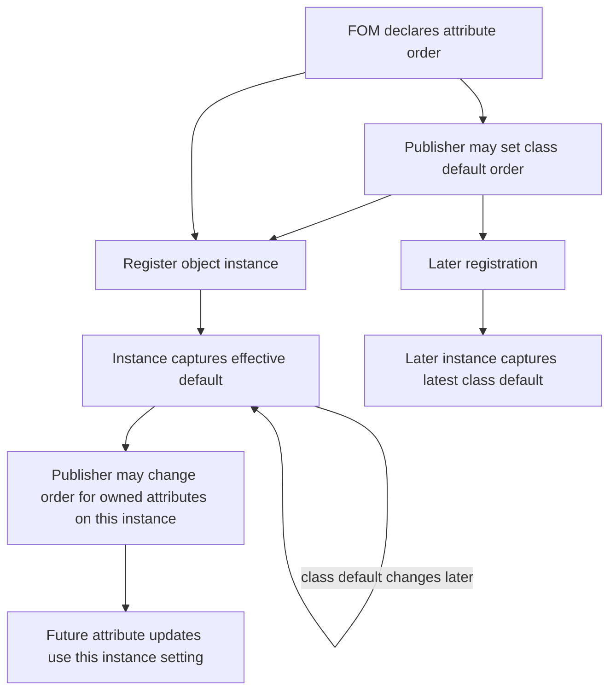
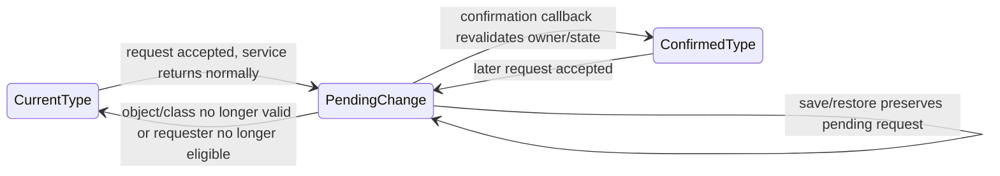
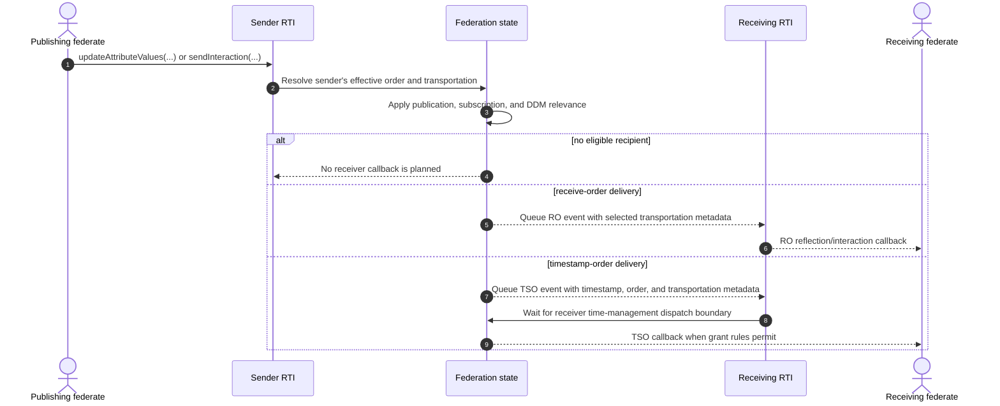
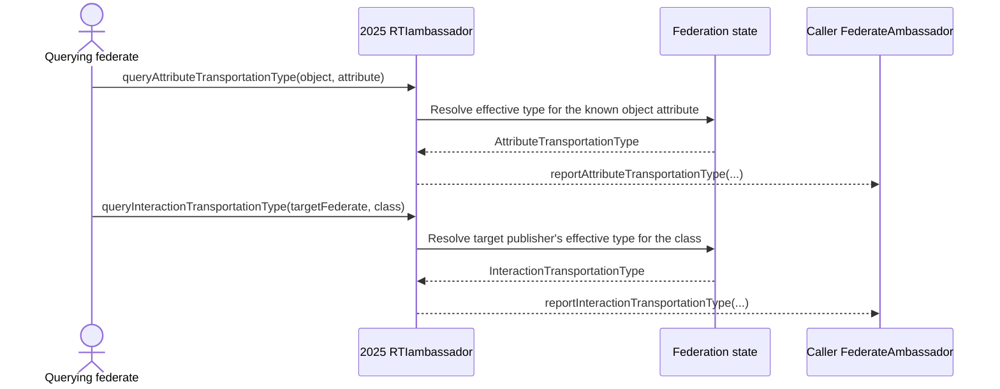

# IEEE 1516.1-2025 Order and Transportation Flow Guide

This guide explains two sender-controlled delivery properties that are easy to
conflate: **order** answers whether information is delivered receive-order or
timestamp-order; **transportation type** selects the federation-declared
transportation category associated with that information. They are reported
separately and follow different change lifecycles in Umbra.

**Edition:** IEEE 1516.1-2025 only. This guide does not describe the separate
2010 API/runtime or infer compatibility between editions.

**Implementation profile:** current 2025 embedded behavior plus selected
process-endpoint control/query cases. Focused tests establish only the paths
and combinations they exercise, not full conformance or physical network QoS.
The official [IEEE 1516.1-2025 edition page](https://standards.ieee.org/ieee/1516.1/6688/)
is the normative starting point. Clause numbers below are navigation pointers
transcribed from Umbra source comments; check exact wording in the licensed
standard before deriving requirements.

## First separate the two questions

| Property | It answers | Current 2025 values in this profile | Public observation |
| --- | --- | --- | --- |
| Order type | Is this delivery receive-order or timestamp-order? | `RECEIVE` or `TIMESTAMP` | Callback sent/received order values; timestamp-ordered callbacks also carry logical time and may carry a retraction handle. |
| Transportation type | Which FOM-declared transportation category is selected for this attribute or interaction? | Federation-scoped `TransportationTypeHandle`, including standard and FOM-defined names | Reflection/interaction callbacks carry the selected transportation handle; query services report it through callbacks. |

Neither value substitutes for the other. A `TIMESTAMP` order selection does not
say which transportation type is selected; a custom transportation handle
does not say when a time-constrained receiver may observe the event. DDM still
decides which receivers are relevant, and time management still gates TSO
delivery. See the separate [time-management](HLA-2025-TIME-MANAGEMENT-GUIDE.md)
and [DDM/regions](HLA-2025-DATA-DISTRIBUTION-AND-REGIONS-FLOW-GUIDE.md)
guides for those state machines.

## Who controls what, and when does it take effect?

Umbra exposes class/default settings and more specific settings. They are
scoped to the declaring federate's publication or object instance; changing
one sender's setting is not a federation-wide change to all senders of that
class.

| Control | Scope and service | Current Umbra commit point | Evidence-backed effect |
| --- | --- | --- | --- |
| Default attribute order | Attribute set on an object class via `changeDefaultAttributeOrderType` | Synchronous service update | Captured by later object registrations; existing instances retain their captured value. |
| Instance attribute order | Owned attributes on a known object via `changeAttributeOrderType` | Synchronous service update | Changes future updates for only that object/attribute set. |
| Published interaction order | An interaction class via `changeInteractionOrderType` | Synchronous service update | Changes future sends for that publisher/class. |
| Default attribute transportation | Attribute set on an object class via `changeDefaultAttributeTransportationType` | Synchronous service update | Later registered instances use the new default; existing instances are not rewritten. |
| Instance attribute transportation | Owned attributes on a known object via `requestAttributeTransportationTypeChange` | **Confirmation callback** `confirmAttributeTransportationTypeChange` | The accepted request stays pending; the selected value becomes effective at the confirmation boundary. |
| Published interaction transportation | A published interaction class via `requestInteractionTransportationTypeChange` | **Confirmation callback** `confirmInteractionTransportationTypeChange` | The accepted request stays pending; future sends use the confirmed value. |

The **default** and **instance** rows are different state locations and have
different lifetimes. For order, both class-default and instance changes apply
synchronously in the current profile. For transportation, the class-default
setter is synchronous, while instance/class overrides use a request-and-confirm
path.

## 1. Attribute order: defaults are captured; instance changes are local

The class default is prospective. Once an object instance exists, change its
order directly if that instance needs a different setting.

The self-loop emphasizes the non-retroactive edge: changing a class default
does not rewrite an already registered object's order. In the focused test, an
FOM-default timestamp-ordered object, a later receive-order default, and a
per-instance timestamp override produce different results even though the
publisher invokes the timestamped update service for each object.

## 2. Transportation overrides are callback-gated

An accepted request is not yet the new effective value. Umbra records pending
state and commits the selected transportation when it processes the matching
confirmation callback. Attribute requests are scoped to an object and set of
owned attributes; interaction requests are scoped to a published interaction
class.

For an attribute request, Umbra rejects a new request if one of its attributes
is already participating in a pending transportation change. For an
interaction class, a second request while a change is pending is rejected.
Before committing from pending to confirmed, the registry rechecks live
membership and ownership/publication state; stale work is discarded rather
than applied to a departed or no-longer-eligible sender.

Focused save/restore tests also exercise a pending attribute or interaction
transportation change across restoration. This documents the tested restore
paths; it does not claim every process restart, persistence backend, or
callback-scheduling interleaving is covered.

## 3. Delivery carries both properties; routing and time stay separate

The selected order and transportation become visible at the receiver, but
they do not replace recipient-selection or grant rules.

In callback observations, `sentOrderType` and `receivedOrderType` describe
order; the separate transportation handle describes the selected category.
Tests include ordinary and timestamped updates/interactions with a FOM-defined
custom transportation and observe that handle on the receiving callback.
Regional and directed variants exist in focused tests too, but this diagram
leaves their recipient-selection details to the DDM guide.

One subtle result in the order-control test is that a timestamped send/update
overload does not by itself prove the delivered event is TSO. The publisher's
current order setting matters: the test changes an interaction to `RECEIVE`,
supplies a logical-time argument, and observes receive-order values with no
valid retraction handle. Read both callback order fields and time-management
state; do not infer the result from the service overload alone.

## 4. Queries report the effective setting through callbacks

These query services are callback-oriented too: the API call is `void`; the
report arrives through the federate ambassador.

The interaction query's federate designator matters: it asks about a named
federate's effective transportation for an interaction class, not one
federation-wide class value. The process-endpoint integration test exercises
interaction change and query under both `HLA_EVOKED` and `HLA_IMMEDIATE`.

## Reading the implementation evidence

The source comments associate these controls and queries with standard
navigation points: §§6.25, 6.27–6.28, 6.30, and 6.32 for transportation
services; §§8.24–8.26 for order controls. The [official 2025 standard page](https://standards.ieee.org/ieee/1516.1/6688/)
is the authority for interpreting those sections.

| Topic | Umbra implementation | Focused evidence |
| --- | --- | --- |
| Attribute order and class defaults | [Registry controls](../../cpp/src/internal/federation/federation_registry_transportation_order_services.cpp#L10); [ambassador controls](../../cpp/src/internal/runtime/umbra_rti_ambassador_order_transportation_services.cpp#L52) | [Order-control scenario](../../cpp/tests/order_type_control_catch2.cpp#L168) |
| Attribute transportation default, pending request, and query | [Request planning](../../cpp/src/internal/federation/federation_registry_attribute_transportation_type_change_planning.cpp#L10); [effective-value resolution](../../cpp/src/internal/federation/federation_registry_catalog_queries.cpp#L932); [ambassador services](../../cpp/src/internal/runtime/umbra_rti_ambassador_order_transportation_services.cpp#L415) | [Embedded default/instance control](../../cpp/tests/custom_transportation_type_control_catch2.cpp#L102); [FOM-defined controls](../../cpp/tests/ieee1516_2025_custom_transportation_type_controls_catch2.cpp#L3) |
| Interaction transportation request/query | [Change](../../cpp/src/internal/runtime/umbra_rti_ambassador_interaction_transportation_type_change.cpp#L21); [query](../../cpp/src/internal/runtime/umbra_rti_ambassador_interaction_transportation_type_query.cpp#L20); [effective value](../../cpp/src/internal/federation/federation_registry_catalog_queries.cpp#L955) | [Configured process endpoint, both callback models](../../cpp/tests/ieee1516_2025_connection_interaction_transportation_catch2.cpp#L76) |
| Transportation metadata on outgoing delivery | [Interaction planning](../../cpp/src/internal/federation/federation_registry.cpp#L1832); [attribute update planning](../../cpp/src/internal/federation/federation_registry_attribute_value_update_requests.cpp#L152) | [Ordinary custom transport](../../cpp/tests/custom_transportation_delivery_catch2.cpp#L142); [timestamped custom transport](../../cpp/tests/custom_transportation_timestamped_delivery_catch2.cpp#L185); [regional/directed variants](../../cpp/tests/custom_transportation_timestamped_regional_attribute_delivery_catch2.cpp#L163), [directed interaction](../../cpp/tests/custom_transportation_timestamped_directed_delivery_catch2.cpp#L143) |
| Pending transportation changes through restore | [Saved pending state](../../cpp/src/internal/federation/federation_registry_state_image_capture.cpp) | [Attribute restore](../../cpp/tests/ieee1516_2025_public_pending_attribute_transportation_type_change_restore_catch2.cpp#L6); [interaction restore](../../cpp/tests/ieee1516_2025_public_pending_interaction_transportation_type_change_restore_catch2.cpp#L6) |

These links show representative implementation and test paths, not exhaustive
coverage of the standard's service matrix. The [separate 2010 reference-RTI guide](HLA-2010-REFERENCE-RTI-FLOW-GUIDE.md)
retains its own implementation boundary; nothing in this 2025 guide is
evidence for that stream.

## Known limits and the next boundary

- Transportation tests prove catalog resolution, state selection, and callback
  metadata for named scenarios. They do not measure wire-level reliability,
  latency, or delivery guarantees of every transportation category or
  deployment.
- The cross-product of attribute versus interaction, default versus override,
  RO versus TSO, regional versus nonregional, embedded versus process, and
  save/restore timing is not exhaustively tested.
- Order values outside `RECEIVE` and `TIMESTAMP` are rejected by the current
  profile; this describes Umbra behavior, not an independent standards ruling.
- This guide does not absorb DDM recipient selection, time-advance eligibility,
  message retraction, or 2010 behavior. Follow the linked guides for those
  boundaries.

The next bounded survey should examine whether publication/subscription
advisories and relevance transitions have a distinct learner-facing lifecycle
not already covered by the DDM and object-information guides. Keep the result
in Umbra documentation and preserve the explicit 2010/2025 separation.
