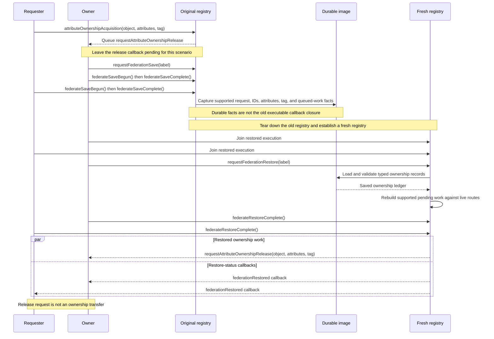
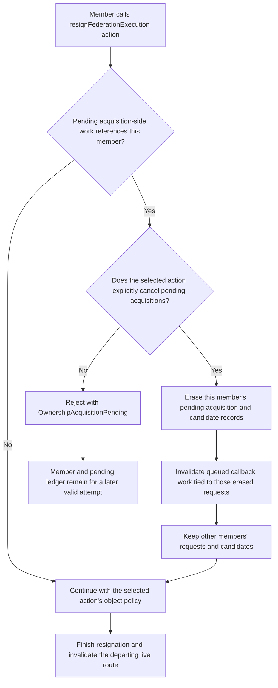
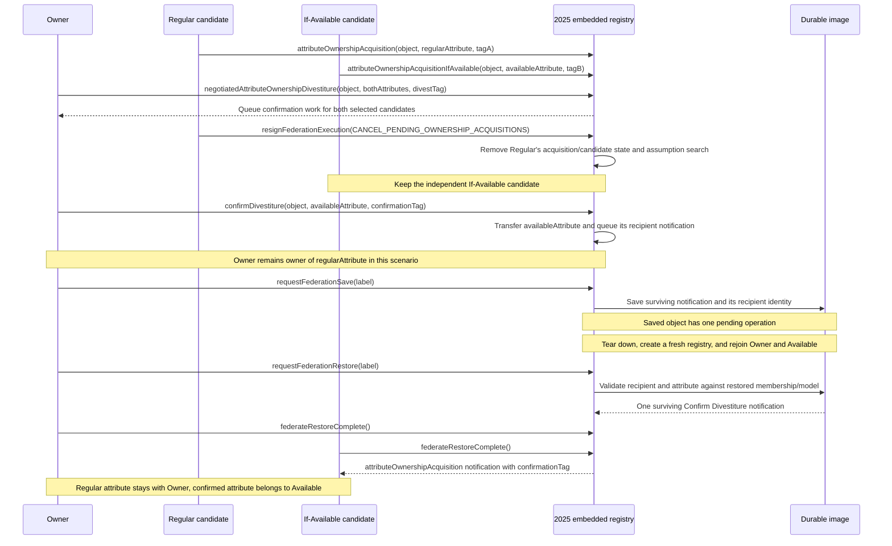

# IEEE 1516.1-2025 Ownership Persistence and Resignation: Flow Guide

This guide is a companion to the [core attribute-ownership guide](HLA-2025-ATTRIBUTE-OWNERSHIP-FLOW-GUIDE.md). It follows selected ownership work across a save/restore boundary and explains how a departing federate's pending acquisition state is treated by the current Umbra implementation. It is contributor documentation, not an implementation contract or a claim of conformance.

## Scope and evidence boundaries

- **Standard boundary:** IEEE 1516.1-2025 only. The official [IEEE standard page](https://standards.ieee.org/ieee/1516.1/6688/) identifies the normative document. Consult its exact service text for requirements; this guide does not reconstruct the full resignation-action matrix.
- **Implementation boundary:** selected 2025 embedded development-profile ownership ledgers, resignation cleanup, and fresh-registry restore paths.
- **Test boundary:** the cited public-API tests exercise named scenarios using embedded registries. A fresh registry in a test is not by itself proof of behavior across every deployed process, transport, or profile.
- **Edition boundary:** the 2010 API and runtime are separate. Nothing here implies 2010 behavior or parity.
- **Evidence labels:** source links describe current implementation; focused tests establish only their named observations. Neither substitutes for the standard or proves complete support.

## Keep three kinds of state distinct

| Layer | Examples | Restore/resignation question |
| --- | --- | --- |
| Ownership ledger | Object and attribute identities, owner/requester IDs, pending request IDs, selected attributes, tags, and queued-work markers | Which typed facts can be validated and reconstructed from the saved image? |
| Callback route | Ambassador registration, live dispatcher, and queued executable closure | Which current route can receive reconstructed work? A closure tied to the old registry is not durable data. |
| Membership | The set of federates currently joined to this execution | Is the saved requester, owner, or notification recipient still a live participant for this restored operation? |

The state-image capture writes typed ownership records. In the route-free fresh-registry path, restore validates their identities against current members and object attributes; for regular acquisition work, it clears old queued-delivery markers so the restored planner can reserve work against live routes. This is deliberately narrower than “all ownership work survives restart.” Only supported ledger shapes should be inferred to restore.

## 1. A pending release callback across save and restore

The focused regular-acquisition case intentionally leaves the owner's release callback undelivered at the save boundary. The test inspects the encoded image, creates a new registry, rejoins, restores, and then checks that the current owner's callback receives the original object, attribute set, and tag. It checks both `HLA_EVOKED` and `HLA_IMMEDIATE` callback models. It does **not** claim that ownership transferred: the requester has no acquisition notification in this scenario.

The diagram is a scenario trace, not a normative callback-order guarantee. In the test, callback delivery is drained or enabled according to the selected callback model after restore completion. The later ownership service that resolves the request is outside this chart.

## 2. Resignation with pending acquisition work

The embedded registry first checks whether the departing member is still referenced by regular or If-Available acquisition requests, cancellation work, negotiated-divestiture candidacy, or a pending Confirm Divestiture notification. For the voluntary actions covered by the source guard, unresolved work rejects the resignation attempt before cleanup mutates the federation. The explicit cancellation action removes acquisition-side work belonging to the departing member; it does not erase another joined member's competing request.

In current source, the preflight rejects unresolved acquisition work for `UNCONDITIONALLY_DIVEST_ATTRIBUTES`, `DELETE_OBJECTS`, `DELETE_OBJECTS_THEN_DIVEST`, and `NO_ACTION`; `CANCEL_PENDING_OWNERSHIP_ACQUISITIONS` and `CANCEL_THEN_DELETE_THEN_DIVEST` select cancellation. The latter also has its own object action. Do not read the chart as the complete standard action table: last-member deletion and connection-loss cleanup are separate rules and are intentionally not expanded here.

The two focused embedded tests make the contrast tangible: an unconditional-divest resignation is rejected while acquisition work is pending, then a combined cancellation action succeeds; separately, a requester resigning with the cancellation-only action leaves the surviving owner's queued release callback undelivered.

## 3. Remove one candidate without discarding the surviving recipient

One fresh-registry test follows a negotiated divestiture with two selected candidates. The regular candidate resigns with pending-acquisition cancellation. The owner then confirms divestiture for the If-Available candidate. The saved image contains only the surviving recipient's pending Confirm Divestiture notification (`pendingOperationCount == 1`); after restore, that recipient receives the notification with its object, attribute, and tag, while the other attribute remains owned by the original owner.

This chart emphasizes candidate pruning and recipient preservation, not arbitration order or a general fairness rule. In particular, a resigned candidate is not a reason to discard a different candidate's pending operation.

## Implementation and focused test evidence

- **Capture:** [typed ownership image capture](../../cpp/src/internal/federation/federation_registry_state_image_capture.cpp#L1015) records acquisition requests, request/candidate identities, attribute sets, tags, callback markers, and Confirm Divestiture notifications.
- **Restore validation and reconstruction:** [ownership-ledger restore](../../cpp/src/internal/federation/federation_registry_restore_ownership_ledgers.cpp#L569) validates live requester/owner identities and attributes. The route-free regular-request path resets queued callback markers so the restored work can be replanned ([lines 695–704](../../cpp/src/internal/federation/federation_registry_restore_ownership_ledgers.cpp#L695)); Confirm Divestiture notifications likewise require a live recipient ([lines 794–829](../../cpp/src/internal/federation/federation_registry_restore_ownership_ledgers.cpp#L794)).
- **Resignation preflight and cleanup:** [resignation pending-work check](../../cpp/src/internal/federation/federation_registry_resign_lifecycle.cpp#L142) and [member-scoped cancellation](../../cpp/src/internal/federation/federation_registry_resign_lifecycle.cpp#L462).
- **Regular release callback restored:** [public fresh-registry restore scenario](../../cpp/tests/ieee1516_2025_public_ownership_acquisition_restore_catch2.cpp#L142) captures pending work; [post-restore callback assertions](../../cpp/tests/ieee1516_2025_public_ownership_acquisition_restore_catch2.cpp#L256) verify object, attribute, and tag with both callback models.
- **Surviving recipient after candidate resignation:** [two-candidate setup and resignation](../../cpp/tests/ieee1516_2025_public_confirm_divestiture_resignation_restore_catch2.cpp#L180), [single-operation saved-image assertions](../../cpp/tests/ieee1516_2025_public_confirm_divestiture_resignation_restore_catch2.cpp#L285), and [restored notification/ownership assertions](../../cpp/tests/ieee1516_2025_public_confirm_divestiture_resignation_restore_catch2.cpp#L361).
- **Resignation rejection:** [unconditional-divest action rejected while acquisition is pending](../../cpp/tests/ieee1516_2025_embedded_resign_action_pending_acquisition_catch2.cpp#L36).
- **Cancellation-only action:** [departing requester cancellation suppresses the queued release callback](../../cpp/tests/ieee1516_2025_embedded_resign_action_cancel_pending_acquisition_catch2.cpp#L49).
- **Adjacent restore coverage:** [If-Available callback](../../cpp/tests/ieee1516_2025_public_pending_ownership_if_available_restore_catch2.cpp#L6) and [mixed negotiated confirmations](../../cpp/tests/ieee1516_2025_public_mixed_negotiated_ownership_restore_catch2.cpp#L6) have separate focused scenarios. They are not extra claims in the diagrams above.

The resignation source comments associate the unresolved-acquisition check with IEEE 1516.1-2025 §4.12.3 and mandatory last-member object deletion with §4.12.4. Verify exact wording and applicability in the official standard before using either as a normative interpretation. The cited tests are development-profile evidence only.

## Deliberate limits and next step

This companion covers selected regular acquisition and Confirm Divestiture/If-Available state only. It does not claim every ownership operation is portable across a fresh registry, expand all `ResignAction` combinations, or integrate ownership with time management, DDM, or TSO callback scheduling. Use the [core ownership guide](HLA-2025-ATTRIBUTE-OWNERSHIP-FLOW-GUIDE.md) for transfer and callback-time state, and the [save/restore guide](HLA-2025-FEDERATION-SAVE-RESTORE-FLOW-GUIDE.md) for federation-wide save coordination.

Receive-order deletion and stale ownership-callback invalidation are now
diagrammed in the [core ownership guide](HLA-2025-ATTRIBUTE-OWNERSHIP-FLOW-GUIDE.md#accepted-object-deletion-invalidates-pending-ownership-work),
with object-state commit and federate-local deletion in the
[object/interaction guide](HLA-2025-OBJECT-AND-INTERACTION-INFORMATION-FLOW-GUIDE.md#object-removal-delete-callback-and-per-receiver-cleanup).
Keep that object-lifecycle material there instead of duplicating it in this
ownership-persistence companion. A filename-filtered survey of 154 IEEE
1516.1-2025 ownership, resignation, and restore test files found no direct
`deleteObjectInstance` or `removeObjectInstance` call in the focused public
restore/resignation/mixed-ownership cases. The If-Available restore scenario
drains callbacks before resignation ([callback drain](../../cpp/tests/ieee1516_2025_public_pending_ownership_if_available_restore_catch2.cpp#L195));
the negotiated restore fixture likewise drains its confirmation
([callback drain](../../cpp/tests/ieee1516_2025_public_pending_negotiated_owner_confirmation_restore_catch2.cpp#L225));
and the mixed-negotiated case reaches its saved-image assertions before
teardown ([saved-image boundary](../../cpp/tests/ieee1516_2025_public_mixed_negotiated_ownership_restore_catch2.cpp#L272)).

There is limited indirect evidence in two adjacent cases. The If-Wanted restore
test captures a pending notification, then resigns the owner with
`CANCEL_THEN_DELETE_THEN_DIVEST` before any callback drain
([pending ledger](../../cpp/tests/ieee1516_2025_public_divestiture_if_wanted_notification_restore_catch2.cpp#L177),
[resignation action](../../cpp/tests/ieee1516_2025_public_divestiture_if_wanted_notification_restore_catch2.cpp#L190)).
It does not assert whether the requester callback is suppressed after that
transition. The Confirm Divestiture candidate-pruning test similarly records a
pending notification before the candidate resigns, then resigns the owner
without a post-delete callback assertion
([pending notification](../../cpp/tests/ieee1516_2025_public_confirm_divestiture_resignation_restore_catch2.cpp#L285),
[resignation sequence](../../cpp/tests/ieee1516_2025_public_confirm_divestiture_resignation_restore_catch2.cpp#L300)).
A similarly named service-report If-Available case drains and observes its
acquisition notification before deleting the object. These scenarios establish
adjacent state and teardown paths, not direct suppression evidence for
If-Wanted, negotiated divestiture, or Confirm Divestiture.

The ownership-specific preflight diagram complements, rather than replaces,
the [federation lifecycle guide's `ResignAction` effects table](HLA-2025-FEDERATION-AND-FEDERATE-LIFECYCLE-FLOW-GUIDE.md#resignaction-effects-in-the-current-implementation):
the table covers object/divestiture effects and final-member behavior, while
this chart explains the pending-work reject-versus-cancel guard. The lifecycle
guide now links back here and records eight focused embedded action-test files.
No additional action diagram was justified because it would repeat those two
distinct views rather than clarify a new tested transition.

Next, audit byte-order clarity in the [data-element encoding guide](HLA-2025-DATA-ELEMENT-ENCODING-FLOW-GUIDE.md)
against the pinned 2025 API, codec source, and focused tests, then inspect the
2010 codec and its evidence separately. Confirm that diagrams distinguish
operation-specific big-/little-endian value encoding from transport framing;
revise only where source-backed labels are unclear. Do not infer cross-edition
parity or edit the HLA Requirements Lab during this Umbra documentation phase.
