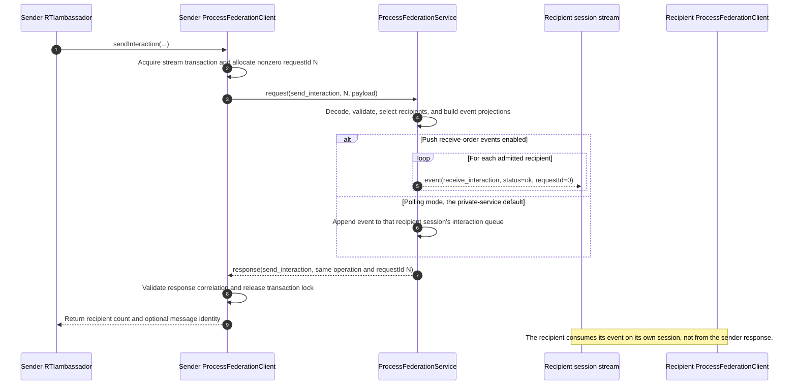
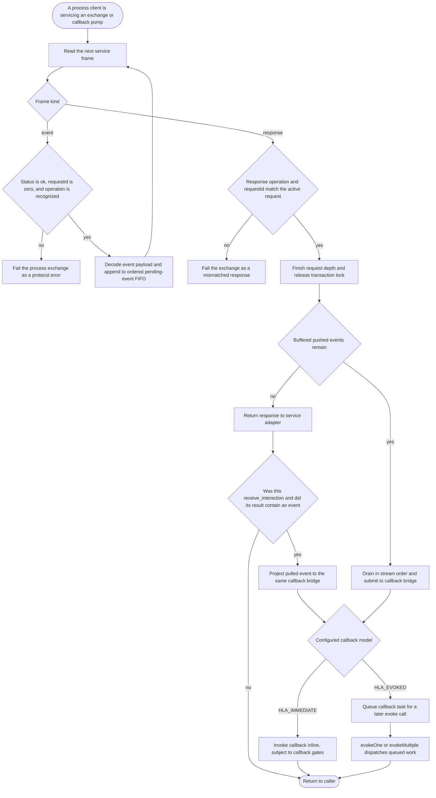

# IEEE 1516.1-2025 Process Endpoint: Request and Callback Flow

This guide explains how one 2025 RTI service request crosses Umbra's private
process endpoint and how a receive-order interaction can return through the
recipient's callback bridge. It is an implementation walkthrough, not a
normative description of the IEEE wire protocol: the transport messages and
request identities below are Umbra-private.

The example is `Send Interaction`, but the request/response framing and event
demultiplexing pattern is shared by other process-service operations. The guide
does not attempt to describe every callback family, the full HLA interaction
state machine, or logical-time admission. Read the [callback/service-ordering
guide](HLA-2025-CALLBACK-AND-SERVICE-ORDERING-FLOW-GUIDE.md) for the broader
callback dispatcher and [time-management](HLA-2025-TIME-MANAGEMENT-GUIDE.md)
and [TSO retraction](HLA-2025-TSO-RETRACTION-FLOW-GUIDE.md) for logical-time
and retraction behavior.

## Keep the boundaries straight

- **Edition:** IEEE 1516.1-2025 process endpoint only. The 2010 reference RTI
  has its own implementation and separate documentation; none of its behavior
  is inferred here.
- **Profiles:** a process endpoint is a client/server boundary. Some focused
  tests run the service in a server thread with an embedded registry; a
  separate test launches service, sender, and receiver processes. Those test
  arrangements are evidence about their respective paths, not proof that all
  deployment profiles are equivalent.
- **Two delivery modes:** the private service option defaults to retaining
  receive-order events in per-session queues. When pushed receive-order events
  are enabled, the service writes an unsolicited event frame to the recipient's
  session. The client can still issue an explicit `receive_interaction`
  request; pushed events are not a background callback thread.
- **Two callback models:** submitting an event to the callback bridge invokes
  user code inline in `HLA_IMMEDIATE`; in `HLA_EVOKED`, the event is queued for
  `evokeOne`/`evokeMultiple`. This is distinct from whether the process service
  pushed or queued the event.
- **Three unrelated identities:** `requestId` correlates a private service
  response; `messageId` identifies certain federation messages, including TSO
  retraction work; a logical timestamp participates in HLA time management.
  Do not compare or substitute one for another.

## 1. A service call and its recipient stream

The sending member's synchronous request and each recipient's event travel on
different process sessions. In push mode, the service sends each recipient
event before returning the sender's service response. That event is not part of
the sender's response and does not use its request ID.

The common outer framing is length-prefixed. Its private frame header reads the
payload length as a big-endian 32-bit value; that framing is not the public
`DataElement` representation or an HLA logical-time encoding. See
[`process_transport.cpp`](../../cpp/src/internal/federation/process_transport.cpp#L188)
and keep it separate from the edition-specific value-byte discussion in the
[DataElement guide](HLA-2025-DATA-ELEMENT-ENCODING-FLOW-GUIDE.md).

## 2. From a stream frame to an official callback

The process client owns one serialized request/response exchange at a time. A
pushed event may arrive while that exchange is waiting for its matching
response. The client validates and buffers it, continues reading, and only
releases the transaction lock after the response operation and `requestId`
match. Callback submission happens after that unlock, so callback re-entry does
not run under the socket-transaction lock.

One subtlety: a pushed frame is unsolicited at the service-protocol level, but
the current client does not run a separate socket-reader callback thread. The
frame is consumed when the client reads its session stream. A public Evoke path
first drains already-buffered work; if none is available, it can issue the
explicit receive operation. In polling mode, the event can be returned inside
that operation's response. In push mode, an event frame can be read while the
receive request waits for its correlated response. Both routes converge on the
callback bridge, but their arrival and buffering steps differ.

The client also preserves a heterogeneous FIFO for pushed event families. It
does not hold the stream transaction lock while submitting user-facing work to
the bridge. For timestamped deliveries, the process service has additional
in-transit and post-callback acknowledgement rules; those are deliberately
covered by the [time](HLA-2025-TIME-MANAGEMENT-GUIDE.md) and
[retraction](HLA-2025-TSO-RETRACTION-FLOW-GUIDE.md) guides, not folded into this
receive-order example.

## Walk one interaction through the code

1. The sending ambassador calls public `sendInteraction`; the configured
   process client allocates a nonzero request ID and serializes the operation.
2. The service decodes and validates the request, computes recipient
   projections, and either queues each event or writes an event frame to that
   recipient's session, according to `pushReceiveOrderEvents`.
3. The service returns a response with the same operation and request ID. The
   sender's client validates that pair before returning the result.
4. On the recipient side, event data can be read during another service
   exchange or by the explicit receive path. Pushed frames are validated as
   `kind=event`, `status=ok`, and `requestId=0`, then decoded into the pending
   FIFO. A polling response instead carries the receive result.
5. After a correlated exchange releases its transaction lock, pending pushed
   events are submitted to the callback bridge. The callback model decides
   whether submission invokes now or queues work for Evoke; it does not change
   the wire event's identity or order.

At the public API layer, `HLA_EVOKED` additionally gates user callback
invocation on `evokeCallback`/`evokeMultipleCallbacks`. The process callback
pump may use a receive request to admit available process events before the
shared dispatcher is asked to evoke. Do not mistake that pump for HLA logical
time advancement: receive-order callback admission has no logical timestamp.

## Evidence map and limits

### Source path

- [`ProcessTransportSession::request` and service dispatcher](../../cpp/src/internal/federation/process_transport_session.cpp#L50) validate nonzero request IDs and require matching response operation/identity.
- [`ProcessFederationClient::bufferEvent`](../../cpp/src/internal/federation/process_federation_client.cpp#L427) validates unsolicited event frames; [`request`](../../cpp/src/internal/federation/process_federation_client.cpp#L504) buffers recognized event families and continues until the active response matches.
- [`receivePendingEvent`](../../cpp/src/internal/federation/process_federation_client_event_templates.hpp#L11) consumes already-buffered events first and otherwise reads synchronously from the session stream; [`submitReceiveOrder`](../../cpp/src/internal/federation/process_federation_callback_bridge.hpp#L57) documents the immediate-inline versus evoked-queue distinction.
- [`ProcessFederationServiceOptions`](../../cpp/src/internal/federation/process_federation_service.hpp#L26) sets polling as the private-service default. [`handleSendInteraction`](../../cpp/src/internal/federation/process_federation_service_interaction_send.cpp#L74) emits event frames in push mode before returning the sender result (see the push branch at [line 594](../../cpp/src/internal/federation/process_federation_service_interaction_send.cpp#L594)); [`handleReceiveInteraction`](../../cpp/src/internal/federation/process_federation_service_receive.cpp#L37) consumes per-session queued work for the explicit receive path.
- [`dispatchPendingPushedEvents`](../../cpp/src/internal/federation/process_federation_client_callback_dispatch.cpp#L265) drains after releasing the exchange lock; `evokeOne` and `evokeMultiple` enter the callback bridge at lines 518 and 526.
- [`pumpProcessReceiveOrder`](../../cpp/src/internal/runtime/umbra_rti_ambassador_callback_control_services.cpp#L125) drains buffered events and uses the explicit receive operation when the process callback pump needs more work.

### Focused tests

- [`Private process service dispatch correlates federation operations over framed data`](../../cpp/tests/process_transport_service_catch2.cpp#L25) checks Create, Join, and Send Interaction request/response correlation and payload preservation.
- [`Private registry-bound service exchanges federation traffic across independently launched processes`](../../cpp/tests/process_federation_service_process_catch2.cpp#L38) launches server, sender, and receiver processes. Its receiver probe enables pushed events and checks projection through the official `FederateAmbassador::receiveInteraction` bridge ([probe setup](../../cpp/tests/process_federation_service_probe.cpp#L162), [receiver assertion](../../cpp/tests/process_federation_service_probe.cpp#L1406)). This test uses the private `ProcessFederationClient` seam, not the public `RTIambassador`.
- [`RTIambassador routes public Send Interaction through a configured process endpoint`](../../cpp/tests/ieee1516_2025_connection_send_interaction_catch2.cpp#L457) checks the public send path and an explicit receiver poll in both callback-model sections. It uses the service's default polling mode, so it is not evidence for pushed callback delivery.
- [`RTIambassador receives a process interaction through the official Evoke callback surface`](../../cpp/tests/ieee1516_2025_connection_receive_evoke_catch2.cpp#L457) and [`RTIambassador preserves a timestamped process interaction through the official Evoke callback surface`](../../cpp/tests/ieee1516_2025_connection_timestamped_receive_evoke_catch2.cpp#L457) exercise public configured-endpoint callback paths. The timestamped case belongs to the adjacent time/retraction boundary, not the receive-order diagram.

These tests are complementary, not interchangeable: transport tests establish
framing/correlation, the subprocess probe establishes a pushed private-client
callback, and public endpoint cases exercise the ambassador surface. None alone
proves every process operation, event family, callback model, deployment, or
edition.

### Current local execution

I attempted the six matching CTest registrations in `.build-fom-services` on
2026-10-09. All six selected CTest registrations failed in this environment:

- Both public callback test cases failed at initial `RTIambassador::connect`
  with `Unknown exception`, before their callback assertions.
- The private framed-transport test failed at localhost socket connect with
  Winsock error `10013`.
- The independently launched-process test failed `senderStatus == 0` after
  30.13 seconds; the sender helper's failure point was not established.

The test source describes the intended assertions, but this run is not passing
runtime evidence. Rerun these focused cases in an environment where the local
process endpoint can bind and connect before upgrading that evidence label.

## Questions for a code-reading session

1. Which connection carries the pushed event: the sender's or each recipient's?
2. Why is a pushed event's `requestId` zero, while the sender response repeats
   a nonzero request ID?
3. At what point is the transaction lock released, and why must bridge/user
   callback submission happen after that point?
4. Does `HLA_IMMEDIATE` mean “the server pushed immediately”? No: it selects
   client callback dispatch timing, independently of service push/poll mode.
5. Does a service `requestId` say anything about HLA logical time? No. Follow
   timestamp, grant, and retraction state in the dedicated time guides.

## Source/test entry points

For a first read, trace these in order:

1. [`transport_service_protocol.hpp`](../../cpp/src/internal/federation/transport_service_protocol.hpp) — private message kinds and operations.
2. [`process_transport_session.cpp`](../../cpp/src/internal/federation/process_transport_session.cpp) — synchronous request correlation and server dispatch.
3. [`process_federation_client.cpp`](../../cpp/src/internal/federation/process_federation_client.cpp) — pushed-frame validation and request demultiplexing.
4. [`process_federation_service_interaction_send.cpp`](../../cpp/src/internal/federation/process_federation_service_interaction_send.cpp) — recipient selection, event push/queue, sender response.
5. [`process_federation_client_callback_dispatch.cpp`](../../cpp/src/internal/federation/process_federation_client_callback_dispatch.cpp) and [`umbra_rti_ambassador_callback_control_services.cpp`](../../cpp/src/internal/runtime/umbra_rti_ambassador_callback_control_services.cpp) — lock release, bridge projection, and Evoke admission.
6. Run the cited focused tests only where the process endpoint can bind/connect; keep their outcomes separate from the source trace.
