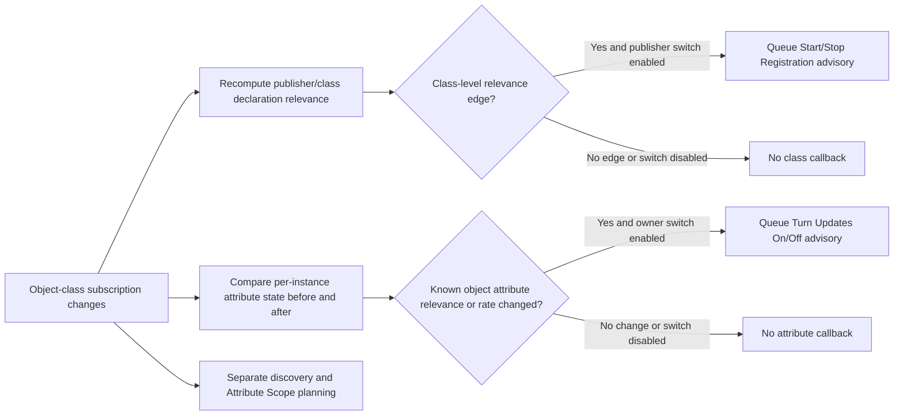
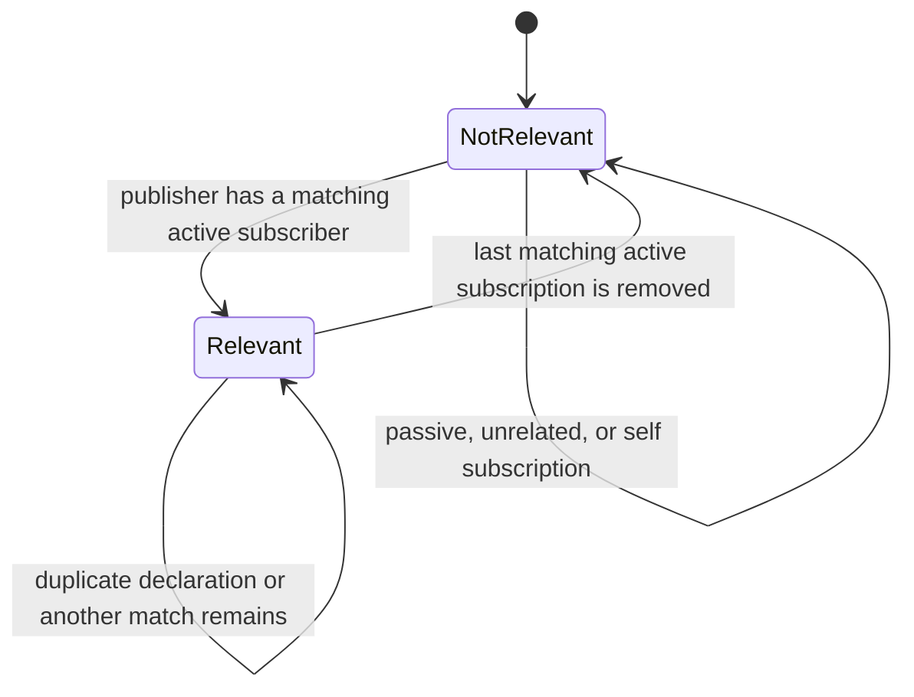
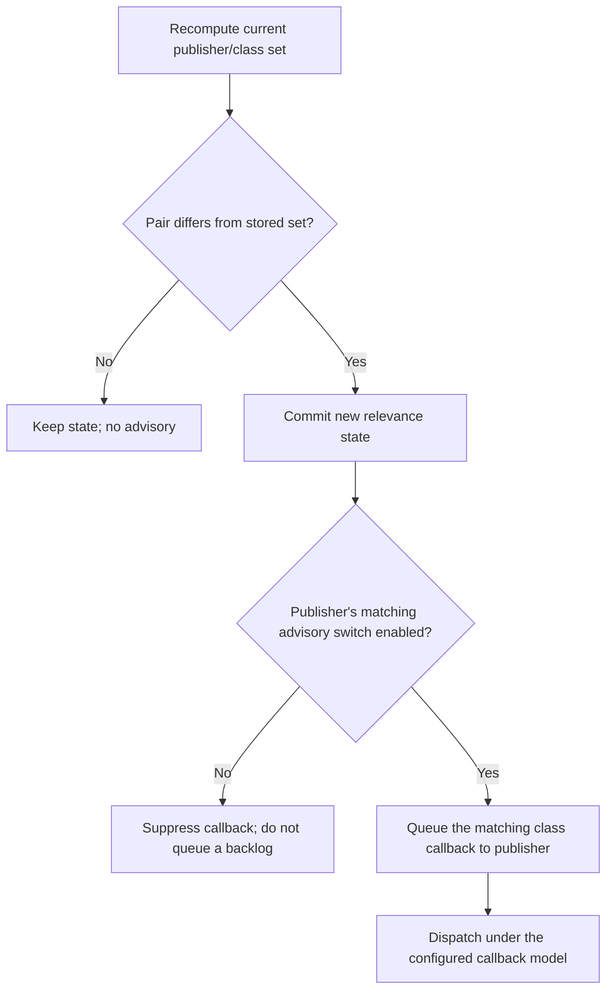
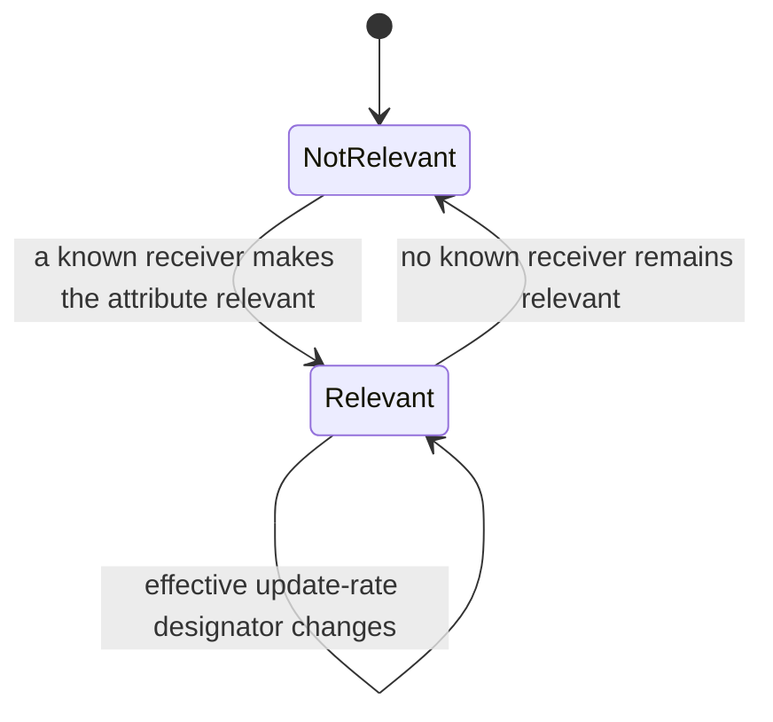

# IEEE 1516.1-2025 Declaration and Attribute Relevance Advisory Flow Guide

This guide separates two RTI-initiated advisory families that are often
mistaken for one signal:

1. **Declaration relevance** tells a publisher that at least one other joined
   federate has an active, matching class subscription.
2. **Attribute relevance** tells an object-attribute owner that a particular
   known object attribute is relevant to one or more receiving federates.

The callbacks have different granularity, recipients, state, and DDM rules.
A single object-class subscription mutation can feed both calculations, as
well as separate discovery and scope paths.

**Edition:** IEEE 1516.1-2025 only. This guide describes the current 2025 Umbra
implementation and selected test evidence; it makes no claim about the separate
2010 stream or about full conformance.

**Implementation profiles:** embedded registry planning plus selected
configured 2025 process-endpoint attribute-relevance paths. Declaration and
attribute evidence come from distinct profile/test slices; this is not a claim
of cross-profile equivalence.

The official [IEEE 1516.1-2025 edition page](https://standards.ieee.org/ieee/1516.1/6688/)
is the normative starting point. Source comments and test names below are
navigation/evidence pointers, not substitutes for the licensed standard.

## Start by asking who receives what

| Signal | State being summarized | Callback recipient | What it does not mean |
| --- | --- | --- | --- |
| Declaration relevance | A publisher's published object or interaction class has at least one other active matching subscription. | The publisher, with a class-level callback. | It does not prove a particular object exists, a region overlaps, or any value will be delivered. |
| Attribute relevance | A known object instance's attribute is relevant to at least one other member under the current subscription and scope policy. | The attribute's current owner, with an instance-and-attribute callback. | It is not a value update, discovery callback, or proof that every receiver has received data. |
| Discovery | A particular receiving federate becomes aware of an object instance. | The receiving federate. | It is not the publisher's class-level Start Registration advisory. |
| Attribute Scope | A separate scope-advisory lane for object attributes. | Governed by its own service and callback rules. | It is not an alias for Turn Updates On/Off. |

Declaration and attribute relevance are independent signals. Do not use one
callback as evidence that the other was generated, enabled, or dispatched.
For object-class subscription operations, the current 2025 ambassador path
plans declaration advisories and attribute-relevance advisories separately;
it also has distinct discovery and scope-change work.

## One object subscription, separate calculations

The branches below show the important separation, not a universal callback
ordering guarantee. A subscription can affect class-level interest even before
an instance is registered; attribute-level relevance requires an applicable
known instance and attribute.

The sender-facing class callback identifies a class. The owner-facing attribute
callback identifies an object instance and one or more attributes. Their
callback queues are distinct, so callback-model dispatch and other queued RTI
events remain separate concerns; see the [callback and service ordering guide](HLA-2025-CALLBACK-AND-SERVICE-ORDERING-FLOW-GUIDE.md).

## Class-level declaration relevance

Umbra stores class relevance as publisher/class pairs. It recomputes the
current set after declaration mutations and compares that set with the previous
set. A newly relevant pair can produce a Start/On callback; a pair that ceases
to be relevant can produce a Stop/Off callback, subject to the publisher's
switch and the class still being published.

For object classes, a published attribute is relevant when another joined
federate has an active subscription to that attribute at the published class
or an applicable ancestor. For interaction classes, an active subscription to
the published class or an applicable ancestor is sufficient. The publisher is
not counted as its own receiver.

The class-level calculation intentionally does **not** require an object
instance or a region-overlap result. An active regional subscription can
establish declaration relevance for a matching published class; actual
region overlap remains a separate delivery question. The focused regional
declaration test exercises the active/passive boundary, and the registry
planner explicitly keeps overlap out of this class-level predicate.

The object-class and interaction-class relevance switches are distinct,
per-federate controls in the current implementation. The composed FDD seeds
each joining federate's initial values; changing one publisher's switch does
not mutate another member's setting. The `Advisories Use Known Class` switch
is a different policy: it is static at federation scope and changes how
attribute relevance resolves class subscriptions. Do not substitute one switch
for another. The distinct Create-time versus per-member initialization boundary
is shown in the
[federation MOM switch-lifecycle flow](HLA-2025-FEDERATION-MOM-FLOW-GUIDE.md#creation-time-federation-policy-versus-per-member-switch-seeding).

### Switch-off is not a queued backlog

In the current planner, the relevance sets are recomputed and committed even
when the publisher's callback switch is disabled. Turning the switch back on
does not replay the already-existing state as a fresh edge. A later transition
can produce a callback if the switch is enabled then. The embedded 2025 test
checks suppression while disabled, no callback merely from re-enabling, and
subsequent active/passive transitions.

The current callback mapping is:

| State edge | Object-class callback | Interaction-class callback |
| --- | --- | --- |
| Not relevant → relevant | `startRegistrationForObjectClass` | `turnInteractionsOn` |
| Relevant → not relevant | `stopRegistrationForObjectClass` | `turnInteractionsOff` |

This table describes callback names and the tested Umbra transition model.
Check the IEEE 1516.1-2025 text for normative conditions and exceptions.

## Per-instance attribute relevance

Attribute relevance is evaluated for a particular object instance and
attribute, using receivers that know the instance and the current declaration
and scope state. The callback is directed to the attribute owner—not to the
federate whose subscription caused the change.

On the first edge, the owner may receive
`turnUpdatesOnForObjectInstance(object, attributes[, updateRateDesignator])`.
On the second edge, it may receive
`turnUpdatesOffForObjectInstance(object, attributes)`. In the current
implementation, if the attribute remains relevant overall because another
known receiver still matches, removing one receiver does not create a spurious
Off edge.

There is an additional update-rate edge: if relevance stays On but the
effective active update-rate designator changes, the implementation can issue
another Turn Updates On callback with the newly resolved designator. In the
current resolver, the maximum applicable explicit active rate is selected; an
applicable declaration with an omitted/default rate suppresses the optional
designator. This is an implementation detail backed by focused tests, not a
general statement about every standard/profile combination.

### Scope and class-selection boundaries

- For ordinary subscriptions, class ancestry and the receiver's known object
  class determine which declarations apply. The 2025 `Advisories Use Known
  Class` policy changes the class basis used for this advisory calculation;
  focused enabled/disabled tests cover the branch.
- For regional object attributes, the concrete object/receiver region
  realizations and overlap matter to per-instance relevance. A committed
  region or update-region association can move an existing known attribute
  across an On/Off edge. The [DDM and regions guide](HLA-2025-DATA-DISTRIBUTION-AND-REGIONS-FLOW-GUIDE.md)
  owns the detailed geometry and discovery branches.
- Declaration relevance for an active regional subscription is broader:
  it can turn the class-level signal On without proving any overlap. Do not
  infer regional delivery from `startRegistrationForObjectClass` or
  `turnInteractionsOn`.
- `turnUpdatesOn/Off` is not `reflectAttributeValues`. A provider still has to
  send an update, and publication, ownership, subscription, DDM, order, and
  time-management gates remain independently applicable.
- Attribute Scope callbacks are a separate lane. A nearby source comment
  references §10.1.3 for a scope-specific unsubscribe case; do not copy that
  exception into the Turn Updates relevance state machine. See the separate
  [Attribute Scope Advisory flow guide](HLA-2025-ATTRIBUTE-SCOPE-ADVISORY-FLOW-GUIDE.md).
  The source points to §6.1.5 for the 2025 `Advisories Use Known Class` policy.

The callback service may also have a service-invocation report route when
configured. That report is a separate observation from the advisory callback;
the [service invocation reporting guide](HLA-2025-SERVICE-INVOCATION-REPORTING-FLOW-GUIDE.md)
covers report routing and callback-order limits.

## Evidence map

| Topic | Current 2025 implementation | Focused test evidence |
| --- | --- | --- |
| Class-level active-subscription set and edge detection | [Declaration planner](../../cpp/src/internal/federation/federation_registry_directed_interactions.cpp#L723); [callback mapping](../../cpp/src/internal/runtime/umbra_rti_ambassador.cpp#L1145) | [Ordinary publication/subscription transitions, switch gating, passive subscriptions, and idempotence](../../cpp/tests/declaration_relevance_advisory_catch2.cpp#L91); [declaration reports before callbacks](../../cpp/tests/declaration_relevance_service_report_catch2.cpp#L163) |
| Regional declarations | [Class-level planner](../../cpp/src/internal/federation/federation_registry_directed_interactions.cpp#L797) | [Active/passive regional object and interaction subscriptions](../../cpp/tests/regional_declaration_relevance_advisory_catch2.cpp#L122) |
| FDD switch seeding | [Membership initialization](../../cpp/src/internal/federation/federation_registry_membership_lifecycle.cpp#L375) | [Joining members receive their composed-FDD switch values](../../cpp/tests/join_advisory_switch_seed_catch2.cpp#L4) |
| Attribute relevance and rate snapshot | [Per-instance resolver](../../cpp/src/internal/federation/federation_registry_attribute_relevance.cpp#L255); [pre/post transition planner](../../cpp/src/internal/federation/federation_registry_attribute_relevance.cpp#L659) | [Process endpoint On/Off callbacks](../../cpp/tests/ieee1516_2025_connection_attribute_relevance_advisory_catch2.cpp#L457); [rate-change reissue](../../cpp/tests/ieee1516_2025_connection_attribute_relevance_rate_reissue_catch2.cpp#L457) |
| Attribute subscription feeds independent planners | [Subscription adapter](../../cpp/src/internal/runtime/umbra_rti_ambassador_object_class_subscription.cpp#L426) | [Embedded transition scenario](../../cpp/tests/declaration_relevance_advisory_catch2.cpp#L174); [attribute callback scenario](../../cpp/tests/ieee1516_2025_connection_attribute_relevance_advisory_catch2.cpp#L822) |
| Regional attribute relevance | [Scope resolver](../../cpp/src/internal/federation/federation_registry_attribute_relevance.cpp#L16); [process revalidation/enqueue](../../cpp/src/internal/federation/process_federation_service_attribute_relevance_advisories.cpp#L11) | [Association overlap transitions](../../cpp/tests/ieee1516_2025_connection_regional_attribute_relevance_transition_catch2.cpp#L42); [subscription overlap transitions](../../cpp/tests/ieee1516_2025_connection_regional_attribute_relevance_subscription_transition_catch2.cpp#L457); [passive regional attribute subscriptions](../../cpp/tests/regional_declaration_relevance_advisory_catch2.cpp#L282) |
| Class-basis policy | [Advisory relevance predicate](../../cpp/src/internal/federation/federation_registry_attribute_relevance.cpp#L127) | [Enabled](../../cpp/tests/attribute_relevance_known_class_enabled_subscription_catch2.cpp#L97); [disabled](../../cpp/tests/attribute_relevance_known_class_disabled_subscription_catch2.cpp#L97) |

The declaration transition scenario is embedded-only in the surveyed focused
suite; the selected attribute transition and rate-reissue scenarios exercise a
configured process endpoint. Those are different evidence profiles, not
evidence of cross-profile equivalence.

## Limits and next boundary

The cited tests cover representative ordinary, regional, callback-model, and
update-rate paths. They do not exhaust every class hierarchy, multi-receiver
combination, simultaneous region/subscription mutation, member-loss race,
switch transition, or process restart. Treat source behavior as Umbra behavior
and the official 2025 standard as normative; do not infer untested standard
rules from implementation.

This guide is 2025-specific. The separate
[2010 reference-RTI guide](HLA-2010-REFERENCE-RTI-FLOW-GUIDE.md) documents a
different implementation stream; this guide makes no compatibility claim.
