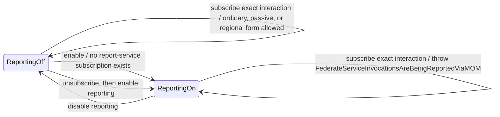
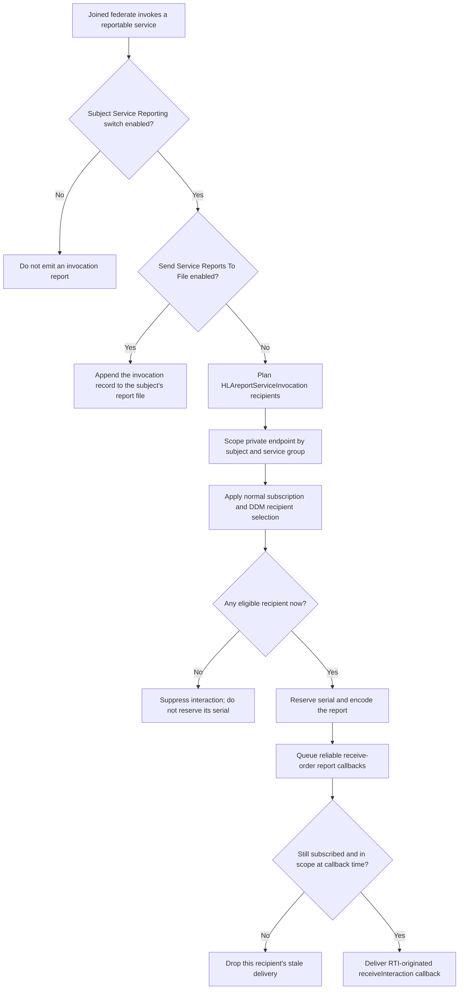
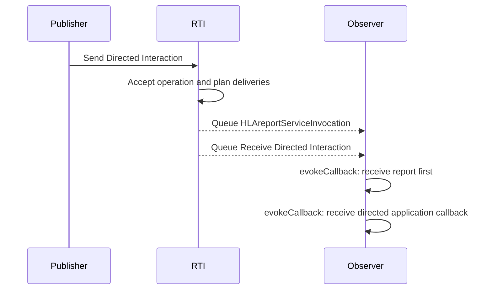
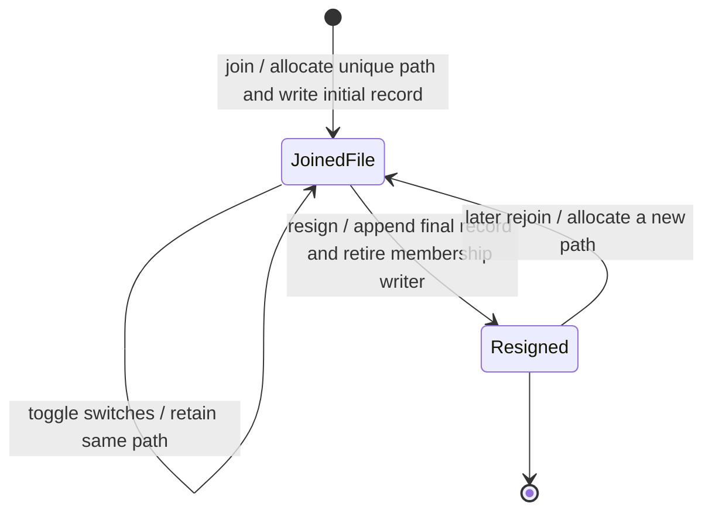
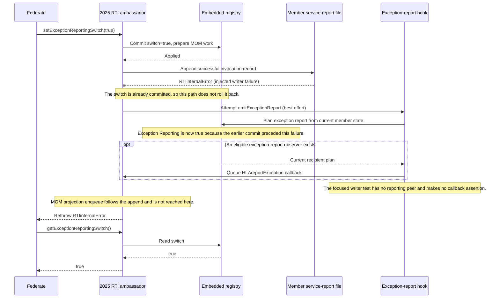
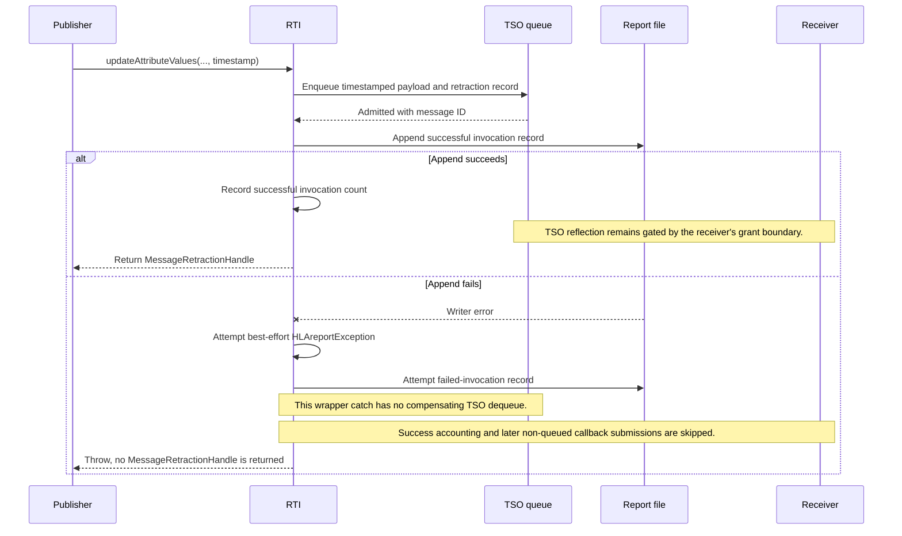

# IEEE 1516.1-2025 Service Invocation Reporting: Contributor Flow Guide

This guide follows a reportable service call through its switches, selected
destination, interaction filtering, file lifetime, and callback delivery. Its
purpose is to explain Umbra's current implementation shape without making a
reader reconstruct that flow from many service wrappers.

## Scope and authority

- **Edition boundary:** IEEE 1516.1-2025 only. The 2010 API/runtime remains a
  separate compatibility stream; this guide makes no 2010 parity claim.
- **Implementation boundary:** detailed behavior is the 2025 embedded
  federation-management development profile. Selected process-endpoint tests
  appear as separate evidence, not proof that all routes or failures are
  equivalent.
- **Normative authority:** the [official IEEE 1516.1-2025 Federate Interface
  Specification](https://standards.ieee.org/ieee/1516.1/6688/) defines service
  behavior. The standard is authoritative; source links explain Umbra's
  present behavior and tests establish only the scenarios they exercise.
  IEEE 1516.1-2025 §11.5.1 and §11.5.2 are useful clause pointers for service
  invocation reporting and report files; verify exact wording and applicability
  in the official standard.
- **Documentation boundary:** this is an Umbra contributor guide, not new
  requirements, a Requirements Lab mapping, or conformance evidence.

The scope here is the `HLAreportServiceInvocation` path and its per-member
service-report file. It does not attempt to diagram all Management Object Model
(MOM) state projections, `HLAreportException`, or `HLAreportMOMexception`.
For deeper implementation notes, see the [MOM service-reporting design](MOM-SERVICE-REPORTING-DESIGN.md#delivery-and-state-invariants)
and the separate [callback/service-ordering guide](HLA-2025-CALLBACK-AND-SERVICE-ORDERING-FLOW-GUIDE.md).

## The mental model: subject, switch, sink, observer

There are two roles in a report interaction:

- The **subject** is the joined federate whose public service was invoked.
  Its Service Reporting switch decides whether that service call is reportable.
- An **observer** is a joined federate whose subscription and DDM scope select
  it to receive the RTI-originated report interaction. The observer's own
  Service Reporting switch controls reports about its services; it does not
  gate its receipt of another subject's report.

The subject's two switches are also different controls:

| Control | What it decides | Important distinction |
| --- | --- | --- |
| Service Reporting switch | Whether successful or failed service invocations by this joined member are reported. | This is the master gate. Turning it off suppresses both report destinations. |
| Send Service Reports To File switch | Which sink is selected while Service Reporting is enabled. | Enabled selects the member's report file instead of the `HLAreportServiceInvocation` interaction; it does not override a disabled master switch. |
| Exception Reporting switch | A separate MOM exception-report path. | Do not confuse an invocation report with `HLAreportException` or `HLAreportMOMexception`. A failed invocation report can carry failure/exception values without this guide modeling those separate report interactions. |

The report file is allocated for the joined-member lifetime. Its initial record
does not mean that invocation reporting is enabled: the switches decide
whether later service invocations add records and which sink is selected.

## The exact report interaction has a switch/subscription interlock

The Service Reporting switch and a subscription to the exact
`HLAreportServiceInvocation` interaction cannot be active for the same member
at the same time. This includes ordinary, passive, and regional subscriptions.
That is a protocol guard, not merely a reporting preference:



Thus the safe transition when a federate wants to observe service reports is:
disable its own Service Reporting switch, subscribe, and keep the switch off
until that subscription (including any regional declaration) is removed. The
inverse order—subscribe first, then enable reporting—is rejected and leaves the
switch off. This is directly exercised for active/passive and regional forms
by the [interlock test](../../cpp/tests/mom_service_reporting_interlock_catch2.cpp#L50).

## A reportable service call selects one destination

For a joined subject, a successful or failed public service invocation reaches
the service-report writer. Calls rejected before membership exists are not
manufactured into joined-member reports. The writer then uses the subject's
master switch and file-sink switch to choose what happens:



The private report endpoint is an internal producer, not a public
`sendInteraction` call. Its region identifies the subject (`HLAfederate`) and
service group (`HLAserviceGroup`); the registry selects observers through the
normal interaction subscription/DDM path. At callback time, the implementation
rechecks the recipient projection so a now-stale subscription is not delivered.
Because an RTI-originated report does not go back through the public service
wrapper, reporting the report does not recursively produce another report.

There are two useful serial-number boundaries to keep apart. If the initial
interaction plan has no eligible observer and the file sink is off, the current
implementation suppresses the report before reserving an interaction serial.
If a recipient becomes ineligible after reservation but before callback
delivery, the recipient is dropped at revalidation; do not infer that the
already-reserved serial is rolled back. The no-recipient/no-reservation rule is
source-derived; the focused tests linked below do not exhaustively exercise
subscription mutation in that interval.

This routing chart describes sink selection, not one universal report-before-
callback rule. Individual service wrappers decide whether a report can be
submitted at their particular state and lock boundary; some defer
callback-sensitive submission until after releasing service locks. For an
ordering not shown in the directed-send test, follow that service's wrapper
and its focused test rather than inferring a global ordering guarantee.

For a failed service call, the invocation report has a failed-success indicator
and the exception details in its report payload. That does not mean the
Exception Reporting switch controls this path; ordinary exception reports and
malformed-MOM reports are separate mechanisms, deliberately outside this
diagram.

## Callback order: a focused interaction example

When one public service produces both a service-report interaction and an
application interaction callback for the same observer, their order is
observable and can matter. The selected 2025 directed-send scenario proves this
specific order under `HLA_EVOKED`:



The test evokes one callback at a time and checks that the report arrives before
the directed callback. Treat this as a demonstrated service/test path, not a
universal order among every HLA service, report, and callback model. See the
[directed invocation ordering test](../../cpp/tests/ieee1516_2025_service_report_directed_invocation_ordering_interaction_catch2.cpp#L5)
and the separate [callback-ordering guide](HLA-2025-CALLBACK-AND-SERVICE-ORDERING-FLOW-GUIDE.md).

## Per-member report-file lifetime

The embedded profile allocates a unique report file when a federate joins,
writes its initial record, and keeps that file identity stable for the joined
membership. Switch changes affect future invocation records; they do not
replace the path. Resignation writes the final membership record before the
membership's writer is retired. A later rejoin is a new membership and gets a
new file.



The file is therefore per joined membership, not per RTI ambassador process or
per reporting-switch cycle. The focused [embedded file-lifecycle test](../../cpp/tests/ieee1516_2025_service_report_file_lifecycle_catch2.cpp#L4)
and [process endpoint file cases](../../cpp/tests/ieee1516_2025_connection_service_report_catch2.cpp#L142)
cover distinct paths; they should not be read as one shared file implementation.

## A failed report append does not roll back the switch

With the master Service Reporting switch enabled and the file sink selected,
the embedded profile has a useful source-visible commit boundary.
`setExceptionReportingSwitch(true)` first commits the switch in the registry
and prepares joined-federate MOM work. It then appends its successful
service-invocation record. If that append fails, the public call reports
`RTIinternalError`, while the switch remains `true`. The focused injected-writer
test is written to assert that state, but its current local run failed during
`createFederationExecution` at test line 148, before reaching the switch or
append-failure assertions:



The source places the MOM projection enqueue after the append, so this failure
path skips that enqueue. Because the switch commit came first, the embedded
best-effort exception hook reads the new `true` value and can plan
`HLAreportException` only through the current eligible observer route. The test
body expects the switch to remain enabled, but the current run failed before
that assertion; it creates no reporting peer and does not assert exception
callback delivery or the corresponding MOM attribute. Thus the state and
ordering are source-derived here, not a passing runtime observation. The hook
must not replace the original error. This is a specific embedded-path
observation, not a general rule for every service or the process endpoint.

## Timestamped update admission precedes report persistence

The embedded 2025 timestamped `UpdateAttributeValues` path has a different
failure boundary. For a time-regulating publisher whose plan includes a
timestamp-ordered passel for a time-constrained receiver, the wrapper commits
the payload and retraction ledger to the federation TSO queue before it writes
the successful service-invocation report. Success accounting and later
non-queued callback submissions follow the report append. The public method
returns the retraction handle only after those later steps.



The successful route's order is exercised by the [time-regulated MOM-report
case](../../cpp/tests/ieee1516_2025_time_regulated_timestamped_update_attribute_values_service_report_mom_catch2.cpp#L5),
which sees the report before the constrained reflection, and the [file-report
case](../../cpp/tests/ieee1516_2025_timestamped_update_attribute_values_service_report_catch2.cpp#L5),
which checks the record at reflection callback entry. The injected writer
failure test covers a different service, `setExceptionReportingSwitch`, not
this TSO update. Thus the earlier queue admission and absence of rollback are
source-observed for this failure path; the cited tests do not prove whether
that queued payload later reaches a callback, nor do they test the combination
of TSO admission and a failed report append. The [time-management guide](HLA-2025-TIME-MANAGEMENT-GUIDE.md)
covers the later grant and TSO delivery gates; this sequence makes no 2010 or
process-endpoint parity claim.

## Embedded Connection Lost: the final file-report failure follows resignation

This is a separate embedded 2025 RTI-originated path, not a failed
federate-initiated service call. The registry commits forced resignation and
reserves the final service-report serial before erasing the member. If the
selected route is the file and its append then fails, the adapter defers that
`RTIinternalError`, finishes lifecycle cleanup and notification submission,
and only then raises the deferred error. The forced-loss registry route
reserves a final file serial only; this sequence does not claim a final
`HLAreportServiceInvocation` interaction for the removed member.

```mermaid
sequenceDiagram
  autonumber
  participant Loss as Embedded transport-loss handler
  participant RTI as 2025 embedded RTI
  participant Registry as Embedded federation registry
  participant File as Joined-member report file
  participant Queue as Local callback dispatcher
  participant Member as Lost member application

  Loss->>RTI: handleEmbeddedTransportFailure(fault)
  RTI->>Registry: connectionLostWithFinalServiceReportReservation
  Registry->>Registry: Apply forced resign action and plan cleanup
  opt Final Service Reporting route selects file
    Registry->>Registry: Reserve final serial before member erasure
  end
  Note over Registry: Forced connection loss reserves the final file route only; no final interaction reservation is emitted here.
  Registry->>Registry: Erase lost member and commit registry transition
  Registry-->>RTI: Applied result and optional final file serial
  RTI->>RTI: Apply Not Connected; release time/join state; reset old callback queue
  opt A final file serial was reserved
    RTI->>File: Append successful ConnectionLost record
    alt Append succeeds
      File-->>RTI: Record persisted
    else Append throws RTIinternalError
      File--xRTI: Writer error
      RTI->>RTI: Defer error; do not roll back membership or lifecycle
    end
  end
  RTI->>RTI: Finish cleanup and submit surviving-member notifications
  opt Lost member callback session exists
    RTI->>Queue: Submit local ConnectionLost callback
    Queue-->>Member: Invoke callback when the callback model permits
  end
  opt File append error was deferred
    RTI-->>Loss: Raise RTIinternalError after cleanup and callback submission
  end
```

The successful append-before-callback route is encoded by the focused
embedded test, but its current local run failed during
`createFederationExecution` (test line 521), before reaching those assertions.
The error branch is source-only: no cited test injects a writer failure
specifically during `ConnectionLost`. In HLA_IMMEDIATE mode callback submission
may invoke inline; HLA_EVOKED leaves it for an Evoke service. This chart does
not determine how a real transport boundary consumes the deferred internal
exception, and it does not describe 2010 or the process endpoint.

## Implementation and test evidence

| Concern | Umbra implementation | Focused evidence |
| --- | --- | --- |
| Service Reporting switch and join/leave boundary | [Public switch services](../../cpp/src/internal/runtime/umbra_rti_ambassador_service_reporting_switches.cpp#L74), [registry state transition](../../cpp/src/internal/federation/federation_registry_control_state.cpp#L315) | [switch/subscription interlock](../../cpp/tests/mom_service_reporting_interlock_catch2.cpp#L50) |
| Ordinary, passive, and regional report-service subscriptions | [Exact subscription predicate](../../cpp/src/internal/federation/federation_registry_regions.cpp#L464) | [interlock scenarios](../../cpp/tests/mom_service_reporting_interlock_catch2.cpp#L82) |
| Subject, sink, and eligible observer planning | [routing plan](../../cpp/src/internal/federation/federation_registry_mom_service_reporting.cpp#L52), [serial reservation](../../cpp/src/internal/federation/federation_registry_mom_service_reporting.cpp#L143) | [service-report interaction scenario](../../cpp/tests/ieee1516_2025_service_report_directed_invocation_ordering_interaction_catch2.cpp#L42) |
| Success/failure service report writing | [report writers](../../cpp/src/internal/runtime/umbra_rti_ambassador_service_report_writers.cpp#L131) | [master-switch suppression despite file switch on](../../cpp/tests/ieee1516_2025_service_report_disabled_suppression_integration_catch2.cpp#L6) |
| Embedded switch commit before selected file append | [switch service and post-append MOM enqueue](../../cpp/src/internal/runtime/umbra_rti_ambassador_service_reporting_switches.cpp#L219), [best-effort exception hook](../../cpp/src/internal/runtime/umbra_rti_ambassador_mom_service_report_interaction.cpp#L184), [exception-report switch and recipient planning](../../cpp/src/internal/federation/federation_registry.cpp#L1661) | [injected append failure keeps switch enabled](../../cpp/tests/service_report_writer_failure_catch2.cpp#L133); the test body asserts the thrown RTI error and getter value, but the current local run failed during federation creation before those assertions; no MOM projection or exception-report callback is asserted |
| Timestamped Update Attribute Values queue/report boundary | [embedded timestamped wrapper](../../cpp/src/internal/runtime/umbra_rti_ambassador_attribute_update_services.cpp#L369), [TSO admission](../../cpp/src/internal/runtime/umbra_rti_ambassador_attribute_update_services.cpp#L687), [post-report accounting and callback path](../../cpp/src/internal/runtime/umbra_rti_ambassador_attribute_update_services.cpp#L714), [registry queue commit](../../cpp/src/internal/federation/federation_registry_time_tso_enqueue.cpp#L427), [exception/failure-report catch](../../cpp/src/internal/runtime/umbra_rti_ambassador_attribute_update_services.cpp#L790) | [time-regulated MOM ordering](../../cpp/tests/ieee1516_2025_time_regulated_timestamped_update_attribute_values_service_report_mom_catch2.cpp#L5) and [file-report before reflection](../../cpp/tests/ieee1516_2025_timestamped_update_attribute_values_service_report_catch2.cpp#L5) cover successful paths. The injected writer-failure case covers a different service; no cited test covers this combined failure schedule |
| Embedded ConnectionLost final file report | [registry reserves the final file serial before erasing the member](../../cpp/src/internal/federation/federation_registry_resign_lifecycle.cpp#L1069), [adapter appends, defers error, completes cleanup, and raises afterward](../../cpp/src/internal/runtime/umbra_rti_ambassador_membership_loss.cpp#L306), [transport failure handler propagation](../../cpp/src/internal/federation/embedded_transport.cpp#L28), [file writer append boundary](../../cpp/src/internal/runtime/umbra_rti_ambassador_service_report_writers.cpp#L335) | [embedded record-before-ConnectionLost-callback case](../../cpp/tests/ieee1516_2025_service_report_catch2.cpp#L503) encodes the successful file route but did not reach its callback assertions in the current local run; no cited test injects a failed append during ConnectionLost or establishes process/embedded parity |
| RTI-originated receive-order callback and callback-time recheck | [interaction callback path](../../cpp/src/internal/runtime/umbra_rti_ambassador_mom_service_report_interaction.cpp#L276) | [report precedes directed callback](../../cpp/tests/ieee1516_2025_service_report_directed_invocation_ordering_interaction_catch2.cpp#L114); that case does not mutate the subscription between planning and delivery |
| Embedded per-membership file creation and final lifetime | [join/report setup](../../cpp/src/internal/runtime/umbra_rti_ambassador_federation_lifecycle.cpp#L631) | [embedded immutable file lifetime](../../cpp/tests/ieee1516_2025_service_report_file_lifecycle_catch2.cpp#L4) |
| Process endpoint selection and file lifetime | [process report handling delegated from the writer](../../cpp/src/internal/runtime/umbra_rti_ambassador_service_report_writers.cpp#L140) | [independent process files](../../cpp/tests/ieee1516_2025_connection_service_report_catch2.cpp#L142), [file path across switch cycles](../../cpp/tests/ieee1516_2025_connection_service_report_catch2.cpp#L356), [failed process reports through interaction](../../cpp/tests/ieee1516_2025_connection_process_service_report_matrix_catch2.cpp#L42) |

These are selected implementation and integration scenarios. A passing case
does not establish complete service coverage, every regional boundary, or
conformance.

## What this guide does not claim

- It does not describe IEEE 1516.1-2010 or infer that edition's reporting
  behavior from 2025 code.
- It does not claim identical embedded and process-endpoint routing, file
  semantics, failure recovery, or concurrency behavior.
- The switch append-failure sequence has one injected embedded writer case;
  the timestamped-update and ConnectionLost append-failure branches are
  source-derived and lack tests for those exact failure schedules. None
  establishes process-endpoint behavior. The skipped MOM projection enqueue
  is source-derived, and actual `HLAreportException` delivery is not asserted
  by the switch test.
- It does not claim every public service's success and exception payload has
  been checked field by field by the linked focused tests.
- It does not establish that a late subscription change after serial reservation
  is rolled back; current source drops a stale recipient at callback time.
- It does not trace the recipient routing of `HLAreportException`,
  `HLAreportMOMexception`, all MOM object projections, periodic updates, or
  general callback ordering.
- It does not add or revise Requirements Lab records.
