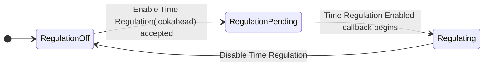
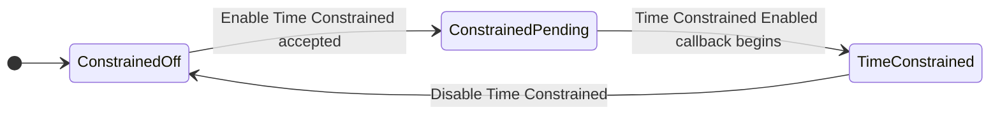
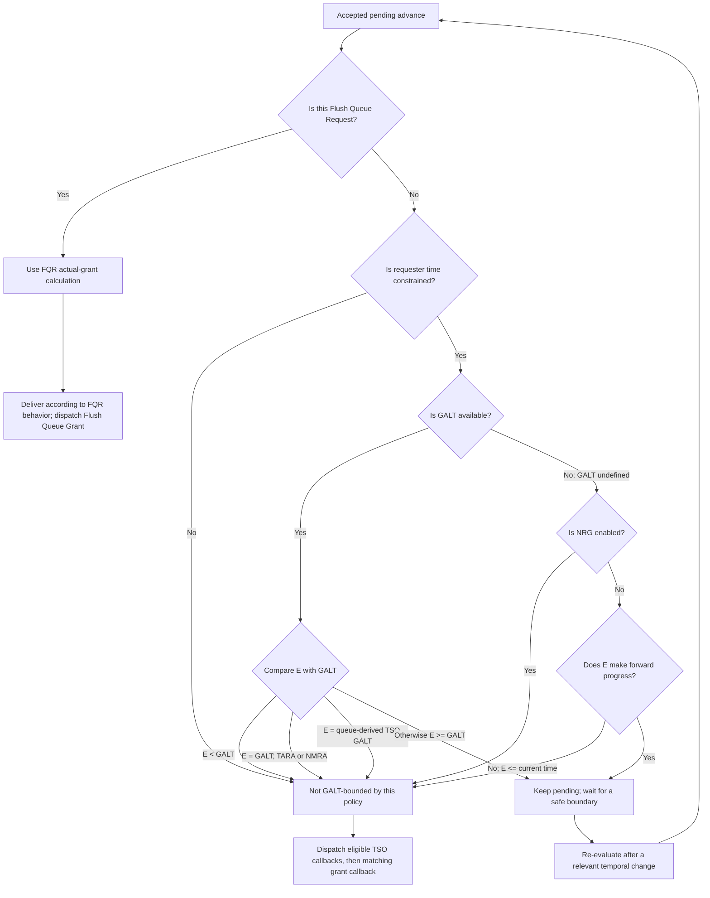
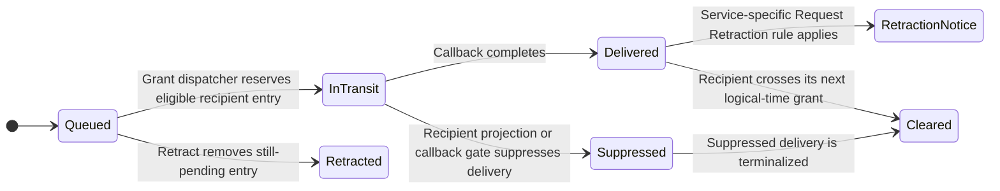

# IEEE 1516.1-2025 Time Management: Contributor Guide

This guide is for contributors who need to understand the time-management
concepts before reading Umbra's implementation. It is a teaching and
implementation guide, not a substitute for the standard, a new source of
requirements, or a claim of conformance.

## Scope and authority

- **Standard boundary:** IEEE 1516.1-2025 only. The 2010 API and runtime are a
  separate compatibility stream and are deliberately not described or compared
  here.
- **Implementation boundary:** the opt-in, non-installable 2025 embedded
  federation-management development profile and the time-coordination code
  exercised by its tests. Support is intentionally bounded; see
  [What this guide does not claim](#what-this-guide-does-not-claim).
- **Authority order:** the [official IEEE 1516.1-2025 standard](https://standards.ieee.org/ieee/1516.1/6688/)
  defines normative behavior. The pinned Requirements Lab records help locate
  the relevant source clauses. C++ code describes Umbra's current behavior;
  tests show specific scenarios that have been exercised. Neither code nor a
  test overrides the standard.
- **Traceability status:** Requirements Lab contracts cited below are
  source-derived traceability records. Their statuses are experimental and
  explicitly not conformance evidence.

The companion [logical-time design](LOGICAL-TIME-DESIGN.md) explains the
reference-time representation and current development profile.
[Embedded time coordination](EMBEDDED-TIME-COORDINATION-DESIGN.md) records
additional implementation boundaries, edge cases, and deferred work.

## The mental model

HLA logical time is simulation time, not wall-clock time. A federate may
compute ahead locally, but the RTI coordinates when each federate may observe
timestamped events and when it may move its public logical time forward.

Three ideas explain most of the machinery:

1. **A time role is a promise or a constraint.** A time-regulating federate
   promises a lower bound for future timestamped sends through its lookahead.
   A time-constrained federate asks the RTI not to advance it past events that
   could still arrive from other regulators.
2. **A request is not a grant.** Accepting an advance request makes it pending;
   it does not immediately change Query Logical Time. The matching grant
   callback is the public completion point.
3. **A grant is a federation decision.** For a time-constrained federate, a
   requested target can be held below a safe frontier (GALT). Known incoming
   timestamped messages and the selected request mode affect the exact
   boundary and callback order.

Time Regulation and Time Constrained are independent roles. A federate can be
neither, either one, or both. They are not two mutually exclusive clock modes.

## Vocabulary

| Term | Meaning in this guide |
| --- | --- |
| Logical time | An ordered simulation-time value from the federation's selected LogicalTime implementation. It is not a timestamp from the operating-system clock. |
| Logical time interval | A duration in that same selected time representation; lookahead is one such interval. |
| Time regulating | A role that constrains how early the federate may send timestamped messages. |
| Lookahead | The regulator's promised minimum separation between its current logical time and outgoing timestamped events. |
| Time constrained | A role that makes the federate's forward grants subject to federation-wide temporal bounds. |
| Receive order (RO) | Delivery without a logical-time timestamp ordering guarantee. |
| Timestamp order (TSO) | Delivery ordered by the message's logical timestamp and subject to time-management rules. |
| GALT | Global Available Logical Time, the federation's current safe advancement boundary as exposed by Query GALT when defined. |
| LITS | Lowest (earliest) Incoming Timestamp, the next relevant incoming timestamp boundary exposed by Query LITS when defined. |
| NRG | The FDD's Non-Regulated-Grant setting. In the current grant policy it matters when GALT is undefined; it does not make GALT itself defined. |
| Callback-gated | The accepted operation remains pending until its matching callback is dispatched; the corresponding private time state changes at that callback boundary. |

Publisher-selected `RECEIVE`/`TIMESTAMP` order and transportation are a
separate control plane from the time-advance scheduler. See the focused
[2025 order and transportation guide](HLA-2025-ORDER-AND-TRANSPORTATION-FLOW-GUIDE.md)
for default capture, instance overrides, and the distinction between order
metadata and transportation metadata.

### Keep four time values distinct

For an advance request, do not casually use “the requested time” to mean four
different values:

- **Caller boundary R:** the logical time supplied by the application.
- **Effective target E:** the time the current implementation selected as
  the target of this particular request. For TAR, TARA, and FQR, E equals R.
  For NMR and NMRA, E can be the earliest currently queued recipient message
  no later than R.
- **Granted time G:** the value applied to the federate when the matching
  grant callback is dispatched. For FQR, G can be earlier than R.
- **Optimistic floor O:** an internal lower bound retained after an FQR
  whose actual grant is earlier than the optimistic progress boundary. Later
  requests cannot select an effective target below that floor.

Umbra stores the caller boundary separately from the effective target. That
separation matters for NMR/NMRA bound calculations, timestamp validation, and
diagnostics.

## Role state machines

The two roles have independent lifecycles. Enabling a role is not the same as
having the role: the enable request remains pending until the corresponding
callback begins.





In the current profile:

- The regulator's requested lookahead becomes the active lookahead when
  Time Regulation Enabled is dispatched. Query Lookahead reports the active
  value.
- A pending role enable blocks a time-advance request that depends on that
  role transition. Do not treat the service return as if the callback already
  ran.
- A disable removes that role from the private state and triggers grant
  re-evaluation where needed.
- A federate can be both regulating and constrained at once. Its sending
  promise and receiving constraint must both be considered.

The source-level state is in
[FederateTimeState](../../cpp/src/internal/time/federate_time_state.hpp);
public service adapters are in
[time regulation control](../../cpp/src/internal/runtime/umbra_rti_ambassador_time_regulation_control.cpp)
and
[time constrained control](../../cpp/src/internal/runtime/umbra_rti_ambassador_time_constrained_control.cpp).

## Advance lifecycle

The following is the common shape of an accepted advance in the current 2025
profile. The policy branch and callback name depend on the request mode.

```mermaid
sequenceDiagram
  autonumber
  actor App as Federate application
  participant API as RTI ambassador
  participant State as Federate time state
  participant Coord as Federation coordinator
  participant Policy as Bounds and grant policy
  participant Queue as Recipient TSO queue
  participant CB as Federate callback path

  App->>API: Request advance with caller boundary R
  API->>State: Validate and retain R, effective target E, and mode
  State-->>API: Accepted; request is now pending
  API->>Coord: Request grant evaluation
  Coord->>Policy: Evaluate one federation snapshot
  alt Not yet safe
    Policy-->>Coord: Wait
    Note over State,Coord: Keep request pending; re-evaluate after a relevant temporal change
  else Grant can be dispatched
    Policy-->>Coord: Eligible
    Coord->>Queue: Select recipient messages through the mode's delivery boundary
    Queue-->>CB: Deliver eligible TSO callbacks
    Note over State,CB: State remains Time Advancing while pre-grant TSO callbacks run
    CB->>State: Apply matching grant at callback boundary
    CB-->>App: Time Advance Grant or Flush Queue Grant
  end
```

Important consequences:

- On acceptance, the federate becomes **Time Advancing**, but its current
  logical time remains the previous granted value.
- The request can remain pending while another regulator's state prevents a
  safe grant. A pending request is not a failed request.
- In the ordinary grant path, eligible TSO callbacks precede the matching
  Time Advance Grant callback. The current state changes immediately before
  that grant callback begins.
- FQR uses its own actual-grant calculation and invokes Flush Queue Grant, not
  Time Advance Grant.
- The same logical ordering applies to HLA_IMMEDIATE and HLA_EVOKED callback
  models. EVOKED applications must continue to evoke callbacks for the
  callback-gated transition to complete.

## How Umbra calculates the timing frontier

This section describes the current bounded implementation model, not a
replacement definition of the IEEE algorithm.

For each other active time regulator, Umbra starts with its current logical
time, or its original caller advance boundary while that regulator has an
advance pending, then adds its active lookahead:

**candidate = regulator base time + active lookahead**

A forward advance from a zero-lookahead regulator makes that minimum
timestamp exclusive in the current implementation. Umbra adds one epsilon
from the federation's selected LogicalTimeFactory; it does not approximate
this with a floating-point constant.

Recipient-side queued, in-transit, and delivered-since-last-advance TSO
timestamps are also considered. In the current calculator:

- With at least one other regulator, the available GALT is the minimum
  applicable regulator and known TSO boundary.
- A queue-derived exact boundary is marked separately from an ordinary
  regulator-only GALT; the grant policy uses that distinction.
- With no other regulator, GALT is undefined. An incoming TSO timestamp can
  still make LITS defined.
- When GALT is defined, LITS is the earlier of GALT and the earliest future
  incoming TSO timestamp. When GALT is undefined, LITS can still be the
  earliest future incoming timestamp.
- Delivered messages remain in the snapshot until the next advance, but a
  delivered timestamp already reached by the recipient's current logical time
  no longer holds GALT at that old boundary.

The calculator is
[FederationTimeBoundsCalculator](../../cpp/src/internal/time/federation_time_bounds.cpp);
its immutable input is assembled by
[FederationTimeCoordinator](../../cpp/src/internal/time/federation_time_coordinator.hpp).
Focused bounds tests are in
[federation_time_bounds_catch2.cpp](../../cpp/tests/federation_time_bounds_catch2.cpp)
and the queue/coordinator tests are in
[federation_time_coordinator_catch2.cpp](../../cpp/tests/federation_time_coordinator_catch2.cpp).

### Grant decision flow

The effective target E is used below. For NMR/NMRA, remember that E may
be earlier than the caller boundary R.



FederationTimeAdvanceGrantPolicy::decide is deliberately small: it consumes
a federate snapshot and previously calculated bounds. The surrounding
scheduler owns pending-request retention, re-evaluation, and callback
dispatch. Do not read this policy function as the complete HLA scheduler.

### Boundary comparison matrix

This matrix captures the current implemented policy and its explicitly
bounded queue behavior. The IEEE standard remains authoritative for normative
interpretation.

| Request mode | Current effective target | Current ordinary GALT behavior | Current message behavior |
| --- | --- | --- | --- |
| TAR | Caller boundary R | A time-constrained request must be strictly below regulator-only GALT. | A known queue-derived exact TSO boundary is treated as grantable; eligible messages are delivered before Time Advance Grant. |
| TARA | Caller boundary R | Equality at an available GALT is permitted by the current Available-mode policy. | Uses the currently queued message set; eligible TSO callbacks precede Time Advance Grant. |
| NMR | Earliest currently queued recipient timestamp at or before R, otherwise R | Same strict ordinary GALT rule as TAR. | The selected timestamp cohort is delivered before Time Advance Grant. Future transport arrivals are not part of target selection. |
| NMRA | Earliest currently queued recipient timestamp at or before R, otherwise R | Equality at an available GALT is permitted by the current Available-mode policy. | The selected timestamp cohort is delivered before Time Advance Grant. Future transport arrivals are not part of target selection. |
| FQR | Caller boundary R; actual grant is calculated separately | The policy does not wait for GALT; GALT can still cap the actual grant when defined. | Flushes the currently available recipient TSO work through the flush boundary, then reports Flush Queue Grant with actual and optimistic times. |

The current policy also grants equality for any non-FQR advance mode when the
selected GALT is itself a known TSO boundary at the effective target. That is
an implementation-specific distinction; it must not be generalized to
ordinary regulator-only GALT.

#### FQR: actual grant and optimistic floor

For the bounded in-process FQR implementation, let U be the earliest
currently undelivered timestamp for the requester. Ignoring invalid-state
errors, the current calculation is:

- **G = max(current, min(R, available GALT if defined, U if present))**
- **O = max(G, min(R, U if present))**

An absent GALT or U is omitted from that minimum. The callback reports G;
O is retained privately as the minimum target for later progress. This
separation is why an FQR may complete at a time earlier than the requested
boundary without allowing a following request to go backward through work
already optimistically flushed.

There are deliberately two frontiers here: the dispatcher flushes the current
in-process recipient delivery set through the final-time queue boundary, while
the callback reports the separately calculated actual grant G and retains O
for later progress. Do not collapse the delivery frontier, actual grant, and
optimistic floor into one time value. This bounded path does not wait for
future transport arrivals.

## Worked examples

### Example 1: equality at an ordinary GALT

Assume:

- Regulator **P** is at logical time 10 with lookahead 2.
- There are no incoming queued TSO messages that set an earlier boundary.
- Constrained federate **C** requests a grant to logical time 12.

P's current lower-bound candidate is 10 + 2 = 12, so the ordinary
regulator-only GALT is 12.

1. C's TAR target is equal to GALT, not below it, so the current strict TAR
   policy keeps the request pending.
2. C's TARA to 12 may use the current inclusive Available-mode boundary.
3. If P then requests an advance to 11, that pending regulator boundary
   contributes 11 + 2 = 13. C's still-pending TAR to 12 is now strictly
   below the current GALT and can become eligible.

The important point is that a pending regulator advance can change the
federation bound before that regulator's own grant callback runs. The current
bounds snapshot uses the regulator's original caller boundary for this
calculation.

### Example 2: an exact queued TSO boundary

Assume an accepted timestamped message for C is queued at time 12 and the
current bound calculator selects that message as the GALT boundary. A request
whose effective target is exactly 12 can use the current queue-boundary rule,
even though equality at an ordinary regulator-only GALT is treated
differently. The dispatcher sends the eligible time-stamped callback before
the matching grant callback.

This is why a single “TAR is always strict” slogan is insufficient to explain
the current implementation. The boundary's source matters. Check the policy
and its focused tests before changing this behavior.

### Example 3: GALT undefined

If C is time constrained but there is no other active regulator, GALT is
undefined. The current policy then consults the federation's NRG setting:

- With NRG enabled, a valid forward target can be granted.
- With NRG disabled, a forward request waits; a non-forward request at or
  before current time can proceed.
- The query result remains “GALT undefined” either way. NRG affects the grant
  decision, not the mathematical existence of GALT.
- If an incoming TSO message exists, LITS may still be defined even though
  GALT is not.

### Example 4: NMR keeps two boundaries

Suppose C calls NMR with R = 20, and the earliest currently queued message
for C is timestamped 12. The current implementation selects E = 12 as the
effective target, but retains R = 20 separately. It processes the queued
timestamp-12 cohort before granting at that selected target. The RTI does not
rewrite the application's original request boundary to 12 for unrelated
timestamp validation or federation-bound calculations.

## Timestamped message lifecycle and callback order

The queue is recipient-scoped. One send can fan out into separate recipient
entries that share a message identity and preserve sequence order for equal
timestamps. For the producer-side legality check, mixed per-recipient retract
outcomes, and the distinct Request Retraction callback, see the companion
[TSO retraction lifecycle guide](HLA-2025-TSO-RETRACTION-FLOW-GUIDE.md).



For the current coordinator:

- **Queued** means accepted for a recipient but not yet selected for callback.
- **In transit** means selected for callback and retained as a distinct phase
  while callback work is active.
- **Delivered since last advance** records a completed TSO callback until the
  recipient advances; it remains relevant to temporal-bound calculations and
  service-specific retraction bookkeeping.
- Retract and Request Retraction are not interchangeable. The queue can remove
  pending fanout, but the owning service determines whether already-delivered
  recipients need a Request Retraction callback.
- Resignation/disconnect cleanup is recipient-scoped; it must not erase
  another recipient's fanout.

In the ordinary supported grant path, the ordering is:

1. The request becomes eligible and a callback-gated grant dispatch is queued.
2. The dispatcher rechecks the pending generation and the live temporal state.
3. The recipient's eligible TSO callbacks run while the private state is still
   Time Advancing.
4. The matching Time Advance Grant callback begins; the private current time
   changes at that callback boundary.
5. Delivered-since-last-advance bookkeeping is cleared as part of crossing
   the recipient's grant boundary.

The tested public TSO producers in the current bounded profile are timestamped
Send Interaction, Update Attribute Values, Delete Object Instance, Send
Directed Interaction, and the supported Send Interaction With Regions
overload with retraction. This list is not a claim that every timestamped HLA
service family is implemented.

## Receive order and asynchronous delivery

Asynchronous delivery is a separate switch from time advancement:

- It is disabled by default in the current profile.
- For the bounded supported routes, a time-constrained federate may enable it
  to receive eligible receive-order callbacks while idle rather than waiting
  for a time advance.
- Disabling it restores the normal receive-order time-advance gate.
- Entering Time Advancing flushes eligible deferred receive-order work before
  the matching grant.
- It does not release TSO messages early. Timestamped callbacks remain
  governed by logical-time boundaries.
- Deferred callback closures are live-session state; their general
  save/restore behavior is not established by the bounded tests.

Do not draw asynchronous delivery as “time regulation off,” “unconstrained,”
or “skip GALT.” It changes a receive-order callback gate, not the time roles or
the TSO grant policy.

## Lookahead changes and pending operations

Modify Lookahead has a transition of its own:

- A nonnegative increase takes effect immediately in the current implementation.
- A decrease is retained and applied at the next logical-time advance.
- Query Lookahead reports the active value; a pending decrease does not replace
  it until that advance boundary.
- A pending decrease is part of the temporal state that a grant scheduler and
  selected restore paths must preserve.

Only describe a lookahead change as effective after checking whether it is
active or deferred. Recomputing another regulator's bound with the wrong
lookahead can allow an unsafe grant or block a safe one.

The state machine rejects or defers overlapping operations rather than
silently replacing pending work. In particular, a second advance cannot
replace an existing pending advance; pending regulation/constrained role
enables affect which advance services are currently legal. The public
exception mapping is in the service adapters and their API contracts.

## Re-evaluation: why a pending request can become grantable

The limited cross-federate TAR scheduler reevaluates pending work when
temporal inputs that can affect safety change. Current documented triggers
include:

- a TAR request or grant by a member;
- Time Regulation Enabled or Disable Time Regulation;
- Disable Time Constrained;
- resignation/removal of a member; and
- replacement of the federation definition through an additional FOM.

The scheduler computes opaque dispatch actions under the registry boundary,
then submits callback work after releasing runtime locks. Before committing a
grant it rechecks the live state/bound, so an old queued action cannot grant a
request made unsafe by a newer state change. This is an Umbra concurrency
invariant, not a new public HLA state.

Changes to TSO queue state and other supported service paths have their own
reevaluation rules. When adding an event source, trace whether it changes
GALT/LITS, request eligibility, delivery order, or all three.

## What this guide does not claim

This is not a complete implementation of all 2025 time-management services.
The current opt-in development slice has explicit limits:

- The no-TSO cross-federate grant scheduler is currently limited to TAR.
- TSO target selection for NMR/NMRA considers currently queued in-process
  messages; future network/transport arrivals are not coordinated.
- Only the timestamped producer paths listed above are covered by this
  bounded public slice. Other time-stamped service families are not implied.
- The asynchronous-delivery implementation covers bounded receive-order
  callback routes; it does not make TSO delivery asynchronous.
- Save/restore cases cover selected temporal snapshots and pending operations;
  they do not establish general time-management persistence or complete
  callback restoration.
- Reference-time foundation tests and current runtime scenarios are not
  independent-vendor conformance evidence. Third-party variable-width time
  implementations and all adapter/package combinations are not established by
  this guide.
- This guide says nothing about IEEE 1516.1-2010 behavior.

The detailed limits and future coordination requirements are maintained in
[Embedded time coordination](EMBEDDED-TIME-COORDINATION-DESIGN.md). If code
and guide disagree, stop and resolve the discrepancy against the 2025 standard
and the pinned source record; do not “fix” the guide by guessing.

## Reading map: rule, implementation, and test evidence

Use the source contract to find exact pinned requirement candidates and test
names. The clause column identifies where to read in the 2025 standard; it
does not assert full coverage of that clause.

| Topic | IEEE 1516.1-2025 anchor | Umbra traceability record | Main implementation / focused evidence |
| --- | --- | --- | --- |
| Joined federate's initial/current time and TAR completion | 8.1.2, 8.8.3 | [time-advance contract](../../compliance/requirements-lab/time-advance-requirements-contract.json) | [FederateTimeState](../../cpp/src/internal/time/federate_time_state.cpp); [state tests](../../cpp/tests/federate_time_state_catch2.cpp); [public time-management tests](../../cpp/tests/ieee1516_2025_connection_time_management_catch2.cpp) |
| Enable/disable time roles and callback gating | 8.2, 8.3.1, 8.5.5, 8.6.3, 8.7.5 | [time-role contract](../../compliance/requirements-lab/time-role-requirements-contract.json) | [role tests](../../cpp/tests/ieee1516_2025_time_role_enable_callback_gating_catch2.cpp) |
| Regulator bounds, GALT, and LITS | 8.1.5, 8.18.1, 8.19.3 | [bounds contract](../../compliance/requirements-lab/time-bounds-requirements-contract.json), [queued-TSO bounds contract](../../compliance/requirements-lab/time-bounds-queued-tso-requirements-contract.json) | [bounds calculator](../../cpp/src/internal/time/federation_time_bounds.cpp); [bounds tests](../../cpp/tests/federation_time_bounds_catch2.cpp) |
| TAR grant eligibility and limited scheduler | Clause 8 timing rules | [grant-policy contract](../../compliance/requirements-lab/time-grant-policy-requirements-contract.json), [scheduler contract](../../compliance/requirements-lab/time-grant-scheduler-requirements-contract.json) | [grant policy](../../cpp/src/internal/time/federation_time_grant_policy.cpp); [policy tests](../../cpp/tests/federation_time_grant_policy_catch2.cpp) |
| TARA | 8.9 | [TARA contract](../../compliance/requirements-lab/time-advance-request-available-requirements-contract.json) | [TARA tests](../../cpp/tests/available_time_advance_inclusive_galt_catch2.cpp) |
| NMR | 8.10.2 | [NMR contract](../../compliance/requirements-lab/next-message-request-requirements-contract.json) | [NMR service](../../cpp/src/internal/runtime/umbra_rti_ambassador_next_message_request.cpp); [NMR tests](../../cpp/tests/ieee1516_2025_connection_time_advance_next_message_queued_tso_catch2.cpp) |
| NMRA | 8.11, 8.11.3 | [NMRA contract](../../compliance/requirements-lab/next-message-request-available-requirements-contract.json) | [advance service tests](../../cpp/tests/ieee1516_2025_connection_time_advance_available_catch2.cpp) |
| FQR and FQG | 8.12, 8.12.3 | [FQR contract](../../compliance/requirements-lab/flush-queue-request-requirements-contract.json) | [grant policy/calculator](../../cpp/src/internal/time/federation_time_grant_policy.cpp); [FQR tests](../../cpp/tests/flush_queue_request_optimistic_time_catch2.cpp) |
| Modify Lookahead | 8.20.4 | [Modify Lookahead contract](../../compliance/requirements-lab/modify-lookahead-requirements-contract.json) | [lookahead tests](../../cpp/tests/ieee1516_2025_connection_modify_lookahead_catch2.cpp) |
| Asynchronous delivery | 8.15.3, 8.16.5 | [asynchronous-delivery contract](../../compliance/requirements-lab/asynchronous-delivery-requirements-contract.json) | [adapter](../../cpp/src/internal/runtime/umbra_rti_ambassador_asynchronous_delivery.cpp); [temporal-state tests](../../cpp/tests/ieee1516_2025_asynchronous_delivery_temporal_state_catch2.cpp) |
| TSO queue phases and order | Service-specific clauses; see each send/retraction contract | [queue contract](../../compliance/requirements-lab/tso-message-queue-requirements-contract.json) | [queue](../../cpp/src/internal/time/tso_message_queue.cpp); [coordinator](../../cpp/src/internal/time/federation_time_coordinator.cpp); grant dispatcher in umbra_rti_ambassador_time_advance_dispatch.cpp |

## How to extend or correct this guide

Before changing a diagram or adding a new one:

1. Identify the exact 2025 service and canonical subsection; use the official
   standard and existing Requirements Lab contract rather than an older
   1516e/2010 reference or another RTI's behavior.
2. Draw the normative rule separately from Umbra's supported path. Mark
   unimplemented, partial, and experimental branches visibly.
3. Trace the current path from the public ambassador method through private
   state, federation coordination, queue/delivery, and callback dispatch.
4. Link at least one focused test that demonstrates the specific scenario.
   A test is evidence for that case, not proof of every branch in the clause.
5. Recheck both immediate and evoked callback models when dispatch timing is
   involved, and preserve the explicit 2010/2025 source boundary.
6. Keep diagrams focused. Split by an actual responsibility—roles, bounds,
   advance decision, or message lifecycle—not merely to increase diagram or
   file counts.
