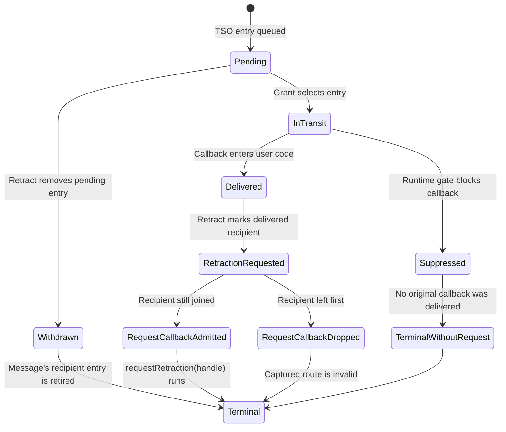
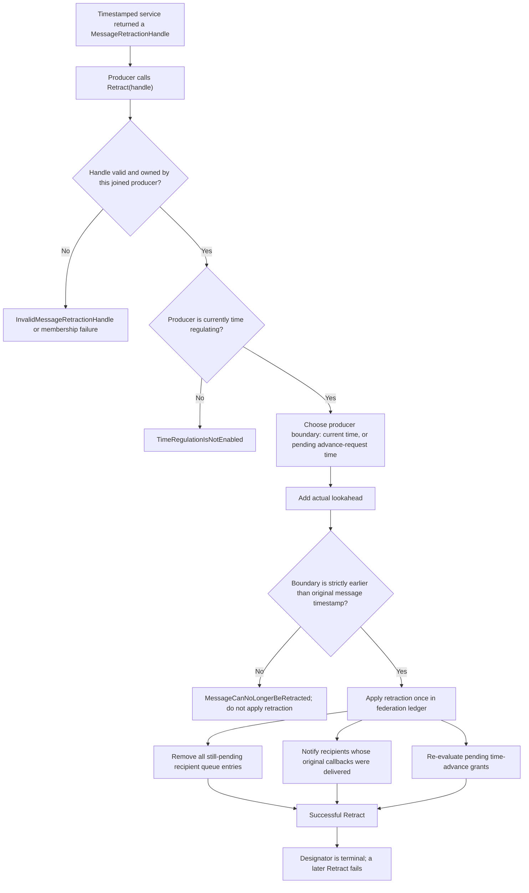
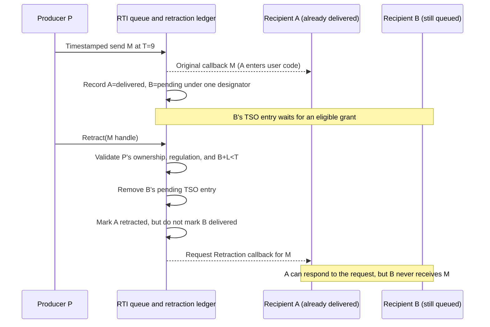
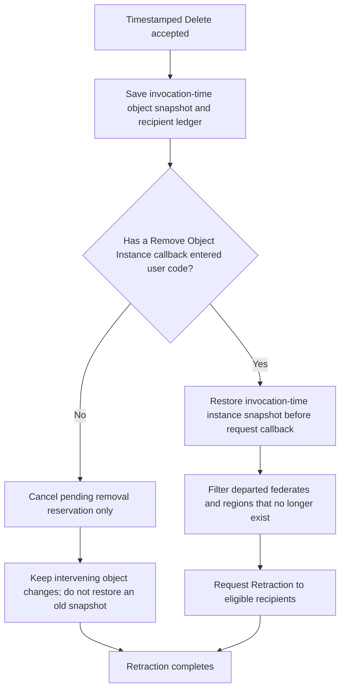

# IEEE 1516.1-2025 TSO Retraction Flow Guide

This guide is a deep dive into the lifecycle of a timestamped message that can
be retracted. It complements the [time-management guide](HLA-2025-TIME-MANAGEMENT-GUIDE.md):
that guide introduces queue phases and grant ordering; this one follows the
retraction designator from send, through recipient-specific delivery states,
to successful `Retract` and any `Request Retraction` callbacks.

**Edition:** IEEE 1516.1-2025 only. This guide does not describe the separate
2010 reference-RTI stream or infer behavioral parity between editions.

**Implementation profile:** current 2025 Umbra behavior, with embedded and
process-endpoint details identified separately. Source and tests establish
only the implementation paths and cases linked below; they do not establish
complete support or conformance.

## Two similarly named operations, two different moments

| Name | Who invokes it? | What it means in this flow |
| --- | --- | --- |
| `RTIambassador::retract(handle)` / **Retract** | The federate that originated the timestamped message | Ask the RTI to withdraw the still-pending fan-out and, when the message has already entered recipient code, trigger the applicable `requestRetraction` callback. Legality is checked against the sending federate's current time state. |
| `FederateAmbassador::requestRetraction(handle)` / **Request Retraction** | The RTI calls the recipient's ambassador | Notify a recipient that an already-delivered timestamped message was retracted. It is not another send-side service and does not mean a queued TSO callback was delivered. |

The normative clause pointers are IEEE 1516.1-2025 §8.22 (Retract), including
§8.22.3's time precondition, and §8.23 (Request Retraction). Start from the
[official IEEE 1516.1-2025 edition page](https://standards.ieee.org/ieee/1516.1/6688/)
and verify normative interpretation against the official licensed clause
text.

## One designator, a separate state for each recipient

This is a **per-recipient conceptual view**, not a claim that the internal
ledger uses these exact names. One send can therefore be in different phases
at the same instant: for example, already delivered to an unconstrained
recipient and still queued for a time-constrained recipient. Retracting the
message must handle each recipient according to that recipient's own state.

Important transitions:

- **Pending → Withdrawn:** the queue entry is removed. The receiver must not
  later get the original TSO callback for that entry, and does not need a
  `requestRetraction` callback for a message it never received.
- **Delivered → RetractionRequested:** the original callback has entered
  recipient code. A successful Retract records that recipient separately and
  queues the direct Request Retraction callback with the same opaque public
  handle.
- **Suppressed → TerminalWithoutRequest:** a grant boundary may have been
  crossed while a runtime declaration/lifetime gate suppressed user code.
  This is not a delivery and must not be upgraded to a Request Retraction.
- **Request callback admission is checked again:** in the embedded callback
  route, Umbra rechecks that the recipient is still a member and that the
  ledger still says retracted before entering user code. A captured callback
  route is not permission to call into a federate that has since left.

## Producer-side legality and result

In Umbra's 2025 check, let `t_base` be the producer's current logical time, or
its most recent advance-request time while an advance is pending; let `L` be
its actual lookahead and `T` the message timestamp. The tested source predicate
is `t_base + L < T`. Equality is not enough. Do not substitute the
timestamped-send admission rule here: the source explicitly keeps the Retract
precondition's actual-lookahead comparison separate from the send-service
epsilon rule.

The outcome is not just “valid handle or invalid handle”:

| Condition | Covered Umbra result |
| --- | --- |
| Malformed/default handle, or the designator belongs to another producer | `InvalidMessageRetractionHandle` |
| Producer is not joined | `FederateNotExecutionMember` |
| Producer is not currently time regulating | `TimeRegulationIsNotEnabled` |
| Timestamp is at or behind the current/requested-time-plus-lookahead boundary, or the designator has reached a terminal state | `MessageCanNoLongerBeRetracted` |
| Valid, owned, still-retractable designator | Retraction is applied once; queued fan-out is withdrawn and delivered recipients are classified separately |

An RTI-internal inconsistency while calculating or applying the operation can
produce `RTIinternalError`; the table is not an exhaustive catalogue of every
failure path.

### Why retracting can unblock someone else's grant

The federation time coordinator may be waiting for the timestamp of a queued
message before advancing another federate. Once Retract has changed the queue
and ledger state authoritatively, Umbra re-evaluates pending TAR/TARA/NMR/NMRA
grant work. The time advance is not granted merely because the producer called
Retract; the normal scheduler still decides whether each request is now
eligible, and callback gates still apply.

## A mixed-recipient walkthrough

Suppose producer **P** sends message **M** at timestamp 9. Recipient **A** is
not time constrained and receives the interaction immediately. Recipient
**B** is time constrained and has not advanced far enough, so B's copy remains
in the TSO queue.

The callback is a request to account for the already-delivered effect, not a
second TSO message sent at timestamp 9. It is a direct standard callback path,
not ordinary receive-order interaction traffic. The federate's callback model
still controls when user callback code runs. In Umbra, the focused test checks
that the delivered interaction callback precedes the Request Retraction
callback for that scenario; do not generalize that test assertion to every
interleaving or every timestamped service.

## Service-specific effects: deletion is special

Retract does not perform one universal “undo payload” algorithm for every
timestamped service. Each producer service has side effects that may require
separate state handling. Timestamped Delete Object Instance is the clearest
example:

The ordering matters: after an already-delivered deletion is retracted, the
registry reconstitutes the instance before queuing Request Retraction, so an
immediate recipient can observe the restored object while handling the
callback. Only still-joined holders can regain attribute ownership in the
covered profile. By contrast, before any removal callback begins, cancelling
the pending deletion clears its reservation without overwriting unrelated
updates made after the delete was invoked.

This deletion path is not the generic rule for interactions or attribute
updates. For those services, the RTI's recipient ledger decides which original
callbacks were delivered and which Request Retraction notifications to issue;
the receiving federate remains responsible for handling the callback's
service-specific consequences.

## Embedded versus process route

The public handle remains the standard opaque `MessageRetractionHandle`; the
current private implementation maps it to a federation-owned message identity.
The API route differs by endpoint:

| Endpoint | Where the authoritative retraction decision happens | What is rechecked or withdrawn |
| --- | --- | --- |
| Embedded federation | The ambassador validates its joined/time-regulation snapshot, then the embedded federation registry applies the owner, timestamp, queue, and recipient-ledger checks. | Pending queue fan-out is removed; direct Request Retraction callbacks use captured callback routes with a live membership/ledger recheck. |
| Process endpoint | The client forwards the producer identity and designator; the process service reads its owned time state and producer map, then calls the same registry-level retraction operation. | Pending event-queue entries for the message are erased; already-delivered recipients receive distinct Request Retraction transport events. |

In the process implementation, temporarily disabling time regulation does
not erase the producer-owned designator, but the Retract service itself is
rejected until regulation is enabled again. This is implementation behavior;
do not assume a cached client-side time switch authorizes the operation.

## Evidence map

### Implementation

- [2025 public Retract service and endpoint split](../../cpp/src/internal/runtime/umbra_rti_ambassador_retract_service.cpp#L22)
- [Retract current/requested-time plus actual-lookahead boundary](../../cpp/src/internal/runtime/umbra_rti_ambassador.cpp#L613)
- [Direct Request Retraction callback route and live admission check](../../cpp/src/internal/runtime/umbra_rti_ambassador.cpp#L983)
- [Per-recipient retraction ledger, pending withdrawal, delivered-recipient notifications, and delete reconstitution](../../cpp/src/internal/federation/federation_registry_tso_delivery.cpp#L114)
- [Process Retract service and process-event cleanup/notification](../../cpp/src/internal/federation/process_federation_service_retraction.cpp#L77)
- [Private per-recipient ledger states](../../cpp/src/internal/federation/federation_registry.hpp#L2203)

### Focused tests

- [Timestamped Send Interaction: retract before delivery, reject after the time boundary, then Request Retraction after delivery](../../cpp/tests/timestamped_send_interaction_retraction_catch2.cpp#L150)
- [Mixed interaction fan-out: notify the delivered recipient and suppress the still-queued recipient](../../cpp/tests/ieee1516_2025_request_retraction_interaction_mixed_fanout_catch2.cpp#L3)
- [Attribute-update mixed fan-out and delivered-recipient callback](../../cpp/tests/ieee1516_2025_request_retraction_attribute_update_mixed_fanout_catch2.cpp#L5)
- [Regional interaction recipient filtering and mixed delivery phases](../../cpp/tests/ieee1516_2025_request_retraction_delivered_regional_interaction_fanout_catch2.cpp#L4)
- [Process endpoint cancels a timestamped attribute update before reflection](../../cpp/tests/ieee1516_2025_connection_process_tso_attribute_retraction_before_callback_catch2.cpp#L366)
- [Timestamped deletion reconstitution and pending-removal cancellation](../../cpp/tests/ieee1516_2025_timestamped_delete_object_instance_retraction_catch2.cpp#L5)
- [Deletion/retraction state across save and restore](../../cpp/tests/ieee1516_2025_public_object_deletion_retraction_restore_catch2.cpp#L7)

These cases demonstrate their named scenarios only. They do not prove that
every timestamped HLA service family is retraction-capable, that every
callback race is covered, or that arbitrary network failures and responder
restarts preserve the same outcomes.

## Edges and explicit limits

- Only timestamped service families that return a usable message retraction
  designator can enter this lifecycle. The current bounded producer list is
  in the [time-management guide](HLA-2025-TIME-MANAGEMENT-GUIDE.md); it is not
  a claim that all timestamped services are implemented.
- Retract is producer-owned and requires current time regulation. The public
  handle is not an integer API, even though Umbra uses a private numeric
  message identity internally.
- Pending, delivered, and suppressed recipients are not interchangeable.
  A callback gate or a recipient lifetime check can make a queue phase
  terminal without any user-code delivery.
- Retract can suppress queued fan-out; Request Retraction addresses a message
  that already entered recipient code. Never draw them as duplicate service
  names for the same transition.
- This guide does not restate all grant ordering, GALT/LITS calculations,
  asynchronous-delivery rules, loss cutoffs, or save/restore behavior. Follow
  the links to the separate time-management and save/restore guides for those
  state machines.
- This is an IEEE 1516.1-2025 guide only. The bounded
  [2010 reference-RTI guide](HLA-2010-REFERENCE-RTI-FLOW-GUIDE.md) has a
  separate implementation boundary and makes no retraction-parity claim.
- No Requirements Lab rows were edited or added. Documentation and test links
  here are not new requirement mappings or conformance evidence.

Before considering the diagrams visually reviewed, render them with GitHub's
Markdown/Mermaid renderer or an approved local renderer. Static fence, link,
and line-anchor checks do not establish that the state, sequence, and
service-specific diagrams lay out clearly.
